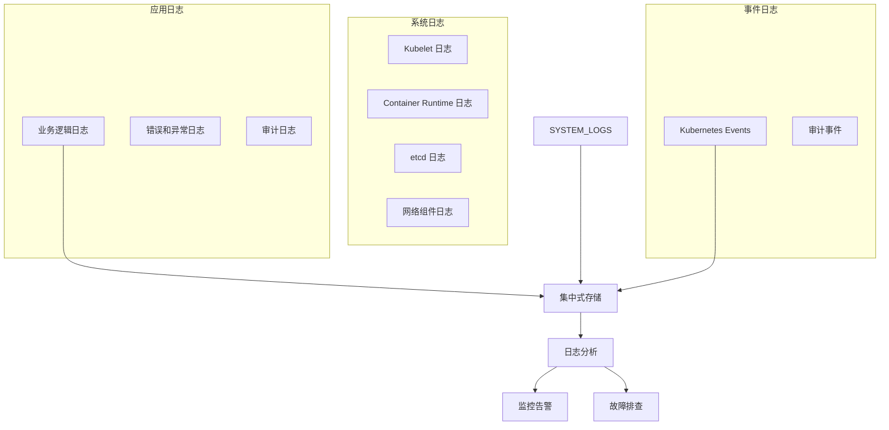
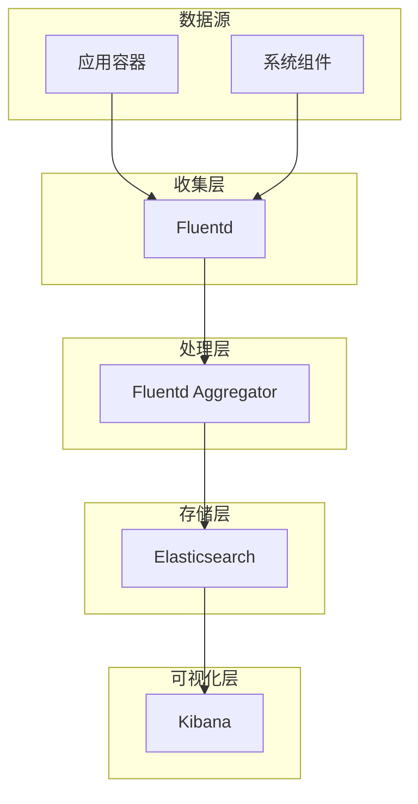
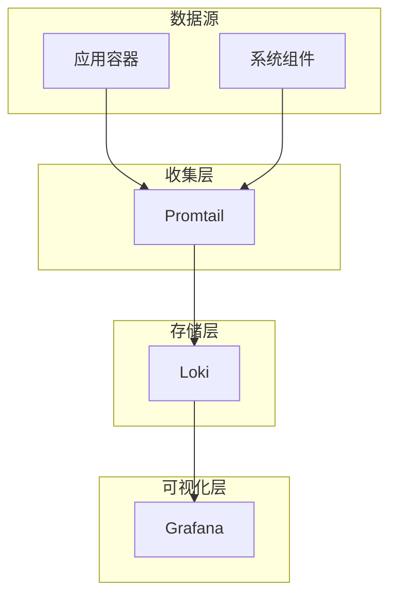
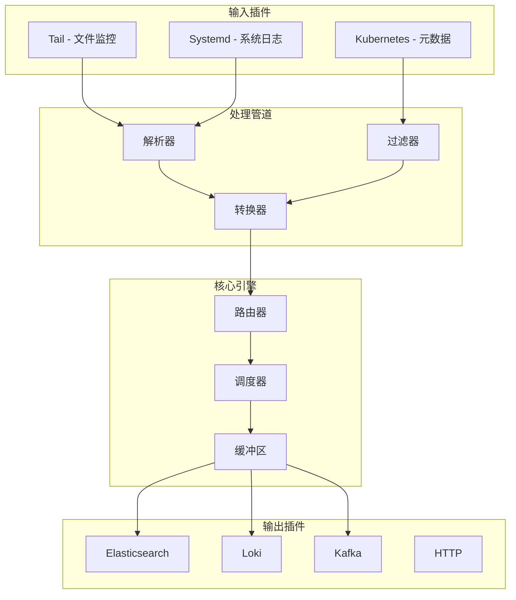

> 日志管理是 Kubernetes 可观测性体系的基础环节，通过标准化收集、处理和分析机制，助力故障排查、性能优化和合规审计。

## 日志管理概述

在 Kubernetes 环境下，日志管理不仅要应对分布式架构和动态扩缩，还需兼顾多租户隔离和高效存储。合理的日志体系能显著提升运维效率和系统可靠性。

### 日志类型

下图展示了 Kubernetes 环境中的主要日志类型及其流转路径。




{width=2000 height=1183}

日志类型包括：

- 应用日志：业务逻辑、错误、审计
- 系统日志：Kubelet、容器运行时、etcd、网络组件
- 事件日志：Kubernetes Events、审计事件

### 日志管理挑战

日志管理面临如下挑战：

- 分布式收集：容器日志分散在各节点
- 动态扩缩：Pod 动态变化导致日志源不稳定
- 多租户隔离：不同命名空间和用户需日志隔离
- 存储压力：数据量大，需高效压缩与轮转
- 实时分析：支持实时查询与告警

## 日志收集架构

Kubernetes 日志收集常见两大技术栈：EFK 和 PLG。下文分别介绍其架构与组件。

### 传统 EFK 栈

EFK（Elasticsearch、Fluentd、Kibana）是经典日志收集与分析方案。




{width=1920 height=5009}

组件说明：

- Fluentd：日志收集与预处理
- Elasticsearch：分布式存储与检索
- Kibana：日志查询与可视化

### 轻量级 PLG 栈

PLG（Promtail、Loki、Grafana）适合资源受限场景，部署简单。




{width=1920 height=3938}

组件说明：

- Promtail：Loki 专用日志收集器
- Loki：轻量级日志聚合系统
- Grafana：统一可观测性界面

## Fluent Bit 轻量级收集器

Fluent Bit 是 Fluentd 的轻量级版本，专为容器环境优化，适合边缘和高密度场景。

### 架构特点

下图展示了 Fluent Bit 的插件化架构。




{width=1920 height=2913}

核心特性：

- 轻量级：内存占用低，适合边缘场景
- 高性能：每秒处理数万日志事件
- 插件化：支持多种输入输出
- 容器友好：原生支持 Kubernetes 元数据

### 部署配置

以下为 Fluent Bit DaemonSet 部署示例：

```yaml
apiVersion: apps/v1
kind: DaemonSet
metadata:
  name: fluent-bit
  namespace: logging
spec:
  selector:
    matchLabels:
      app: fluent-bit
  template:
    metadata:
      labels:
        app: fluent-bit
    spec:
      containers:
      - name: fluent-bit
        image: fluent/fluent-bit:2.2.0
        volumeMounts:
        - name: config
          mountPath: /fluent-bit/etc/
        - name: varlogcontainers
          mountPath: /var/log/containers
      volumes:
      - name: config
        configMap:
          name: fluent-bit-config
      - name: varlogcontainers
        hostPath:
          path: /var/log/containers
```

## 日志处理最佳实践

为提升日志系统的可用性和分析效率，建议遵循以下实践。

### 结构化日志

推荐采用统一结构化格式，便于检索与分析。

```json
{
  "timestamp": "2023-10-19T10:30:00Z",
  "level": "INFO",
  "service": "user-service",
  "version": "1.2.3",
  "request_id": "abc-123-def",
  "user_id": "user-456",
  "message": "User login successful",
  "context": {
    "ip": "192.168.1.100",
    "user_agent": "Mozilla/5.0..."
  }
}
```

### 日志级别管理

不同环境应设置合理的日志级别，避免生产环境日志过多。

```yaml
log_levels:
  production:
    default: "WARN"
    special_services: "INFO"
  development:
    default: "DEBUG"
    special_services: "TRACE"
```

### 日志轮转和压缩

合理配置索引生命周期，降低存储压力。

```yaml
index_lifecycle:
  - name: "hot"
    actions:
      rollover:
        max_age: "1d"
        max_size: "50gb"
  - name: "warm"
    actions:
      allocate:
        number_of_replicas: 1
      shrink:
        number_of_shards: 1
  - name: "delete"
    actions:
      delete:
        delete_searchable_snapshot: true
```

## 查询和分析

日志系统支持多种查询方式，便于故障排查和业务分析。

### Elasticsearch 查询

以下为常用 Elasticsearch 查询示例：

```json
// 基本查询
GET /fluentd-2023.10.19/_search
{
  "query": {
    "match": {
      "message": "error"
    }
  }
}

// 聚合查询
GET /fluentd-2023.10.19/_search
{
  "size": 0,
  "aggs": {
    "errors_by_service": {
      "terms": {
        "field": "kubernetes.container_name"
      },
      "aggs": {
        "error_count": {
          "value_count": {
            "field": "message"
          }
        }
      }
    }
  }
}
```

### Loki 查询

Loki 支持 LogQL 查询语法，适合高效检索和聚合。

```logql
// 基础查询
{app="nginx"} |= "error"

// 时间范围查询
{app="nginx"} [5m]

// 聚合查询
count_over_time({app="nginx"} |= "error" [1h])

// 管道处理
{app="nginx"} | json | status >= 500 | line_format "{{.message}}"
```

## 性能优化

日志系统性能优化需从收集器和存储两方面入手。

### 收集器优化

- 缓冲配置：合理设置缓冲区大小，提升吞吐

  ```yaml
  [SERVICE]
      Flush         1
      Daemon        off
      Log_Level     info

  [INPUT]
      Name              tail
      Path              /var/log/containers/*.log
      Buffer_Max_Size  1MB
      Buffer_Chunk_Size 256KB
  ```

- 并发设置：提升输出插件并发能力

  ```yaml
  [OUTPUT]
      Name  es
      Match *
      Workers 4
      Buffer_Size 10MB
  ```

### 存储优化

- 索引优化：调整刷新间隔和副本数

  ```json
  {
    "settings": {
      "refresh_interval": "30s",
      "number_of_replicas": 1
    }
  }
  ```

- 数据压缩：启用压缩降低存储成本

  ```yaml
  compression:
    enabled: true
    level: 6
  ```

## 安全和合规

日志系统需保障数据安全和合规性，防止敏感信息泄露。

### 日志安全

- 传输加密：启用 TLS，保障数据安全

  ```yaml
  [OUTPUT]
      Name  es
      Match *
      tls   On
      tls.verify On
      tls.ca_file /etc/ssl/certs/ca.crt
  ```

- 访问控制：配置 Elasticsearch 安全机制

  ```yaml
  xpack.security.enabled: true
  xpack.security.transport.ssl.enabled: true
  ```

### 合规要求

- 数据保留策略：按业务和法规要求设置日志保留周期

  ```yaml
  retention:
    hot: 7d
    warm: 30d
    cold: 90d
    delete: 1y
  ```

- 审计日志：开启审计功能，支持多种输出

  ```yaml
  audit:
    enabled: true
    outputs: ["index", "logfile"]
  ```

## 故障排除

日志系统常见故障可通过以下方法排查。

### 常见问题

- 日志收集失败：检查 Fluent Bit Pod 状态与日志

  ```bash
  kubectl get pods -n logging -l app=fluent-bit
  kubectl logs -n logging -l app=fluent-bit
  ```

- Elasticsearch 存储压力：检查集群健康与索引大小

  ```bash
  curl -X GET "elasticsearch:9200/_cluster/health?pretty"
  curl -X GET "elasticsearch:9200/_cat/indices?v"
  ```

- 查询性能问题：优化查询语句与索引

  ```bash
  curl -X GET "elasticsearch:9200/_stats/search?pretty"
  GET /fluentd-*/_search
  {
    "query": {
      "bool": {
        "must": [
          {"term": {"kubernetes.namespace_name": "production"}},
          {"range": {"@timestamp": {"gte": "now-1h"}}}
        ]
      }
    }
  }
  ```

## 总结

日志管理是 Kubernetes 可观测性的重要组成部分。通过 EFK、PLG 等技术栈，可以构建高效的日志收集、处理和分析系统。选择合适的日志方案需结合资源限制、查询需求和运维复杂度。标准化日志格式、合理保留策略和完善告警机制，是保障系统可靠性的关键。

## 参考文献

1. [Fluent Bit 官方文档 - fluentbit.io](https://docs.fluentbit.io/)
2. [Loki 官方文档 - grafana.com](https://grafana.com/docs/loki/latest/)
3. [Elasticsearch 官方文档 - elastic.co](https://www.elastic.co/guide/en/elasticsearch/reference/current/index.html)
4. [Kubernetes 官方文档 - kubernetes.io](https://kubernetes.io/docs/)
5. [Promtail 官方文档 - grafana.com](https://grafana.com/docs/loki/latest/clients/promtail/)
