> 真正的可观测性标准，是让数据流动起来，而不是让工具变多。

## 引言

在云原生（Cloud Native）环境中，微服务、容器编排与动态基础设施让系统复杂度急剧上升。要有效观察系统行为，仅靠日志或监控已不够。**OpenTelemetry（简称 OTel）** 作为 CNCF 毕业项目，已成为统一指标（Metrics）、追踪（Traces）与日志（Logs）采集与传输的事实标准，是构建现代 **Kubernetes 可观测性体系的核心基石**。

OpenTelemetry 通过一套跨语言、跨平台的 API、SDK、协议和 Collector 组件，极大简化了云原生环境下的观测体系建设，实现了数据模型、采集、传输、处理与导出的全链路标准化。

## OpenTelemetry 概述与核心理念

OpenTelemetry（OTel）由 OpenTracing 与 OpenCensus 合并而来，目标是为分布式系统（Distributed System）提供统一、标准化的可观测性数据采集、处理与导出能力。其核心理念包括：

- **API 与 SDK 分离**：API 仅用于埋点和数据生成，SDK 负责数据处理与导出，便于第三方库无侵入集成。
- **信号（Signal）分层**：将 Traces、Metrics、Logs、Baggage 等不同观测信号独立建模，统一上下文传递。
- **协议与数据模型标准化**：通过 OTLP 协议和统一的数据模型，降低与后端系统（如 Prometheus、Jaeger、Tempo、Loki 等）的集成门槛。
- **可扩展与跨语言**：支持多语言实现，提供丰富的扩展点（如 Processor、Exporter、Resource Detector 等）。

OpenTelemetry 的主要组成部分如下：

- **API 包**：用于埋点和生成观测数据（Trace、Metric、Log、Baggage、Context）。
- **SDK 包**：实现 API，负责数据采集、处理、导出。
- **Collector**：独立于应用的观测数据聚合、处理与转发组件。
- **协议规范（OTLP）**：统一的传输协议。
- **语义约定（Semantic Conventions）**：标准化标签与属性。

## OpenTelemetry 架构全景

了解 OpenTelemetry 在云原生中的架构有助于理解其数据流转过程。下图展示了 OTel 在云原生环境中的典型数据流转路径：

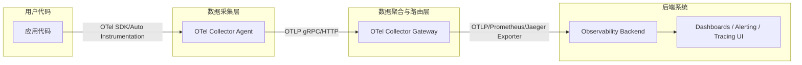


{width=2415 height=198}

该架构主要分为以下几个层次：

- **SDK 层**：应用代码通过 API/SDK 埋点或自动探针生成观测数据。
- **Collector 层**：负责数据聚合、过滤、标签处理与导出。
- **Backend 层**：如 Prometheus（Metrics）、Jaeger/Tempo（Traces）、Loki（Logs）等后端。

为了进一步清晰展现 OpenTelemetry 组件间的关系，下图详细展示了 API、SDK、Exporter 等模块的交互：

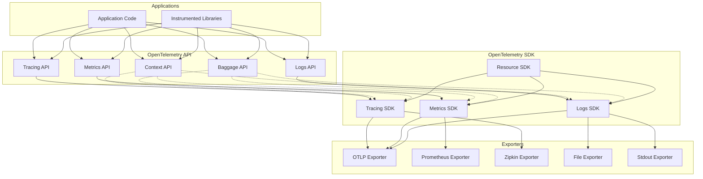

{width=2615 height=910}

此外，OpenTelemetry 强调 API/SDK 分离、信号分层、上下文传递与可扩展性。下图进一步说明其架构原则：

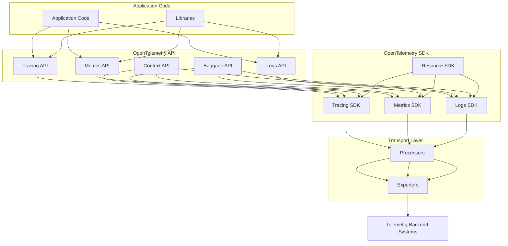

{width=1982 height=1232}

## Collector 详解与部署模式

Collector 是 OpenTelemetry 的核心组件，主要负责数据的接收、处理与导出。下图为 Collector 内部结构示意：

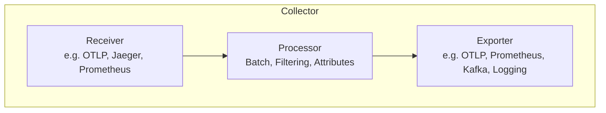

{width=1920 height=349}

Collector 主要包含以下模块：

- **Receiver**：接收来自 SDK 或外部系统的数据。
- **Processor**：批处理、聚合、标签过滤等处理逻辑。
- **Exporter**：将数据导出到目标后端。

## Kubernetes 中的部署模式

在 Kubernetes 集群中，OpenTelemetry Collector 可灵活部署于不同层级。以下架构图直观展示了各组件在集群内的分布：

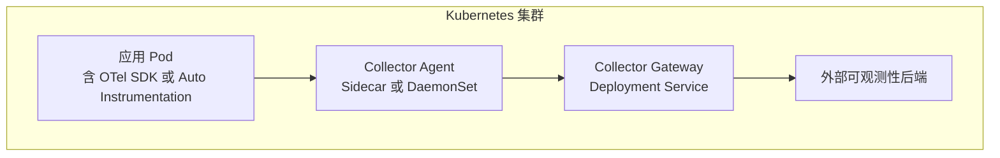

{width=1920 height=294}

总结来看：

- **Sidecar 模式**：每个 Pod 内嵌 Collector，适合细粒度控制。
- **DaemonSet 模式**：每个 Node 部署一个 Collector Agent，便于节点级采集。
- **Gateway 模式**：集中聚合与导出，适合统一出口管理。
- **混合模式**：Agent + Gateway，生产环境首选。

## 信号类型与数据模型

OpenTelemetry 支持多种信号类型（Signal），全面覆盖云原生可观测性的需求：

- **Trace**：分布式请求链路，由 Span 组成，记录操作、时间、属性、事件、父子关系等。
- **Metrics**：系统性能指标，支持 Counter、Histogram、UpDownCounter、ObservableGauge 等多种仪表类型。
- **Logs**：结构化日志，可独立采集或嵌入到 Span 事件中。
- **Baggage**：分布式上下文传递的键值对。
- **Resources**：描述观测数据来源实体（如服务名、主机、容器、云信息等）。

下图解释了各信号类型的结构与流转关系：

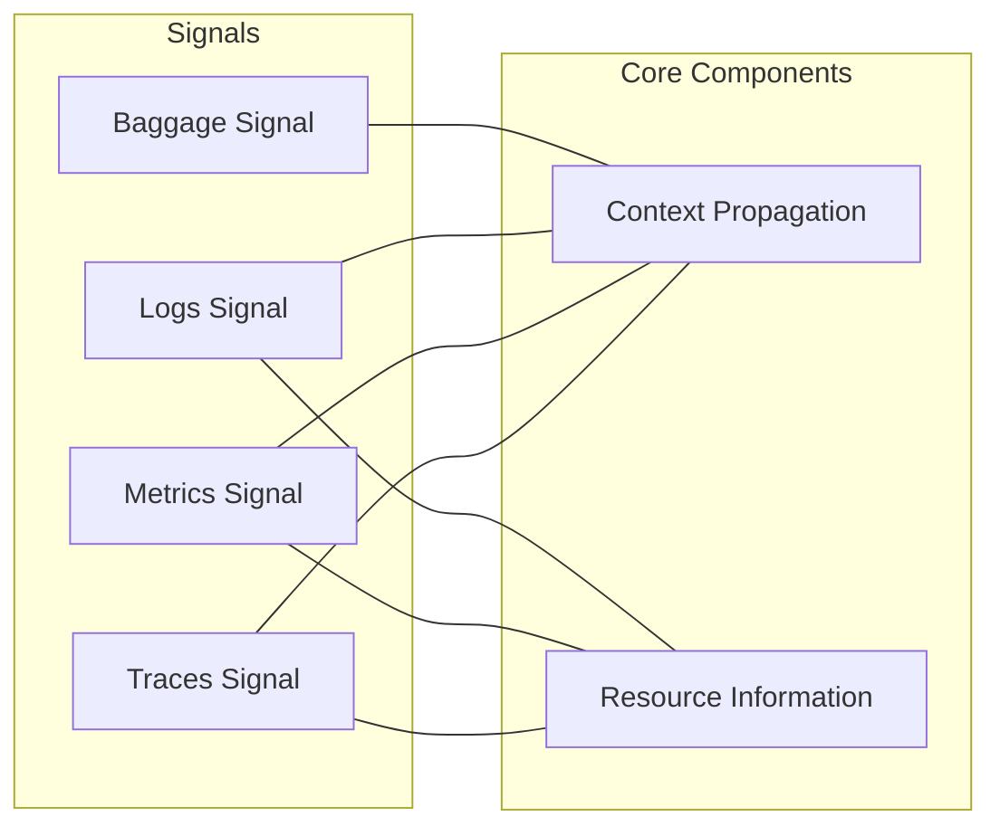

{width=1920 height=1620}

### Trace 结构示意

为了帮助理解 Trace 的层次结构，以下图展示了分布式链路的父子 Span 关系：

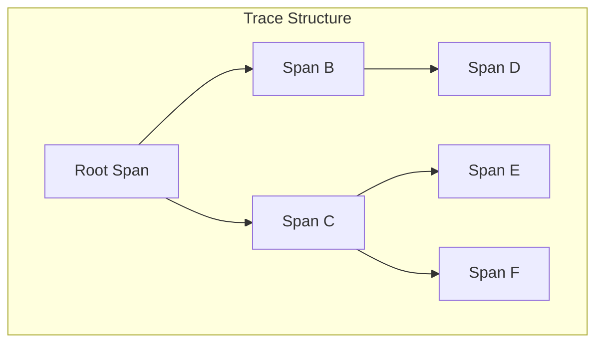

{width=1920 height=1106}

### Metrics 数据流

Metrics 的采集、处理与导出流程如下图所示：

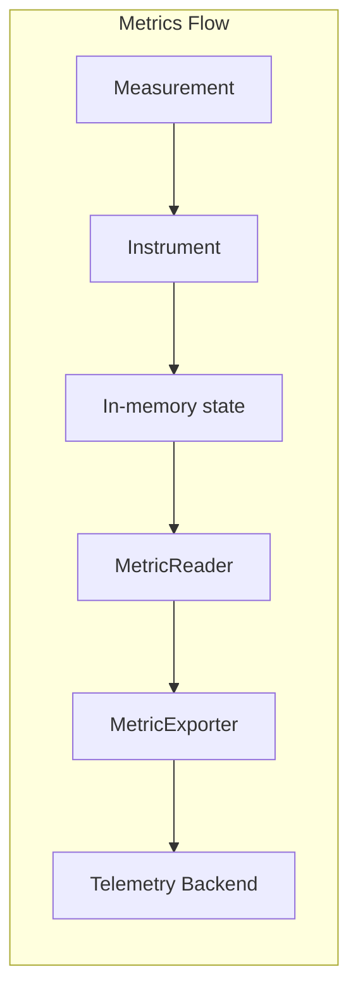

{width=1920 height=6708}

### 上下文与跨服务传播

OpenTelemetry 通过 Context 机制实现 Trace、Baggage 等的跨服务传播。下图展示了典型的上下文传递流程：

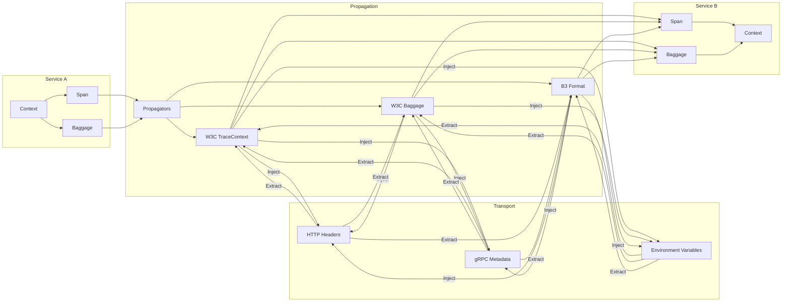

{width=3275 height=1098}

#### 资源（Resource）

Resource 用于标识观测数据的来源实体，具备不可变性、可合并、可扩展等特性。

## 与 Kubernetes 及主流生态集成

OpenTelemetry 与 Kubernetes 深度集成，大大提升了观测数据的自动化与上下文丰富性。主要集成方式包括：

- Pod Annotation 自动探针（如 `instrumentation.opentelemetry.io/inject-java: "true"`），实现自动埋点。
- Kubernetes Resource Detector 自动注入标签（如 `k8s.pod.name`, `k8s.node.name`），丰富元数据。
- OTLP Collector Receiver 可直接接收 Prometheus 指标。
- 与 Grafana Alloy / Tempo / Loki / Mimir 完全兼容，实现统一观测。
- 可与 Istio Telemetry v2、Envoy OTel Filter 等集成，支持服务网格场景。

## 生态与标准化现状

OpenTelemetry 的标准化进展迅速，已成为云原生领域的主流方案。下表汇总了其主要标准版本与里程碑：

这是展示 OpenTelemetry 主要标准版本的表格：



| 标准版本       | 说明                  | 发布日期    |
| ------------- | --------------------- | ----------- |
| v1.0.0        | 首个稳定版，定义 trace 语义   | 2021        |
| v1.10         | 增加日志与 metrics 语义一致性 | 2023        |
| v1.50         | 最新规范版本，优化指标采样算法 | 2025-10     |
| OTLP v0.23    | 当前 Collector 默认协议版本   | 2025        |



目前，OpenTelemetry 已成为 CNCF 毕业项目，被 Kubernetes、Envoy、Istio、Grafana、Prometheus 等广泛集成，并成为 AWS、Google Cloud、Azure 等云厂商的事实标准方案。

## Kubernetes 集群部署示例

以下代码演示了如何在 Kubernetes 集群中快速部署 OpenTelemetry Operator 和 Collector，适用于初学者实践：

```bash
kubectl apply -f https://github.com/open-telemetry/opentelemetry-operator/releases/download/v0.107.0/opentelemetry-operator.yaml

kubectl apply -f - <<EOF
apiVersion: opentelemetry.io/v1alpha1
kind: OpenTelemetryCollector
metadata:
  name: otel-collector
spec:
  mode: daemonset
  config: |
    receivers:
      otlp:
        protocols:
          grpc:
          http:
    processors:
      batch:
    exporters:
      logging:
        loglevel: debug
      prometheus:
        endpoint: "0.0.0.0:9464"
    service:
      pipelines:
        metrics:
          receivers: [otlp]
          processors: [batch]
          exporters: [prometheus]
EOF
```

## 最佳实践与架构扩展

在生产环境中，建议遵循以下最佳实践，以获得更高的可观测性与系统稳定性：

- 使用 Agent + Gateway 架构，兼顾本地采集与集中导出。
- Collector 的 `batch` processor 调优可显著降低 CPU 占用。
- 明确 TraceId 与 Metrics Resource 的关联关系，便于全链路分析。
- 利用 Semantic Conventions 定义一致性标签，提升数据分析质量。
- 集成 Kubernetes metadata processor 丰富上下文，增强可观测性。

下图展示了 OpenTelemetry 的角色分工与扩展点，帮助开发者理解系统可扩展性：

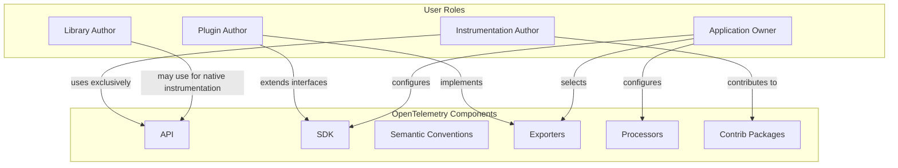

{width=1981 height=462}

## 总结

OpenTelemetry 为 Kubernetes 及云原生可观测性带来了真正的标准化与互操作性。它打通了指标、日志、追踪的边界，成为云原生时代可观测性的统一语言。无论你使用 Prometheus + Grafana，还是 Tempo + Loki + Mimir，OpenTelemetry 都是将数据源与后端解耦的关键基础设施。

通过 API/SDK 分离、信号分层、Collector 架构、协议标准化与丰富的生态集成，OpenTelemetry 让开发者和运维团队能够以最低成本获得高质量、可扩展的观测能力。

## 参考文献

- [OpenTelemetry Specification – github.com](https://github.com/open-telemetry/opentelemetry-specification)
- [DeepWiki: OpenTelemetry Specification Overview - deepwiki.com](https://deepwiki.com/open-telemetry/opentelemetry-specification)
- [OpenTelemetry Operator - github.com](https://github.com/open-telemetry/opentelemetry-operator)
- [OTLP Protocol Specification - opentelemetry.io](https://opentelemetry.io/docs/specs/otlp/)
- [Grafana Alloy + OTel Integration - grafana.com](https://grafana.com/docs/alloy/latest/)
