本文系统梳理了 Kubernetes 集群生命周期管理的核心流程，包括集群创建、证书管理、升级、高可用部署及常见故障排查，帮助运维人员高效管理生产级集群。

## kubeadm 概述

kubeadm 是官方推荐的 Kubernetes 集群生命周期管理工具，旨在以最佳实践快速引导安全可用的集群。其主要功能包括：

- 集群引导（初始化与节点加入）
- 集群升级
- 组件配置
- 证书管理
- 节点管理（添加与移除节点）

下图展示了 kubeadm 在集群生命周期中的作用：


{width=1920 height=2307}

## 集群创建流程

集群创建是生命周期管理的起点，需严格按照规范准备环境和组件。

### 前置条件

在使用 kubeadm 创建集群前，请确保：

- 每台机器至少 2 GB 内存
- 控制平面节点至少 2 个 CPU
- 集群内所有节点网络互通
- 每台节点主机名、MAC 地址、`product_uuid` 唯一
- 必要端口已开放
- 已禁用 swap 或已配置 kubelet 容忍 swap
- Linux 内核模块已加载
- 已安装并配置容器运行时
- 已安装 kubeadm、kubelet、kubectl

### 安装 kubeadm、kubelet 和 kubectl

kubeadm 不会自动安装 kubelet 或 kubectl，需手动安装。下图展示了安装流程：


{width=1920 height=283}

### 容器运行时配置

kubelet 通过 CRI（Container Runtime Interface）与容器运行时通信。常见运行时包括 containerd、CRI-O、Docker（需 cri-dockerd）。需确保 kubelet 与容器运行时使用相同的 cgroup driver。



| cgroup driver | 说明 | 推荐场景 |
| --- | --- | --- |
| `cgroupfs` | 直接操作 cgroup 文件系统 | 非 systemd 系统 |
| `systemd` | 由 systemd 管理 cgroup | systemd 系统（推荐） |



### 使用 kubeadm init 创建集群

`kubeadm init` 命令用于初始化控制平面节点，主要步骤如下：


{width=2094 height=177}

基础初始化命令：

```bash
kubeadm init
```

自定义参数示例：

```bash
kubeadm init --pod-network-cidr=192.168.0.0/16 --kubernetes-version=v1.26.0 --control-plane-endpoint="cluster-endpoint:6443"
```

### 使用 kubeadm join 添加工作节点

控制平面初始化后，可通过 `kubeadm join` 添加工作节点。下图展示了节点加入流程：


{width=1920 height=307}

加入命令示例：

```bash
kubeadm join --token <token> <control-plane-host>:<control-plane-port> --discovery-token-ca-cert-hash sha256:<hash>
```

如需高可用，可添加更多控制平面节点。

## 证书管理

Kubernetes 依赖 PKI 证书保障安全通信。kubeadm 负责控制面组件证书的生成与续期。

### 证书文件位置说明

证书默认存放于 `/etc/kubernetes/pki`，主要文件如下：



| 文件路径 | 说明 |
| --- | --- |
| `/etc/kubernetes/pki/ca.crt` | 集群根 CA 证书 |
| `/etc/kubernetes/pki/ca.key` | 集群根 CA 密钥 |
| `/etc/kubernetes/pki/apiserver.crt` | API Server 证书 |
| `/etc/kubernetes/pki/apiserver.key` | API Server 密钥 |
| `/etc/kubernetes/pki/sa.key` | ServiceAccount 密钥 |
| `/etc/kubernetes/pki/sa.pub` | ServiceAccount 公钥 |



### 证书续期流程

kubeadm 支持升级时自动续期，也可手动续期。下图展示了证书管理流程：


{width=1920 height=567}

检查证书有效期：

```bash
kubeadm certs check-expiration
```

续期全部证书：

```bash
kubeadm certs renew all
```

## 集群升级流程

升级 Kubernetes 集群需多步操作，建议严格按照官方流程执行。下图展示了升级流程：


{width=2555 height=198}

### 控制平面节点升级步骤

1. 升级 kubeadm：

    ```bash
    sudo apt-mark unhold kubeadm && \
    sudo apt-get update && sudo apt-get install -y kubeadm='1.26.x-*' && \
    sudo apt-mark hold kubeadm
    ```

2. 查看升级计划：

    ```bash
    sudo kubeadm upgrade plan
    ```

3. 应用升级：

    ```bash
    sudo kubeadm upgrade apply v1.26.x
    ```

4. 驱逐节点：

    ```bash
    kubectl drain <node-name> --ignore-daemonsets
    ```

5. 升级 kubelet 和 kubectl：

    ```bash
    sudo apt-mark unhold kubelet kubectl && \
    sudo apt-get update && sudo apt-get install -y kubelet='1.26.x-*' kubectl='1.26.x-*' && \
    sudo apt-mark hold kubelet kubectl
    ```

6. 重启 kubelet：

    ```bash
    sudo systemctl daemon-reload
    sudo systemctl restart kubelet
    ```

7. 恢复节点调度：

    ```bash
    kubectl uncordon <node-name>
    ```

### 工作节点升级步骤

工作节点升级流程类似，区别在于使用 `kubeadm upgrade node`：

1. 升级 kubeadm
2. 执行 `kubeadm upgrade node`
3. 驱逐节点
4. 升级 kubelet 和 kubectl
5. 重启 kubelet
6. 恢复节点调度

## 高可用集群部署

kubeadm 支持两种高可用拓扑：



{width=1920 height=3643}

高可用部署需满足：

- 配置 API Server 负载均衡器
- 证书共享或分发
- 正确设置控制平面 endpoint

堆叠式 etcd 初始化示例：

```bash
kubeadm init --control-plane-endpoint "LOAD_BALANCER_DNS:LOAD_BALANCER_PORT" --upload-certs
```

## 常见故障排查

集群运维过程中常见问题及排查建议如下：

### API Server 不可用

- 检查 Pod 状态：`kubectl -n kube-system get pods`
- 查看日志：`kubectl -n kube-system logs kube-apiserver-<node-name>`
- 检查证书有效期：`kubeadm certs check-expiration`

### Pod 网络异常

- 确认已安装 CNI 插件
- 检查 Pod CIDR 与节点网络无冲突
- 核查 CoreDNS 状态：`kubectl -n kube-system get pods`

### etcd 故障

- 查看 etcd 日志：`kubectl -n kube-system logs etcd-<node-name>`
- 检查 etcd 健康：`kubectl -n kube-system exec -it etcd-<node-name> -- etcdctl member list`

## 高级配置

kubeadm 支持通过配置文件自定义集群参数，适用于复杂场景。

### 自定义配置文件示例

```yaml
apiVersion: kubeadm.k8s.io/v1beta4
kind: InitConfiguration
nodeRegistration:
  name: node1
  criSocket: unix:///var/run/containerd/containerd.sock
---
apiVersion: kubeadm.k8s.io/v1beta4
kind: ClusterConfiguration
kubernetesVersion: v1.26.0
networking:
  podSubnet: 192.168.0.0/16
  serviceSubnet: 10.96.0.0/12
```

### 控制面组件自定义参数

可通过 `extraArgs` 字段自定义组件参数：

```yaml
apiVersion: kubeadm.k8s.io/v1beta4
kind: ClusterConfiguration
apiServer:
  extraArgs:
    enable-admission-plugins: "NodeRestriction"
controllerManager:
  extraArgs:
    node-monitor-period: "5s"
scheduler:
  extraArgs:
    config: "/etc/kubernetes/scheduler-config.yaml"
```

### kubelet 配置自定义

kubelet 可通过配置对象自定义参数：

```yaml
apiVersion: kubelet.config.k8s.io/v1beta1
kind: KubeletConfiguration
cgroupDriver: systemd
```

## 总结

kubeadm 为 Kubernetes 集群生命周期管理提供了标准化、自动化的解决方案。掌握其核心流程与配置方法，有助于高效部署和维护生产级集群，提升系统稳定性与安全性。

## 参考文献

1. [Kubernetes 官方文档 - kubernetes.io](https://kubernetes.io/zh-cn/docs/)
2. [kubeadm 官方指南 - kubernetes.io](https://kubernetes.io/zh-cn/docs/setup/production-environment/tools/kubeadm/)
3. [Kubernetes 高可用架构 - kubernetes.io](https://kubernetes.io/zh-cn/docs/setup/production-environment/tools/kubeadm/high-availability/)
