本文系统梳理了 Kubernetes 集群的运维管理流程，包括集群生命周期、版本升级、证书管理、发布节奏、常见故障排查及最佳实践，帮助运维工程师高效保障集群稳定运行。

## 集群生命周期概览

Kubernetes 集群的运维管理涵盖从初始部署、日常维护到最终下线的完整生命周期。合理规划和执行各阶段任务，有助于提升集群的稳定性与可扩展性。

下图展示了集群生命周期及关键工具的关系：

{width=1920 height=1180}

## 使用 kubeadm 部署集群

### 安装前置条件

在搭建 Kubernetes 集群前，请确保各节点满足以下要求：

- Linux 操作系统，内核需支持 LTS 版本
- 每台机器至少 2 GB 内存（建议更高）
- 控制平面节点至少 2 个 CPU
- 所有节点间网络互通
- 每台节点需唯一的主机名、MAC 地址和 product\_uuid
- 必要端口已开放
- 已禁用 swap，或 kubelet 配置为容忍 swap
- 已安装兼容的容器运行时

### 容器运行时配置

每个节点都需安装兼容的容器运行时。Kubernetes 通过 CRI（Container Runtime Interface）与运行时对接。常见运行时及其 Unix Socket 路径如下：



| 运行时 | Unix Socket 路径（Linux） |
| --- | --- |
| containerd | unix:///var/run/containerd/containerd.sock |
| CRI-O | unix:///var/run/crio/crio.sock |
| Docker Engine（需 cri-dockerd） | unix:///var/run/cri-dockerd.sock |



容器运行时需与 kubelet 使用相同的 cgroup driver。常见驱动有：

- `cgroupfs`（kubelet 默认）
- `systemd`（推荐，若主机 init 系统为 systemd）

### 集群创建流程

下图展示了使用 kubeadm 创建集群的完整流程：

{width=1920 height=6390}

### 高可用集群部署

生产环境建议采用多控制平面节点的高可用架构。kubeadm 支持两种拓扑：

- **堆叠式控制平面**：etcd 与控制平面节点同机部署
- **外部 etcd 集群**：etcd 独立部署

无论哪种方式，都需负载均衡器分发流量至所有健康的控制平面节点。

## 集群升级

### 版本兼容策略

升级集群时需遵循组件间的版本兼容策略，确保系统稳定：



| 组件关系 | 支持的版本差异 |
| --- | --- |
| kube-apiserver | 不可落后于其他组件 |
| kubelet | 最多可比 kube-apiserver 低 3 个小版本 |
| kube-controller-manager、kube-scheduler、cloud-controller-manager | 最多可比 kube-apiserver 低 1 个小版本 |
| kubectl | 可比 kube-apiserver 高/低 1 个小版本 |
| kubeadm | 升级时需与 kubelet 版本一致 |



### kubeadm 升级流程

下图展示了 kubeadm 升级集群的主要步骤：

{width=1920 height=8141}

详细步骤如下：

1. 更新软件源，指向目标 Kubernetes 版本
2. 依次升级控制平面节点：
    - 升级 kubeadm
    - 首节点执行 `kubeadm upgrade plan` 和 `kubeadm upgrade apply`
    - 其他节点执行 `kubeadm upgrade node`
    - 升级前驱逐节点
    - 升级 kubelet 和 kubectl
    - 重启 kubelet
    - 恢复节点调度
3. 工作节点可顺序或分批升级，步骤同上
4. 升级后验证集群健康状态

## 证书管理

Kubernetes 依赖 PKI 证书进行身份认证。kubeadm 默认生成的证书有效期为 1 年，需定期续期。

### 证书存放位置与用途

kubeadm 证书存放于 `/etc/kubernetes/pki`，kubeconfig 文件位于 `/etc/kubernetes/`。主要证书说明如下：



| 证书/密钥文件 | 用途 |
| --- | --- |
| `ca.crt`、`ca.key` | 集群根 CA |
| `apiserver.crt`、`apiserver.key` | API Server 证书 |
| `apiserver-kubelet-client.crt`、 `apiserver-kubelet-client.key` | API Server 访问 kubelet |
| `sa.pub`、 `sa.key` | ServiceAccount 签名 |
| `front-proxy-ca.crt`、`front-proxy-ca.key` | 前端代理 CA |
| `front-proxy-client.crt`、 `front-proxy-client.key` | 前端代理客户端 |



### 证书续期方式

证书续期可通过以下方式实现：

- **升级自动续期**：`kubeadm upgrade` 升级控制平面时自动续期所有证书
- **手动续期**：使用 `kubeadm certs renew` 命令续期指定或全部证书
- **外部 CA 模式**：适用于有自有证书体系的组织

续期后需重启控制平面 Pod 以使新证书生效。

## 版本发布管理

### 发布节奏

Kubernetes 遵循固定的版本发布节奏。下图展示了小版本发布周期及支持策略：

{width=2347 height=378}

每个小版本通常支持约 14 个月：

- 12 个月标准支持（定期补丁）
- 2 个月维护模式（仅修复关键和安全问题）

例如，当前版本支持计划如下：



| 版本 | 发布日期 | 维护模式开始 | 生命周期结束 |
| --- | --- | --- | --- |
| 1.30 | 2024-04-17 | 2025-04-28 | 2025-06-28 |
| 1.31 | 2024-08-13 | 2025-08-28 | 2025-10-28 |
| 1.32 | 2024-12-11 | 2025-12-28 | 2026-02-28 |



### 补丁发布流程

补丁版本每月发布，遇安全漏洞时可临时加发。主要流程包括：

1. 提交 bug 修复 cherry-pick 请求
2. 发布经理审核
3. 创建发布分支
4. 测试与验证
5. 发布新包与镜像

安全漏洞补丁遵循协调披露流程，由安全响应委员会主导。

### 发布验证

为提升安全性，Kubernetes 镜像与制品均采用加密签名。管理员可通过校验签名验证组件来源。

## 故障排查

下表总结了常见运维故障及排查建议：



| 问题 | 可能原因 | 排查建议 |
| --- | --- | --- |
| kubeadm init 卡住 | 网络异常、cgroup 驱动不一致、控制面容器异常 | 检查网络、cgroup 驱动、容器日志 |
| 节点加入失败 | 令牌或证书问题、网络异常 | 校验令牌、证书哈希、网络连通性 |
| 证书过期 | 默认 1 年有效期 | `kubeadm certs check-expiration` 检查，`kubeadm certs renew` 续期 |
| kubelet 客户端证书轮转失败 | 轮转机制异常 | 按官方手册手动生成证书 |
| etcd 故障 | 数据损坏、丢失 quorum | 使用 etcd 备份恢复 |
| CoreDNS Pending | 未安装网络插件 | 安装 CNI 插件 |



## Windows 工作节点支持

Kubernetes 支持在 Linux 控制平面下添加 Windows 工作节点，便于运行 Windows 工作负载。

### 添加 Windows 节点流程

主要步骤如下：

1. 准备 Windows Server 2022（或更高）实例
2. 安装 containerd 作为容器运行时
3. 安装 kubeadm 和 kubelet
4. 运行 `kubeadm join` 加入集群
5. 安装支持 Windows 的 CNI 插件（如 Flannel、Calico）

目前仅部分 CNI 插件支持 Windows。

## 运维最佳实践

- **定期备份 etcd**：保障灾难恢复能力
- **多控制平面节点**：提升高可用性
- **监控证书有效期**：定期执行 `kubeadm certs check-expiration`
- **严格遵循版本兼容策略**：升级前充分验证
- **统一 cgroup driver 配置**：kubelet 与容器运行时一致
- **及时应用安全补丁**：关注每月补丁发布
- **先在测试环境验证升级**：再应用至生产环境

## 总结

本文系统梳理了 Kubernetes 集群的生命周期管理、升级流程、证书管理、版本发布、常见故障排查及运维最佳实践。通过规范化运维流程和工具使用，可显著提升集群的稳定性与安全性。建议运维工程师结合实际场景，持续关注官方文档与社区动态，及时更新运维策略。

## 参考文献

1. [Kubernetes 官方文档 - kubernetes.io](https://kubernetes.io/zh-cn/docs/)
2. [Kubernetes 版本发布计划 - kubernetes.io](https://kubernetes.io/releases/)
3. [Kubeadm 官方指南 - kubernetes.io](https://kubernetes.io/zh-cn/docs/setup/production-environment/tools/kubeadm/)
