Kubernetes 版本发布管理系统负责版本规划、发布执行与支持保障。本文详解发布周期、角色分工、流程与策略，助力稳定可靠地交付 Kubernetes 版本。

## 发布周期概览

Kubernetes 遵循结构化的发布周期，每年约发布三次，每个周期约 14 周，分为三个主要阶段。

### 发布周期阶段

下图展示了发布流程与关键里程碑：

{width=1920 height=1395}

- **功能定义**：确定本周期计划纳入的特性，约第 4 周前完成增强提案（Enhancements Freeze）。
- **实现阶段**：主要开发、集成测试与文档完善。
- **稳定阶段**：聚焦稳定性，约第 12 周进入代码冻结（Code Freeze），仅接受关键修复，最终发布。

发布后，master 分支重新开放，当前版本的修改通过 cherry-pick 回补到 release 分支。

## 发布规划与里程碑管理

版本规划涉及特性负责人、SIG 领导与 Release Team。增强提案需在前 4 周内准备完毕。

{width=2360 height=480}

每个面向发布的 Issue 或 PR 需包含：

- **SIG Owner 标签**：标明责任 SIG
- **优先级标签**：如 `priority/critical-urgent`、`priority/important-soon`
- **Kind 标签**：如 `kind/bug`、`kind/feature`
- **Milestone**：目标发布版本

代码冻结期间，仅接受带有特定标签（如 `kind/bug`、`kind/failing-test`）和正确里程碑的 PR。

## 版本号与语义化管理

Kubernetes 采用语义化版本（SemVer）格式 **x.y.z**：

- **x**：主版本号
- **y**：次版本号
- **z**：补丁号

如 1.28.3 表示主版本 1，次版本 28，补丁 3。

## 版本支持周期

Kubernetes 维护最近三个小版本的 release 分支。1.19 及以上版本约有 1 年补丁支持，1.18 及以下为 9 个月。

{width=1920 height=1152}

- **标准支持期**：前 12 个月，常规补丁与安全更新
- **维护模式**：最后 2 个月，仅修复安全漏洞、依赖项与核心组件关键问题
- **生命周期结束（EOL）**：维护期后版本不再支持

## 补丁发布流程

### 发布节奏与计划

补丁版本通常每月发布，次版本发布初期补丁节奏更快（1-2 周）。遇关键 bug 可临时加发。

补丁发布时间表维护于 `schedule.yaml`，并在补丁发布页面展示。

### Cherry Pick 流程

补丁合入需满足：

1. GitHub PR 已通过 `approved`、`lgtm`、`release-note` 等标签
2. Cherry pick 截止前（一般为目标发布前两天）通过 CI
3. 遵循 [cherry pick 流程](https://github.com/kubernetes/website/blob/4c26fe55/cherry%20pick%20process)

不满足条件的 PR 顺延至下次补丁发布。

## 发布管理角色分工

Kubernetes 发布管理体系包含多种角色，各司其职。

### Release Managers

主要职责：

- 协调并发布各类版本（补丁、小版本、预发布）
- 维护 release 分支，审核 cherry pick，保障分支健康
- 指导 Release Manager Associate
- 维护 k/release 代码库
- 支持 Release Team 各阶段工作

### Release Manager Associates

作为 Release Manager 学徒，主要参与：

- 补丁发布与 cherry pick 审核
- 贡献 k/release 代码
- 维护发布流程文档
- 协助 Release Team 与新成员培养

### SIG Release 领导

SIG Release Chairs 与技术负责人负责：

- SIG Release 治理
- 组织知识交流与领导力培训
- 管理沟通渠道与权限组

## 版本偏差策略（Version Skew Policy）

版本偏差策略定义各组件间最大支持的版本差异，核心规则如下：

1. **kube-apiserver**：HA 集群中新旧 apiserver 版本差异不超过 1 个小版本
2. **kubelet**：不得高于 apiserver，最多可比 apiserver 低 3 个小版本
3. **kube-proxy**：不得高于 apiserver，可比 apiserver 低 3 个小版本，也可与本节点 kubelet 相差 3 个小版本
4. **kube-controller-manager、kube-scheduler、cloud-controller-manager**：不得高于 apiserver，建议与 apiserver 保持一致，最多低 1 个小版本
5. **kubectl**：支持与 apiserver 相差 1 个小版本（高/低均可）

## 组件升级顺序

升级时应遵循如下顺序：

1. **kube-apiserver**（优先升级，确保不落后于其他组件）
2. **kube-controller-manager、kube-scheduler、cloud-controller-manager**（顺序不限，可同时升级）
3. **kubelet**（可选，允许滞后于 apiserver）
4. **kube-proxy**（可选，允许滞后于 apiserver）

## 安全发布管理

Release Management 团队与 Security Response Committee 紧密协作，安全相关发布遵循专门流程：

- **安全发布流程**：严格遵循安全响应委员会指导
- **信息禁运政策**：部分安全信息按政策禁运
- **安全公告**：通过 kubernetes-security-announce 群组发布

团队内部设有私有邮件列表与 Slack 频道，便于安全事件协调。

## 发布制品与验证

每次发布会产出多种制品，均需签名验证。下图展示了发布周期与支持关系：

{width=2370 height=420}

**二进制与镜像签名**：采用 [sigstore](https://sigstore.dev) 签名，可用 `cosign` 工具验证

- 二进制验证：`cosign verify-blob`
- 镜像验证：`cosign verify`
- SBOM 验证：签名或 SHA 校验

## Release Team 与治理

Release Team 独立于 Release Managers，每个发布周期组建，设有 Enhancements Lead、Bug Triage Lead 等专职角色。

GitHub 里程碑由 `milestone-maintainers` 团队维护，涵盖各 SIG 代表。

最终治理归 SIG Release 领导团队负责。

## 总结

Kubernetes 版本发布管理体系通过规范的流程、角色分工与安全策略，保障了版本交付的稳定性与可追溯性。理解发布周期、支持策略与升级顺序，有助于企业和开发者安全高效地管理集群版本。

## 参考文献

1. [Release Cycle 详细文档 - github.com](https://github.com/kubernetes/website/blob/4c26fe55/Release%20Cycle%20detailed%20documentation)
2. [Patch Releases 文档 - github.com](https://github.com/kubernetes/website/blob/4c26fe55/Patch%20Releases%20documentation)
3. [Version Skew Policy - github.com](https://github.com/kubernetes/website/blob/4c26fe55/Version%20Skew%20Policy)
4. [Kubernetes Security 信息 - github.com](https://github.com/kubernetes/website/blob/4c26fe55/Kubernetes%20Security%20information)
5. [Release Manager 联系方式 - github.com](https://github.com/kubernetes/website/blob/4c26fe55/Release%20Manager%20contact%20information)
