> 灵活的调度与资源管理，是 Kubernetes 实现弹性、高可用和高效资源利用的核心竞争力。

Kubernetes 通过灵活的调度与资源管理机制，实现了高效的工作负载分布与资源利用。本文系统梳理调度流程、资源分配、自动扩缩容、优先级抢占、节点压力驱逐等核心内容，助力集群性能与可靠性提升。

## 调度与资源管理概述

Kubernetes 需要复杂的系统来决定工作负载的运行位置及资源分配方式。这些系统确保：

- Pod 被调度到合适的节点
- 资源分配高效且公平
- 高优先级工作负载在资源紧张时能优先运行
- 系统可根据资源需求动态调整

下图展示了调度与资源管理的主要组件关系：


{width=1920 height=5388}

## Kubernetes 调度器原理

Kubernetes 调度器（kube-scheduler）负责为新建 Pod 分配节点。它持续监听未分配节点的 Pod，并为每个 Pod 选择最优节点。

### 调度流程

调度分为两大阶段：

1. **过滤（Filtering）**：筛选出可运行 Pod 的节点集合
2. **打分（Scoring）**：对候选节点评分，选出最优节点



{width=2178 height=259}

### 调度框架与插件机制

调度器采用可插拔架构（Scheduling Framework），支持多种扩展点，便于自定义调度逻辑。


{width=3241 height=177}

### 默认调度插件

下表列举了常用内置调度插件及其作用：



| 插件 | 说明 | 扩展点 |
| --- | --- | --- |
| NodeResourcesFit | 检查节点资源是否充足 | preFilter, filter, score |
| PodTopologySpread | 实现拓扑分布约束 | preFilter, filter, preScore, score |
| NodeAffinity | 节点亲和性与选择器 | filter, score |
| TaintToleration | 污点与容忍度 | filter, preScore, score |
| NodeName | 节点名匹配 | filter |
| NodePorts | 检查端口可用性 | preFilter, filter |
| NodeUnschedulable | 过滤不可调度节点 | filter |
| InterPodAffinity | Pod 间亲和/反亲和 | preFilter, filter, preScore, score |
| PrioritySort | 优先级排序 | queueSort |
| DefaultBinder | 默认绑定机制 | bind |
| DefaultPreemption | 抢占逻辑 | postFilter |



## 资源管理机制

Kubernetes 支持为 Pod 中的容器指定资源请求（requests）与限制（limits），用于调度与资源分配。

### 资源类型

主要资源类型如下：



| 资源类型 | 说明 | 单位 |
| --- | --- | --- |
| CPU | 计算资源 | 核心数（1、0.5、100m 等） |
| Memory | 内存 | 字节（Ki、Mi、Gi 等） |
| Ephemeral Storage | 临时存储 | 字节（Ki、Mi、Gi 等） |
| Huge Pages | 大页内存（Linux） | 指定大小（如 hugepages-2Mi） |
| Extended Resources | 自定义扩展资源 | 整数单位 |



### Requests 与 Limits

每个容器可指定资源请求与限制。下图展示了 Pod 内多容器资源汇总关系：



{width=1920 height=1181}

- **Requests**：调度时保证的最小资源
- **Limits**：运行时允许的最大资源

调度器依据 requests 进行节点选择，kubelet 依据 limits 强制资源上限。

### 资源限制的强制机制

kubelet 与容器运行时协作，强制资源限制：

- **CPU 限制**：通过限流实现，超出部分被限制
- **内存限制**：超限时触发 OOM 杀手，容器被终止

若容器超出 requests 但未超 limits，且节点资源紧张，Pod 可能被驱逐。

## Pod 调度策略

Kubernetes 提供多种机制控制 Pod 在节点间的分布。

### 拓扑分布约束（Topology Spread Constraints）

拓扑分布约束可控制 Pod 在不同故障域（如区域、可用区、节点）间的分布。


{width=1920 height=716}

常用字段包括：

- `maxSkew`：最大分布偏差
- `topologyKey`：节点标签键
- `whenUnsatisfiable`：无法满足约束时的处理方式
- `labelSelector`：约束作用的 Pod 选择器

### 污点与容忍（Taints & Tolerations）

污点与容忍机制确保 Pod 不会被调度到不合适的节点。



{width=1920 height=856}

常见场景包括专用节点、特殊硬件节点、节点压力驱逐等。

## 优先级与抢占

Kubernetes 支持通过优先级（Priority）指定 Pod 重要性。高优先级 Pod 无法调度时，调度器可抢占低优先级 Pod。

### Pod 优先级

通过 PriorityClass 对象和 `priorityClassName` 字段指定。优先级值越高，Pod 越重要。


{width=1920 height=1249}

内置优先级类包括 `system-cluster-critical` 和 `system-node-critical`。

### 抢占机制

抢占流程如下：

1. 高优先级 Pod 无法调度
2. 调度器查找可抢占节点
3. 选择低优先级 Pod 进行驱逐
4. 高优先级 Pod 获得调度机会

## 节点压力驱逐

kubelet 监控节点资源压力，主动驱逐 Pod 以防节点故障。

### 驱逐信号与阈值

kubelet 依据多种信号判断资源压力：



| 驱逐信号 | 说明 |
| --- | --- |
| memory.available | 节点可用内存 |
| nodefs.available | 节点文件系统可用空间 |
| nodefs.inodesFree | 节点文件系统可用 inode |
| imagefs.available | 镜像存储可用空间 |
| pid.available | 可用进程数 |



阈值分为软阈值（有宽限期）和硬阈值（立即驱逐）。驱逐顺序依次考虑 QoS 类别、资源使用与优先级。

## Pod 中断预算（PDB）

Pod Disruption Budget（PDB）用于限制自愿中断（如节点维护、升级）时可同时中断的 Pod 数量。



{width=1920 height=902}

PDB 可指定 `minAvailable` 或 `maxUnavailable`，仅保护自愿中断，不防止节点故障或资源驱逐。

## 自动扩缩容（Autoscaling）

Kubernetes 支持基于指标的自动扩缩容，提升资源利用率。

### 水平 Pod 自动扩缩容（HPA）

HPA 控制器根据指标自动调整副本数。下图展示了 HPA 工作流程：



{width=1920 height=2029}

HPA 支持 CPU、内存、自定义与外部指标。核心算法如下：

```text
desiredReplicas = ceil[currentReplicas * (currentMetricValue / desiredMetricValue)]
```

### 可配置扩缩容策略

HPA 支持分别配置扩容与缩容策略：

```yaml
behavior:
  scaleDown:
    stabilizationWindowSeconds: 300
    policies:
    - type: Percent
      value: 10
      periodSeconds: 60
  scaleUp:
    stabilizationWindowSeconds: 0
    policies:
    - type: Percent
      value: 100
      periodSeconds: 15
    - type: Pods
      value: 4
      periodSeconds: 15
    selectPolicy: Max
```

可控制扩缩容速度、窗口期与单次变更幅度。

## 资源装箱（Bin Packing）策略

Kubernetes 支持多种资源装箱策略，提升集群利用率。

### MostAllocated 策略

MostAllocated 策略倾向于将 Pod 调度到资源利用率高的节点。

```yaml
apiVersion: kubescheduler.config.k8s.io/v1
kind: KubeSchedulerConfiguration
profiles:
- pluginConfig:
  - args:
      scoringStrategy:
        resources:
        - name: cpu
          weight: 1
        - name: memory
          weight: 1
        type: MostAllocated
    name: NodeResourcesFit
```

### RequestedToCapacityRatio 策略

该策略可更细粒度控制资源分配比例，适用于复杂场景。

## 多调度器支持

Kubernetes 支持同时运行多个调度器，满足特殊调度需求。


{width=1920 height=1742}

通过 Pod 的 `schedulerName` 字段指定调度器。

## 集群规模与可扩展性

Kubernetes 支持大规模集群，常见上限如下：

- 节点数：5000
- 总 Pod 数：150,000
- 总容器数：300,000
- 单节点最大 Pod 数：110

大集群需关注控制面容量、资源配额、云厂商限制、网络与存储性能等。

## 总结

Kubernetes 通过灵活的调度与资源管理体系，实现了高效的工作负载分布、资源利用与弹性伸缩。合理配置调度策略、资源限制、优先级与自动扩缩容机制，可显著提升集群的性能、可靠性与可维护性。

## 参考文献

1. [Pod Priority and Preemption - kubernetes.io](https://kubernetes.io/docs/concepts/scheduling-eviction/pod-priority-preemption/)
2. [Kubernetes Scheduling - kubernetes.io](https://kubernetes.io/docs/concepts/scheduling-eviction/scheduling-framework/)
3. [Resource Management for Pods and Containers - kubernetes.io](https://kubernetes.io/docs/concepts/configuration/manage-resources-containers/)
4. [Horizontal Pod Autoscaler - kubernetes.io](https://kubernetes.io/docs/tasks/run-application/horizontal-pod-autoscale/)
5. [Pod Disruption Budgets - kubernetes.io](https://kubernetes.io/docs/concepts/workloads/pods/disruptions/)
