> Liveness 和 Readiness 探针是 Kubernetes 健康检查的核心机制，合理配置可提升应用的高可用性和自动化运维能力。

## 探针概述

Kubernetes 通过探针（Probe）机制动态感知容器的健康和服务可用性，自动实现自愈和流量调度。



{width=1920 height=603}

### Liveness Probe（存活探针）

Kubelet 使用 liveness probe 判断容器是否需要重启。当进程死锁或进入不可恢复状态时，liveness 探针可自动触发重启，提升系统自愈能力。

### Readiness Probe（就绪探针）

Kubelet 使用 readiness probe 判断容器是否已准备好接收流量。只有所有容器就绪，Pod 才会加入 Service 负载均衡池，避免流量打到未准备好的实例。

## 探针类型与配置

Kubernetes 支持三种探针类型，分别适用于不同场景。

### 基于命令的 Liveness 探针

适用于进程内部健康状态可通过命令检测的场景。

```yaml
apiVersion: v1
kind: Pod
metadata:
  labels:
    test: liveness
  name: liveness-exec
spec:
  containers:
  - name: liveness
    image: registry.k8s.io/busybox
    args:
    - /bin/sh
    - -c
    - touch /tmp/healthy; sleep 30; rm -rf /tmp/healthy; sleep 600
    livenessProbe:
      exec:
        command:
        - cat
        - /tmp/healthy
      initialDelaySeconds: 5
      periodSeconds: 5
```

**说明：**

- `periodSeconds`：每 5 秒探测一次
- `initialDelaySeconds`：启动后 5 秒首次探测
- 探针执行 `cat /tmp/healthy`，返回 0 视为健康，否则重启容器

**测试流程：**

创建 Pod：

```bash
kubectl apply -f exec-liveness.yaml
```

在 30 秒内查看 Pod 状态：

```bash
kubectl describe pod liveness-exec
```

35 秒后再次查看，会发现 liveness probe 失败的事件：

```bash
kubectl get pod liveness-exec
```

### 基于 HTTP 的 Liveness 探针

HTTP GET 请求是另一种常用的 liveness probe 方式：

```yaml
apiVersion: v1
kind: Pod
metadata:
  labels:
    test: liveness
  name: liveness-http
spec:
  containers:
  - name: liveness
    image: registry.k8s.io/liveness
    args:
    - /server
    livenessProbe:
      httpGet:
        path: /healthz
        port: 8080
        httpHeaders:
        - name: X-Custom-Header
          value: Awesome
      initialDelaySeconds: 3
      periodSeconds: 3
```

**说明：**

- kubelet 向 8080 端口 `/healthz` 发送 HTTP GET
- 2xx/3xx 状态码为健康，其他为失败

### 基于 TCP 的 Liveness/Readiness 探针

适用于无需 HTTP 接口的 TCP 服务。

```yaml
apiVersion: v1
kind: Pod
metadata:
  name: goproxy
  labels:
    app: goproxy
spec:
  containers:
  - name: goproxy
    image: registry.k8s.io/goproxy:0.1
    ports:
    - containerPort: 8080
    livenessProbe:
      tcpSocket:
        port: 8080
      initialDelaySeconds: 15
      periodSeconds: 20
    readinessProbe:
      tcpSocket:
        port: 8080
      initialDelaySeconds: 5
      periodSeconds: 10
```

**说明：**

- kubelet 尝试连接 8080 端口，连通即健康

## Readiness 探针配置示例

Readiness 探针常用于应用启动慢、需预热等场景。

```yaml
readinessProbe:
  exec:
    command:
    - cat
    - /tmp/healthy
  initialDelaySeconds: 5
  periodSeconds: 5
```

HTTP/TCP 配置方式与 livenessProbe 相同，仅字段名不同。

## 使用命名端口

可用命名端口提升配置可读性：

```yaml
ports:
- name: liveness-port
  containerPort: 8080

livenessProbe:
  httpGet:
    path: /healthz
    port: liveness-port
```

## 探针配置参数


{width=1920 height=6153}

### 通用参数

- `initialDelaySeconds`：首次探测前等待时间（默认 0）
- `periodSeconds`：探测频率（默认 10，最小 1）
- `timeoutSeconds`：探测超时（默认 1，最小 1）
- `successThreshold`：连续成功次数（默认 1，liveness 必须为 1）
- `failureThreshold`：连续失败次数（默认 3，最小 1）

### HTTP 探针特有参数

- `host`：目标主机名（默认 Pod IP）
- `scheme`：协议（默认 HTTP，可选 HTTPS）
- `path`：访问路径
- `httpHeaders`：自定义请求头
- `port`：目标端口

## 启动探针（Startup Probe）【2024 新推荐】

> **更新（2024）**  
> Kubernetes 1.16+ 支持 `startupProbe`，用于检测容器启动阶段健康，适合启动慢的应用。  
> 配置 `startupProbe` 后，liveness/readiness 探针会在启动探针通过后才生效，避免误杀。

```yaml
startupProbe:
  httpGet:
    path: /healthz
    port: 8080
  failureThreshold: 30
  periodSeconds: 10
```

## 最佳实践

1. **合理设置超时时间**：避免因网络延迟导致误判
2. **区分使用场景**：
   - Liveness probe：检测进程是否需要重启
   - Readiness probe：检测服务是否可对外提供流量
   - Startup probe：适用于启动慢的服务
3. **谨慎配置失败阈值**：防止临时故障导致频繁重启
4. **监控探针事件**：通过 `kubectl describe pod` 及时发现探针异常
5. **避免探针本身影响性能**：探针命令/接口应高效、轻量

## 参考资料

- [Pod 生命周期 - Kubernetes 官方文档](https://kubernetes.io/zh-cn/docs/concepts/workloads/pods/pod-lifecycle/#container-probes)
- [配置存活、就绪和启动探针](https://kubernetes.io/zh-cn/docs/tasks/configure-pod-container/configure-liveness-readiness-startup-probes/)
- [Kubernetes 1.16: Startup Probes](https://kubernetes.io/blog/2019/08/23/kubernetes-1-16-feature-startup-probes/)
