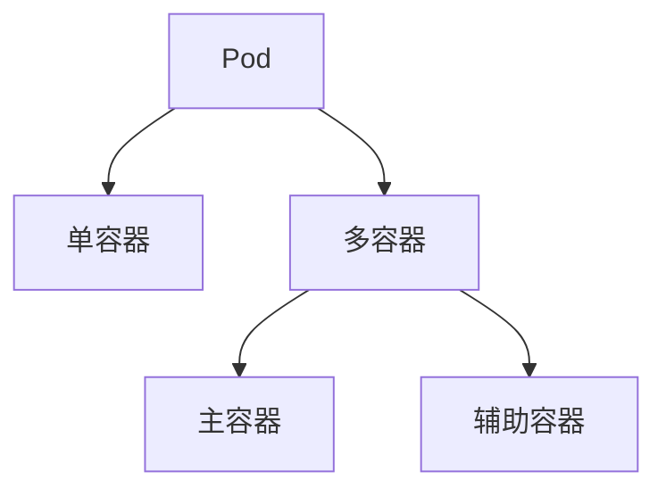

> Pod 是 Kubernetes 中最基本的部署和调度单元，承载着容器化应用的运行环境，是实现弹性伸缩和自动化运维的基础。

## 什么是 Pod

Pod（容器组）是 Kubernetes 中可以创建和调度的**最小部署单元**。每个 Pod 代表集群中运行的一个或多个容器的集合，通常用于承载一个应用实例。

Pod 封装了以下内容：

- 一个或多个应用容器
- 共享的存储卷（Volumes）
- 唯一的网络 IP 地址
- 容器运行策略配置

Pod 作为部署单元，通常由一个或多个紧密协作的容器组成，便于资源共享和进程间通信。

> **容器运行时支持说明**：Kubernetes 现已全面支持多种符合 CRI（Container Runtime Interface）标准的运行时，如 containerd、CRI-O 等。自 2022 年起，Docker 不再作为官方默认运行时，但仍可通过额外配置支持。

## Pod 的使用模式

在 Kubernetes 集群中，Pod 有以下两种主要使用模式：

### 单容器 Pod

这是最常见的模式，即**一个 Pod 运行一个容器**。在此模式下：

- Pod 作为单个容器的包装器
- Kubernetes 直接管理 Pod，而非容器本身
- 提供更高层次的抽象和管理能力

### 多容器 Pod

适用于需要紧密协作的容器场景，即**一个 Pod 运行多个容器**：

- 容器间共享资源和数据
- 容器处于同一网络命名空间，可通过 `localhost` 通信
- 常见于边车（Sidecar）、大使（Ambassador）、适配器（Adapter）等模式

常见多容器模式包括：

- **边车模式（Sidecar）**：主容器与辅助容器协作（如日志收集、代理）
- **大使模式（Ambassador）**：代理容器处理外部通信
- **适配器模式（Adapter）**：转换容器输出格式

下图展示了单容器与多容器 Pod 的结构关系：




{width=1920 height=1695}

### 学习资源

以下 Kubernetes 官方博客文章提供了更详细的 Pod 使用模式：

- [The Distributed System Toolkit: Patterns for Composite Containers - kubernetes.io](https://kubernetes.io/blog/2015/06/the-distributed-system-toolkit-patterns/)
- [Container Design Patterns - kubernetes.io](https://kubernetes.io/blog/2016/06/container-design-patterns/)

## Pod 中的资源共享

Pod 内的多个容器可以共享以下资源，实现高效协作。

### 网络共享

- 每个 Pod 分配唯一的 IP 地址
- Pod 内所有容器共享网络命名空间
- 容器间可通过 `localhost` 通信
- 共享端口空间，避免端口冲突

### 存储共享

- Pod 可定义多个共享卷（Volumes）
- 所有容器可访问这些共享卷
- 支持数据持久化和容器间数据交换
- 常用于配置文件、日志文件共享

下图展示了典型的多容器 Pod 架构：


{width=1156 height=908}

## Pod 的生命周期管理

Pod 的生命周期管理是保障应用高可用和自动化运维的关键。

### 为什么不直接使用 Pod

在生产环境中，很少直接创建和管理单个 Pod，原因如下：

- **短暂性**：Pod 是临时的、用后即焚的实体
- **不自愈**：Pod 故障后不会自动重启或重新调度
- **无副本管理**：单个 Pod 无法提供高可用性

### Pod 与控制器

Kubernetes 通过控制器（Controller）来管理 Pod，实现自动化运维和弹性伸缩。常见控制器类型如下表所示：

以下表格总结了常见控制器类型及其用途：



| 控制器类型 | 用途 | 特点 |
|------------|------|------|
| [Deployment](../../controllers/deployment) | 无状态应用 | 副本管理、滚动更新 |
| [StatefulSet](../../controllers/statefulset) | 有状态应用 | 有序部署、持久化存储 |
| [DaemonSet](../../controllers/daemonset) | 节点级服务 | 每个节点运行一个 Pod |
| [Job](../../controllers/job) | 批处理任务 | 一次性任务执行 |
| [CronJob](../../controllers/cronjob) | 定时任务 | 按计划执行任务 |



### Pod 扩缩容

如需运行应用的多个实例：

- 创建多个 Pod，每个作为独立的应用实例
- 在 Kubernetes 中称为**副本（Replication）**
- 通常由控制器自动管理副本数量，实现弹性伸缩

## Pod 模板

Pod 模板（Pod Template）定义了 Pod 的规格，可嵌入到各种控制器中，实现批量和自动化管理。

以下 YAML 示例展示了一个基础的 Pod 模板：

```yaml
apiVersion: v1
kind: Pod
metadata:
  name: example-pod
spec:
  containers:
  - name: app-container
    image: nginx:1.21
    ports:
    - containerPort: 80
```

控制器使用 Pod 模板来创建和管理实际的 Pod 实例，确保应用的可靠性和可扩展性。

## 最佳实践

在实际使用 Pod 时，建议遵循以下最佳实践：

- **优先使用控制器**：避免直接创建 Pod，使用 Deployment 等控制器
- **合理设计容器**：一个 Pod 中的容器应该紧密相关
- **资源限制**：为容器设置适当的资源请求和限制
- **健康检查**：配置存活探针和就绪探针
- **标签管理**：使用标签进行 Pod 的分类和选择

## 总结

Pod 是 Kubernetes 应用部署的核心单元。通过合理设计 Pod 结构、资源共享和生命周期管理，并结合控制器实现自动化运维，可以显著提升集群的弹性和可维护性。建议在生产环境中始终通过控制器管理 Pod，确保高可用和自动恢复能力。

## 参考文献

1. [The Distributed System Toolkit: Patterns for Composite Containers - kubernetes.io](https://kubernetes.io/blog/2015/06/the-distributed-system-toolkit-patterns/)
2. [Container Design Patterns - kubernetes.io](https://kubernetes.io/blog/2016/06/container-design-patterns/)
3. [Pod - kubernetes.io](https://kubernetes.io/zh/docs/concepts/workloads/pods/)
