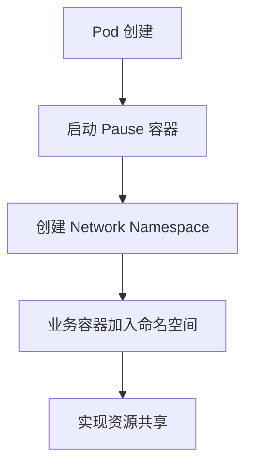

> Pause 容器（Infra 容器）是 Kubernetes Pod 架构的核心机制，负责实现容器间命名空间共享和 Pod 生命周期管理，是多容器协作的基础。

## Pause 容器配置

Pause 容器的镜像配置在 kubelet 参数中，以下为常见配置方式：

```bash
# Kubernetes 默认配置
--pod-infra-container-image=registry.k8s.io/pause:3.9

# 早期版本配置（已过时）
--pod-infra-container-image=gcr.io/google_containers/pause-amd64:3.0
```

> **注意**：自 Kubernetes 1.25 起，Pause 容器镜像默认为 `registry.k8s.io/pause:3.9`，支持多架构。

Pause 容器可自定义，官方源代码见 [Kubernetes GitHub 仓库](https://github.com/kubernetes/kubernetes/tree/master/build/pause)，采用 C 语言实现。

## 容器特点

Pause 容器具备以下显著特性：

- **轻量级**：镜像极小，约 300-700KB
- **持久运行**：始终处于 Pause（暂停）状态
- **多架构支持**：兼容 AMD64、ARM64 等主流架构
- **资源消耗极低**：几乎不占用 CPU 和内存

## 设计背景

Pod 是 Kubernetes 的基本调度单元，本质为逻辑概念。为实现 Pod 内多容器高效共享资源，需打破 Linux Namespace 和 cgroups 的隔离。Kubernetes 通过 Pause 容器实现网络和存储共享，具体包括：

- **网络共享**：通过 Network Namespace
- **存储共享**：通过 Volume 挂载

## 实现原理

Pause 容器的核心作用是为 Pod 内所有业务容器提供统一的命名空间基础。下图展示了 Pause 容器实现网络共享的流程：




{width=1920 height=5204}

### 网络共享机制

Pod 内容器的网络共享按如下步骤实现：

1. 创建 Pause 容器，持有 Network Namespace
2. 业务容器通过 `--net=container:pause` 加入同一 Network Namespace
3. 所有容器共享 IP、端口、路由表等网络资源

### 关键特性

- **统一网络视图**：Pod 内所有容器共享网络设备、IP、MAC 地址
- **生命周期管理**：Pod 生命周期等同于 Pause 容器生命周期
- **独立更新**：可单独更新业务容器，无需重建整个 Pod

## 实际作用

Pause 容器在 Pod 中承担以下职责：

- **命名空间共享基础**：Network、IPC、PID Namespace 共享
- **Init 进程角色**：作为 Pod 内 PID 1，负责回收僵尸进程和信号处理

## 查看运行状态

可通过以下命令在节点上查看 Pause 容器运行情况：

```bash
crictl ps | grep pause
```

示例输出：

```text
9cec6c0ef583   registry.k8s.io/pause:3.9   3 hours ago   Running   k8s_POD_nginx-deployment-...
5a5ef33b0d58   registry.k8s.io/pause:3.9   3 hours ago   Running   k8s_POD_redis-cluster-...
```

## 实战演示

下图展示了 Pause 容器在 Pod 内部的资源共享机制：


{width=1598 height=948}

### 步骤一：启动 Pause 容器

手动启动 Pause 容器作为命名空间基础：

```bash
docker run -d --name pause -p 8880:80 --ipc=shareable registry.k8s.io/pause:3.9
```

### 步骤二：启动 Nginx 容器并共享命名空间

通过 `--net=container:pause` 等参数将 Nginx 容器加入 Pause 容器命名空间：

```bash
cat <<EOF > nginx.conf
error_log stderr;
events { worker_connections 1024; }
http {
    access_log /dev/stdout combined;
    server {
        listen 80 default_server;
        server_name example.com www.example.com;
        location / {
            proxy_pass http://127.0.0.1:2368;
        }
    }
}
EOF

docker run -d --name nginx \
  -v $(pwd)/nginx.conf:/etc/nginx/nginx.conf \
  --net=container:pause \
  --ipc=container:pause \
  --pid=container:pause \
  nginx
```

### 步骤三：启动 Ghost 应用容器

将 Ghost 容器加入 Pause 容器命名空间，实现多容器协作：

```bash
docker run -d --name ghost \
  --net=container:pause \
  --ipc=container:pause \
  --pid=container:pause \
  ghost
```

访问 `http://localhost:8880/` 即可看到 Ghost 博客界面。

### 验证共享效果

进入 Ghost 容器查看进程：

```bash
docker exec -it ghost ps aux
```

示例输出：

```text
USER       PID %CPU %MEM    VSZ   RSS TTY      STAT START   TIME COMMAND
root         1  0.0  0.0   1024     4 ?        Ss   13:49   0:00 /pause
root         5  0.0  0.1  32432  5736 ?        Ss   13:51   0:00 nginx: master process
systemd+     9  0.0  0.0  32980  3304 ?        S    13:51   0:00 nginx: worker process
node        10  0.3  2.0 1254200 83788 ?       Ssl  13:53   0:03 node current/index.js
```

可见：

- Pause 容器进程 PID 为 1（Init 进程）
- 所有容器进程在同一 PID 命名空间
- 容器间可通过 `localhost` 通信

## 版本演进



| Kubernetes 版本 | Pause 容器版本 | 主要变化                     |
|-----------------|----------------|------------------------------|
| 1.20 及以前     | pause:3.2      | 基础功能                     |
| 1.21-1.24       | pause:3.5      | 多架构支持                   |
| 1.25+           | pause:3.9      | 镜像仓库迁移到 registry.k8s.io |



## 最佳实践

Pause 容器相关建议如下：

- **镜像选择**：使用与集群版本匹配的 Pause 容器镜像
- **网络配置**：确保 Pause 容器镜像在所有节点可用
- **监控观察**：通过 Pause 容器状态判断 Pod 健康
- **故障排查**：Pause 容器异常通常意味着整个 Pod 存在问题

## 总结

Pause 容器是 Kubernetes Pod 内部资源共享和生命周期管理的基础。通过 Pause 容器实现命名空间统一，保障多容器高效协作和稳定运行。建议在实际运维中关注 Pause 容器状态，提升故障排查和集群可靠性。

## 参考文献

- [The Almighty Pause Container - ianlewis.org](https://www.ianlewis.org/en/almighty-pause-container)
- [Kubernetes Pause Container Source Code - github.com](https://github.com/kubernetes/kubernetes/tree/master/build/pause)
- [Kubernetes Container Runtime Interface - kubernetes.io](https://kubernetes.io/docs/concepts/architecture/cri/)
