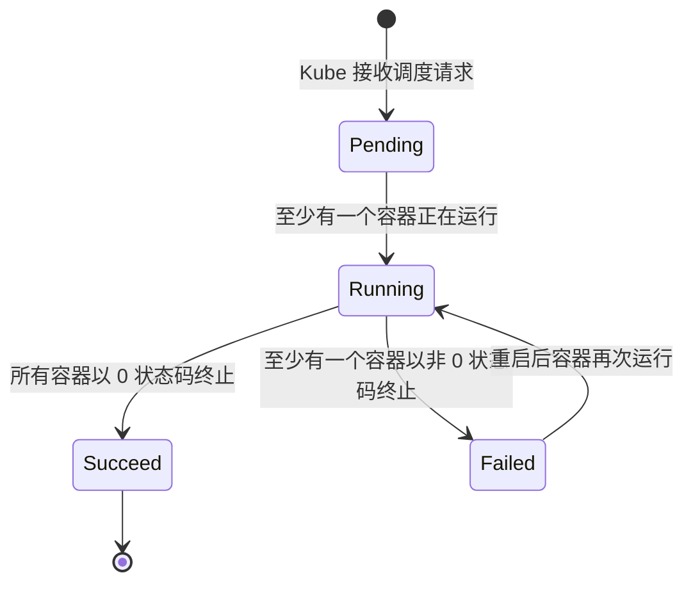

> Pod 是 Kubernetes 架构的基石，理解其设计理念和生命周期管理对于构建高可用、可扩展的容器化应用至关重要。

## Pod 数据结构概览

下图展示了 Pod 的核心数据结构，便于理解其组成和属性：


{width=3695 height=5188}

## 什么是 Pod？

Pod（容器组）是 Kubernetes REST API 中的核心资源类型，也是最小的可部署和管理单元。Pod 可以理解为豌豆荚，它是一个或多个容器的集合，这些容器：

- **共享网络命名空间**：拥有相同的 IP 地址和端口空间
- **共享存储卷**：可以访问相同的持久化存储
- **协同调度**：总是被调度到同一个节点上
- **生命周期一致**：同时创建、启动和终止

Pod 为紧密耦合的应用提供了一个“逻辑主机”环境，类似于传统部署中将相关应用运行在同一台物理机或虚拟机上。

## Pod 的共享环境

Pod 中的容器共享以下环境：

- **Linux 命名空间**：网络、IPC、UTS 等
- **控制组（cgroups）**：资源限制和隔离
- **存储卷**：数据持久化和共享

容器间可以通过以下方式通信：

- **localhost**：网络通信
- **进程间通信（IPC）**：SystemV 信号量、POSIX 共享内存等
- **共享文件系统**：通过挂载的卷进行文件共享

## Pod 架构示意图

下图展示了多容器 Pod 的典型架构，便于理解容器间的协作关系：


{width=1156 height=908}

## Pod 的设计理念

Pod 作为部署单元，提供了更高层次的抽象，简化了应用管理和资源利用。

### 简化应用管理

- **统一调度**：相关容器总是部署在同一节点
- **协同生命周期**：容器同时创建、启动和终止
- **资源共享**：简化容器间的通信和数据交换
- **依赖管理**：自动处理容器间的依赖关系

### 优化资源利用

- **网络共享**：避免端口冲突和网络复杂性
- **存储共享**：高效的数据交换和持久化
- **计算资源**：合理的资源分配和限制

## Pod 的典型使用场景

Pod 支持多种设计模式，满足不同业务需求。

### 边车模式 (Sidecar Pattern)

边车模式（Sidecar Pattern）是 Kubernetes 中常见的 Pod 设计模式。在同一个 Pod 内运行主应用容器的同时，配套部署一个或多个辅助容器（边车），用于实现日志收集、数据同步、代理、监控等功能。边车容器与主容器共享网络和存储环境，提升应用的可观测性和可维护性。

以下是边车模式的典型 YAML 配置示例：

```yaml
# 示例：Web 应用 + 日志收集器
apiVersion: v1
kind: Pod
spec:
  containers:
  - name: web-app
    image: nginx
  - name: log-collector
    image: fluentd
```

### 代理模式 (Proxy Pattern)

- API 网关和后端服务
- 缓存代理和应用服务器
- 安全代理和业务容器

### 适配器模式 (Adapter Pattern)

- 监控数据格式转换
- 配置文件标准化
- 协议转换和桥接

## Pod 生命周期管理

Pod 的生命周期分为多个阶段，合理管理可提升系统稳定性。

### Pod 阶段 (Phase)

- **Pending**：Pod 已创建但未调度或镜像拉取中
- **Running**：至少有一个容器正在运行
- **Succeeded**：所有容器成功终止且不会重启
- **Failed**：所有容器已终止且至少一个失败
- **Unknown**：无法获取 Pod 状态

### 重启策略

- **Always**：总是重启（默认）
- **OnFailure**：仅在失败时重启
- **Never**：从不重启

### Pod 生命周期流程图

下图展示了 Pod 的生命周期主要阶段及状态转换：




{width=1920 height=2284}

## Pod 网络和存储

Pod 提供独立的网络和存储环境，支持多种业务场景。

### 网络特性

- 每个 Pod 拥有唯一的集群 IP 地址
- Pod 内容器共享网络命名空间
- 容器间通过 localhost 通信
- 跨 Pod 通信需要通过 Service

### 存储特性

- 支持多种卷类型：EmptyDir、HostPath、PVC 等
- 卷的生命周期与 Pod 一致
- 容器重启时数据保持不变
- Pod 删除时临时卷被清理

## Pod 终止流程

Pod 的优雅终止遵循以下步骤：

1. **发起删除请求**：用户或控制器请求删除 Pod
2. **标记终止状态**：API Server 更新 Pod 状态为 Terminating
3. **执行预停止钩子**：运行 preStop 生命周期钩子
4. **发送 SIGTERM 信号**：通知容器进程准备关闭
5. **等待优雅期**：默认 30 秒的优雅终止期
6. **强制终止**：发送 SIGKILL 信号强制停止进程
7. **清理资源**：从 API Server 中移除 Pod 记录

### 自定义终止行为

可以通过自定义 Pod 的终止行为来实现更优雅的下线流程。例如，设置 `terminationGracePeriodSeconds` 参数延长优雅终止时间，并通过 `preStop` 生命周期钩子在容器被终止前执行清理脚本。以下是典型的自定义终止行为 YAML 示例：

```yaml
apiVersion: v1
kind: Pod
spec:
  terminationGracePeriodSeconds: 60  # 自定义优雅期
  containers:
  - name: app
    image: myapp
    lifecycle:
      preStop:
        exec:
          command: ["/bin/sh", "-c", "cleanup.sh"]
```

## 高级特性

Pod 支持多种安全和资源管理特性，保障集群稳定与安全。

### 安全上下文

以下是相关的代码示例：

```yaml
apiVersion: v1
kind: Pod
spec:
  securityContext:
    runAsUser: 1000
    runAsGroup: 1000
    fsGroup: 1000
  containers:
  - name: app
    securityContext:
      allowPrivilegeEscalation: false
      readOnlyRootFilesystem: true
      capabilities:
        drop:
        - ALL
```

### 资源管理

合理设置资源请求（requests）和限制（limits），可防止资源争用和抢占，提升集群稳定性。以下是资源管理的典型 YAML 配置示例：

```yaml
apiVersion: v1
kind: Pod
spec:
  containers:
  - name: app
    resources:
      requests:
        memory: "128Mi"
        cpu: "100m"
      limits:
        memory: "256Mi"
        cpu: "200m"
```

## 最佳实践

Pod 设计与管理建议如下：

- **单一职责**：每个容器专注于单一功能
- **无状态设计**：避免在 Pod 中存储持久状态
- **优雅终止**：实现合适的关闭逻辑
- **资源限制**：合理设置资源请求和限制
- **健康检查**：配置 livenessProbe、readinessProbe
- **安全加固**：使用非 root 用户、只读根文件系统、最小化权限

## Pod 与控制器关系

虽然可以直接创建 Pod，但在生产环境中通常使用以下控制器：

- **Deployment**：无状态应用的部署和更新
- **StatefulSet**：有状态应用的管理
- **DaemonSet**：节点级别的后台任务
- **Job/CronJob**：批处理任务

这些控制器提供了自动重启、滚动更新、扩缩容等高级功能。

## 总结

Pod 是 Kubernetes 架构的核心单元。通过合理设计 Pod 结构、资源共享和生命周期管理，并结合控制器实现自动化运维，可以显著提升集群的弹性和可维护性。建议在生产环境中始终通过控制器管理 Pod，确保高可用和自动恢复能力。

## 参考文献

- [Kubernetes 官方文档 - kubernetes.io](https://kubernetes.io/zh/docs/concepts/workloads/pods/)
- [Pod 生命周期管理 - kubernetes.io](https://kubernetes.io/zh/docs/concepts/workloads/pods/pod-lifecycle/)
