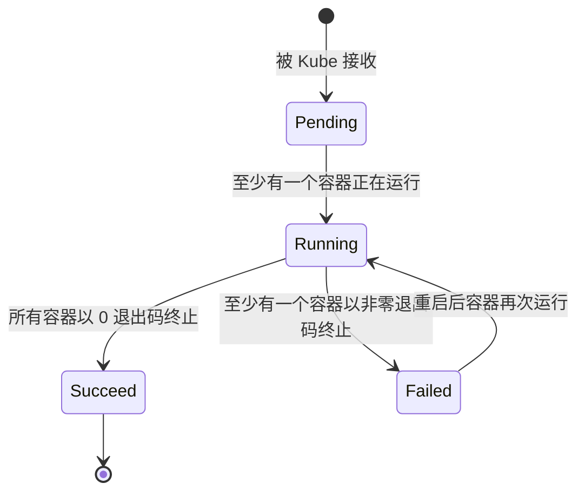

> Pod 生命周期管理是 Kubernetes 自动化运维和高可用保障的核心，合理配置探针和重启策略可显著提升应用的健壮性和弹性。

## Pod 阶段（Phase）

Pod 的 `status` 字段包含一个 PodStatus 对象，其中的 `phase` 字段表示 Pod 在生命周期中的当前状态。Pod 的阶段（phase）是对 Pod 在其生命周期中状态的高层次概括，并非容器或 Pod 状态的详细汇总。

### 阶段类型

下表总结了 Pod `phase` 字段的所有可能取值及其含义：



| 阶段         | 描述                                                                 |
|--------------|----------------------------------------------------------------------|
| Pending      | Pod 已被 Kubernetes 接受，但一个或多个容器尚未创建完成。包括调度等待时间和镜像拉取时间 |
| Running      | Pod 已绑定到节点，所有容器已创建，至少有一个容器正在运行、启动或重启 |
| Succeeded    | Pod 中所有容器已成功终止，且不会重启                                 |
| Failed       | Pod 中所有容器已终止，至少有一个容器因失败而终止（退出码非零或被系统终止） |
| Unknown      | 无法获取 Pod 状态，通常因与 Pod 所在节点通信失败导致                 |



下图展示了 Pod 生命周期中状态的变化流程：




{width=1920 height=2289}

## Pod 状态（Status）

Pod 具有 PodStatus 对象，包含 PodCondition 数组。每个 PodCondition 包含：

- **`type`**：条件类型，可能值包括：
  - `PodScheduled`：Pod 是否已被调度
  - `Ready`：Pod 是否准备好接收流量
  - `Initialized`：所有初始化容器是否成功完成
  - `ContainersReady`：Pod 中所有容器是否就绪
- **`status`**：条件状态，值为 `True`、`False` 或 `Unknown`

## 容器探针（Probes）

探针（Probe）是 kubelet 对容器执行的定期健康检查。kubelet 通过调用容器实现的处理程序来执行诊断。

### 探针类型

下表总结了三种常见探针类型及其判定标准：



| 探针类型        | 描述           | 成功条件           |
|-----------------|----------------|--------------------|
| ExecAction      | 执行指定命令    | 命令退出码为 0     |
| TCPSocketAction | TCP 端口检查    | 端口可连接         |
| HTTPGetAction   | HTTP GET 请求   | 响应状态码 200-399 |



每次探测返回以下结果之一：

- **Success（成功）**：容器通过诊断
- **Failure（失败）**：容器未通过诊断  
- **Unknown（未知）**：诊断失败，不采取行动

### 探针种类

#### 存活探针（Liveness Probe）

- 检测容器是否正在运行
- 失败时 kubelet 杀死容器，按重启策略处理
- 未配置时默认为 `Success`

#### 就绪探针（Readiness Probe）

- 检测容器是否准备好接收流量
- 失败时从 Service 端点中移除 Pod IP
- 未配置时默认为 `Success`

#### 启动探针（Startup Probe）

自 Kubernetes 1.16 起支持，用于慢启动容器：

- 检测容器是否已启动
- 启动探针成功前，其他探针被禁用
- 适用于启动时间较长的应用

### 探针使用指南

- **存活探针**：适用于进程无法自愈或需自动重启的场景
- **就绪探针**：用于控制流量路由，适合需预热或加载数据的应用
- **启动探针**：为慢启动容器提供更长启动窗口

### 探针配置示例

以下 YAML 展示了三种探针的典型配置：

```yaml
apiVersion: v1
kind: Pod
metadata:
  name: probe-example
spec:
  containers:
  - name: app
    image: nginx:1.20
    ports:
    - containerPort: 80
    startupProbe:
      httpGet:
        path: /
        port: 80
      initialDelaySeconds: 10
      periodSeconds: 5
      failureThreshold: 12  # 60 秒启动窗口
    livenessProbe:
      httpGet:
        path: /health
        port: 80
      initialDelaySeconds: 15
      periodSeconds: 10
      timeoutSeconds: 5
      failureThreshold: 3
    readinessProbe:
      httpGet:
        path: /ready
        port: 80
      initialDelaySeconds: 5
      periodSeconds: 5
      timeoutSeconds: 3
      successThreshold: 1
      failureThreshold: 3
```

## 就绪门控（Readiness Gates）

自 Kubernetes 1.14 起，Pod 支持扩展就绪检测机制。可在 PodSpec 中设置 `readinessGates`，指定额外的就绪条件：

```yaml
apiVersion: v1
kind: Pod
metadata:
  name: readiness-gate-example
spec:
  readinessGates:
    - conditionType: "example.com/load-balancer-ready"
  containers:
  - name: app
    image: nginx:1.20
status:
  conditions:
    - type: Ready
      status: "True"
      lastTransitionTime: "2023-01-01T00:00:00Z"
    - type: "example.com/load-balancer-ready"
      status: "True"
      lastTransitionTime: "2023-01-01T00:00:00Z"
```

Pod 被认为就绪需满足：

1. 所有容器状态为 Ready
2. 所有 `readinessGates` 条件为 True

## 重启策略（Restart Policy）

PodSpec 的 `restartPolicy` 字段控制容器重启行为。下表总结了三种重启策略及其适用场景：



| 策略         | 描述           | 适用场景         |
|--------------|----------------|------------------|
| Always       | 总是重启（默认）| 长期运行的服务   |
| OnFailure    | 失败时重启     | 批处理任务       |
| Never        | 从不重启       | 一次性任务       |



- **重启延迟**：采用指数退避算法（10s, 20s, 40s, 80s, 160s, 300s）
- **重置条件**：容器成功运行 10 分钟后重置延迟
- **节点限制**：容器只能在同一节点重启

## Pod 生命周期管理

Kubernetes 通过控制器实现 Pod 生命周期的自动化管理。下表总结了常见控制器类型及其重启策略要求：



| 控制器                | 适用场景         | 重启策略要求      |
|-----------------------|------------------|-------------------|
| Deployment/ReplicaSet | 无状态应用       | Always            |
| StatefulSet           | 有状态应用       | Always            |
| DaemonSet             | 节点级服务       | Always            |
| Job                   | 批处理任务       | OnFailure/Never   |
| CronJob               | 定时任务         | OnFailure/Never   |



### 生命周期事件

Pod 生命周期主要包括以下阶段：

1. **创建阶段**
   - API Server 验证并存储 Pod 规格
   - 调度器选择节点
   - kubelet 拉取镜像并创建容器
2. **运行阶段**
   - 容器启动并运行
   - 探针持续检查健康状态
   - 根据检查结果更新 Pod 状态
3. **终止阶段**
   - 发送 SIGTERM 信号
   - 等待优雅终止期（默认 30 秒）
   - 发送 SIGKILL 强制终止

## 实际应用场景

Pod 生命周期管理和重启策略的选择需结合实际业务需求。以下为典型场景示例：

### 场景 1：Web 应用部署

适用于 Deployment 控制器，长期运行服务，重启策略为 Always：

```yaml
apiVersion: apps/v1
kind: Deployment
metadata:
  name: web-app
spec:
  replicas: 3
  selector:
    matchLabels:
      app: web-app
  template:
    metadata:
      labels:
        app: web-app
    spec:
      containers:
      - name: web
        image: nginx:1.20
        ports:
        - containerPort: 80
        livenessProbe:
          httpGet:
            path: /health
            port: 80
          initialDelaySeconds: 30
          periodSeconds: 10
        readinessProbe:
          httpGet:
            path: /ready
            port: 80
          initialDelaySeconds: 5
          periodSeconds: 5
        resources:
          requests:
            memory: "64Mi"
            cpu: "250m"
          limits:
            memory: "128Mi"
            cpu: "500m"
```

### 场景 2：批处理任务

适用于 Job 控制器，一次性或有限次数运行的任务，重启策略为 OnFailure：

```yaml
apiVersion: batch/v1
kind: Job
metadata:
  name: data-processing
spec:
  template:
    spec:
      restartPolicy: OnFailure
      containers:
      - name: processor
        image: data-processor:latest
        command: ["python", "process.py"]
        resources:
          requests:
            memory: "512Mi"
            cpu: "1"
          limits:
            memory: "1Gi"
            cpu: "2"
```

## 故障排查

在 Pod 生命周期管理中，常见问题及排查建议如下：

- **Pod 一直处于 Pending 状态**
  - 检查节点资源是否充足
  - 验证镜像是否可拉取
  - 确认 PVC 是否可用
- **容器频繁重启**
  - 检查探针配置是否合理
  - 查看容器日志和事件
  - 验证资源限制设置
- **Pod 无法接收流量**
  - 检查就绪探针状态
  - 验证 Service 配置
  - 确认网络策略设置

常用调试命令如下：

```bash
# 查看 Pod 状态
kubectl get pods -o wide

# 查看 Pod 详细信息
kubectl describe pod <pod-name>

# 查看 Pod 日志
kubectl logs <pod-name> -c <container-name>

# 查看 Pod 事件
kubectl get events --field-selector involvedObject.name=<pod-name>

# 进入容器调试
kubectl exec -it <pod-name> -c <container-name> -- /bin/bash
```

## 最佳实践

- **合理配置探针**：根据应用特性设置合适的超时和重试参数，避免探针过于频繁或宽松
- **优化启动时间**：使用启动探针为慢启动应用提供缓冲，优化镜像和启动流程
- **资源管理**：设置合理的资源请求和限制，监控资源使用
- **优雅终止**：处理 SIGTERM 信号，设置合适的 `terminationGracePeriodSeconds`

## 总结

Pod 生命周期管理是 Kubernetes 自动化运维和高可用的基础。通过合理配置探针、重启策略和生命周期事件，能够有效提升应用的健壮性和弹性。建议结合实际业务场景，灵活运用生命周期管理机制，保障集群稳定运行。

## 参考文献

- [Pod Lifecycle - kubernetes.io](https://kubernetes.io/docs/concepts/workloads/pods/pod-lifecycle/)
- [Configure Liveness, Readiness and Startup Probes - kubernetes.io](https://kubernetes.io/docs/tasks/configure-pod-container/configure-liveness-readiness-startup-probes/)
- [Pod Lifecycle - API Reference - kubernetes.io](https://kubernetes.io/docs/reference/generated/kubernetes-api/v1.28/#podstatus-v1-core)
