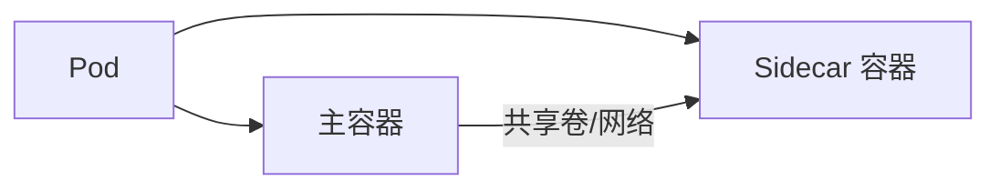

> Sidecar 容器模式是实现 Kubernetes 应用关注点分离和增强可观测性的关键手段，广泛应用于日志、监控、服务网格等场景。

## Sidecar 容器的特点

Sidecar 容器（Sidecar Container）是指与主容器（Main Container）共同运行在同一个 Pod 内的辅助容器。它们具有如下特点：

- **共享资源**：与主容器共享网络命名空间、存储卷和生命周期。
- **松耦合**：功能独立，可单独更新和维护。
- **透明性**：对主应用透明，无需修改主应用代码。
- **可重用性**：可在多个不同应用中复用。

下图展示了 Sidecar 容器与主容器的协作关系：




{width=1920 height=354}

## 常见使用场景

Sidecar 容器模式适用于多种场景，以下为典型用例：

### 日志收集

Sidecar 容器可用于日志收集，将主容器日志转发到日志系统。主容器与日志收集 Sidecar 通过共享卷（如 emptyDir）实现日志文件共享。

```yaml
apiVersion: v1
kind: Pod
metadata:
  name: app-with-sidecar
spec:
  containers:
  - name: app
    image: my-app:latest
    volumeMounts:
    - name: shared-logs
      mountPath: /var/log
  - name: log-collector
    image: fluent/fluent-bit:latest
    volumeMounts:
    - name: shared-logs
      mountPath: /var/log
  volumes:
  - name: shared-logs
    emptyDir: {}
```

### 服务网格代理

在服务网格（Service Mesh）场景中，Sidecar 容器作为代理（如 Envoy、Istio Proxy）部署于每个应用 Pod 内，实现流量管理、可观测性和安全等功能。

```yaml
apiVersion: v1
kind: Pod
metadata:
  name: app-with-proxy
spec:
  containers:
  - name: app
    image: my-app:latest
    ports:
    - containerPort: 8080
  - name: envoy-proxy
    image: envoyproxy/envoy:latest
    ports:
    - containerPort: 9901
```

### 配置热更新

Sidecar 容器可用于监听 ConfigMap 变更，实现配置热更新，无需重启主容器。

```yaml
apiVersion: v1
kind: Pod
metadata:
  name: app-with-config-watcher
spec:
  containers:
  - name: app
    image: my-app:latest
    volumeMounts:
    - name: config-volume
      mountPath: /etc/config
  - name: config-watcher
    image: config-watcher:latest
    volumeMounts:
    - name: config-volume
      mountPath: /etc/config
  volumes:
  - name: config-volume
    configMap:
      name: app-config
```

## 与 Init 容器的区别

Sidecar 容器与 Init 容器（Init Container）在运行时机、生命周期等方面存在本质区别。下表进行对比说明：



| 特性       | Sidecar 容器         | Init 容器           |
|------------|---------------------|---------------------|
| 运行时机   | 与主容器同时运行     | 主容器启动前运行    |
| 生命周期   | 与主容器相同         | 运行完成后退出      |
| 数量限制   | 可有多个             | 可有多个，顺序执行  |
| 主要用途   | 持续辅助服务         | 初始化任务          |



## 最佳实践

在实际应用中，建议遵循以下最佳实践以提升 Sidecar 容器的可维护性和稳定性。

### 资源管理

为 Sidecar 容器合理分配资源，避免影响主业务容器：

```yaml
containers:
- name: sidecar
  image: sidecar:latest
  resources:
    requests:
      memory: "64Mi"
      cpu: "50m"
    limits:
      memory: "128Mi"
      cpu: "100m"
```

### 健康检查

为 Sidecar 容器配置健康检查（如 livenessProbe 和 readinessProbe）：

```yaml
containers:
- name: sidecar
  image: sidecar:latest
  livenessProbe:
    httpGet:
      path: /health
      port: 8080
    initialDelaySeconds: 30
    periodSeconds: 10
```

### 优雅关闭

通过 `preStop` 钩子实现 Sidecar 容器的优雅关闭：

```yaml
containers:
- name: sidecar
  image: sidecar:latest
  lifecycle:
    preStop:
      exec:
        command: ["/bin/sh", "-c", "sleep 10"]
```

## 注意事项

在设计和使用 Sidecar 容器时需关注以下问题：

- **资源消耗**：每个 Sidecar 容器都会消耗额外的 CPU 和内存资源。
- **复杂性提升**：增加 Pod 复杂性，调试和监控难度提升。
- **网络通信**：需考虑容器间网络通信和端口冲突。
- **版本管理**：需协调主容器与 Sidecar 容器的版本更新。

## 总结

Sidecar 容器模式是 Kubernetes 实现关注点分离和增强应用能力的重要方式。通过合理设计 Sidecar 容器，可将日志、监控、安全等横切关注点从主应用中解耦，提升系统的模块化和可维护性。在实际应用中需权衡其带来的灵活性与复杂性，结合最佳实践实现高效的云原生架构。
