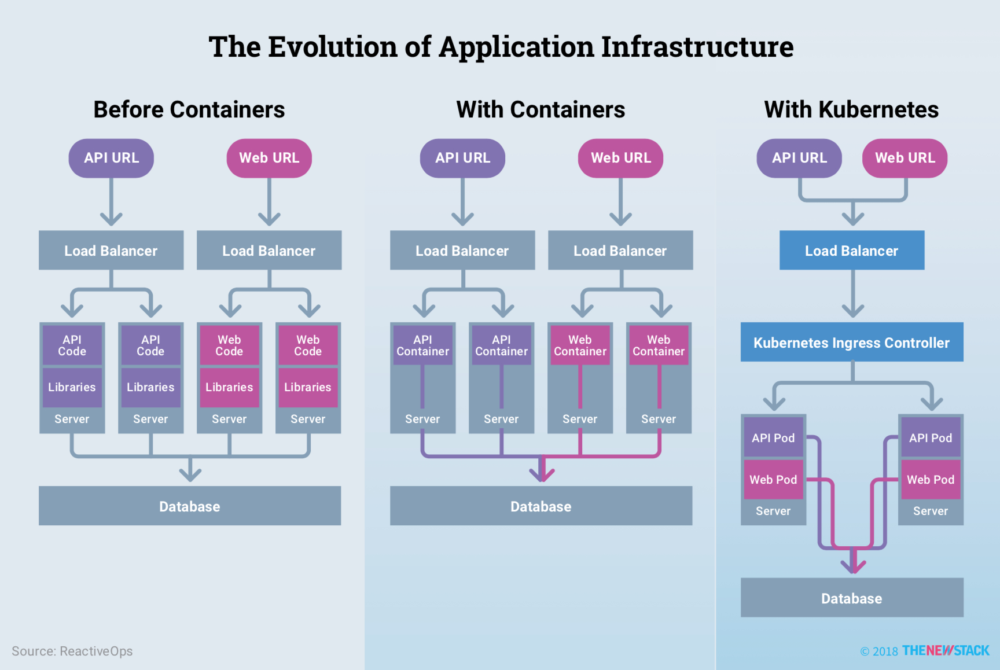
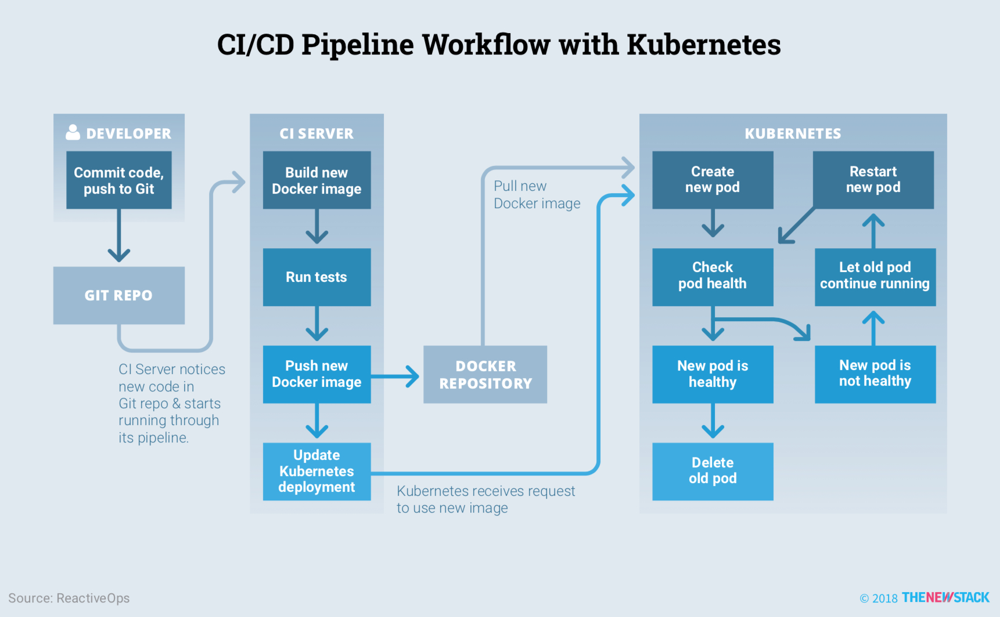
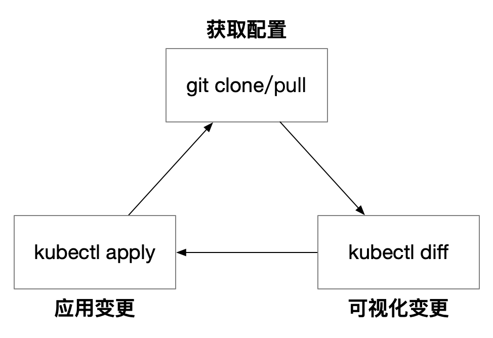
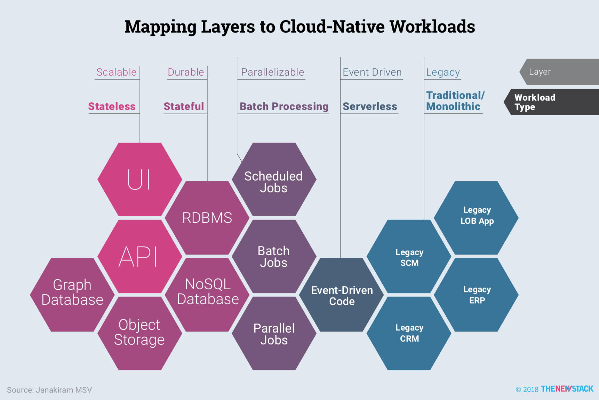
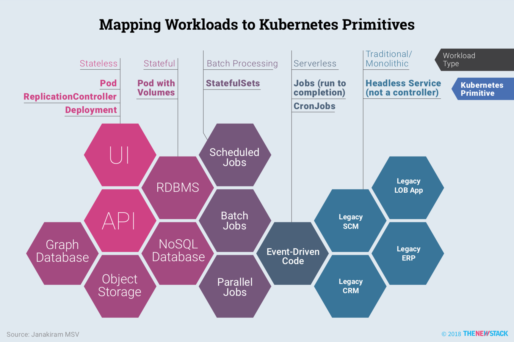

# 持续集成与发布（CI/CD）

持续集成与发布，简称 CI/CD，是微服务构建的重要环节，也是 DevOps 中推崇的方法论。如何在 Kubernetes 中使用持续构建与发布工具？可以既可以与企业内部原有的持续构建集成，例如 Jenkins，也可以在 Kubernetes 中部署一套新的持续构建与发布工具，例如 Drone、ArgoCD、Tekton 等。

众所周知 Kubernetes 并不提供代码构建、发布和部署，所有的这些工作都是由 CI/CD 工作流完成的，TheNewStack 推出过一本专门介绍 Kubernetes 中的 CI/CD 的白皮书 [CI/CD with Kubernetes](https://thenewstack.io/ebooks/kubernetes/ci-cd-with-kubernetes/)，本书共 117 页，介绍了 Kubernetes 中 CI/CD 的现状。

> **CI/CD with Kubernetes 简介 **
>
> 主要作者
> - Rob Scott：ReactiveOps 公司的 SRE
> - Janakiram MSV：Janakiram & Associates 的首席分析师
> - Craig Martin：Kenzan 的高级副总裁
> - Container Solutions
> 
> 主要内容
> - DevOps 模式
> - 云原生应用模式
> - 使用 Spinnaker 做持续交付
> - 云原生时代的监控

本节本分内容引用自本书。

### DevOps 模式

在云原生应用诞生之前，就已经有很多流行的自动化运维工具，比如 Chef、Puppet 等，后来又诞生了 CI/CD 流水线，Docker 和 DevOps 使用容器解除开发和运维之间的隔阂，但同时也带来了一些挑战，比如频繁的发布变更如何控制，如何控制容器集群的行为，如何拆分应用到容器之中等。这是一个专门用于容器编排调度的工具呼之欲出，Kubernetes 的出现彻底改变了局面，可以说它直接改变了应用的基础架构。

Kubernetes 细化的应用程序的分解粒度，同时将服务发现、配置管理、负载均衡和健康检查等作为基础设施的功能，简化了应用程序的开发。

而 Kubernetes 这种声明式配置尤其适合 CI/CD 流程，况且现在还有如 Helm、Draft、Spinnaker、Skaffold 等开源工具可以帮助我们发布 Kuberentes 应用。

有了基于 Kubernetes 的 CI/CD 流程后，又出现了 GitOps 和 DevSecOps。

## GitOps

GitOps 是一套使用 Git 来管理基础设施和应用配置的实践。对于 Kubernetes 来说，这意味着任何 GitOps 操作者都需要依次自动完成以下步骤：

1. 通过克隆或拉取更新 Git 仓库（如 GitHub、GitLab），从 Git 中检索最新的配置清单
2. 使用 `kubectl diff` 将 Git 配置清单与 Kubernetes 集群中的实时资源进行比较
3. 最后，使用 `kubectl apply` 将更改推送到 Kubernetes 集群中

Kubernetes 中 GitOps 的流程如下图所示。

该流程虽然看上去很简单，但是有很多隐藏的细节在其中，真正实施起来还是比较复杂的。

### 云原生应用模式

> 云原生是通过构建团队、文化和技术，利用自动化和架构来管理系统的复杂性和解放生产力。——Joe Beda，Heotio CTO，联合创始人

云原生应用的 10 条关键属性。

1. 使用轻量级的容器打包
2. 使用最合适的语言和框架开发
3. 以松耦合的微服务方式设计
4. 以 API 为中心的交互和协作
5. 无状态和有状态服务在架构上界限清晰
6. 不依赖于底层操作系统和服务器
7. 部署在自服务、弹性的云基础设施上
8. 通过敏捷的 DevOps 流程管理
9. 自动化能力
10. 通过定义和策略驱动的资源分配

将应用程序架构中的不同组件映射到云原生的工作负载中，如下图所示：

这也是 DevOps 需要关注的部分，如何将云原生的组件映射为 Kubernetes 的原语（即 Kubernetes 里的各种资源对象和概念组合）呢？如下图所示。

在 Kubernetes 中发布应用时，需要注意的点总结概括为以下 10 条：

1. 不要直接部署裸的 Pod。
2. 为工作负载选择合适的 Controller。
3. 使用 Init 容器确保应用程序被正确的初始化。
4. 在应用程序工作负载启动之前先启动 service。
5. 使用 Deployment history 来回滚到历史版本。
6. 使用 ConfigMap 和 Secret 来存储配置。
7. 在 Pod 里增加 Readiness 和 Liveness 探针。
8. 给 Pod 设置 CPU 和内存资源限额。
9. 定义多个 namespace 来限制默认 service 范围的可视性。
10. 配置 HPA 来动态扩展无状态工作负载。

## 参考

- [CI/CD with Kubernetes - thenewstack.io](https://thenewstack.io/ebooks/kubernetes/ci-cd-with-kubernetes/)
