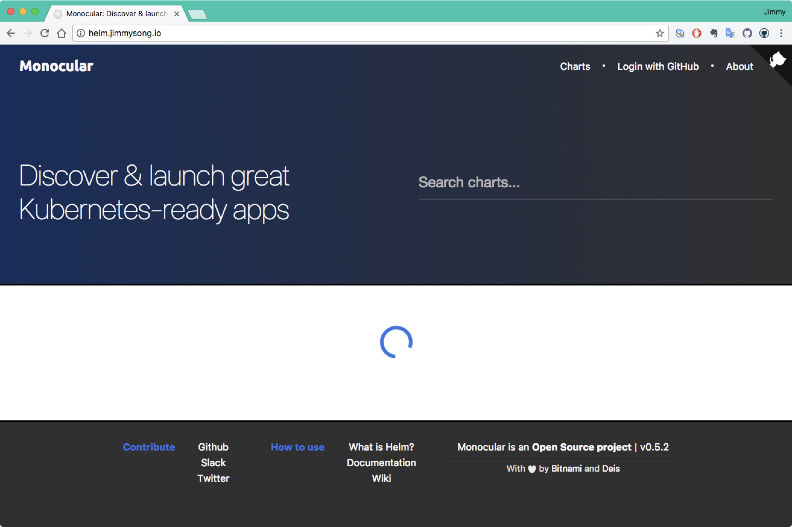

# 构建私有Chart仓库

使用Chart便于封装和管理kubernetes中的应用，因此当企业内部的应用多了以后，互相依赖、部署环境复杂之后，原先的直接使用yaml文件的管理方式已经不再适应生产的需要，因此我们有必要构建自己的chart仓库。本文中我们将使用 GitHub Pages 来构建我们自己的 chart 仓库。

## 目的

我们需要构建一个GitHub pages存储所有chart的压缩文件，最好还要有一个前端来展示和搜索chart。

## 什么是Chart

Chart是helm管理的应用的打包格式。它包括如下特征：

- Chart中包括一系列的yaml格式的描述文件。
- 一个Chart只用来部署单个的应用的，不应该过于复杂，不应该包含多个依赖，相当于一个微服务。

Chart有特定的目录结构，可以打包起来进行版本控制。

### Chart的组成结构

我们以nginx的chart为例，讲解chart的组成结构。

```bash
nginx/
  Chart.yaml          # 必须：一个包含chart的名称、版本和启用条件信息等的YAML文件
  LICENSE             # 可选: chart的许可证
  README.md           # 可选: 使用说明
  requirements.yaml   # 可选: 该chart的依赖配置
  values.yaml         # 必须：该chart的默认配置值
  charts/             # 可选: 包含该chart依赖的chart
  templates/          # 可选：kubernetes manifest文件模板，用于生成kubernetes yaml文件
  templates/NOTES.txt # 可选: 该chart的使用说明和提示信息文本文件，作为helm install后的提示信息
```

### Chart的安装方式

安装chart主要分为安装本地定义的chart和远程chart仓库中的chart两种方式。

**安装本地chart**

- 指定本地chart目录：helm install .
- 指定本地chart压缩包：helm install nginx-1.2.3.tgz

**安装chart仓库中的chart**

- 使用默认的远程仓库：helm install stable/nginx
- 使用指定的仓库：helm install localhost:8879/nginx-1.2.3.tgz

实际上可以将chart打包后作为静态文件托管到web服务器上，例如GitHub pages作为chart仓库也可以。

### 依赖管理

有两种方式来管理chart的依赖。

- 直接在本的chart的`charts`目录下定义
- 通过在`requirements.yaml`文件中定义依赖的chart

在每个chart的`charts`目录下可以定义依赖的子chart。子chart有如下特点：

- 无法访问父chart中的配置
- 父chart可以覆盖子chart中的配置

## Chart仓库

Chart 仓库（repository）是一个用来托管`index.yaml`文件和打包好的chart文件的web服务器。当前chart仓库本身没有设置身份和权限验证，查看[此链接](https://github.com/kubernetes/helm/issues/1038)获取该问题的最新进展。

因为chart仓库只是一个HTTP服务，通过HTTP GET获取YAML文件和chart的压缩包，所以可以将这些文件存储在web服务器中，例如GCS、Amazon S3、GitHub Pages等。

关于chart仓库的更多信息请参考[Helm chart文档](https://github.com/kubernetes/helm/blob/master/docs/chart_repository.md)。

## 使用GitHub pages托管charts

我们在上文中说到，chart可以使用GitHub pages做存储，接下来我们将会把之前够够构建的chart上传到GitHub pages并在helm中新增一个repo。

## 构建Monocular UI

参考 [Monocular UI](Monocular UI) 构建UI。

克隆项目到本地

```bash
git clone https://github.com/kubernetes-helm/monocular.git
```

### 依赖环境

- [Angular 2](https://angular.io/)
- [angular/cli](https://github.com/angular/angular-cli) 
- Typescript
- Sass
- [Webpack](https://webpack.github.io/)
- Bootstrap

在`monoclar/scr/ui`目录下执行以下命令安装依赖：

```bash
yarn install
npm install -g @angular/cli
npm install -g typescript
npm install -g webpack
```

## 运行

### 使用docker-compose

最简单的运行方式使用[docker-compose](https://docs.docker.com/compose/)：

```bash
docker-comopse up
```

该命令需要用到如下镜像：

- bitnami/mongodb:3
- bitnami/node:8
- quay.io/deis/go-dev:v1.5.0

会有一个很长的build过程，构建失败。

### 使用helm

首先需要已在本地安装了helm，并在kubernetes集群中安装了tiller，见[使用helm管理kubernetes应用](helm.md)。

```bash
# 需要安装nginx ingress
$ helm install stable/nginx-ingress
$ helm repo add monocular https://kubernetes-helm.github.io/monocular
$ helm install monocular/monocular
```



因为nginx ingress配置问题，官方的chart中api与ui使用的是同样的domain name，我使用的是traefik ingress，`api`访问不到，所以加载不了chart。

## 参考

[Monocular UI]()

[Helm Chart - GitHub](https://github.com/kubernetes/helm/blob/master/docs/charts.md)

[简化Kubernetes应用部署工具-Helm之应用部署](https://www.kubernetes.org.cn/2706.html)

[Speed deployment on Kubernetes with Helm Chart – Quick YAML example from scratch](https://www.ibm.com/blogs/bluemix/2017/10/quick-example-helm-chart-for-kubernetes/)

[Using a private github repo as helm chart repo (https access)](https://medium.com/@kavehmz/using-a-private-github-repo-as-helm-chart-repo-https-access-95629b2af27c)