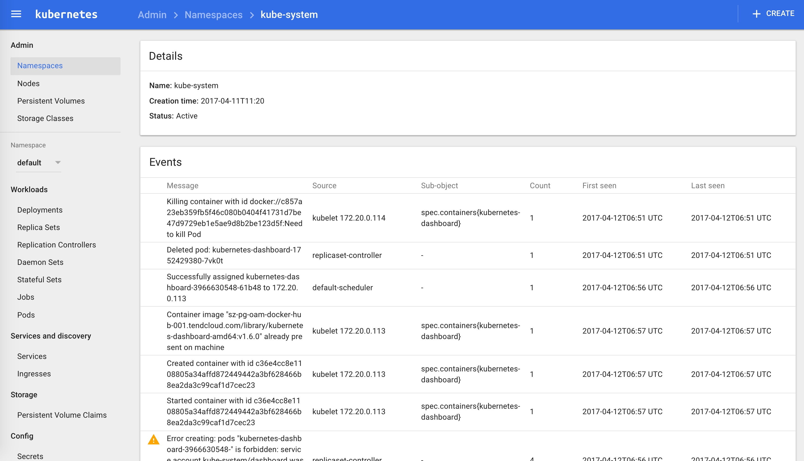
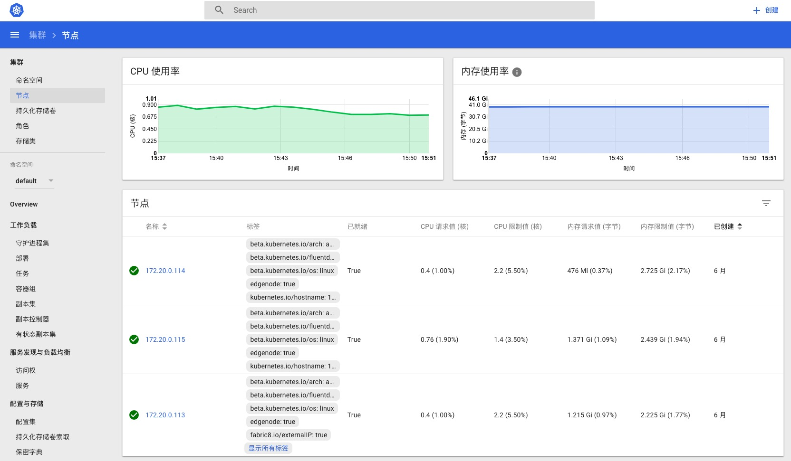
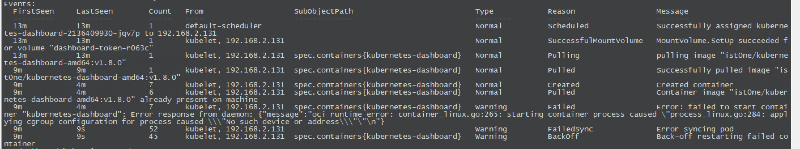

# 安装dashboard插件

> 注意：本文档中安装的是kubernetes dashboard v1.6.0，安装新版的dashboard请参考[升级dashboard](dashboard-upgrade.md)。

官方文件目录：https://github.com/kubernetes/kubernetes/tree/master/cluster/addons/dashboard

我们使用的文件如下：

``` bash
$ ls *.yaml
dashboard-controller.yaml  dashboard-service.yaml dashboard-rbac.yaml
```

已经修改好的 yaml 文件见：[../manifests/dashboard](https://github.com/rootsongjc/kubernetes-handbook/blob/master/manifests/dashboard)

文件中的kubernetes-dashboard-amd64镜像为本地镜像地址需要修改为对应的镜像地址和版本：

kubernetes 1.7.11 可以使用此镜像地址： registry.cn-qingdao.aliyuncs.com/haitao/kubernetes-dashboard-amd64:v1.7.0   替换 dashboard-controller.yaml 文件中的镜像地址


由于 `kube-apiserver` 启用了 `RBAC` 授权，而官方源码目录的 `dashboard-controller.yaml` 没有定义授权的 ServiceAccount，所以后续访问 API server 的 API 时会被拒绝，web中提示：

```
Forbidden (403)

User "system:serviceaccount:kube-system:default" cannot list jobs.batch in the namespace "default". (get jobs.batch)
```

增加了一个`dashboard-rbac.yaml`文件，定义一个名为 dashboard 的 ServiceAccount，然后将它和 Cluster Role view 绑定，如下：

```yaml
apiVersion: v1
kind: ServiceAccount
metadata:
  name: dashboard
  namespace: kube-system
---
kind: ClusterRoleBinding
apiVersion: rbac.authorization.k8s.io/v1beta1
metadata:
  name: dashboard
subjects:
  - kind: ServiceAccount
    name: dashboard
    namespace: kube-system
roleRef:
  kind: ClusterRole
  name: cluster-admin
  apiGroup: rbac.authorization.k8s.io
```

然后使用`kubectl apply -f dashboard-rbac.yaml`创建。

## 配置dashboard-service

``` bash
$ diff dashboard-service.yaml.orig dashboard-service.yaml
10a11
>   type: NodePort
```

+ 指定端口类型为 NodePort，这样外界可以通过地址 nodeIP:nodePort 访问 dashboard；

## 配置dashboard-controller

``` bash
$ diff dashboard-controller.yaml.orig dashboard-controller.yaml
23c23
<         image: gcr.io/google_containers/kubernetes-dashboard-amd64:v1.6.0
---
>         image: harbor-001.jimmysong.io/library/kubernetes-dashboard-amd64:v1.6.0
```

## 执行所有定义文件

``` bash
$ pwd
/root/kubernetes/cluster/addons/dashboard
$ ls *.yaml
dashboard-controller.yaml  dashboard-service.yaml
$ kubectl create -f  .
service "kubernetes-dashboard" created
deployment "kubernetes-dashboard" created
```

## 检查执行结果

查看分配的 NodePort

``` bash
$ kubectl get services kubernetes-dashboard -n kube-system
NAME                   CLUSTER-IP       EXTERNAL-IP   PORT(S)        AGE
kubernetes-dashboard   10.254.224.130   <nodes>       80:30312/TCP   25s
```

+ NodePort 30312映射到 dashboard pod 80端口；

检查 controller

``` bash
$ kubectl get deployment kubernetes-dashboard  -n kube-system
NAME                   DESIRED   CURRENT   UP-TO-DATE   AVAILABLE   AGE
kubernetes-dashboard   1         1         1            1           3m
$ kubectl get pods  -n kube-system | grep dashboard
kubernetes-dashboard-1339745653-pmn6z   1/1       Running   0          4m
```

## 访问dashboard

有以下三种方式：

- kubernetes-dashboard 服务暴露了 NodePort，可以使用 `http://NodeIP:nodePort` 地址访问 dashboard
- 通过 API server 访问 dashboard（https 6443端口和http 8080端口方式）
- 通过 kubectl proxy 访问 dashboard

### 通过 kubectl proxy 访问 dashboard

启动代理

``` bash
$ kubectl proxy --address='172.20.0.113' --port=8086 --accept-hosts='^*$'
Starting to serve on 172.20.0.113:8086
```

+ 需要指定 `--accept-hosts` 选项，否则浏览器访问 dashboard 页面时提示 “Unauthorized”；

浏览器访问 URL：http://172.20.0.113:8086/ui
自动跳转到：http://172.20.0.113:8086/api/v1/proxy/namespaces/kube-system/services/kubernetes-dashboard/#/workload?namespace=default

### 通过 API server 访问dashboard

获取集群服务地址列表

``` bash
$ kubectl cluster-info
Kubernetes master is running at https://172.20.0.113:6443
KubeDNS is running at https://172.20.0.113:6443/api/v1/proxy/namespaces/kube-system/services/kube-dns
kubernetes-dashboard is running at https://172.20.0.113:6443/api/v1/proxy/namespaces/kube-system/services/kubernetes-dashboard
```

浏览器访问 URL：<https://172.20.0.113:6443/api/v1/proxy/namespaces/kube-system/services/kubernetes-dashboard>（浏览器会提示证书验证，因为通过加密通道，以改方式访问的话，需要提前导入证书到你的计算机中）。这是我当时在这遇到的坑：[通过 kube-apiserver 访问dashboard，提示User "system:anonymous" cannot proxy services in the namespace "kube-system". #5](https://github.com/opsnull/follow-me-install-kubernetes-cluster/issues/5)，已经解决。

**导入证书**

将生成的admin.pem证书转换格式

```bash
openssl pkcs12 -export -in admin.pem  -out admin.p12 -inkey admin-key.pem
```

将生成的`admin.p12`证书导入的你的电脑，导出的时候记住你设置的密码，导入的时候还要用到。

如果你不想使用**https**的话，可以直接访问insecure port 8080端口：<http://172.20.0.113:8080/api/v1/proxy/namespaces/kube-system/services/kubernetes-dashboard>



由于缺少 Heapster 插件，当前 dashboard 不能展示 Pod、Nodes 的 CPU、内存等 metric 图形。

### 更新

Kubernetes 1.6 版本的 dashboard 的镜像已经到了 v1.6.3 版本，我们可以使用下面的方式更新。

修改 `dashboard-controller.yaml` 文件中的镜像的版本将 `v1.6.0` 更改为 `v1.6.3`。

```yaml
image: harbor-001.jimmysong.io/library/kubernetes-dashboard-amd64:v1.6.3
```

然后执行下面的命令：

```bash
kubectl apply -f dashboard-controller.yaml
```

即可在线更新 dashboard 的版本。

监听 dashboard Pod 的状态可以看到：

```bash
kubernetes-dashboard-215087767-2jsgd   0/1       Pending   0         0s
kubernetes-dashboard-3966630548-0jj1j   1/1       Terminating   0         1d
kubernetes-dashboard-215087767-2jsgd   0/1       Pending   0         0s
kubernetes-dashboard-3966630548-0jj1j   1/1       Terminating   0         1d
kubernetes-dashboard-215087767-2jsgd   0/1       ContainerCreating   0         0s
kubernetes-dashboard-3966630548-0jj1j   0/1       Terminating   0         1d
kubernetes-dashboard-3966630548-0jj1j   0/1       Terminating   0         1d
kubernetes-dashboard-215087767-2jsgd   1/1       Running   0         6s
kubernetes-dashboard-3966630548-0jj1j   0/1       Terminating   0         1d
kubernetes-dashboard-3966630548-0jj1j   0/1       Terminating   0         1d
kubernetes-dashboard-3966630548-0jj1j   0/1       Terminating   0         1d
```

新的 Pod 的启动了，旧的 Pod 被终结了。

Dashboard 的访问地址不变，重新访问 <http://172.20.0.113:8080/api/v1/proxy/namespaces/kube-system/services/kubernetes-dashboard>，可以看到新版的界面：



新版本中最大的变化是增加了进入容器内部的入口，可以在页面上进入到容器内部操作，同时又增加了一个搜索框。

关于如何将dashboard从1.6版本升级到1.7版本请参考[升级dashboard](dashboard-upgrade.md)。


## 问题

1. 按照教程安装后，发现dashboard pod 无法启动

   ```
   kubectl -n kube-system describe pod dashboard-xxxxxxx
   ```

   

   可以尝试删除所有相关“资源”再重试一次，如：secret、serviceaccount、service、pod、deployment

   

## 参考

- [WebUI(Dashboard) 文档](https://kubernetes.io/docs/tasks/access-application-cluster/web-ui-dashboard/)