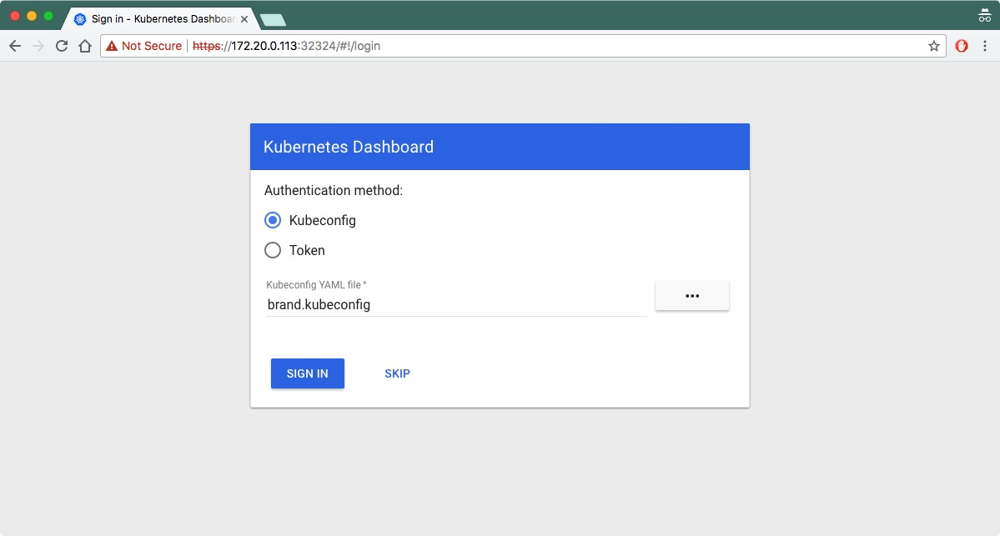
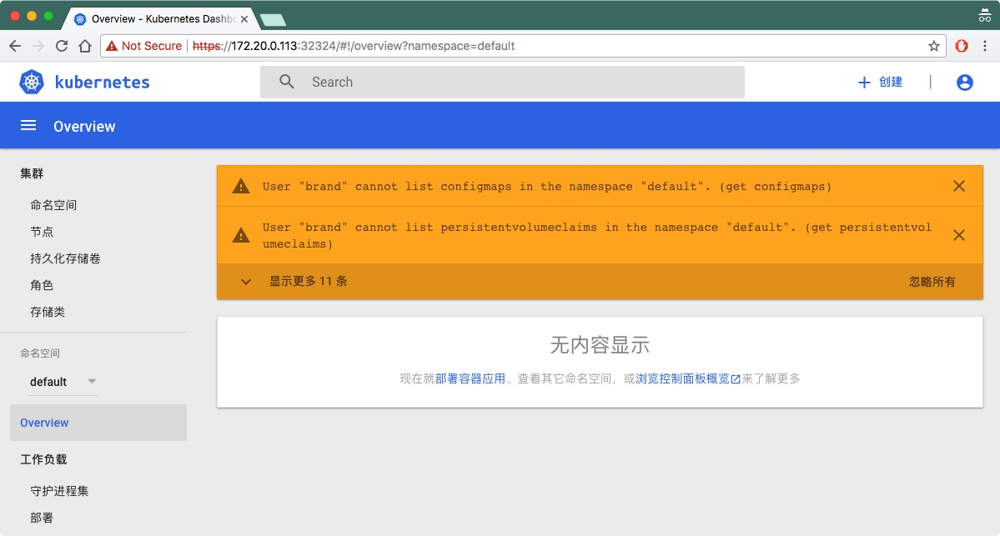
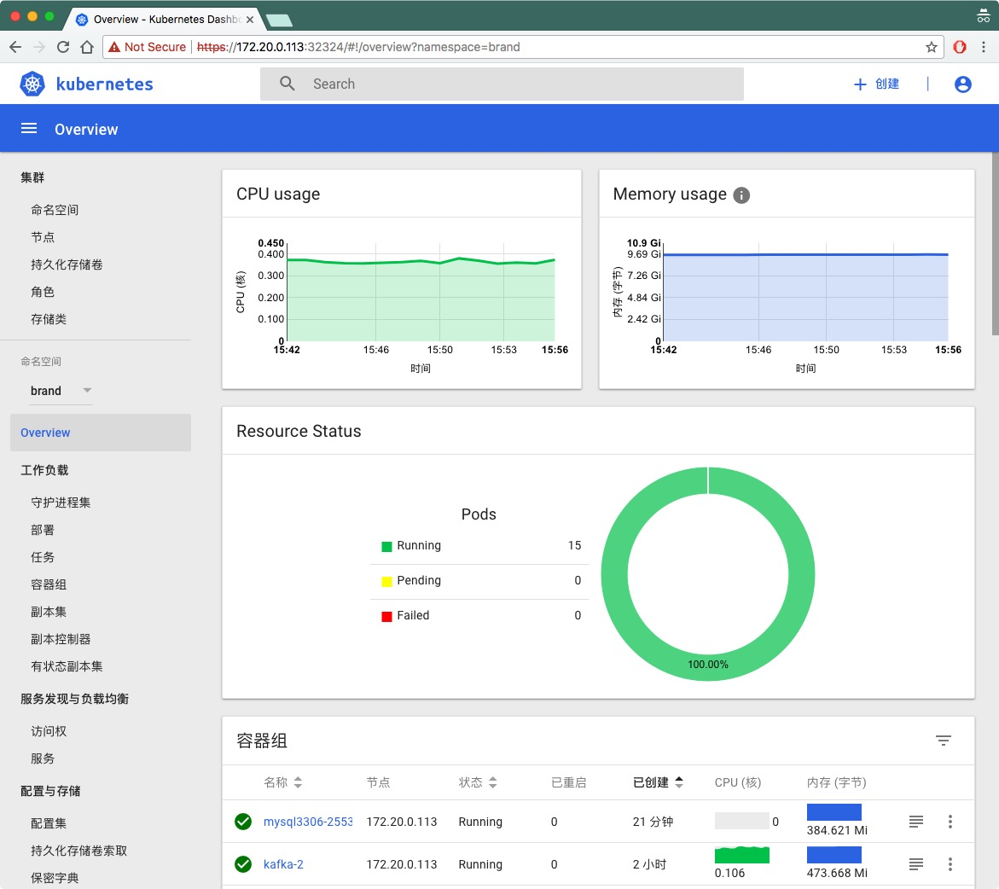
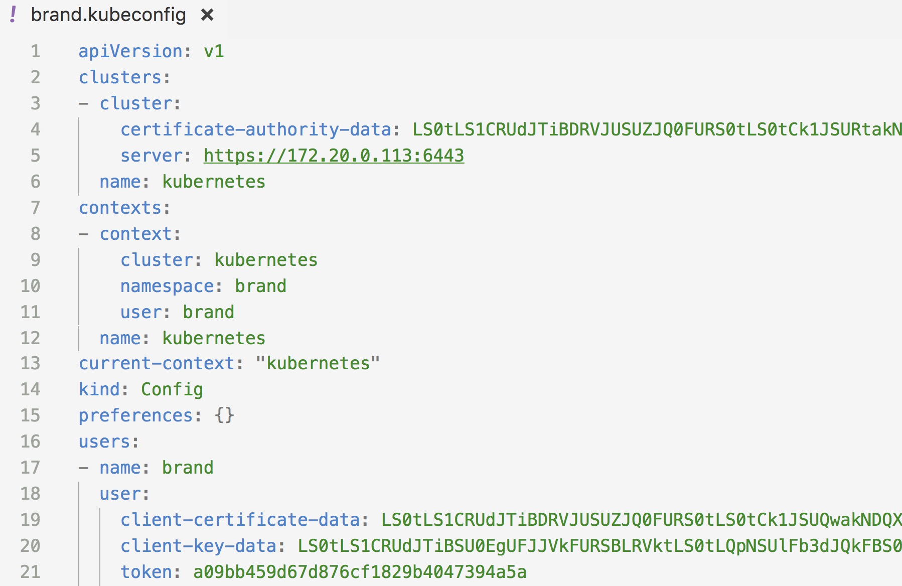

# 升级Dashboard

我们在kubernetes1.6的时候同时安装了dashboard插件，该插件也是基于kubernetes1.6版本开发的。如今kubernetes1.8版本业已发布，如何升级dashboard以获取新版中功能呢？

Dashboard的升级比较简单，因为它仅仅是一个前端应用，用来展现集群信息和与后端API交互，理论上只需要更新原先dashboard的yaml配置文件中的镜像就可以了，但是为了使用dashboard1.7版本中的用户登陆功能，还需要做一些额外的操作。

[dashboard](https://github.com/kubernetes/dashboard)的更新日志请见[release note](https://github.com/kubernetes/dashboard/releases)，当前的最新版本为v1.7.1，下面将介绍将dashboard从v1.6.3升级到v1.7.1并开启用户登陆认证的详细步骤。

## 升级步骤

**删除原来的版本**

首先删除原来的dashboard资源：

```bash
kubectl delete -f dashboard/
```

将`dashboard`目录下的所有yaml文件中的资源全部删除，包括Deployment、service和角色绑定等。

**部署新版本**

我们使用官方的配置文件来安装，首先下载官方配置：

```bash
wget https://raw.githubusercontent.com/kubernetes/dashboard/v1.10.1/src/deploy/recommended/kubernetes-dashboard.yaml
```

修改其中的两个镜像地址为我们的私有地址。

- gcr.io/google_containers/kubernetes-dashboard-init-amd64:v1.0.1
- gcr.io/google_containers/kubernetes-dashboard-amd64:v1.7.1

这个两个镜像可以同时从**时速云**上获取：

- index.tenxcloud.com/jimmy/kubernetes-dashboard-amd64:v1.7.1
- index.tenxcloud.com/jimmy/kubernetes-dashboard-init-amd64:v1.0.1

将service type设置为`NodePort`，修改后的yaml文件见[kubernetes-dashboard.yaml](https://github.com/rootsongjc/kubernetes-handbook/tree/master/manifests/dashboard-1.7.1/kubernetes-dashboard.yaml)，然后就可以部署新版本的dashboard了。

```bash
kubectl create -f kubernetes-dashboard.yaml
```

获取dashboard的外网访问端口：

```bash
kubectl -n kube-system get svc kubernetes-dashboard
NAME                   CLUSTER-IP       EXTERNAL-IP   PORT(S)         AGE
kubernetes-dashboard   10.254.177.181   <nodes>       443:32324/TCP   49m
```

访问集群中的任何一个节点，即可打开dashboard登陆页面，如<https://172.20.0.113:32324/>（请使用https访问），支持使用`kubeconfig`和`token`两种的认证方式：



选择本地的`kubeconfig`文件以登陆集群，`kubeconfig`文件中包括登陆的用户名、证书和token信息。

登陆之后首先看到的界面是这样的：



这是因为该用户没有对`default`命名空间的访问权限。

修改URL地址中的`namespace`字段为该用户有权限访问的命名空间如brand：<https://172.20.0.113:32324/#!/overview?namespace=brand>：



**设置界面的语言**

我们看到现在 dashboard 的页面都已经被汉化了，当前支持英文、中文简体、中文繁体、日语，根据浏览器的语言自动切换的。如果想要强制设置 dashboard 中显示的语言，需要在 dahsboard 的 Deployment yaml 配置中增加如下配置：

```yaml
env:
  - name: ACCEPT_LANGUAGE
    value: english
```

更简单的方式是，如果您使用的Chrome浏览器，则在浏览器中的配置中设置语言的顺序后刷新网页，dashboard将以您在Chrome中配置的首选语言显示。

## 身份认证

登陆 dashboard 的时候支持 kubeconfig 和 token 两种认证方式，kubeconfig 中也依赖 token 字段，所以生成 token 这一步是必不可少的。

下文分两块来讲解两种登陆认证方式：

- 为 brand 命名空间下的 brand 用户创建 kubeconfig 文件
- 为集群的管理员（拥有所有命名空间的 amdin 权限）创建 token

### 使用 kubeconfig

登陆dashboard的时候可以指定`kubeconfig`文件来认证用户权限，如何生成登陆dashboard时指定的`kubeconfig`文件请参考[创建用户认证授权的kubeconfig文件](../guide/kubectl-user-authentication-authorization.md)。

> 注意我们生成的 kubeconfig 文件中没有 token 字段，需要手动添加该字段。

比如我们为 brand namespace 下的 brand 用户生成了名为 `brand.kubeconfig` 的 kubeconfig 文件，还要再该文件中追加一行 `token` 的配置（如何生成 token 将在下文介绍），如下所示：



这样就可以使用`brand.kubeconfig`文件来登陆dashboard了，而且只能访问和操作`brand`命名空间下的对象。

### 生成集群管理员的token

以下是为集群最高权限的管理员（可以任意操作所有namespace中的所有资源）生成token的步骤详解。

> 注意：登陆dashboard的时候token值是必须的，而kubeconfig文件是kubectl命令所必须的，kubectl命令使用的kubeconfig文件中可以不包含token信息。

需要创建一个admin用户并授予admin角色绑定，使用下面的yaml文件创建admin用户并赋予他管理员权限，然后可以通过token登陆dashbaord，该文件见[admin-role.yaml](https://github.com/rootsongjc/kubernetes-handbook/tree/master/manifests/dashboard-1.7.1/admin-role.yaml)。这种认证方式本质上是通过 Service Account 的身份认证加上 Bearer token 请求 API server 的方式实现，参考 [Kubernetes 中的认证](https://kubernetes.io/docs/admin/authentication/)。

```yaml
kind: ClusterRoleBinding
apiVersion: rbac.authorization.k8s.io/v1beta1
metadata:
  name: admin
  annotations:
    rbac.authorization.kubernetes.io/autoupdate: "true"
roleRef:
  kind: ClusterRole
  name: cluster-admin
  apiGroup: rbac.authorization.k8s.io
subjects:
- kind: ServiceAccount
  name: admin
  namespace: kube-system
---
apiVersion: v1
kind: ServiceAccount
metadata:
  name: admin
  namespace: kube-system
  labels:
    kubernetes.io/cluster-service: "true"
    addonmanager.kubernetes.io/mode: Reconcile
```

然后执行下面的命令创建 serviceaccount 和角色绑定，对于其他命名空间的其他用户只要修改上述 yaml 中的 `name` 和 `namespace` 字段即可：

```bash
kubectl create -f admin-role.yaml
```

创建完成后获取secret和token的值。

运行下面的命令直接获取admin用户的token：

```bash
kubectl -n kube-system describe secret `kubectl -n kube-system get secret|grep admin-token|cut -d " " -f1`|grep "token:"|tr -s " "|cut -d " " -f2
```

**手动获取**

也可以执行下面的步骤来获取token值：

```bash
# 获取admin-token的secret名字
$ kubectl -n kube-system get secret|grep admin-token
admin-token-nwphb                          kubernetes.io/service-account-token   3         6m
# 获取token的值
$ kubectl -n kube-system describe secret admin-token-nwphb
Name:		admin-token-nwphb
Namespace:	kube-system
Labels:		<none>
Annotations:	kubernetes.io/service-account.name=admin
		kubernetes.io/service-account.uid=f37bd044-bfb3-11e7-87c0-f4e9d49f8ed0

Type:	kubernetes.io/service-account-token

Data
====
namespace:	11 bytes
token:		非常长的字符串
ca.crt:		1310 bytes
```

在 dashboard 登录页面上有两种登录方式，`kubeconfig` 文件和 token （令牌），使用 token 登录可以直接使用上面输出中的那个**非常长的字符串**作为 token 登录，即可以拥有管理员权限操作整个kubernetes集群中的对象。对于 `kubeconfig` 文件登录方式，不能直接使用之前给 kubectl 生成的 `kubeconfig` 文件(`~/.kube/config`) 需要给它加一个 token 字段，您可以将这串 token 加到 admin 用户的`kubeconfig`文件中，继续使用`kubeconfig`登录，具体加的位置可以参考`bootstrap-kubeconfig` 文件，两种认证方式任您选择。

**注意**：通过 `kubectl get secret xxx` 输出中的 token 值需要进行 `base64` 解码，在线解码工具 [base64decode](https://www.base64decode.org/)，Linux 和 Mac 有自带的 `base64` 命令也可以直接使用，输入  `base64` 是进行编码，Linux 中`base64 -d` 表示解码，Mac 中使用 `base64 -D`；通过 `kubectl describe secret xxx` 输出中的 token 不需要 `base64` 解码。

也可以使用 jsonpath 的方式直接获取 token 的值，如：

```bash
kubectl -n kube-system get secret admin-token-nwphb -o jsonpath={.data.token}|base64 -d
```

注意我们使用了 base64 对其重新解码，因为 secret 都是经过 base64 编码的，如果直接使用 kubectl 中查看到的 `token` 值会认证失败，详见 [secret 配置](../guide/secret-configuration.md)。关于 JSONPath 的使用请参考 [JSONPath 手册](https://kubernetes.io/docs/user-guide/jsonpath/)。

**注意**：关于如何给其它namespace的管理员生成token请参考[使用kubeconfig或token进行用户身份认证](../guide/auth-with-kubeconfig-or-token.md)。

## 参考

- [Dashboard log in mechanism #2093](https://github.com/kubernetes/dashboard/issues/2093)
- [Accessing Dashboard 1.7.X and above](https://github.com/kubernetes/dashboard/wiki/Accessing-Dashboard---1.7.X-and-above)
- [Kubernetes dashboard UX for Role-Based Access Control](https://github.com/kubernetes/dashboard/blob/master/docs/design/access-control.md)
- [How to sign in kubernetes dashboard? - StackOverflow](https://stackoverflow.com/questions/46664104/how-to-sign-in-kubernetes-dashboard)
- [JSONPath 手册](https://kubernetes.io/docs/user-guide/jsonpath/)
- [Kubernetes 中的认证](https://kubernetes.io/docs/admin/authentication/)
