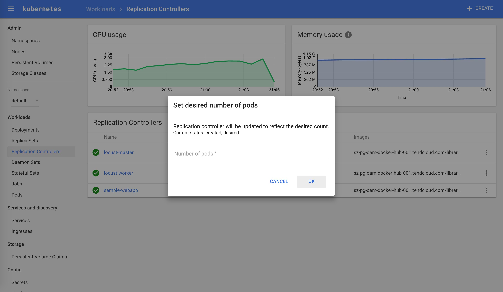
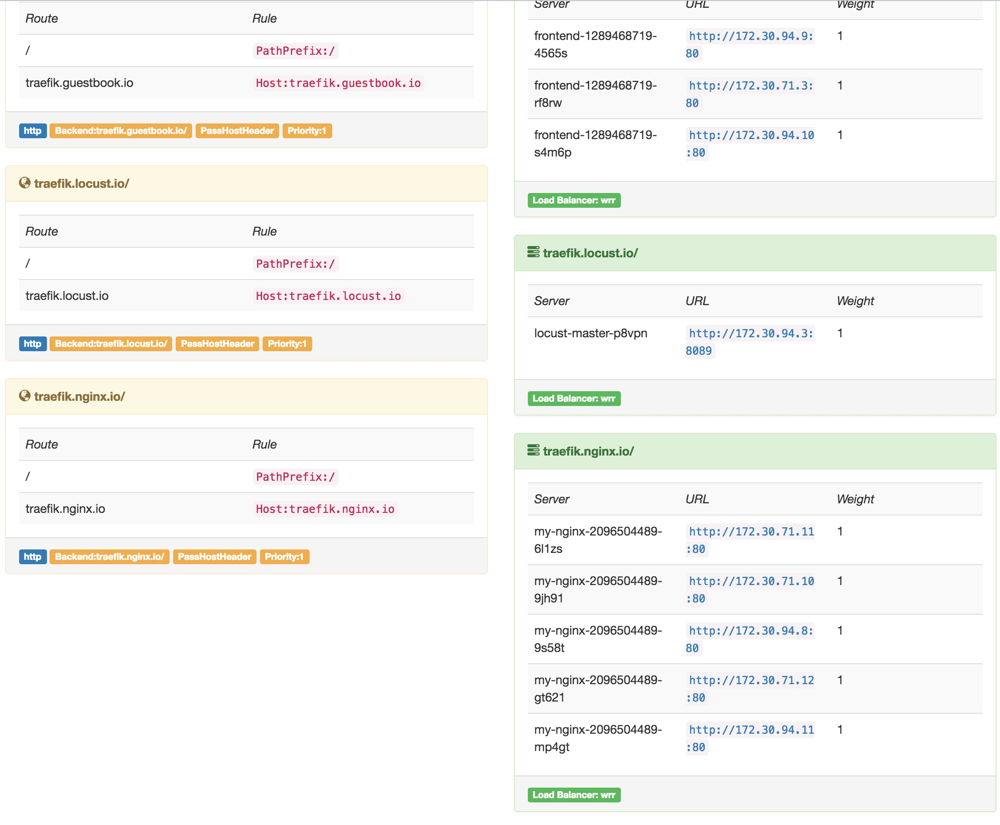
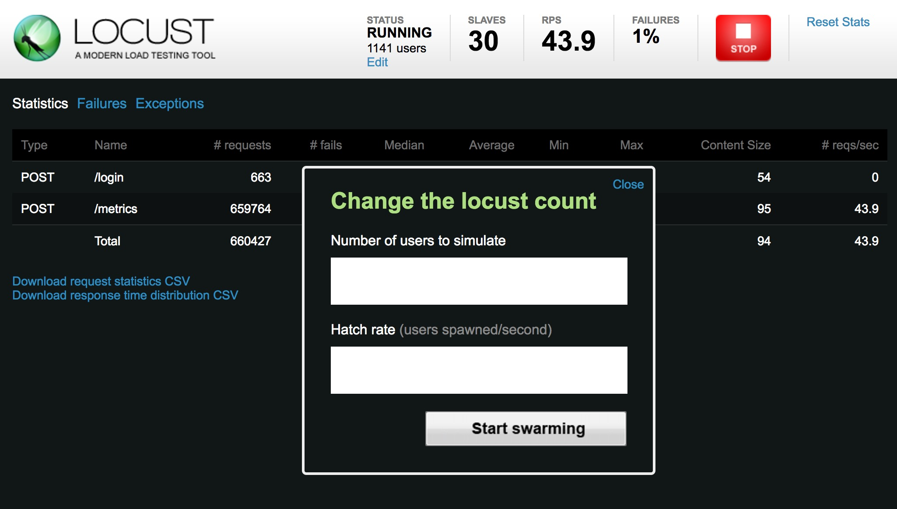
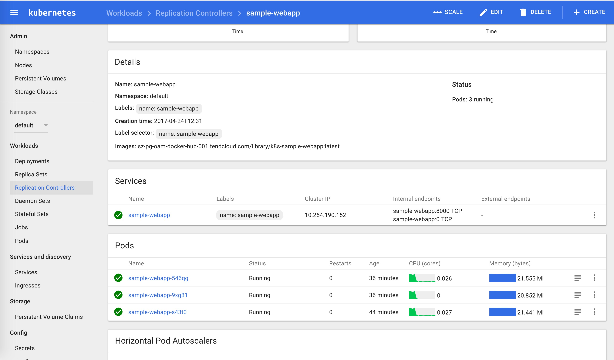
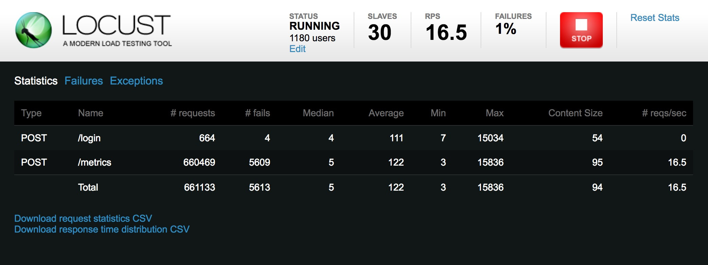

## 分布式负载测试

该教程描述如何在[Kubernetes](http://kubernetes.io)中进行分布式负载均衡测试，包括一个web应用、docker镜像和Kubernetes controllers/services。关于分布式负载测试的更多资料请查看[Distributed Load Testing Using Kubernetes](http://cloud.google.com/solutions/distributed-load-testing-using-kubernetes) 。

## 准备

**不需要GCE及其他组件，你只需要有一个kubernetes集群即可。**

如果你还没有kubernetes集群，可以参考[kubernetes-handbook](https://www.gitbook.com/book/rootsongjc/kubernetes-handbook)部署一个。

## 部署Web应用

本文中使用的镜像、kubernetes应用的yaml配置来自我的另一个项目，请参考：https://github.com/rootsongjc/distributed-load-testing-using-kubernetes

 `sample-webapp` 目录下包含一个简单的web测试应用。我们将其构建为docker镜像，在kubernetes中运行。你可以自己构建，也可以直接用这个我构建好的镜像`index.tenxcloud.com/jimmy/k8s-sample-webapp:latest`。

在kubernetes上部署sample-webapp。

```bash
$ git clone https://github.com/rootsongjc/distributed-load-testing-using-kubernetes.git
$ cd kubernetes-config
$ kubectl create -f sample-webapp-controller.yaml
$ kubectl create -f sample-webapp-service.yaml
```

## 部署Locust的Controller和Service

`locust-master`和`locust-work`使用同样的docker镜像，修改cotnroller中`spec.template.spec.containers.env`字段中的value为你`sample-webapp` service的名字。

    - name: TARGET_HOST
      value: http://sample-webapp:8000

### 创建Controller Docker镜像（可选）

`locust-master`和`locust-work` controller使用的都是`locust-tasks` docker镜像。你可以直接下载`gcr.io/cloud-solutions-images/locust-tasks`，也可以自己编译。自己编译大概要花几分钟时间，镜像大小为820M。

    $ docker build -t index.tenxcloud.com/jimmy/locust-tasks:latest .
    $ docker push index.tenxcloud.com/jimmy/locust-tasks:latest

**注意**：我使用的是时速云的镜像仓库。

每个controller的yaml的`spec.template.spec.containers.image` 字段指定的是我的镜像：

    image: index.tenxcloud.com/jimmy/locust-tasks:latest
### 部署locust-master

```bash
$ kubectl create -f locust-master-controller.yaml
$ kubectl create -f locust-master-service.yaml
```

### 部署locust-worker

Now deploy `locust-worker-controller`:

```bash
$ kubectl create -f locust-worker-controller.yaml
```
你可以很轻易的给work扩容，通过命令行方式：

```bash
$ kubectl scale --replicas=20 replicationcontrollers locust-worker
```
当然你也可以通过WebUI：Dashboard - Workloads - Replication Controllers - **ServiceName** - Scale来扩容。



### 配置Traefik

参考[kubernetes的traefik ingress安装](https://jimmysong.io/posts/traefik-ingress-installation/)，在`ingress.yaml`中加入如下配置：

```yaml
  - host: traefik.locust.io
    http:
      paths:
      - path: /
        backend:
          serviceName: locust-master
          servicePort: 8089
```

然后执行`kubectl replace -f ingress.yaml`即可更新traefik。

通过Traefik的dashboard就可以看到刚增加的`traefik.locust.io`节点。



## 执行测试

打开`http://traefik.locust.io`页面，点击`Edit`输入伪造的用户数和用户每秒发送的请求个数，点击`Start Swarming`就可以开始测试了。



在测试过程中调整`sample-webapp`的pod个数（默认设置了1个pod），观察pod的负载变化情况。



从一段时间的观察中可以看到负载被平均分配给了3个pod。

在locust的页面中可以实时观察也可以下载测试结果。



