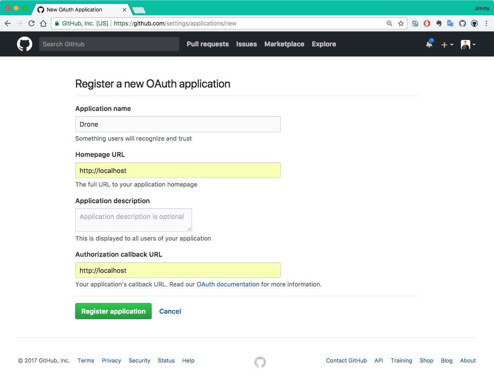
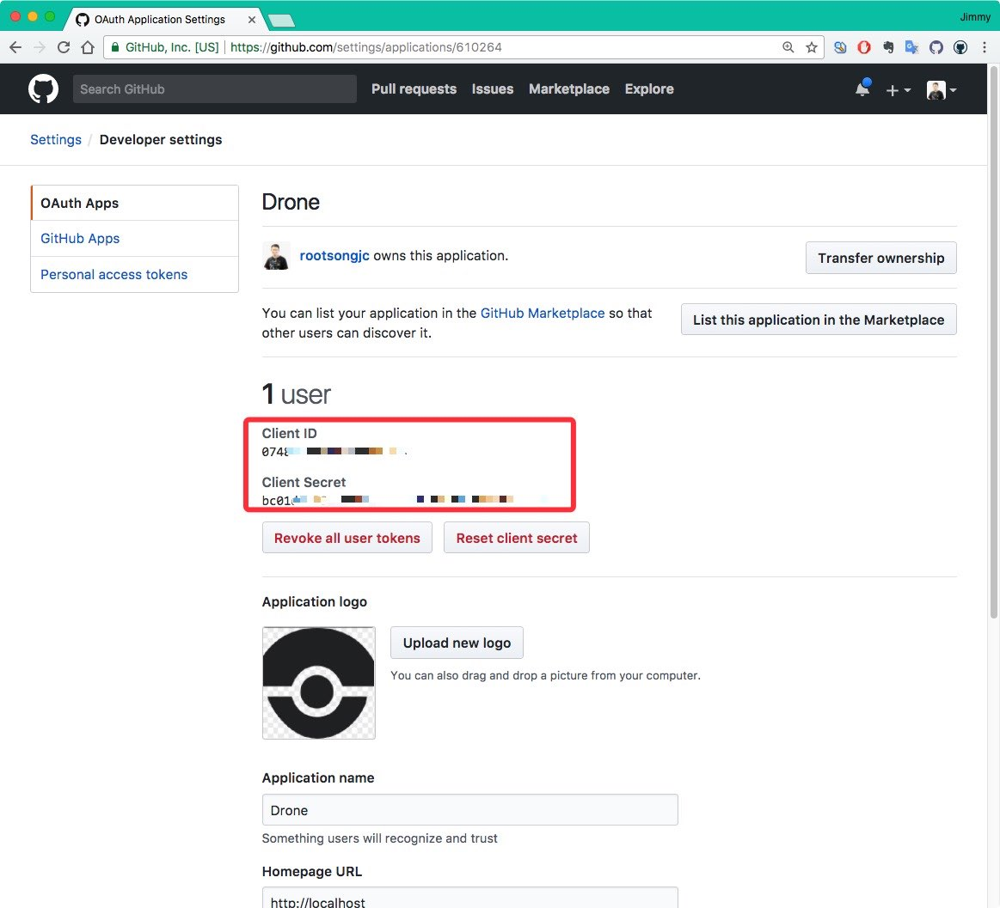
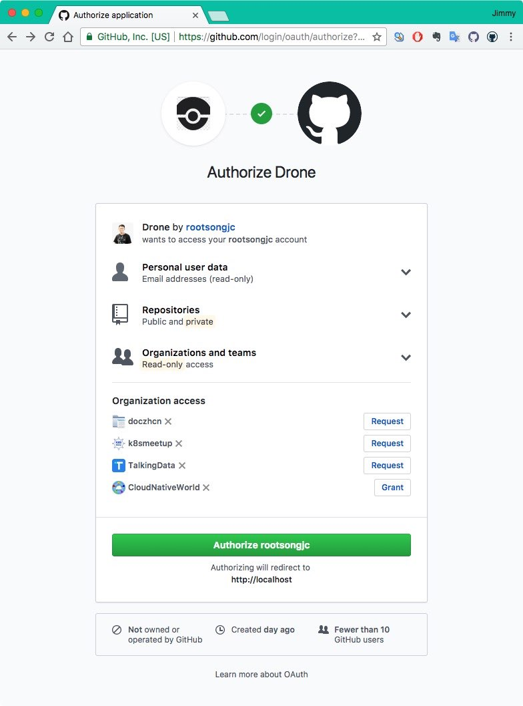
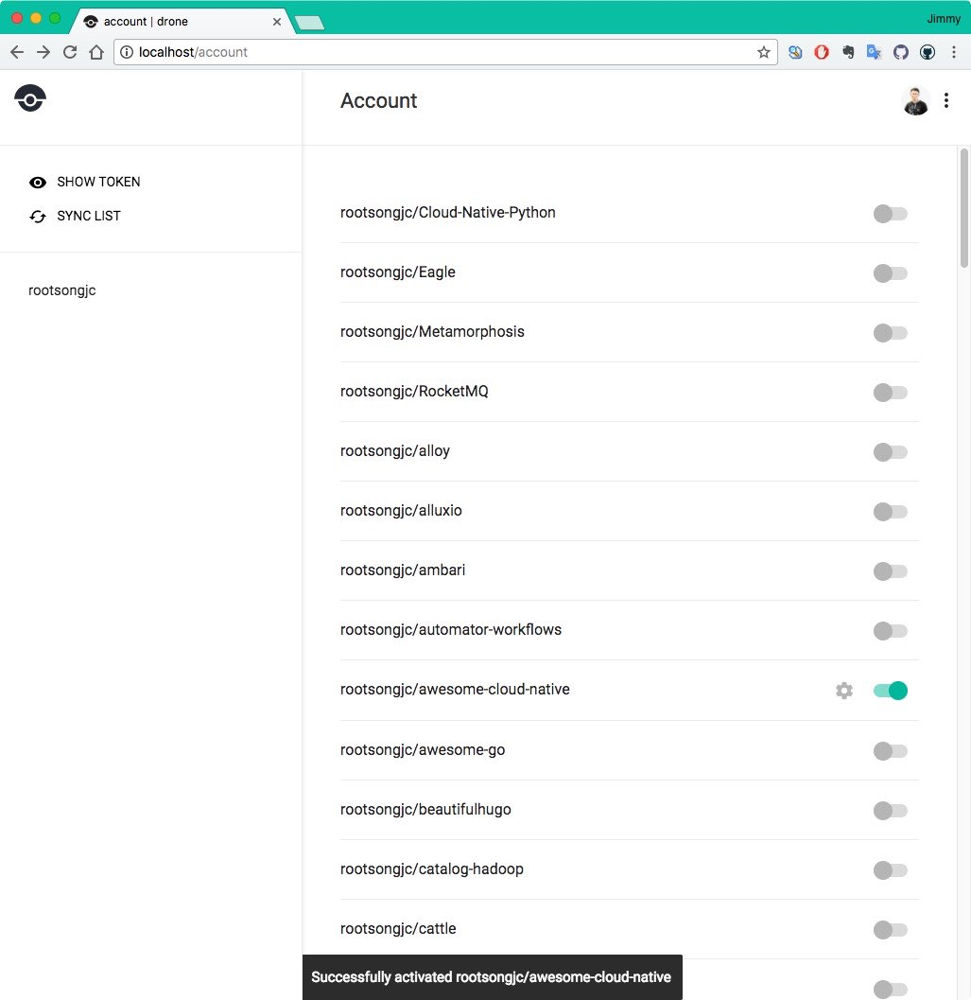

# 使用Drone进行持续构建与发布

[Drone](https://drone.io)是一个用Go语言开发的基于容器运行的持续集成软件。

## 配置GitHub

使用Drone对GitHub上的代码进行持续构建与发布，需要首先在GitHub上设置一个OAuth，如下：

**1. 在Github上创建一个新的OAtuh应用**

访问[此頁面](https://github.com/settings/applications/new)，创建新的OAuth应用。



填写应用程序的地址，因为是在本地与行，所以我们都填`http://localhost`。

**2. 获取OAtuh Client ID和Client Secret**

在注册完成后就可以获得如下图所示的OAuth Client ID和Client Secret，保存下来，我们后面要用到。



## 使用docker-compose单机运行

我们在本地环境，使用docker-compose，按照[Drone官方安装文档](http://docs.drone.io/installation/)安装配置Drone。

我们将代码托管在GitHub上，需要Drone可以持续集成和发布GitHub的代码，因此需要修改`docker-compose.yaml`文件中的GitHub配置。

```yaml
version: '2'

services:
  drone-server:
    image: drone/drone:0.8

    ports:
      - 80:8000
      - 9000
    volumes:
      - /var/lib/drone:/var/lib/drone/
    restart: always
    environment:
      - DRONE_OPEN=true
      - DRONE_HOST=${DRONE_HOST}
      - DRONE_GITHUB=true
      - DRONE_GITHUB_CLIENT=${DRONE_GITHUB_CLIENT}
      - DRONE_GITHUB_SECRET=${DRONE_GITHUB_SECRET}
      - DRONE_SECRET=${DRONE_SECRET}

  drone-agent:
    image: drone/agent:0.8

    command: agent
    restart: always
    depends_on:
      - drone-server
    volumes:
      - /var/run/docker.sock:/var/run/docker.sock
    environment:
      - DRONE_SERVER=drone-server:9000
      - DRONE_SECRET=${DRONE_SECRET}
```

- `/var/lib/drone`是在本地挂载的目录，请确保该目录已存在，且可以被docker访问到，Mac下可以在docker的共享目录中配置。
- `DRONE_SECRET`可以是一个随机的字符串，要确保`drone-server`与`drone-client`的`DRONE_SECRET`相同。
- `DRONE_GITHUB_CLIENT`和`DRONE_GITHUB_SECRET`即在前面申请的OAuth的Client ID和Client Secret。

### 启动Drone

使用下面的命令在本地启动drone：

```bash
docker-compose up
```

这样是在前台启动，加上`-d`参数就可以在后台启动。

访问 `http://localhost` 可以看到登陆画面。



授权后可以看到GitHub repo设置。




## 参考

- [Drone Installation](http://docs.drone.io/installation/)
- [Github - Drone](https://github.com/drone/drone)
- [Drone 搭配 Kubernetes 升級應用程式版本 - blog.wu-boy.com](https://blog.wu-boy.com/2017/10/upgrade-kubernetes-container-using-drone/)
