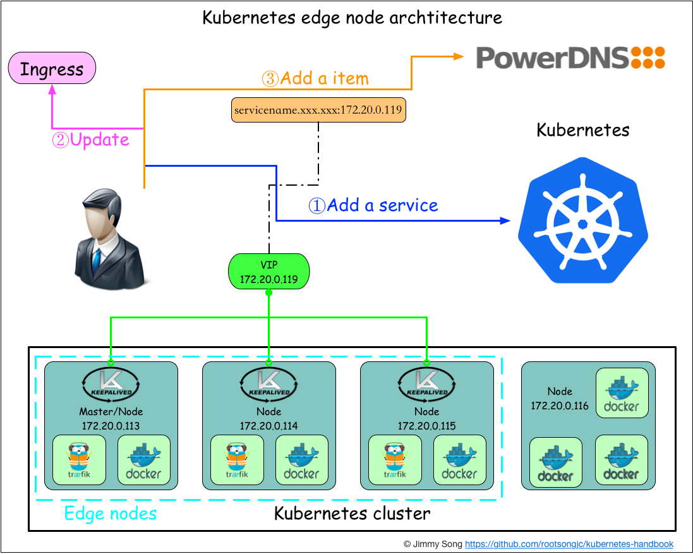
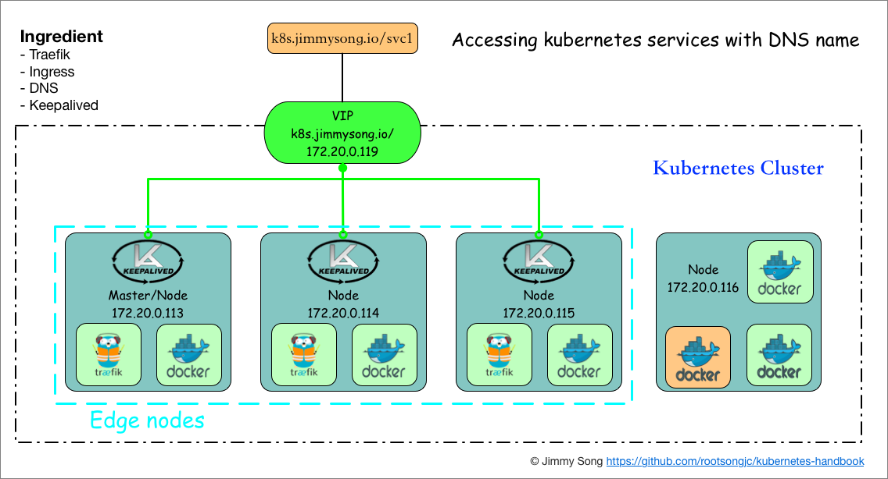

# 边缘节点配置

## 前言

为了配置kubernetes中的traefik ingress的高可用，对于kubernetes集群以外只暴露一个访问入口，需要使用keepalived排除单点问题。本文参考了[kube-keepalived-vip](https://github.com/kubernetes/contrib/tree/master/keepalived-vip)，但并没有使用容器方式安装，而是直接在node节点上安装。

## 定义

首先解释下什么叫边缘节点（Edge Node），所谓的边缘节点即集群内部用来向集群外暴露服务能力的节点，集群外部的服务通过该节点来调用集群内部的服务，边缘节点是集群内外交流的一个Endpoint。

**边缘节点要考虑两个问题**

- 边缘节点的高可用，不能有单点故障，否则整个kubernetes集群将不可用
- 对外的一致暴露端口，即只能有一个外网访问IP和端口

## 架构

为了满足边缘节点的以上需求，我们使用[keepalived](http://www.keepalived.org/)来实现。

在Kubernetes中添加了service的同时，在DNS中增加一个记录，这条记录需要跟ingress中的`host`字段相同，IP地址即VIP的地址，本示例中是`172.20.0.119`，这样集群外部就可以通过service的DNS名称来访问服务了。

选择Kubernetes的三个node作为边缘节点，并安装keepalived，下图展示了边缘节点的配置，同时展示了向Kubernetes中添加服务的过程。



## 准备

复用kubernetes测试集群的三台主机。

172.20.0.113

172.20.0.114

172.20.0.115

## 安装

使用keepalived管理VIP，VIP是使用IPVS创建的，[IPVS](http://www.linux-vs.org)已经成为linux内核的模块，不需要安装

LVS的工作原理请参考：http://www.cnblogs.com/codebean/archive/2011/07/25/2116043.html

不使用镜像方式安装了，直接手动安装，指定三个节点为边缘节点（Edge node）。

因为我们的测试集群一共只有三个node，所有在在三个node上都要安装keepalived和ipvsadmin。

```Shell
yum install keepalived ipvsadm
```

## 配置说明

需要对原先的traefik ingress进行改造，从以Deployment方式启动改成DeamonSet。还需要指定一个与node在同一网段的IP地址作为VIP，我们指定成172.20.0.119，配置keepalived前需要先保证这个IP没有被分配。。

- Traefik以DaemonSet的方式启动
- 通过nodeSelector选择边缘节点
- 通过hostPort暴露端口
- 当前VIP漂移到了172.20.0.115上
- Traefik根据访问的host和path配置，将流量转发到相应的service上

## 配置keepalived

参考[基于keepalived 实现VIP转移，lvs，nginx的高可用](http://limian.blog.51cto.com/7542175/1301776)，配置keepalived。

keepalived的官方配置文档见：http://keepalived.org/pdf/UserGuide.pdf

配置文件`/etc/keepalived/keepalived.conf`文件内容如下：

```ini
! Configuration File for keepalived

global_defs {
   notification_email {
     root@localhost
   }
   notification_email_from kaadmin@localhost
   smtp_server 127.0.0.1
   smtp_connect_timeout 30
   router_id LVS_DEVEL
}

vrrp_instance VI_1 {
    state MASTER
    interface eth0
    virtual_router_id 51
    priority 100
    advert_int 1
    authentication {
        auth_type PASS
        auth_pass 1111
    }
    virtual_ipaddress {
        172.20.0.119
    }
}

virtual_server 172.20.0.119 80{
    delay_loop 6
    lb_algo loadbalance
    lb_kind DR
    nat_mask 255.255.255.0
    persistence_timeout 0
    protocol TCP

    real_server 172.20.0.113 80{
        weight 1
        TCP_CHECK {
        connect_timeout 3
        }
    }
    real_server 172.20.0.114 80{
        weight 1
        TCP_CHECK {
        connect_timeout 3
        }
    }
    real_server 172.20.0.115 80{
        weight 1
        TCP_CHECK {
        connect_timeout 3
        }
    }
}
```

`Realserver`的IP和端口即traefik供外网访问的IP和端口。

将以上配置分别拷贝到另外两台node的`/etc/keepalived`目录下。

我们使用转发效率最高的`lb_kind DR`直接路由方式转发，使用TCP_CHECK来检测real_server的health。

设置keepalived为开机自启动：

```bash
chkconfig keepalived on
```

**启动keepalived**

```
systemctl start keepalived
```

三台node都启动了keepalived后，观察eth0的IP，会在三台node的某一台上发现一个VIP是172.20.0.119。

```bash
$ ip addr show eth0
2: eth0: <BROADCAST,MULTICAST,UP,LOWER_UP> mtu 1500 qdisc mq state UP qlen 1000
    link/ether f4:e9:d4:9f:6b:a0 brd ff:ff:ff:ff:ff:ff
    inet 172.20.0.115/17 brd 172.20.127.255 scope global eth0
       valid_lft forever preferred_lft forever
    inet 172.20.0.119/32 scope global eth0
       valid_lft forever preferred_lft forever
```

关掉拥有这个VIP主机上的keepalived，观察VIP是否漂移到了另外两台主机的其中之一上。

## 改造Traefik

在这之前我们启动的traefik使用的是deployment，只启动了一个pod，无法保证高可用（即需要将pod固定在某一台主机上，这样才能对外提供一个唯一的访问地址），现在使用了keepalived就可以通过VIP来访问traefik，同时启动多个traefik的pod保证高可用。

配置文件`traefik.yaml`内容如下：

```Yaml
apiVersion: extensions/v1beta1
kind: DaemonSet
metadata:
  name: traefik-ingress-lb
  namespace: kube-system
  labels:
    k8s-app: traefik-ingress-lb
spec:
  template:
    metadata:
      labels:
        k8s-app: traefik-ingress-lb
        name: traefik-ingress-lb
    spec:
      terminationGracePeriodSeconds: 60
      hostNetwork: true
      restartPolicy: Always
      serviceAccountName: ingress
      containers:
      - image: traefik
        name: traefik-ingress-lb
        resources:
          limits:
            cpu: 200m
            memory: 30Mi
          requests:
            cpu: 100m
            memory: 20Mi
        ports:
        - name: http
          containerPort: 80
          hostPort: 80
        - name: admin
          containerPort: 8580
          hostPort: 8580
        args:
        - --web
        - --web.address=:8580
        - --kubernetes
      nodeSelector:
        edgenode: "true"
```

注意，我们使用了`nodeSelector`选择边缘节点来调度traefik-ingress-lb运行在它上面，所有你需要使用：

```
kubectl label nodes 172.20.0.113 edgenode=true
kubectl label nodes 172.20.0.114 edgenode=true
kubectl label nodes 172.20.0.115 edgenode=true
```

给三个node打标签。

查看DaemonSet的启动情况：

```Bash
$ kubectl -n kube-system get ds
NAME                 DESIRED   CURRENT   READY     UP-TO-DATE   AVAILABLE   NODE-SELECTOR                              AGE
traefik-ingress-lb   3         3         3         3            3           edgenode=true                              2h
```

现在就可以在外网通过172.20.0.119:80来访问到traefik ingress了。

## 使用域名访问Kubernetes中的服务

现在我们已经部署了以下服务：

- 三个边缘节点，使用Traefik作为Ingress controller
- 使用keepalived做的VIP（虚拟IP）172.20.0.119

这样在访问该IP的时候通过指定不同的`Host`来路由到kubernetes后端服务。这种方式访问每个Service时都需要指定`Host`，而同一个项目中的服务一般会在同一个Ingress中配置，使用`Path`来区分Service已经足够，这时候只要为VIP（172.20.0.119）来配置一个域名，所有的外部访问直接通过该域名来访问即可。

如下图所示：



## 参考

[kube-keepalived-vip](https://github.com/kubernetes/contrib/tree/master/keepalived-vip)

http://www.keepalived.org/

[keepalived工作原理与配置说明](http://outofmemory.cn/wiki/keepalived-configuration)

[LVS简介及使用](http://www.cnblogs.com/codebean/archive/2011/07/25/2116043.html)

[基于keepalived 实现VIP转移，lvs，nginx的高可用](http://limian.blog.51cto.com/7542175/1301776)