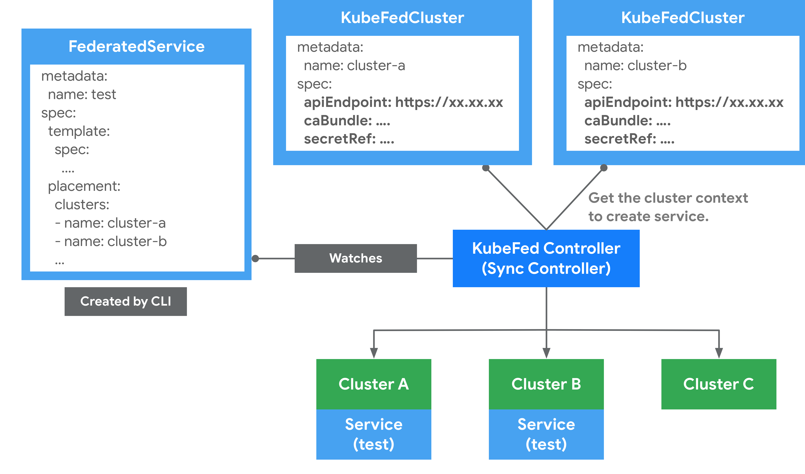
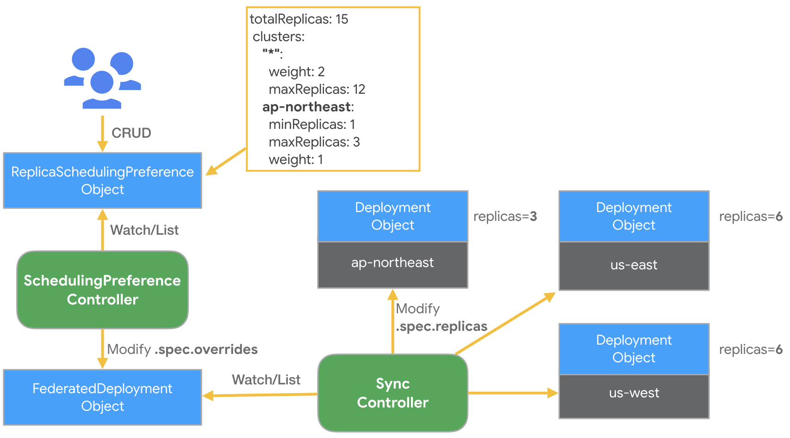
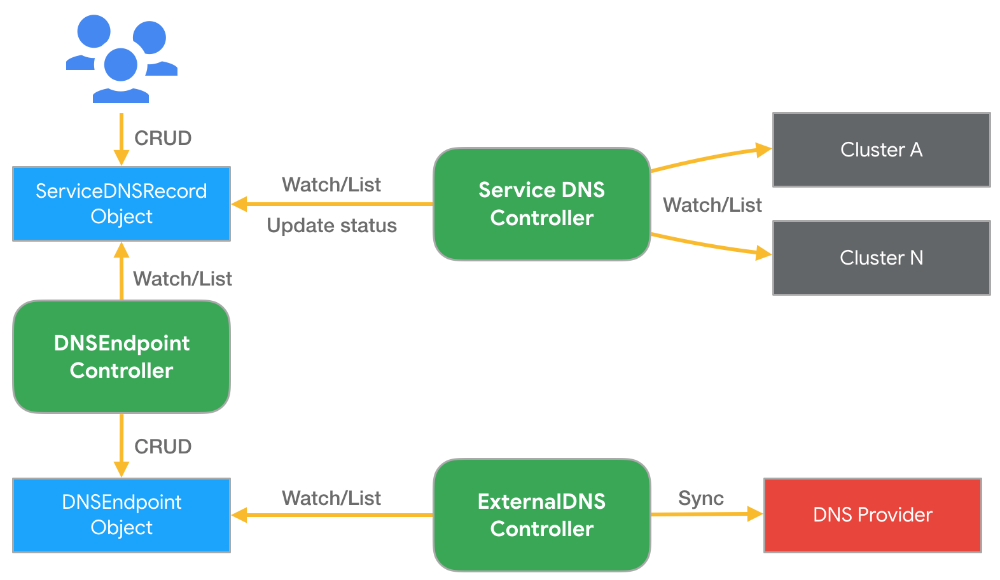

# 集群联邦（Cluster Federation）

Kubernetes 从 1.8 版本起就声称单集群最多可支持 5000 个节点和 15 万个 Pod，我相信很少有公司会部署如此庞大的一个单集群，总有很多情况下因为各种各样的原因我们可能会部署多个集群，但是有时候有想将他们统一起来管理，这时候就需要用到集群联邦（Federation）。

## 为什么要使用集群联邦

Federation 使管理多个集群变得简单。它通过提供两个主要构建模块来实现：

- 跨集群同步资源：Federation 提供了在多个集群中保持资源同步的能力。例如，可以保证同一个 deployment 在多个集群中存在。
- 跨集群服务发现：Federation 提供了自动配置 DNS 服务以及在所有集群后端上进行负载均衡的能力。例如，可以提供一个全局 VIP 或者 DNS 记录，通过它可以访问多个集群后端。

Federation 还可以提供一些其它用例：

- 高可用：通过在集群间分布负载并自动配置 DNS 服务和负载均衡，federation 最大限度地减少集群故障的影响。
- 避免厂商锁定：通过更简单的跨集群应用迁移方式，federation 可以防止集群厂商锁定。

Federation 对于单个集群没有用处。基于下面这些原因你可能会需要多个集群：

- 低延迟：通过在多个区域部署集群可以最大限度减少区域近端用户的延迟。
- 故障隔离：拥有多个小集群可能比单个大集群更利于故障隔离（例如：在云服务提供商的不同可用区中的多个集群）。
- 可伸缩性：单个集群有可伸缩性限制（对于大多数用户这不是典型场景。更多细节请参考 [Kubernetes 弹性伸缩与性能目标](https://github.com/kubernetes/community/blob/master/sig-scalability/goals.md)）。
- 混合云：你可以在不同的云服务提供商或本地数据中心中拥有多个集群。

### 警告

虽然 federation 有很多吸引人的使用案例，但也有一些注意事项：

- 增加网络带宽和成本：federation 控制平面监控所有集群以确保当前状态符合预期。如果集群在云服务提供商的不同区域或者不同的云服务提供商上运行时，这将导致明显的网络成本增加。
- 减少跨集群隔离：federation 控制平面中的 bug 可能影响所有集群。通过在 federation 中实现最少的逻辑可以缓解这种情况。只要有可能，它就将尽力把工作委托给 kubernetes 集群中的控制平面。这种设计和实现在安全性及避免多集群停止运行上也是错误的。
- 成熟度：federation 项目相对比较新，还不是很成熟。并不是所有资源都可用，许多仍然处于 alpha 状态。 [Issue 88](https://github.com/kubernetes/kubernetes/issues/88) 列举了团队目前正忙于解决的与系统相关的已知问题。

### 混合云能力

Kubernetes 集群 federation 可以包含运行在不同云服务提供商（例如 Google Cloud、AWS）及本地（例如在 OpenStack 上）的集群。你只需要按需在适合的云服务提供商和 / 或地点上简单的创建集群，然后向 Federation API Server 注册每个集群的 API endpoint 和凭据即可。

此后，你的 API 资源就可以跨越不同的集群和云服务提供商。

## 单个集群范围

在诸如 Google Compute Engine 或者 Amazon Web Services 等 IaaS 服务提供商中，虚拟机存在于 [区域（Zone）](https://cloud.google.com/compute/docs/zones) 或 [可用区（Availability Zone）](http://docs.aws.amazon.com/AWSEC2/latest/UserGuide/using-regions-availability-zones.html) 上。我们建议 Kubernetes 集群中的所有虚拟机应该位于相同的可用区，因为：

- 与拥有单个全局 Kubernetes 集群相比，单点故障更少。
- 与跨可用区集群相比，推测单区域集群的可用性属性更容易。
- 当 Kubernetes 开发人员设计系统时（例如对延迟，带宽或相关故障进行假设），它们假设所有的机器都在一个单一的数据中心，或以其它方式紧密连接。

在每个可用区域同时拥有多个集群也是可以的，但总体而言，我们认为少一点更好。 选择较少集群的理由是：

- 某些情况下，在一个集群中拥有更多的节点可以改进 Pod 的装箱打包（较少资源碎片）。
- 减少运维开销（尽管随着运维工具和流程的成熟，优势已经减少）。
- 减少每个集群固定资源成本的开销，例如 apiserver 虚拟机（但对于大中型集群的整体集群成本来说百分比很小）。

拥有多个集群的原因包括：

- 严格的安全策略要求将一类工作与另一类工作隔离开来（但是，请参见下面的分区集群（Partitioning Clusters））。
- 对新的 Kubernetes 发行版或其它集群软件进行灰度测试。

## 选择正确的集群数量

Kubernetes 集群数量的选择可能是一个相对静态的选择，只是偶尔重新设置。相比之下，依据负载情况和增长，集群的节点数量和 service 的 pod 数量可能会经常变化。

要选择集群的数量，首先要确定使用哪些区域，以便为所有终端用户提供足够低的延迟，以在 Kubernetes 上运行服务，如果你使用内容分发网络（Content Distribution Network，CDN），则 CDN 托管内容的时延要求不需要考虑。法律问题也可能影响到这一点。例如，拥有全球客户群的公司可能会决定在美国、欧盟、亚太和南亚地区拥有集群。我们将选择的区域数量称为 `R`。

其次，决定在整体仍然可用的前提下，可以同时有多少集群不可用。将不可用集群的数量称为 `U`。如果你不能确定，那么 1 是一个不错的选择。

如果在集群故障的情形下允许负载均衡将流量引导到任何区域，则至少需要有比 `R` 或 `U + 1` 数量更大的集群。如果不行的话（例如希望在集群发生故障时对所有用户确保低延迟），那么你需要有数量为 `R * (U + 1)` 的集群（`R` 个区域，每个中有 `U + 1` 个集群）。无论如何，请尝试将每个集群放在不同的区域中。

最后，如果你的任何集群需要比 Kubernetes 集群最大建议节点数更多的节点，那么你可能需要更多的集群。 Kubernetes v1.3 支持最多 1000 个节点的集群。 Kubernetes v1.8 支持最多 5000 个节点的集群。

## Kubernetes 集群联邦的演进

[Kubernetes 官方博客的文章](https://kubernetes.io/blog/2018/12/12/kubernetes-federation-evolution/)中介绍了 Kubernetes 集群联邦的演进，该项目是在 SIG Multicluster 中进行的，Federation 是 Kubernetes 的一个子项目，社区对这个项目的兴趣很浓，该项目最初重用 Kubernetes API，以消除现有 Kubernetes 用户的任何附加使用复杂性。但由于以下原因，此方式行不通：

- 在集群层面重新实施 Kubernetes API 的困难，因为 Federation 的特定扩展存储在注释中。
- 由于 Kubernetes API 的1:1仿真，Federation 类型、放置（placement）和调节（reconciliation）的灵活性有限。
- 没有固定的 GA 路径，API 成熟度普遍混乱；例如，Deployment 在Kubernetes 中是 GA，但在 Federation v1 中甚至不是Beta。

随着 Federation 特定的 API 架构和社区的努力，这些想法有了进一步的发展，改进为 Federation v2。请注意，Federation V1 版本已经归档不再维护和更新，且官方也不再推荐继续使用。如果需要了解更多的 Federation 资料，请参考：[Kubernetes Federation v2](https://github.com/kubernetes-sigs/kubefed)。

下面将带你了解 Federation v2 背后的考量。

### 将任意资源联合起来

联邦的主要目标之一是能够定义 API 和 API 组，其中包含联邦任何给定 Kubernetes 资源所需的基本原则。这是至关重要的，因为 CRD 已经成为扩展 Kubernetes API 的一种主流方式。

Multicluster SIG 得出了 Federation API 和 API 组的共同定义，即 "一种将`规范的` Kubernetes API 资源分配到不同集群的机制"。最简单的分布形式可以想象为这种'规范的 Kubernetes API 资源'在联邦集群中的简单传播。除了这种简单的 Kubernetes 资源传播之外，有心的读者当然可以看出更复杂的机制。

在定义 Federation API 的构建模块的历程中，最早期的目标也演化为 "能够创建一个简单的联邦，也就是任何 Kubernetes 资源或 CRD 的简单传播，几乎不需要编写代码"。随后，核心 API 组进一步定义了构件，即每个给定的 Kubernetes 资源有一个 `Template` 资源、一个 `Placement` 资源和一个 `Override` 资源，一个 `TypeConfig` 来指定给定资源的同步或不同步，以及执行同步的相关控制器。更多细节将在后文中介绍。进一步的章节还将谈到能够遵循分层行为，更高级别的 Federation API 消耗这些核心构件的行为，而用户能够消耗整个或部分 API 和相关控制器。最后，这种架构还允许用户编写额外的控制器或用自己的控制器替换现有的参考控制器（reference controller），以执行所需的行为。

能够 "轻松地联合任意 Kubernetes 资源"，以及一个解耦的 API，分为构件 API、更高层次的 API 和可能的用户预期类型，这样的呈现方式使得不同的用户可以消费部分和编写控制器组成特定的解决方案，这为 Federation v2 提供了一个令人信服的案例。

### 联邦服务与跨集群服务发现

Kubernetes 服务在构建微服务架构时非常有用。人们明显希望跨越集群、可用区、区域和云的边界来部署服务。跨集群的服务提供了地理分布，实现了混合和多云场景，并提高了超越单一集群部署的高可用性水平。希望其服务跨越一个或多个（可能是远程）集群的客户，需要在集群内外以一致的方式提供服务。

Federated Service 的核心是包含一个 Template（Kubernetes服务的定义）、一个 Placement（部署到哪个集群）、一个 Override（在特定集群中的可选变化）和一个 ServiceDNSRecord（指定如何发现它的细节）。

注意：联邦服务必须是 LoadBalancer 类型，以便它可以跨集群发现。

### Pod 如何发现联邦服务

默认情况下，Kubernetes 集群预先配置了集群本地 DNS 服务器，以及智能构建的 DNS 搜索路径，它们共同确保了由 pod 内部运行的软件发出的 myservice、`myservice.mynamespace `或 `some-other-service.other-namespace` 等 DNS 查询会自动扩展并正确解析到本地集群中运行的服务的相应 IP。

随着联邦服务和跨集群服务发现的引入，这个概念被扩展到全局覆盖在你的集群联邦中所有集群中运行的 Kubernetes 服务。为了利用这个扩展的范围，我们需要使用一个稍微不同的 DNS 名称（例如 `myservice.mynamespace.myfederation`）来解析联邦服务。使用不同的 DNS 名还可以避免现有的应用意外地穿越区域网络而会产生不必要的网络费用或延迟。

让我们看一个例子，使用一个名为 nginx 的服务。

在 `us-central1-a` 可用区的集群中的一个 pod 需要联系我们的 nginx 服务。它现在可以使用服务的联邦 DNS 名，即 `nginx.mynamespace.myfederation` ，而不是使用服务的传统集群本地 DNS 名（即  `nginx.mynamespace` 自动扩展为 `nginx.mynamespace.svc.cluster.local`）。这将被自动扩展并解析到离我的 nginx 服务最近的健康 shard。如果本地集群中存在一个健康的 shard，那么该服务的集群本地 IP 地址将被返回（通过集群本地 DNS）。这完全等同于非联邦服务解析。

如果服务在本地集群中不存在（或者存在但没有健康的后端 pod），DNS 查询会自动扩展到 `nginx.mynamespace.myfederation.svc.us-central1-a.example.com`。在幕后，这可以找到离我们的可用区最近的一个 shard 的外部 IP。这个扩展是由集群本地 DNS 服务器自动执行的，它返回相关的 CNAME 记录。这就导致了对 DNS 记录的层次结构的遍历，并最终找到附近联邦服务的一个外部 IP。

也可以通过明确指定适当的 DNS 名称，而不是依赖自动的DNS扩展，将目标锁定在 pod 本地以外的可用性区域和地区的服务 shard。例如，`nginx.mynamespace.myfederation.svc.europe-west1.example.com` 将解析到欧洲所有当前健康的服务 shard，即使发布查询的 pod 位于美国，也不管美国是否有健康的服务 shard，这对远程监控和其他类似的应用很有用。

### 从联邦集群之外的其他客户端发现联邦服务

对于外部客户端，目前还不能实现所述自动 DNS 扩展。外部客户需要指定联邦服务的一个完全限定的 DNS 名称，无论是区域、可用区还是全局名称。为了方便起见，通常情况下，在服务中手动配置额外的静态 CNAME 记录是一个好主意，例如：

| 短名称            | CNAME                                                       |
| ----------------- | ----------------------------------------------------------- |
| eu.nginx.acme.com | nginx.mynamespace.myfederation.svc.europe-west1.example.com |
| us.nginx.acme.com | nginx.mynamespace.myfederation.svc.us-central1.example.com  |
| nginx.acme.com    | nginx.mynamespace.myfederation.svc.example.com              |

这样一来，你的客户就可以始终使用左边的短名称，并始终自动路由到离他们位置最近的健康 shard。所有所需的故障转移都由 Kubernetes 集群联邦为你自动处理。

## 架构概览

Kubernetes Cluster Federation 又名 KubeFed 或 Federation v2，v2 架构在 Federation v1 基础之上，简化扩展 Federated API 过程，并加强跨集群服务发现与编排的功能。另外 KubeFed 在设计之初，有两个最重要核心理念是 KubeFed 希望实现的，分别为 Modularization（模块化）与 Customizable (定制化)，这两个理念大概是希望 KubeFed 能够跟随着 Kubernetes 生态发展，并持续保持相容性与扩展性。

由于 Federation 试图解决一系列复杂的问题，因此需要将这些问题的不同部分分解开来。Federation 中涉及的概念和架构图如下所示。


上图中展示了集群联邦的过程：

- 配置需要联邦的集群
- 配置需要在集群中传播的 API 资源
- 配置 API 资源如何分配到不同的集群
- 对集群中 DNS 记录注册

相较于 v1，v2 在组件上最大改变是将 API Server 移除，并通过 CRD 机制来完成 Federated Resources 的扩充。而 KubeFed Controller 则管理这些 CRD，并实现同步资源、跨集群编排等功能。


目前 KubeFed 通过 CRD 方式新增了四种 API 群组来实现联邦机制的核心功能：

| API Group                      | 用途                                                  |
| ------------------------------ | ----------------------------------------------------- |
| core.kubefed.k8s.io            | 集群组态、联邦资源组态、KubeFed Controller 设定档等。 |
| types.kubefed.k8s.io           | 被联邦的 Kubernetes API 资源。                        |
| scheduling.kubefed.k8s.io      | 副本编排策略。                                        |
| multiclusterdns.kubefed.k8s.io | 跨集群服务发现设定。                                  |

在这些核心功能中，我们必须先了解一些 KebeFed 提出的基础概念后，才能更清楚知道 KubeFed 是如何运作的。

###  Cluster Configuration

用来定义哪些 Kubernetes 集群要被联邦。可通过 kubefedctl join/unjoin 来加入/删除集群，当成功加入时，会建立一个 KubeFedCluster 组件来储存集群相关信息，如 API Endpoint、CA Bundle 等。这些信息会被用在 KubeFed Controller 存取不同 Kubernetes 集群上，以确保能够建立 Kubernetes API 资源，示意图如下所示。



在 Federation 中，会区分 Host 与 Member 两种类型集群。

- Host : 用于提供 KubeFed API 与控制平面的集群。
- Member : 通过 KubeFed API 注册的集群，并提供相关身份凭证来让 KubeFed Controller 能够存取集群。Host 集群也可以作为 Member 被加入。

### Type Configuration

定义了哪些 Kubernetes API 资源要被用于联邦管理。比如说想将 ConfigMap 资源通过联邦机制建立在不同集群上时，就必须先在 Federation Host 集群中，通过 CRD 建立新资源 FederatedConfigMap，接着再建立名称为 configmaps 的 Type configuration（FederatedTypeConfig）资源，然后描述 ConfigMap 要被 FederatedConfigMap 所管理，这样 KubeFed Controllers 才能知道如何建立 Federated 资源。以下为简单范例：

```yaml
apiVersion: core.kubefed.k8s.io/v1beta1
kind: FederatedTypeConfig
metadata:
  name: configmaps
  namespace: kube-federation-system
spec:
  federatedType:
    group: types.kubefed.k8s.io
    kind: FederatedConfigMap
    pluralName: federatedconfigmaps
    scope: Namespaced
    version: v1beta1
  propagation: Enabled
  targetType:
    kind: ConfigMap
    pluralName: configmaps
    scope: Namespaced
    version: v1
```

若想新增 CRD 的 Federated API 的话，可通过 `kubefedctl enable <res>` 指令来建立，如下:

```sh
$ kubefedctl enable etcdclusters
$ kubectl api-resources | grep etcd
etcdclusters                      etcd         etcd.database.coreos.com         true         EtcdCluster
federatedetcdclusters             fetcd        types.kubefed.k8s.io             true         FederatedEtcdCluster

$ kubectl -n kube-federation-system get federatedtypeconfigs | grep etcd
etcdclusters.etcd.database.coreos.com    3m16s
```

而一个 Federated 资源一般都会具备三个主要功能，这些信息能够在 spec 中由使用者自行定义，如下范例：

```yaml
apiVersion: types.kubefed.k8s.io/v1beta1
kind: FederatedDeployment
metadata:
  name: test-deployment
  namespace: test-namespace
spec:
  template: # 定义 Deployment 的所有內容，可理解成 Deployment 与 Pod 之间的关联。
    metadata:
      labels:
        app: nginx
    spec:
      ...
  placement:
    clusters:
    - name: cluster2
    - name: cluster1
  overrides: 
  - clusterName: cluster2
    clusterOverrides:
    - path: spec.replicas
      value: 5
```

- Placement：定义 Federated 资源要分散到哪些集群上，若没有该文件，则不会分散到任何集群中。如 FederatedDeployment 中的 `spec.placement` 定义了两个集群时，这些集群将被同步建立相同的 Deployment。另外也支持用 `spec.placement.clusterSelector` 的方式来选择要放置的集群。
- Override：定义修改指定集群的 Federated 资源中的 `spec.template` 内容。如部署 FederatedDeployment 到不同公有云上的集群时，就能通过 `spec.overrides` 来调整 Volume 或副本数。

注意：目前 Override 不支持 List（Array）。比如说无法修改 `spec.template.spec.containers [0].image`。

### Scheduling

KubeFed 提供了一种自动化机制来将工作负载实例分散到不同的集群中，这能够基于总副本数与集群的定义策略来将 Deployment 或 ReplicaSet 资源进行编排。编排策略是通过建立 `ReplicaSchedulingPreference`（RSP）文件，再由 KubeFed RSP Controller 监听与撷取 RSP 内容来将工作负载实例建立到指定的集群上。这是基于用户给出的高级用户偏好。这些偏好包括加权分布的语义和分布副本的限制（最小和最大）。这些还包括允许动态重新分配副本的语义，以防某些副本 Pod 仍然没有被调度到某些集群上，例如由于该集群资源不足。更多细节可以在 [`ReplicaSchedulingPreferences` 的用户指南](https://github.com/kubernetes-sigs/kubefed/blob/master/docs/userguide.md#replicaschedulingpreference)中找到。

以下为一个 RSP 范例。假设有三个集群被联邦，名称分别为 ap-northeast、us-east 与 us-west。

```yaml
apiVersion: scheduling.kubefed.k8s.io/v1alpha1
kind: ReplicaSchedulingPreference
metadata:
  name: test-deployment
  namespace: test-ns
spec:
  targetKind: FederatedDeployment
  totalReplicas: 15 
  clusters: 
    "*":
      weight: 2
      maxReplicas: 12
    ap-northeast:
      minReplicas: 1
      maxReplicas: 3
      weight: 1
```

该配置示意图如下所示。



当该范例建立后，RSP Controller 会收到资源，并匹配对应 namespace/name 的 FederatedDeployment 与 FederatedReplicaSet 是否存在，若存在的话，会根据设定的策略计算出每个集群预期的副本数，之后覆写 Federated 资源中的 `spec.overrides` 内容以修改每个集群的副本数，最后再由 KubeFed Sync Controller 来同步至每个集群的 Deployment。以上面为例，结果会是 ap-northeast 集群会拥有 3 个 Pod，us-east 跟 us-west 则分别会有 6 个 Pod。

注意：

- 若 `spec.clusters` 未定义的话，则预设为 `{“*”:{Weight: 1}}`。
- 若有定义 `spec.replicas` 的 overrides 时，副本会以 RSP 为优先考量。
- 分配的计算机制可以参考 `kubefed/pkg/controller/util/planner/planner.go`。

### Multi-cluster DNS

KubeFed 提供了一组 API 资源，以及 Controllers 来实现跨集群 Service/Ingress 的 DNS records 自动产生机制，并结合 ExternalDNS 来同步更新至 DNS 服务供应商。以下为简单例子：

```yaml
apiVersion: multiclusterdns.kubefed.k8s.io/v1alpha1
kind: Domain
metadata:
  name: test
  namespace: kube-federation-system
domain: k8s.example.com
---
apiVersion: multiclusterdns.kubefed.k8s.io/v1alpha1
kind: ServiceDNSRecord
metadata:
  name: nginx
  namespace: development
spec:
  domainRef: test
  recordTTL: 300
```

首先假设已建立一个名称为 nginx 的 FederatedDeployment，然后放到 development namespace 中，并且也建立了对应的 FederatedService 提供 LoadBalancer。这时当建立上述 Domain 与 ServiceDNSRecord 后，KubeFed 的 Service DNS Controller 会依据 ServiceDNSRecord 文件内容，去收集不同集群的 Service 信息，并将这些信息更新至 ServiceDNSRecord 状态中，接着 DNS Endpoint Controller 会依据该 ServiceDNSRecord 的状态内容，建立一个 DNSEndpoint 文件，并产生 DNS records 资源，最后再由 ExternalDNS 来同步更新 DNS records 至 DNS 供应商。下图是 Service DNS 建立的架构。



若是 Ingress 的话，会由 IngressDNSRecord 文件取代，并由 Ingress DNS Controller 收集信息。

## 参考

- [Kubernetes Federation v2 - github.com](https://github.com/kubernetes-sigs/kubefed)
- [Kubernetes Federation Evolution - kuberentes.io](https://kubernetes.io/blog/2018/12/12/kubernetes-federation-evolution/)
- [KubeFed: Kubernetes Federation v2 详解 - kuberentes.org.cn](https://www.kubernetes.org.cn/5702.html)