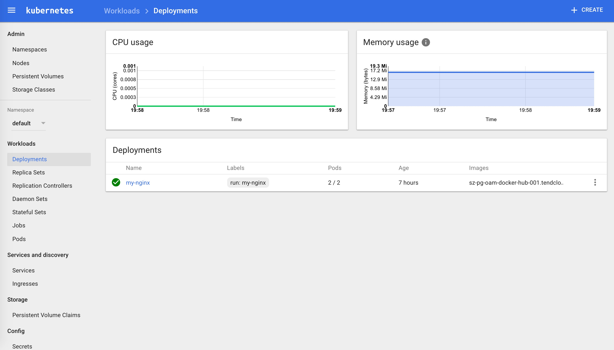
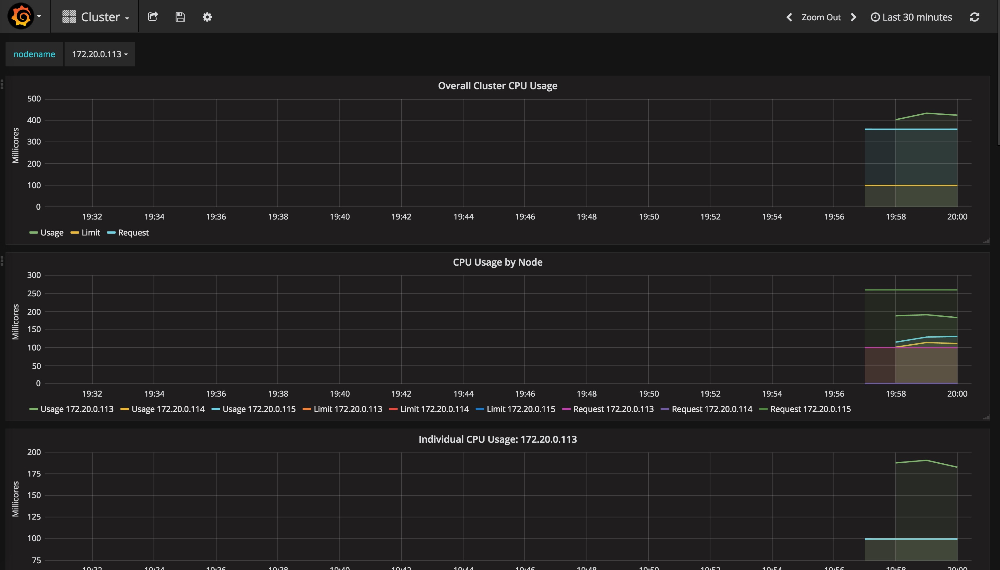
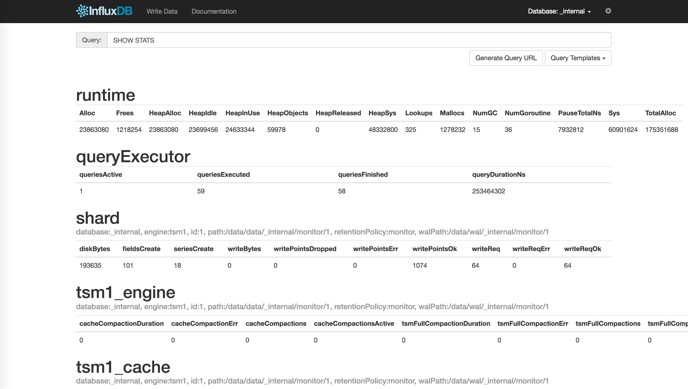
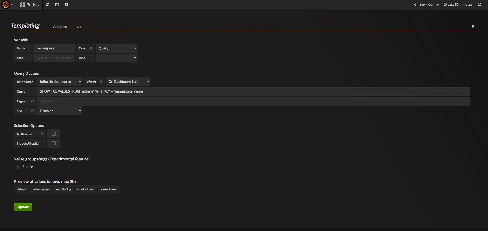

# 安装heapster插件

## 准备镜像

官方镜像保存在 gcr.io 中需要翻墙才能下载，为了方便大家使用，我下载后放到了[时速云](http://www.tenxcloud.com)中，为公有镜像供大家下载。

- index.tenxcloud.com/jimmy/heapster-amd64:v1.3.0-beta.1
- index.tenxcloud.com/jimmy/heapster-influxdb-amd64:v1.1.1
- index.tenxcloud.com/jimmy/heapster-grafana-amd64:v4.0.2

## 准备YAML文件

到 [heapster release 页面](https://github.com/kubernetes/heapster/releases) 下载最新版本的 heapster。

``` bash
wget https://github.com/kubernetes/heapster/archive/v1.3.0.zip
unzip v1.3.0.zip
mv v1.3.0.zip heapster-1.3.0
```

文件目录： `heapster-1.3.0/deploy/kube-config/influxdb`

``` bash
$ cd heapster-1.3.0/deploy/kube-config/influxdb
$ ls *.yaml
grafana-deployment.yaml  grafana-service.yaml  heapster-deployment.yaml  heapster-service.yaml  influxdb-deployment.yaml  influxdb-service.yaml heapster-rbac.yaml
```

我们自己创建了heapster的rbac配置`heapster-rbac.yaml`。

已经修改好的 yaml 文件见：[../manifests/heapster](https://github.com/rootsongjc/kubernetes-handbook/blob/master/manifests/heapster/)


## 配置 grafana-deployment

``` bash
$ diff grafana-deployment.yaml.orig grafana-deployment.yaml
16c16
<         image: gcr.io/google_containers/heapster-grafana-amd64:v4.0.2
---
>         image: sz-pg-oam-docker-hub-001.tendcloud.com/library/heapster-grafana-amd64:v4.0.2
40,41c40,41
<           # value: /api/v1/proxy/namespaces/kube-system/services/monitoring-grafana/
<           value: /
---
>           value: /api/v1/proxy/namespaces/kube-system/services/monitoring-grafana/
>           #value: /
```

+ 如果后续使用 kube-apiserver 或者 kubectl proxy 访问 grafana dashboard，则必须将 `GF_SERVER_ROOT_URL` 设置为 `/api/v1/proxy/namespaces/kube-system/services/monitoring-grafana/`，否则后续访问grafana时访问时提示找不到`http://172.20.0.113:8086/api/v1/proxy/namespaces/kube-system/services/monitoring-grafana/api/dashboards/home` 页面；


## 配置 heapster-deployment

``` bash
$ diff heapster-deployment.yaml.orig heapster-deployment.yaml
16c16
<         image: gcr.io/google_containers/heapster-amd64:v1.3.0-beta.1
---
>         image: sz-pg-oam-docker-hub-001.tendcloud.com/library/heapster-amd64:v1.3.0-beta.1
```

## 配置 influxdb-deployment

influxdb 官方建议使用命令行或 HTTP API 接口来查询数据库，从 v1.1.0 版本开始默认关闭 admin UI，将在后续版本中移除 admin UI 插件。

开启镜像中 admin UI的办法如下：先导出镜像中的 influxdb 配置文件，开启 admin 插件后，再将配置文件内容写入 ConfigMap，最后挂载到镜像中，达到覆盖原始配置的目的：

注意：manifests 目录已经提供了 [修改后的 ConfigMap 定义文件](https://github.com/opsnull/follow-me-install-kubernetes-cluster/blob/master/manifests/heapster/influxdb-cm.yaml)

``` bash
$ # 导出镜像中的 influxdb 配置文件
$ docker run --rm --entrypoint 'cat'  -ti lvanneo/heapster-influxdb-amd64:v1.1.1 /etc/config.toml >config.toml.orig
$ cp config.toml.orig config.toml
$ # 修改：启用 admin 接口
$ vim config.toml
$ diff config.toml.orig config.toml
35c35
<   enabled = false
---
>   enabled = true
$ # 将修改后的配置写入到 ConfigMap 对象中
$ kubectl create configmap influxdb-config --from-file=config.toml  -n kube-system
configmap "influxdb-config" created
$ # 将 ConfigMap 中的配置文件挂载到 Pod 中，达到覆盖原始配置的目的
$ diff influxdb-deployment.yaml.orig influxdb-deployment.yaml
16c16
<         image: gcr.io/google_containers/heapster-influxdb-amd64:v1.1.1
---
>         image: sz-pg-oam-docker-hub-001.tendcloud.com/library/heapster-influxdb-amd64:v1.1.1
19a20,21
>         - mountPath: /etc/
>           name: influxdb-config
22a25,27
>       - name: influxdb-config
>         configMap:
>           name: influxdb-config
```

## 配置 monitoring-influxdb Service

```
$ diff influxdb-service.yaml.orig influxdb-service.yaml
12a13
>   type: NodePort
15a17,20
>     name: http
>   - port: 8083
>     targetPort: 8083
>     name: admin
```

- 定义端口类型为 NodePort，额外增加了 admin 端口映射，用于后续浏览器访问 influxdb 的 admin UI 界面；

## 执行所有定义文件

``` bash
$ pwd
/root/heapster-1.3.0/deploy/kube-config/influxdb
$ ls *.yaml
grafana-service.yaml      heapster-rbac.yaml     influxdb-cm.yaml          influxdb-service.yaml
grafana-deployment.yaml  heapster-deployment.yaml  heapster-service.yaml  influxdb-deployment.yaml
$ kubectl create -f  .
deployment "monitoring-grafana" created
service "monitoring-grafana" created
deployment "heapster" created
serviceaccount "heapster" created
clusterrolebinding "heapster" created
service "heapster" created
configmap "influxdb-config" created
deployment "monitoring-influxdb" created
service "monitoring-influxdb" created
```


## 检查执行结果

检查 Deployment

``` bash
$ kubectl get deployments -n kube-system | grep -E 'heapster|monitoring'
heapster               1         1         1            1           2m
monitoring-grafana     1         1         1            1           2m
monitoring-influxdb    1         1         1            1           2m
```

检查 Pods

``` bash
$ kubectl get pods -n kube-system | grep -E 'heapster|monitoring'
heapster-110704576-gpg8v                1/1       Running   0          2m
monitoring-grafana-2861879979-9z89f     1/1       Running   0          2m
monitoring-influxdb-1411048194-lzrpc    1/1       Running   0          2m
```

检查 kubernets dashboard 界面，看是显示各 Nodes、Pods 的 CPU、内存、负载等利用率曲线图；



## 访问 grafana

1. 通过 kube-apiserver 访问：

    获取 monitoring-grafana 服务 URL

    ``` bash
    $ kubectl cluster-info
    Kubernetes master is running at https://172.20.0.113:6443
    Heapster is running at https://172.20.0.113:6443/api/v1/proxy/namespaces/kube-system/services/heapster
    KubeDNS is running at https://172.20.0.113:6443/api/v1/proxy/namespaces/kube-system/services/kube-dns
    kubernetes-dashboard is running at https://172.20.0.113:6443/api/v1/proxy/namespaces/kube-system/services/kubernetes-dashboard
    monitoring-grafana is running at https://172.20.0.113:6443/api/v1/proxy/namespaces/kube-system/services/monitoring-grafana
    monitoring-influxdb is running at https://172.20.0.113:6443/api/v1/proxy/namespaces/kube-system/services/monitoring-influxdb

    To further debug and diagnose cluster problems, use 'kubectl cluster-info dump'.
    ```

    浏览器访问 URL： `http://172.20.0.113:8080/api/v1/proxy/namespaces/kube-system/services/monitoring-grafana`

2. 通过 kubectl proxy 访问：

    创建代理

    ``` bash
    $ kubectl proxy --address='172.20.0.113' --port=8086 --accept-hosts='^*$'
    Starting to serve on 172.20.0.113:8086
    ```

    浏览器访问 URL：`http://172.20.0.113:8086/api/v1/proxy/namespaces/kube-system/services/monitoring-grafana`



## 访问 influxdb admin UI

获取 influxdb http 8086 映射的 NodePort

```
$ kubectl get svc -n kube-system|grep influxdb
monitoring-influxdb    10.254.22.46    <nodes>       8086:32299/TCP,8083:30269/TCP   9m
```

通过 kube-apiserver 的**非安全端口**访问 influxdb 的 admin UI 界面： `http://172.20.0.113:8080/api/v1/proxy/namespaces/kube-system/services/monitoring-influxdb:8083/`

在页面的 “Connection Settings” 的 Host 中输入 node IP， Port 中输入 8086 映射的 nodePort 如上面的 32299，点击 “Save” 即可（我的集群中的地址是172.20.0.113:32299）：



## 注意

在安装好 Grafana 之后我们使用的是默认的 template 配置，页面上的 namespace 选择里只有 `default` 和 `kube-system`，并不是说其他的 namespace 里的指标没有得到监控，只是我们没有在 Grafana 中开启他它们的显示而已。见 [Cannot see other namespaces except, kube-system and default #1279](https://github.com/kubernetes/heapster/issues/1279)。



将 Templating 中的 namespace 的 Data source 设置为 influxdb-datasource，Refresh 设置为 on Dashboard Load 保存设置，刷新浏览器，即可看到其他 namespace 选项。

## 参考

[使用Heapster获取集群对象的metric数据](../practice/using-heapster-to-get-object-metrics.md)