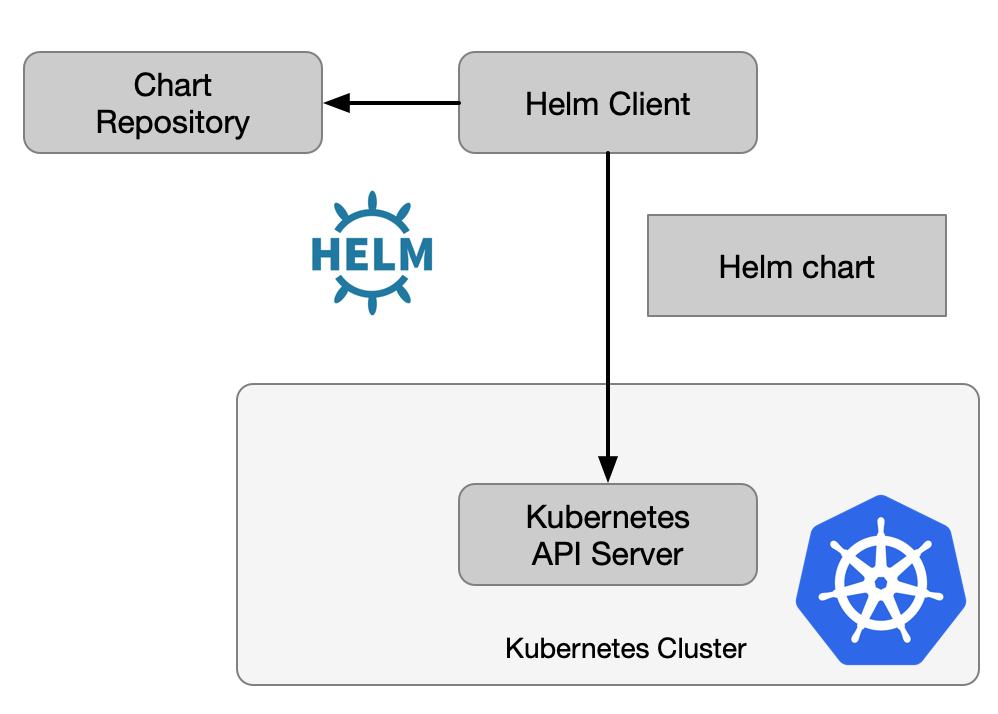

# 使用Helm管理kubernetes应用

[Helm](http://helm.sh) 是一个 Kubernetes 应用的包管理工具，用来管理 [chart](https://github.com/helm/charts)——预先配置好的安装包资源，有点类似于 Ubuntu 的 APT  和 CentOS 中的 YUM。2019 年 11 月 13 日，[Helm 3 发布](https://helm.sh/blog/helm-3-released/)，2020 年 4 月 30 日，从 CNCF 中[毕业](https://helm.sh/blog/celebrating-helms-cncf-graduation/)。本文基于 Helm 3。

Helm chart 是用来封装 Kubernetes 原生应用程序的 YAML 文件，可以在你部署应用的时候自定义应用程序的一些 metadata，便与应用程序的分发。

Helm 和 chart 的主要作用是：

- 应用程序封装
- 版本管理
- 依赖检查
- 便于应用程序分发

下面是 Helm 的架构图。



Helm 可以安装本地或者远程的 chart，当 chart 安装到 Kubernetes 中后就会创建一个 release，每次更新该 chart 的配置并执行 `helm upgrade`， release 的版本数就会加 1。同一个 chart 可以部署多次。

## 安装 Helm

**前提要求**

- Kubernetes 1.5 以上版本
- 执行 helm 命令的主机可以访问到 Kubernetes 集群

请参考 [Helm 官方文档](https://helm.sh/docs/intro/install/)安装，对于 Mac 用户可以直接运行 `brew install helm` 安装即可。

## Chart 说明

下面我们将一步步创建一个 chart 来说明其组织结构。

首先使用 `helm create mychart` 创建一个名为 `mychart` 的示例，我们再使用 `tree mychart` 命令看一下 chart 的目录结构。

```bash
mychart
├── Chart.yaml
├── charts # 该目录保存其他依赖的 chart（子 chart）
├── templates # chart 配置模板，用于渲染最终的 Kubernetes YAML 文件
│   ├── NOTES.txt # 用户运行 helm install 时候的提示信息
│   ├── _helpers.tpl # 用于创建模板时的帮助类
│   ├── deployment.yaml # Kubernetes deployment 配置
│   ├── ingress.yaml # Kubernetes ingress 配置
│   ├── service.yaml # Kubernetes service 配置
│   ├── serviceaccount.yaml # Kubernetes serviceaccount 配置
│   └── tests
│       └── test-connection.yaml
└── values.yaml # 定义 chart 模板中的自定义配置的默认值，可以在执行 helm install 或 helm update 的时候覆盖
```

以上仅为 helm 为我们自动创建的目录结构，我们还可以在 `templates` 目录加其他 Kubernetes 对象的配置，比如 `ConfigMap`、`DaemonSet` 等。

我们查看下使用 `helm create` 命令自动生成的 `templates/service.yaml` 文件。

```yaml
apiVersion: v1
kind: Service
metadata:
  name: {{ include "mychart.fullname" . }}
  labels:
    {{- include "mychart.labels" . | nindent 4 }}
spec:
  type: {{ .Values.service.type }}
  ports:
    - port: {{ .Values.service.port }}
      targetPort: http
      protocol: TCP
      name: http
  selector:
    {{- include "mychart.selectorLabels" . | nindent 4 }}
```

可以看到其中有很多`{{ }}` 包围的字段，这是使用的 [Go template](https://golang.org/pkg/text/template/) 创建的自定义字段，其中 `mychart` 开头的都是在 `_helpers.tpl` 中生成的定义。

例如 `_helpers.tpl` 中对  `chart.fullname` 的定义：

```go
{{/*
Create a default fully qualified app name.
We truncate at 63 chars because some Kubernetes name fields are limited to this (by the DNS naming spec).
If release name contains chart name it will be used as a full name.
*/}}
{{- define "mychart.fullname" -}}
{{- if .Values.fullnameOverride -}}
{{- .Values.fullnameOverride | trunc 63 | trimSuffix "-" -}}
{{- else -}}
{{- $name := default .Chart.Name .Values.nameOverride -}}
{{- if contains $name .Release.Name -}}
{{- .Release.Name | trunc 63 | trimSuffix "-" -}}
{{- else -}}
{{- printf "%s-%s" .Release.Name $name | trunc 63 | trimSuffix "-" -}}
{{- end -}}
{{- end -}}
{{- end -}}
```

我们再看下 `values.yaml` 文件中有这样的一段配置：

```yaml
service:
  type: ClusterIP
  port: 80
```

在使用 `helm install` 或 `helm update` 时，会渲染 `templates/service.yaml` 文件中的 `{{ .Values.service.type }}` 和 `{{ .Values.service.port }}` 的值。

## 使用 Helm

Helm 常用命令如下：

- `helm create`：在本地创建新的 chart；
- `helm dependency`：管理 chart 依赖；
- `helm intall`：安装 chart；
- `helm lint`：检查 chart 配置是否有误；
- `helm list`：列出所有 release；
- `helm package`：打包本地 chart；
- `helm repo`：列出、增加、更新、删除 chart 仓库；
- `helm rollback`：回滚 release 到历史版本；
- `helm pull`：拉取远程 chart 到本地；
- `helm search`：使用关键词搜索 chart；
- `helm uninstall`：卸载 release；
- `helm upgrade`：升级 release；

使用 `helm -h` 可以查看 Helm 命令行使用详情，请参考 [Helm 文档](https://helm.sh/docs/helm/helm/)。

### 安装 chart

安装 chart 的命令格式为：

```bash
helm install [NAME] [CHART] [flags]
```

示例：

```bash
# 安装本地 chart
helm install -f myvalues.yaml myredis ./redis
# 指定变量
helm install --set name=prod myredis ./redis
# 指定变量的值为 string 类型
helm install --set-string long_int=1234567890 myredis ./redis
# 指定引用的文件地址
helm install --set-file my_script=dothings.sh myredis ./redis
# 同时指定多个变量
helm install --set foo=bar --set foo=newbar  myredis ./redis
```

其中：

- `myvalues.yaml`：自定义变量配置文件；
- `myredis`：release 名称；
- `./redis`：本地的 chart 目录；

Helm chart 安装后会转化成 Kubernetes 中的资源对象，生成一个 chart release，可以使用 `helm list` 命令查看。

关于 `helm intsall` 详细用法见：<https://helm.sh/docs/helm/helm_install/>。

## 升级和回滚 chart

要想升级 chart 可以修改本地的 chart 配置并执行：

```bash
helm upgrade [RELEASE] [CHART] [flags]
```

使用 `helm ls` 的命令查看当前运行的 chart 的 release 版本，并使用下面的命令回滚到历史版本：

```bash
helm rollback <RELEASE> [REVISION] [flags]
```

### 卸载 chart

要想卸载 chart 可以使用下面的命令。

```bash
helm uninstall RELEASE_NAME [...] [flags]
```

## 参考

- [Go template - golang.org](https://golang.org/pkg/text/template/)
- [Getting Started - helm.sh](https://helm.sh/docs/chart_template_guide/getting_started/)
- [Helm 用户指南 - whmzsu.github.io](https://whmzsu.github.io/helm-doc-zh-cn/)
