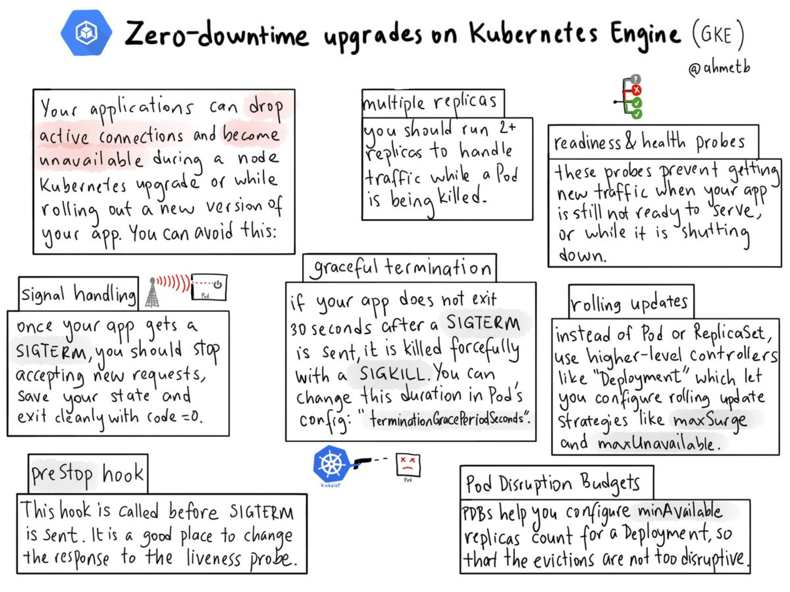

# 手动升级kubernetes集群

在我最开始写作本书的时候，kubernetes刚发布1.6.0版本，而kubernetes基本按照每三个月发布一个大版本的速度迭代，为了使用新特性和只支持新版本kubernetes的配套软件，升级kubernetes就迫在眉睫，在此我们使用替换kubernets的旧的二进制文件这种暴力的方式来升级测试集群，若升级生产集群还望三思。

另外，自kubernetes1.6版本之后发布的1.7和1.8版本又增加了一些新特性，参考：

- [Kubernetes1.7更新日志](../appendix/kubernetes-1.7-changelog.md)
- [Kubernetes1.8更新日志](../appendix/kubernetes-1.8-changelog.md)

目前kubernetes的官方文档上并没有详细的手动安装的集群如何升级的参考资料，只有两篇关于kubernetes集群升级的文档。

手动升级的还没有详细的方案，大多是基于管理工具部署和升级，比如juju、kubeadm、kops、kubespray等。

[manual upgrade/downgrade testing for Kubernetes 1.6 - google group](https://groups.google.com/forum/#!topic/kubernetes-dev/jDbGKAsfo4Q)，在这个Google group中讨论了kubernetes手动升级的问题，并给出了参考建议。

## 升级步骤

> **注意：**该升级步骤是实验性的，建议在测试集群上使用，无法保证线上服务不中断，实际升级完成后无需对线上服务做任何操作。

大体上的升级步骤是，先升级master节点，然后再一次升级每台node节点。

## 升级建议

下图来自[@ahmetb](https://twitter.com/ahmetb)的Twitter，这是他对于0宕机时间的kubernetes集群升级建议。



主要包括以下建议：

- 应用使用高级对象定义，如支持滚动更新的`Deployment`对象
- 应用要部署成多个实例
- 使用pod的preStop hook，加强pod的生命周期管理
- 使用就绪和健康检查探针来确保应用存活和及时阻拦应用流量的分发

### 准备

1. 备份kubernetes原先的二进制文件和配置文件。
2. 下载最新版本的kubernetes二进制包，如1.8.5版本，查看[changelog](https://github.com/kubernetes/kubernetes/blob/master/CHANGELOG-1.8.md)，下载二进制包，我们使用的是[kubernetes-server-linux-amd64.tar.gz](https://dl.k8s.io/v1.8.5/kubernetes-server-linux-amd64.tar.gz)，分发到集群的每个节点上。

### 升级master节点

停止master节点的进程

```bash
systemctl stop kube-apiserver
systemctl stop kube-scheduler
systemctl stop kube-controller-manager
systemctl stop kube-proxy
systemctl stop kubelet
```

使用新版本的kubernetes二进制文件替换原来老版本的文件，然后启动master节点上的进程：

```bash
systemctl start kube-apiserver
systemctl start kube-scheduler
systemctl start kube-controller-manager
```

因为我们的master节点同时也作为node节点，所有还要执行下面的”升级node节点“中的步骤。

### 升级node节点

关闭swap

```bash
# 临时关闭
swapoff -a

# 永久关闭，注释掉swap分区即可
vim /etc/fstab
#UUID=65c9f92d-4828-4d46-bf19-fb78a38d2fd1 swap                    swap    defaults        0 0
```

修改kubelet的配置文件

将kubelet的配置文件`/etc/kubernetes/kublet`配置文件中的`KUBELET_API_SERVER="--api-servers=http://172.20.0.113:8080"`行注释掉。

> **注意：**：kubernetes1.7及以上版本已经没有该配置了，API server的地址写在了kubeconfig文件中。

停止node节点上的kubernetes进程：

```bash
systemctl stop kubelet
systemctl stop kube-proxy
```

使用新版本的kubernetes二进制文件替换原来老版本的文件，然后启动node节点上的进程：

```bash
systemctl start kubelet
systemctl start kube-proxy
```

启动新版本的kube-proxy报错找不到`conntrack`命令，使用`yum install -y conntrack-tools`命令安装后重启kube-proxy即可。

## 检查

到此升级完成，在master节点上检查节点状态：

```bash
NAME           STATUS    ROLES     AGE       VERSION
172.20.0.113   Ready     <none>    244d      v1.8.5
172.20.0.114   Ready     <none>    244d      v1.8.5
172.20.0.115   Ready     <none>    244d      v1.8.5
```

所有节点的状态都正常，再检查下原先的运行在kubernetes之上的服务是否正常，如果服务正常的话说明这次升级无误。

## API版本变更适配

对于不同版本的Kubernetes，许多资源对象的API的版本可能会变更，下表列出了kubernetes1.5至1.9的API资源对象的版本演进：


当我们升级过后，可能出现资源对象的API变更后，原先的YAML文件无法使用的情况，因此需要对新版本的Kubernetes进行适配。对应的API版本转换工具：<https://github.com/fleeto/kube-version-converter>，可以将Kuberntes API对象转换到指定版本。

## 参考

- [Cluster Upgrade #2524](https://github.com/kubernetes/kubernetes/issues/2524)
- [Upgrading self-hosted Kubernetes](https://coreos.com/matchbox/docs/latest/bootkube-upgrades.html)
- [Upgrading Kubernetes - kops](https://github.com/kubernetes/kops/blob/master/docs/upgrade.md)
- [How to Upgrade a Kubernetes Cluster With No Downtime](https://medium.com/retailmenot-engineering/zero-downtime-kubernetes-cluster-upgrades-aab4cac943d2)
- [manual upgrade/downgrade testing for Kubernetes 1.6 - google group](https://groups.google.com/forum/#!topic/kubernetes-dev/jDbGKAsfo4Q)
- [Notes/Instructions for Manual Upgrade Testing1.5 -> 1.6](https://docs.google.com/document/d/1DtQFhxmKSZJJ_yv8ttweqotburHHZWxaCYnFbjLDA5g/edit)
- [Upgrading Kubernetes in Kubespray](https://github.com/kubernetes-incubator/kubespray/blob/master/docs/upgrades.md)