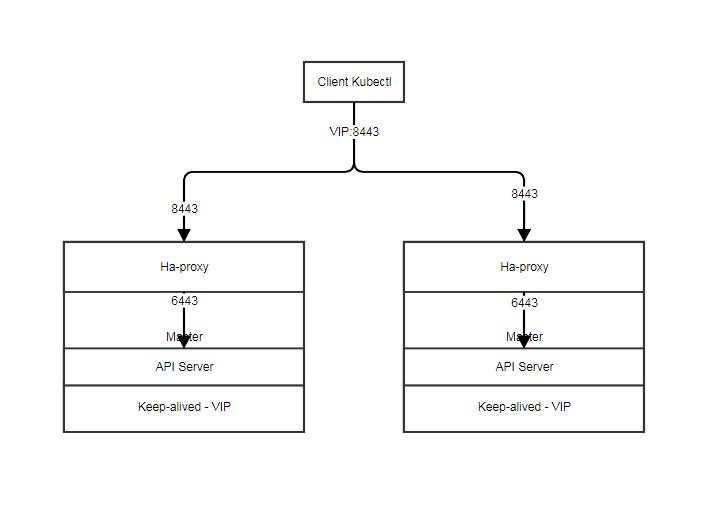

# Master节点高可用
作者：[mendickxiao](https://github.com/mendickxiao)

经过部署Kubernetes集群章节我们已经可以顺利的部署一个集群用于开发和测试，但是要应用到生产就就不得不考虑master节点的高可用问题，因为现在我们的master节点上的几个服务`kube-apiserver`、`kube-scheduler`和`kube-controller-manager`都是单点的而且都位于同一个节点上，一旦master节点宕机，虽然不应答当前正在运行的应用，将导致kubernetes集群无法变更。本文将引导你创建一个高可用的master节点。

在大神gzmzj的ansible创建kubernetes集群神作中有讲到如何配置多个Master，但是在实践过程中还是遇到不少坑。需要将坑填上才能工作。
神作链接地址：[集群规划和基础参数设定](https://github.com/mendickxiao/kubeasz/blob/master/docs/00-%E9%9B%86%E7%BE%A4%E8%A7%84%E5%88%92%E5%92%8C%E5%9F%BA%E7%A1%80%E5%8F%82%E6%95%B0%E8%AE%BE%E5%AE%9A.md)。

按照神作的描述，实际上是通过keepalived + haproxy实现的，其中keepalived是提供一个VIP，通过VIP关联所有的Master节点；然后haproxy提供端口转发功能。由于VIP还是存在Master的机器上的，默认配置API Server的端口是6443，所以我们需要将另外一个端口关联到这个VIP上，一般用8443。




根据神作的实践，我发现需要在Master手工安装keepalived, haproxy。
```bash
yum install keepalived
yum install haproxy
```

需要将HAProxy默认的配置文件balance从source修改为`roundrobin`方式。haproxy的配置文件`haproxy.cfg`默认路径是`/etc/haproxy/haproxy.cfg`。另外需要手工创建`/run/haproxy`的目录，否则haproxy会启动失败。

**注意**

- bind绑定的就是VIP对外的端口号，这里是8443。


- balance指定的负载均衡方式是`roundrobin`方式，默认是source方式。在我的测试中，source方式不工作。
- server指定的就是实际的Master节点地址以及真正工作的端口号，这里是6443。有多少台Master就写多少条记录。

```ini
# haproxy.cfg sample
global
        log /dev/log    local0
        log /dev/log    local1 notice
        chroot /var/lib/haproxy
        *stats socket /run/haproxy/admin.sock mode 660 level admin
        stats timeout 30s
        user haproxy
        group haproxy
        daemon
        nbproc 1

defaults
        log     global
        timeout connect 5000
        timeout client  50000
        timeout server  50000

listen kube-master
        **bind 0.0.0.0:8443**
        mode tcp
        option tcplog
        **balance roundrobin**
        server s1 **Master 1的IP地址**:6443  check inter 10000 fall 2 rise 2 weight 1
        server s2 **Master 2的IP地址**:6443  check inter 10000 fall 2 rise 2 weight 1
```

修改keepalived的配置文件，配置正确的VIP。keepalived的配置文件`keepalived.conf`的默认路径是`/etc/keepalived/keepalived.conf`

**注意**

- priority决定哪个Master是主，哪个Master是次。数字小的是主，数字大的是次。数字越小优先级越高。
- `virtual_router_id`决定当前VIP的路由号，实际上VIP提供了一个虚拟的路由功能，该VIP在同一个子网内必须是唯一。
- virtual_ipaddress提供的就是VIP的地址，该地址在子网内必须是空闲未必分配的。

```ini
# keepalived.cfg sample

global_defs {
    router_id lb-backup
}

vrrp_instance VI-kube-master {
    state BACKUP
    **priority 110**
    dont_track_primary
    interface eth0
    **virtual_router_id 51**
    advert_int 3
    virtual_ipaddress {
        **10.86.13.36**
    }
}
```
配置好后，那么先启动主Master的keepalived和haproxy。
```bash
systemctl enable keepalived
systemctl start keepalived
systemctl enable haproxy
systemctl start haproxy
```
然后使用ip a s命令查看是否有VIP地址分配。如果看到VIP地址已经成功分配在eth0网卡上，说明keepalived启动成功。
```bash
[root@kube32 ~]# ip a s
1: lo: <LOOPBACK,UP,LOWER_UP> mtu 65536 qdisc noqueue state UNKNOWN qlen 1
    link/loopback 00:00:00:00:00:00 brd 00:00:00:00:00:00
    inet 127.0.0.1/8 scope host lo
       valid_lft forever preferred_lft forever
    inet6 ::1/128 scope host
       valid_lft forever preferred_lft forever
2: eth0: <BROADCAST,MULTICAST,UP,LOWER_UP> mtu 1500 qdisc mq state UP qlen 1000
    link/ether 00:50:56:a9:d5:be brd ff:ff:ff:ff:ff:ff
    inet 10.86.13.32/23 brd 10.86.13.255 scope global eth0
       valid_lft forever preferred_lft forever
    **inet 10.86.13.36/32 scope global eth0**
       valid_lft forever preferred_lft forever
    inet6 fe80::250:56ff:fea9:d5be/64 scope link
       valid_lft forever preferred_lft forever
```
更保险方法还可以通过`systemctl status keepalived -l`看看keepalived的状态
```bash
[root@kube32 ~]# systemctl status keepalived -l
● keepalived.service - LVS and VRRP High Availability Monitor
   Loaded: loaded (/usr/lib/systemd/system/keepalived.service; enabled; vendor preset: disabled)
   Active: active (running) since Thu 2018-02-01 10:24:51 CST; 1 months 16 days ago
 Main PID: 13448 (keepalived)
   Memory: 6.0M
   CGroup: /system.slice/keepalived.service
           ├─13448 /usr/sbin/keepalived -D
           ├─13449 /usr/sbin/keepalived -D
           └─13450 /usr/sbin/keepalived -D

Mar 20 04:51:15 kube32 Keepalived_vrrp[13450]: VRRP_Instance(VI-kube-master) Dropping received VRRP packet...
**Mar 20 04:51:18 kube32 Keepalived_vrrp[13450]: (VI-kube-master): ip address associated with VRID 51 not present in MASTER advert : 10.86.13.36
Mar 20 04:51:18 kube32 Keepalived_vrrp[13450]: bogus VRRP packet received on eth0 !!!**
```
然后通过systemctl status haproxy -l看haproxy的状态
```bash
[root@kube32 ~]# systemctl status haproxy -l
● haproxy.service - HAProxy Load Balancer
   Loaded: loaded (/usr/lib/systemd/system/haproxy.service; enabled; vendor preset: disabled)
   Active: active (running) since Thu 2018-02-01 10:33:22 CST; 1 months 16 days ago
 Main PID: 15116 (haproxy-systemd)
   Memory: 3.2M
   CGroup: /system.slice/haproxy.service
           ├─15116 /usr/sbin/haproxy-systemd-wrapper -f /etc/haproxy/haproxy.cfg -p /run/haproxy.pid
           ├─15117 /usr/sbin/haproxy -f /etc/haproxy/haproxy.cfg -p /run/haproxy.pid -Ds
           └─15118 /usr/sbin/haproxy -f /etc/haproxy/haproxy.cfg -p /run/haproxy.pid -Ds
```
这个时候通过kubectl version命令，可以获取到kubectl的服务器信息。
```bash
[root@kube32 ~]# kubectl version
**Client Version: version.Info{Major:"1", Minor:"9", GitVersion:"v1.9.1", GitCommit:"3a1c9449a956b6026f075fa3134ff92f7d55f812", GitTreeState:"clean", BuildDate:"2018-01-03T22:31:01Z", GoVersion:"go1.9.2", Compiler:"gc", Platform:"linux/amd64"}
Server Version: version.Info{Major:"1", Minor:"9", GitVersion:"v1.9.1", GitCommit:"3a1c9449a956b6026f075fa3134ff92f7d55f812", GitTreeState:"clean", BuildDate:"2018-01-03T22:18:41Z", GoVersion:"go1.9.2", Compiler:"gc", Platform:"linux/amd64"}**
```

这个时候说明你的keepalived和haproxy都是成功的。这个时候你可以依次将你其他Master节点的keepalived和haproxy启动。
此时，你通过ip a s命令去查看其中一台Master（*非主Master*）的时候，你看不到VIP，这个是正常的，因为VIP永远只在主Master节点上，只有当主Master节点挂掉后，才会切换到其他Master节点上。
```bash
[root@kube31 ~]# ip a s
1: lo: <LOOPBACK,UP,LOWER_UP> mtu 65536 qdisc noqueue state UNKNOWN qlen 1
    link/loopback 00:00:00:00:00:00 brd 00:00:00:00:00:00
    inet 127.0.0.1/8 scope host lo
       valid_lft forever preferred_lft forever
    inet6 ::1/128 scope host
       valid_lft forever preferred_lft forever
2: eth0: <BROADCAST,MULTICAST,UP,LOWER_UP> mtu 1500 qdisc mq state UP qlen 1000
    link/ether 00:50:56:a9:07:23 brd ff:ff:ff:ff:ff:ff
    inet 10.86.13.31/23 brd 10.86.13.255 scope global eth0
       valid_lft forever preferred_lft forever
    inet6 fe80::250:56ff:fea9:723/64 scope link
       valid_lft forever preferred_lft forever
```
在我的实践过程中，通过大神的脚本快速启动多个Master节点，会导致主Master始终获取不了VIP，当时的报错非常奇怪。后来经过我的研究发现，主Master获取VIP是需要时间的，如果多个Master同时启动，会导致冲突。这个不知道是否算是Keepalived的Bug。但是最稳妥的方式还是先启动一台主Master，等VIP确定后再启动其他Master比较靠谱。

Kubernetes通过Keepalived + Haproxy实现多个Master的高可用部署，你实际上可以采用其他方式，如外部的负载均衡方式。实际上Kubernetes的多个Master是没有主从的，都可以提供一致性服务。Keepalived + Haproxy实际上就是提供了一个简单的负载均衡方式。
