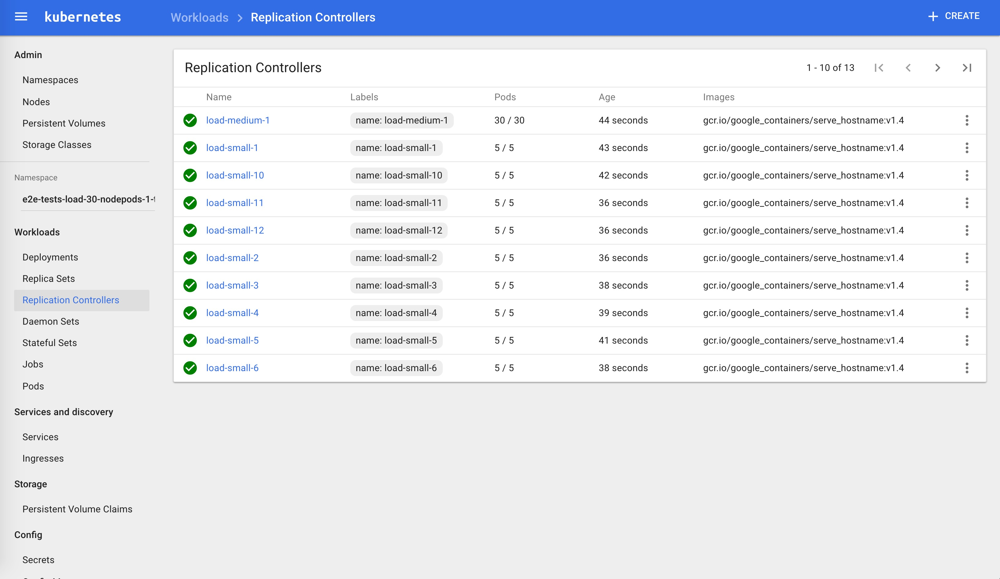
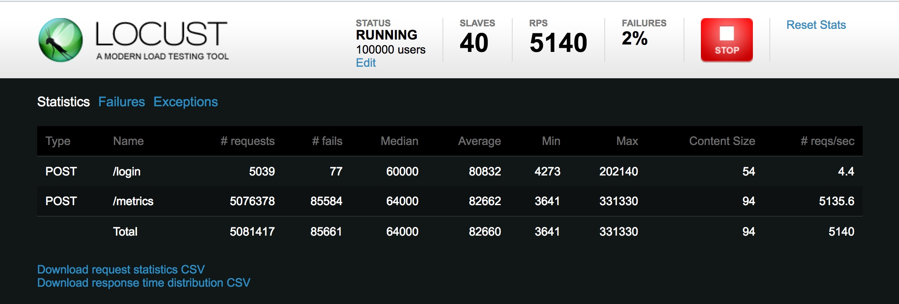

# Kubernetes网络和集群性能测试

## 准备

**测试环境**

在以下几种环境下进行测试：

- Kubernetes集群node节点上通过Cluster IP方式访问
- Kubernetes集群内部通过service访问
- Kubernetes集群外部通过traefik ingress暴露的地址访问

**测试地址**

Cluster IP: 10.254.149.31

Service Port：8000

Ingress Host：traefik.sample-webapp.io

**测试工具**

- [Locust](http://locust.io)：一个简单易用的用户负载测试工具，用来测试web或其他系统能够同时处理的并发用户数。
- curl
- [kubemark](https://github.com/kubernetes/kubernetes/tree/master/test/e2e)
- 测试程序：sample-webapp，源码见Github [kubernetes的分布式负载测试](https://github.com/rootsongjc/distributed-load-testing-using-kubernetes)

**测试说明**

通过向`sample-webapp`发送curl请求获取响应时间，直接curl后的结果为：

```Bash
$ curl "http://10.254.149.31:8000/"
Welcome to the "Distributed Load Testing Using Kubernetes" sample web app
```

## 网络延迟测试

### 场景一、 Kubernetes集群node节点上通过Cluster IP访问

**测试命令**

```bash
curl -o /dev/null -s -w '%{time_connect} %{time_starttransfer} %{time_total}' "http://10.254.149.31:8000/"
```

**10组测试结果**

| No   | time_connect | time_starttransfer | time_total |
| ---- | ------------ | ------------------ | ---------- |
| 1    | 0.000        | 0.003              | 0.003      |
| 2    | 0.000        | 0.002              | 0.002      |
| 3    | 0.000        | 0.002              | 0.002      |
| 4    | 0.000        | 0.002              | 0.002      |
| 5    | 0.000        | 0.002              | 0.002      |
| 6    | 0.000        | 0.002              | 0.002      |
| 7    | 0.000        | 0.002              | 0.002      |
| 8    | 0.000        | 0.002              | 0.002      |
| 9    | 0.000        | 0.002              | 0.002      |
| 10   | 0.000        | 0.002              | 0.002      |

**平均响应时间：2ms**

**时间指标说明**

单位：秒

time_connect：建立到服务器的 TCP 连接所用的时间

time_starttransfer：在发出请求之后，Web 服务器返回数据的第一个字节所用的时间

time_total：完成请求所用的时间

### 场景二、Kubernetes集群内部通过service访问

**测试命令**

```bash
curl -o /dev/null -s -w '%{time_connect} %{time_starttransfer} %{time_total}' "http://sample-webapp:8000/"
```

**10组测试结果**

| No   | time_connect | time_starttransfer | time_total |
| ---- | ------------ | ------------------ | ---------- |
| 1    | 0.004        | 0.006              | 0.006      |
| 2    | 0.004        | 0.006              | 0.006      |
| 3    | 0.004        | 0.006              | 0.006      |
| 4    | 0.004        | 0.006              | 0.006      |
| 5    | 0.004        | 0.006              | 0.006      |
| 6    | 0.004        | 0.006              | 0.006      |
| 7    | 0.004        | 0.006              | 0.006      |
| 8    | 0.004        | 0.006              | 0.006      |
| 9    | 0.004        | 0.006              | 0.006      |
| 10   | 0.004        | 0.006              | 0.006      |

**平均响应时间：6ms**

### 场景三、在公网上通过traefik ingress访问

**测试命令**

```bash
curl -o /dev/null -s -w '%{time_connect} %{time_starttransfer} %{time_total}' "http://traefik.sample-webapp.io" >>result
```

**10组测试结果**

| No   | time_connect | time_starttransfer | time_total |
| ---- | ------------ | ------------------ | ---------- |
| 1    | 0.043        | 0.085              | 0.085      |
| 2    | 0.052        | 0.093              | 0.093      |
| 3    | 0.043        | 0.082              | 0.082      |
| 4    | 0.051        | 0.093              | 0.093      |
| 5    | 0.068        | 0.188              | 0.188      |
| 6    | 0.049        | 0.089              | 0.089      |
| 7    | 0.051        | 0.113              | 0.113      |
| 8    | 0.055        | 0.120              | 0.120      |
| 9    | 0.065        | 0.126              | 0.127      |
| 10   | 0.050        | 0.111              | 0.111      |

**平均响应时间：110ms**

### 测试结果

在这三种场景下的响应时间测试结果如下：

- Kubernetes集群node节点上通过Cluster IP方式访问：2ms
- Kubernetes集群内部通过service访问：6ms
- Kubernetes集群外部通过traefik ingress暴露的地址访问：110ms

*注意：执行测试的node节点/Pod与serivce所在的pod的距离（是否在同一台主机上），对前两个场景可以能会有一定影响。*

## 网络性能测试

网络使用flannel的vxlan模式。

使用iperf进行测试。

服务端命令：

```bash
iperf -s -p 12345 -i 1 -M
```

客户端命令：

```bash
iperf -c ${server-ip} -p 12345 -i 1 -t 10 -w 20K
```

### 场景一、主机之间

```
[ ID] Interval       Transfer     Bandwidth
[  3]  0.0- 1.0 sec   598 MBytes  5.02 Gbits/sec
[  3]  1.0- 2.0 sec   637 MBytes  5.35 Gbits/sec
[  3]  2.0- 3.0 sec   664 MBytes  5.57 Gbits/sec
[  3]  3.0- 4.0 sec   657 MBytes  5.51 Gbits/sec
[  3]  4.0- 5.0 sec   641 MBytes  5.38 Gbits/sec
[  3]  5.0- 6.0 sec   639 MBytes  5.36 Gbits/sec
[  3]  6.0- 7.0 sec   628 MBytes  5.26 Gbits/sec
[  3]  7.0- 8.0 sec   649 MBytes  5.44 Gbits/sec
[  3]  8.0- 9.0 sec   638 MBytes  5.35 Gbits/sec
[  3]  9.0-10.0 sec   652 MBytes  5.47 Gbits/sec
[  3]  0.0-10.0 sec  6.25 GBytes  5.37 Gbits/sec
```

### 场景二、不同主机的Pod之间(使用flannel的vxlan模式)

```
[ ID] Interval       Transfer     Bandwidth
[  3]  0.0- 1.0 sec   372 MBytes  3.12 Gbits/sec
[  3]  1.0- 2.0 sec   345 MBytes  2.89 Gbits/sec
[  3]  2.0- 3.0 sec   361 MBytes  3.03 Gbits/sec
[  3]  3.0- 4.0 sec   397 MBytes  3.33 Gbits/sec
[  3]  4.0- 5.0 sec   405 MBytes  3.40 Gbits/sec
[  3]  5.0- 6.0 sec   410 MBytes  3.44 Gbits/sec
[  3]  6.0- 7.0 sec   404 MBytes  3.39 Gbits/sec
[  3]  7.0- 8.0 sec   408 MBytes  3.42 Gbits/sec
[  3]  8.0- 9.0 sec   451 MBytes  3.78 Gbits/sec
[  3]  9.0-10.0 sec   387 MBytes  3.25 Gbits/sec
[  3]  0.0-10.0 sec  3.85 GBytes  3.30 Gbits/sec
```

### 场景三、Node与非同主机的Pod之间（使用flannel的vxlan模式）

```
[ ID] Interval       Transfer     Bandwidth
[  3]  0.0- 1.0 sec   372 MBytes  3.12 Gbits/sec
[  3]  1.0- 2.0 sec   420 MBytes  3.53 Gbits/sec
[  3]  2.0- 3.0 sec   434 MBytes  3.64 Gbits/sec
[  3]  3.0- 4.0 sec   409 MBytes  3.43 Gbits/sec
[  3]  4.0- 5.0 sec   382 MBytes  3.21 Gbits/sec
[  3]  5.0- 6.0 sec   408 MBytes  3.42 Gbits/sec
[  3]  6.0- 7.0 sec   403 MBytes  3.38 Gbits/sec
[  3]  7.0- 8.0 sec   423 MBytes  3.55 Gbits/sec
[  3]  8.0- 9.0 sec   376 MBytes  3.15 Gbits/sec
[  3]  9.0-10.0 sec   451 MBytes  3.78 Gbits/sec
[  3]  0.0-10.0 sec  3.98 GBytes  3.42 Gbits/sec
```

### 场景四、不同主机的Pod之间（使用flannel的host-gw模式）

```
[ ID] Interval       Transfer     Bandwidth
[  5]  0.0- 1.0 sec   530 MBytes  4.45 Gbits/sec
[  5]  1.0- 2.0 sec   576 MBytes  4.84 Gbits/sec
[  5]  2.0- 3.0 sec   631 MBytes  5.29 Gbits/sec
[  5]  3.0- 4.0 sec   580 MBytes  4.87 Gbits/sec
[  5]  4.0- 5.0 sec   627 MBytes  5.26 Gbits/sec
[  5]  5.0- 6.0 sec   578 MBytes  4.85 Gbits/sec
[  5]  6.0- 7.0 sec   584 MBytes  4.90 Gbits/sec
[  5]  7.0- 8.0 sec   571 MBytes  4.79 Gbits/sec
[  5]  8.0- 9.0 sec   564 MBytes  4.73 Gbits/sec
[  5]  9.0-10.0 sec   572 MBytes  4.80 Gbits/sec
[  5]  0.0-10.0 sec  5.68 GBytes  4.88 Gbits/sec
```

### 场景五、Node与非同主机的Pod之间（使用flannel的host-gw模式）

```
[ ID] Interval       Transfer     Bandwidth
[  3]  0.0- 1.0 sec   570 MBytes  4.78 Gbits/sec
[  3]  1.0- 2.0 sec   552 MBytes  4.63 Gbits/sec
[  3]  2.0- 3.0 sec   598 MBytes  5.02 Gbits/sec
[  3]  3.0- 4.0 sec   580 MBytes  4.87 Gbits/sec
[  3]  4.0- 5.0 sec   590 MBytes  4.95 Gbits/sec
[  3]  5.0- 6.0 sec   594 MBytes  4.98 Gbits/sec
[  3]  6.0- 7.0 sec   598 MBytes  5.02 Gbits/sec
[  3]  7.0- 8.0 sec   606 MBytes  5.08 Gbits/sec
[  3]  8.0- 9.0 sec   596 MBytes  5.00 Gbits/sec
[  3]  9.0-10.0 sec   604 MBytes  5.07 Gbits/sec
[  3]  0.0-10.0 sec  5.75 GBytes  4.94 Gbits/sec
```

### 网络性能对比综述

使用Flannel的**vxlan**模式实现每个pod一个IP的方式，会比宿主机直接互联的网络性能损耗30%～40%，符合网上流传的测试结论。而flannel的host-gw模式比起宿主机互连的网络性能损耗大约是10%。

Vxlan会有一个封包解包的过程，所以会对网络性能造成较大的损耗，而host-gw模式是直接使用路由信息，网络损耗小，关于host-gw的架构请访问[Flannel host-gw architecture](https://docs.openshift.com/container-platform/3.4/architecture/additional_concepts/flannel.html)。

## Kubernete的性能测试

参考[Kubernetes集群性能测试](https://supereagle.github.io/2017/03/09/kubemark/)中的步骤，对kubernetes的性能进行测试。

我的集群版本是Kubernetes1.6.0，首先克隆代码，将kubernetes目录复制到`$GOPATH/src/k8s.io/`下然后执行：

```bash
$ ./hack/generate-bindata.sh
/usr/local/src/k8s.io/kubernetes /usr/local/src/k8s.io/kubernetes
Generated bindata file : test/e2e/generated/bindata.go has 13498 test/e2e/generated/bindata.go lines of lovely automated artifacts
No changes in generated bindata file: pkg/generated/bindata.go
/usr/local/src/k8s.io/kubernetes
$ make WHAT="test/e2e/e2e.test"
...
+++ [0425 17:01:34] Generating bindata:
    test/e2e/generated/gobindata_util.go
/usr/local/src/k8s.io/kubernetes /usr/local/src/k8s.io/kubernetes/test/e2e/generated
/usr/local/src/k8s.io/kubernetes/test/e2e/generated
+++ [0425 17:01:34] Building go targets for linux/amd64:
    test/e2e/e2e.test
$ make ginkgo
+++ [0425 17:05:57] Building the toolchain targets:
    k8s.io/kubernetes/hack/cmd/teststale
    k8s.io/kubernetes/vendor/github.com/jteeuwen/go-bindata/go-bindata
+++ [0425 17:05:57] Generating bindata:
    test/e2e/generated/gobindata_util.go
/usr/local/src/k8s.io/kubernetes /usr/local/src/k8s.io/kubernetes/test/e2e/generated
/usr/local/src/k8s.io/kubernetes/test/e2e/generated
+++ [0425 17:05:58] Building go targets for linux/amd64:
    vendor/github.com/onsi/ginkgo/ginkgo

$ export KUBERNETES_PROVIDER=local
$ export KUBECTL_PATH=/usr/bin/kubectl
$ go run hack/e2e.go -v -test  --test_args="--host=http://172.20.0.113:8080 --ginkgo.focus=\[Feature:Performance\]" >>log.txt
```

**测试结果**

```bash
Apr 25 18:27:31.461: INFO: API calls latencies: {
  "apicalls": [
    {
      "resource": "pods",
      "verb": "POST",
      "latency": {
        "Perc50": 2148000,
        "Perc90": 13772000,
        "Perc99": 14436000,
        "Perc100": 0
      }
    },
    {
      "resource": "services",
      "verb": "DELETE",
      "latency": {
        "Perc50": 9843000,
        "Perc90": 11226000,
        "Perc99": 12391000,
        "Perc100": 0
      }
    },
    ...
Apr 25 18:27:31.461: INFO: [Result:Performance] {
  "version": "v1",
  "dataItems": [
    {
      "data": {
        "Perc50": 2.148,
        "Perc90": 13.772,
        "Perc99": 14.436
      },
      "unit": "ms",
      "labels": {
        "Resource": "pods",
        "Verb": "POST"
      }
    },
...
2.857: INFO: Running AfterSuite actions on all node
Apr 26 10:35:32.857: INFO: Running AfterSuite actions on node 1

Ran 2 of 606 Specs in 268.371 seconds
SUCCESS! -- 2 Passed | 0 Failed | 0 Pending | 604 Skipped PASS

Ginkgo ran 1 suite in 4m28.667870101s
Test Suite Passed
```

从kubemark输出的日志中可以看到**API calls latencies**和**Performance**。

**日志里显示，创建90个pod用时40秒以内，平均创建每个pod耗时0.44秒。**

### 不同type的资源类型API请求耗时分布

| Resource  | Verb   | 50%     | 90%      | 99%      |
| --------- | ------ | ------- | -------- | -------- |
| services  | DELETE | 8.472ms | 9.841ms  | 38.226ms |
| endpoints | PUT    | 1.641ms | 3.161ms  | 30.715ms |
| endpoints | GET    | 931µs   | 10.412ms | 27.97ms  |
| nodes     | PATCH  | 4.245ms | 11.117ms | 18.63ms  |
| pods      | PUT    | 2.193ms | 2.619ms  | 17.285ms |

从`log.txt`日志中还可以看到更多详细请求的测试指标。



### 注意事项

测试过程中需要用到docker镜像存储在GCE中，需要翻墙下载，我没看到哪里配置这个镜像的地址。该镜像副本已上传时速云：

用到的镜像有如下两个：

- gcr.io/google_containers/pause-amd64:3.0
- gcr.io/google_containers/serve_hostname:v1.4

时速云镜像地址：

- index.tenxcloud.com/jimmy/pause-amd64:3.0
- index.tenxcloud.com/jimmy/serve_hostname:v1.4

将镜像pull到本地后重新打tag。

## Locust测试

请求统计

| Method | Name     | # requests | # failures | Median response time | Average response time | Min response time | Max response time | Average Content Size | Requests/s |
| ------ | -------- | ---------- | ---------- | -------------------- | --------------------- | ----------------- | ----------------- | -------------------- | ---------- |
| POST   | /login   | 5070       | 78         | 59000                | 80551                 | 11218             | 202140            | 54                   | 1.17       |
| POST   | /metrics | 5114232    | 85879      | 63000                | 82280                 | 29518             | 331330            | 94                   | 1178.77    |
| None   | Total    | 5119302    | 85957      | 63000                | 82279                 | 11218             | 331330            | 94                   | 1179.94    |

响应时间分布

| Name          | # requests | 50%   | 66%    | 75%    | 80%    | 90%    | 95%    | 98%    | 99%    | 100%   |
| ------------- | ---------- | ----- | ------ | ------ | ------ | ------ | ------ | ------ | ------ | ------ |
| POST /login   | 5070       | 59000 | 125000 | 140000 | 148000 | 160000 | 166000 | 174000 | 176000 | 202140 |
| POST /metrics | 5114993    | 63000 | 127000 | 142000 | 149000 | 160000 | 166000 | 172000 | 176000 | 331330 |
| None Total    | 5120063    | 63000 | 127000 | 142000 | 149000 | 160000 | 166000 | 172000 | 176000 | 331330 |

以上两个表格都是瞬时值。请求失败率在2%左右。

Sample-webapp起了48个pod。

Locust模拟10万用户，每秒增长100个。



关于Locust的使用请参考Github：https://github.com/rootsongjc/distributed-load-testing-using-kubernetes

## 参考

- [基于 Python 的性能测试工具 locust (与 LR 的简单对比)](https://testerhome.com/topics/4839)
- [Locust docs](http://docs.locust.io/en/latest/what-is-locust.html)
- [Kubernetes集群性能测试](https://supereagle.github.io/2017/03/09/kubemark/)
- [CoreOS是如何将Kubernetes的性能提高10倍的](http://dockone.io/article/1050)
- [运用Kubernetes进行分布式负载测试](http://www.csdn.net/article/2015-07-07/2825155)
- [Kubemark User Guide](https://github.com/kubernetes/community/blob/master/contributors/devel/kubemark-guide.md)
- [Flannel host-gw architecture](https://docs.openshift.com/container-platform/3.4/architecture/additional_concepts/flannel.html)
