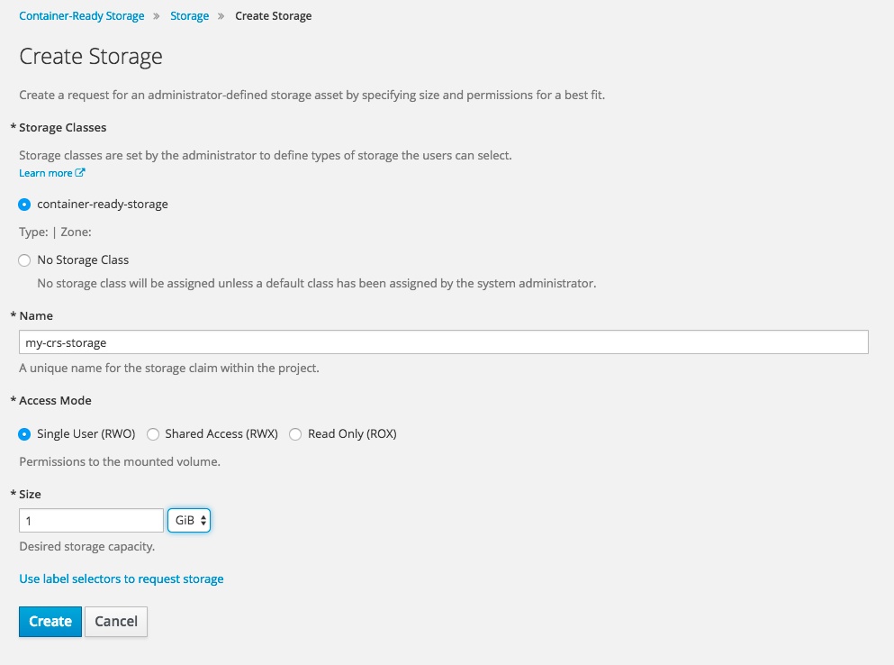

# 在OpenShift中使用GlusterFS做持久化存储

### 概述

本文由Daniel Messer（Technical Marketing Manager Storage @RedHat）和Keith Tenzer（Solutions Architect @RedHat）共同撰写。

- [Storage for Containers Overview – Part I](https://keithtenzer.com/2017/03/07/storage-for-containers-overview-part-i/)
- [Storage for Containers using Gluster – Part II](https://keithtenzer.com/2017/03/24/storage-for-containers-using-gluster-part-ii/)
- [Storage for Containers using Container Native Storage – Part III](https://keithtenzer.com/2017/03/29/storage-for-containers-using-container-native-storage-part-iii/)
- [Storage for Containers using Ceph – Part IV](https://keithtenzer.com/2017/04/07/storage-for-containers-using-ceph-rbd-part-iv/)
- [Storage for Containers using NetApp ONTAP NAS – Part V](https://keithtenzer.com/2017/04/05/storage-for-containers-using-netapp-ontap-nas-part-v/)
- [Storage for Containers using NetApp SolidFire – Part VI](https://keithtenzer.com/2017/04/05/storage-for-containers-using-netapp-solidfire-part-vi/)

### Gluster作为Container-Ready Storage(CRS)

在本文中，我们将介绍容器存储的首选以及如何部署它。 Kusternet和OpenShift支持GlusterFS已经有一段时间了。 GlusterFS的适用性很好，可用于所有的部署场景：裸机、虚拟机、内部部署和公共云。 在容器中运行GlusterFS的新特性将在本系列后面讨论。

GlusterFS是一个分布式文件系统，内置了原生协议（GlusterFS）和各种其他协议（NFS，SMB，...）。 为了与OpenShift集成，节点将通过FUSE使用原生协议，将GlusterFS卷挂在到节点本身上，然后将它们绑定到目标容器中。 OpenShift / Kubernetes具有实现请求、释放和挂载、卸载GlusterFS卷的原生程序。

### CRS概述

在存储方面，根据OpenShift / Kubernetes的要求，还有一个额外的组件管理集群，称为“heketi”。 这实际上是一个用于GlusterFS的REST API，它还提供CLI版本。 在以下步骤中，我们将在3个GlusterFS节点中部署heketi，使用它来部署GlusterFS存储池，将其连接到OpenShift，并使用它来通过PersistentVolumeClaims为容器配置存储。 我们将总共部署4台虚拟机。 一个用于OpenShift（实验室设置），另一个用于GlusterFS。

注意：您的系统应至少需要有四核CPU，16GB RAM和20 GB可用磁盘空间。

### 部署OpenShift

首先你需要先部署OpenShift。最有效率的方式是直接在虚拟机中部署一个All-in-One环境，部署指南见 [the “OpenShift Enterprise 3.4 all-in-one Lab Environment” article.](https://keithtenzer.com/2017/03/13/openshift-enterprise-3-4-all-in-one-lab-environment/)。

确保你的OpenShift虚拟机可以解析外部域名。编辑`/etc/dnsmasq.conf`文件，增加下面的Google DNS：

```ini
server=8.8.8.8
```

重启：

```bash
# systemctl restart dnsmasq
# ping -c1 google.com
```

### 部署Gluster

GlusterFS至少需要有以下配置的3台虚拟机：

- RHEL 7.3
- 2 CPUs
- 2 GB内存
- 30 GB磁盘存储给操作系统
- 10 GB磁盘存储给GlusterFS bricks

修改/etc/hosts文件，定义三台虚拟机的主机名。

例如（主机名可以根据你自己的环境自由调整）

```bash
# cat /etc/hosts
127.0.0.1      localhost localhost.localdomain localhost4 localhost4.localdomain4
::1            localhost localhost.localdomain localhost6 localhost6.localdomain6
172.16.99.144  ocp-master.lab ocp-master
172.16.128.7   crs-node1.lab crs-node1
172.16.128.8   crs-node2.lab crs-node2
172.16.128.9   crs-node3.lab crs-node3
```

**在3台GlusterFS虚拟机上都执行以下步骤**：

```bash
# subscription-manager repos --disable="*"
# subscription-manager repos --enable=rhel-7-server-rpms
```

如果你已经订阅了GlusterFS那么可以直接使用，开启`rh-gluster-3-for-rhel-7-server-rpms`的yum源。

如果你没有的话，那么可以通过EPEL使用非官方支持的GlusterFS的社区源。

```bash
# yum -y install http://dl.fedoraproject.org/pub/epel/epel-release-latest-7.noarch.rpm
# rpm --import http://dl.fedoraproject.org/pub/epel/RPM-GPG-KEY-EPEL-7
```

在`/etc/yum.repos.d/`目录下创建`glusterfs-3.10.repo`文件：

```ini
[glusterfs-3.10]
name=glusterfs-3.10
description="GlusterFS 3.10 Community Version"
baseurl=https://buildlogs.centos.org/centos/7/storage/x86_64/gluster-3.10/
gpgcheck=0
enabled=1
```

验证源已经被激活。

```bash
# yum repolist
```

现在可以开始安装GlusterFS了。

```bash
# yum -y install glusterfs-server
```

需要为GlusterFS peers打开几个基本TCP端口，以便与OpenShift进行通信并提供存储：

```bash
# firewall-cmd --add-port=24007-24008/tcp --add-port=49152-49664/tcp --add-port=2222/tcp
# firewall-cmd --runtime-to-permanent
```

现在我们可以启动GlusterFS的daemon进程了：

```bash
# systemctl enable glusterd
# systemctl start glusterd
```

完成。GlusterFS已经启动并正在运行。其他配置将通过heketi完成。

**在GlusterFS的一台虚拟机上安装heketi**

```bash
[root@crs-node1 ~]# yum -y install heketi heketi-client
```

### 更新EPEL

如果你没有Red Hat Gluster Storage订阅的话，你可以从EPEL中获取heketi。 在撰写本文时，2016年10月那时候还是3.0.0-1.el7版本，它不适用于OpenShift 3.4。 你将需要更新到更新的版本：

```bash
[root@crs-node1 ~]# yum -y install wget
[root@crs-node1 ~]# wget https://github.com/heketi/heketi/releases/download/v4.0.0/heketi-v4.0.0.linux.amd64.tar.gz
[root@crs-node1 ~]# tar -xzf heketi-v4.0.0.linux.amd64.tar.gz
[root@crs-node1 ~]# systemctl stop heketi
[root@crs-node1 ~]# cp heketi/heketi* /usr/bin/
[root@crs-node1 ~]# chown heketi:heketi /usr/bin/heketi*
```

在`/etc/systemd/system/heketi.service`中创建v4版本的heketi二进制文件的更新语法文件：

```ini
[Unit]
Description=Heketi Server

[Service]
Type=simple
WorkingDirectory=/var/lib/heketi
EnvironmentFile=-/etc/heketi/heketi.json
User=heketi
ExecStart=/usr/bin/heketi --config=/etc/heketi/heketi.json
Restart=on-failure
StandardOutput=syslog
StandardError=syslog

[Install]
WantedBy=multi-user.target
```

```bash
[root@crs-node1 ~]# systemctl daemon-reload
[root@crs-node1 ~]# systemctl start heketi
```

Heketi使用SSH来配置GlusterFS的所有节点。创建SSH密钥对，将公钥拷贝到所有3个节点上（包括你登陆的第一个节点）：

```bash
[root@crs-node1 ~]# ssh-keygen -f /etc/heketi/heketi_key -t rsa -N ''
[root@crs-node1 ~]# ssh-copy-id -i /etc/heketi/heketi_key.pub root@crs-node1.lab
[root@crs-node1 ~]# ssh-copy-id -i /etc/heketi/heketi_key.pub root@crs-node2.lab
[root@crs-node1 ~]# ssh-copy-id -i /etc/heketi/heketi_key.pub root@crs-node3.lab
[root@crs-node1 ~]# chown heketi:heketi /etc/heketi/heketi_key*
```

剩下唯一要做的事情就是配置heketi来使用SSH。 编辑`/etc/heketi/heketi.json`文件使它看起来像下面这个样子（改变的部分突出显示下划线）：

```json
{
   "_port_comment":"Heketi Server Port Number",
   "port":"8080",
   "_use_auth":"Enable JWT authorization. Please enable for deployment",
   "use_auth":false,
   "_jwt":"Private keys for access",
   "jwt":{
      "_admin":"Admin has access to all APIs",
      "admin":{
         "key":"My Secret"
      },
      "_user":"User only has access to /volumes endpoint",
      "user":{
         "key":"My Secret"
      }
   },
   "_glusterfs_comment":"GlusterFS Configuration",
   "glusterfs":{
      "_executor_comment":[
         "Execute plugin. Possible choices: mock, ssh",
         "mock: This setting is used for testing and development.",
         " It will not send commands to any node.",
         "ssh: This setting will notify Heketi to ssh to the nodes.",
         " It will need the values in sshexec to be configured.",
         "kubernetes: Communicate with GlusterFS containers over",
         " Kubernetes exec api."
      ],
      "executor":"ssh",
      "_sshexec_comment":"SSH username and private key file information",
      "sshexec":{
         "keyfile":"/etc/heketi/heketi_key",
         "user":"root",
         "port":"22",
         "fstab":"/etc/fstab"
      },
      "_kubeexec_comment":"Kubernetes configuration",
      "kubeexec":{
         "host":"https://kubernetes.host:8443",
         "cert":"/path/to/crt.file",
         "insecure":false,
         "user":"kubernetes username",
         "password":"password for kubernetes user",
         "namespace":"OpenShift project or Kubernetes namespace",
         "fstab":"Optional: Specify fstab file on node. Default is /etc/fstab"
      },
      "_db_comment":"Database file name",
      "db":"/var/lib/heketi/heketi.db",
      "_loglevel_comment":[
         "Set log level. Choices are:",
         " none, critical, error, warning, info, debug",
         "Default is warning"
      ],
      "loglevel":"debug"
   }
}
```

完成。heketi将监听8080端口，我们来确认下防火墙规则允许它监听该端口：

```bash
# firewall-cmd --add-port=8080/tcp
# firewall-cmd --runtime-to-permanent
```

重启heketi：

```bash
# systemctl enable heketi
# systemctl restart heketi
```

测试它是否在运行：

```bash
# curl http://crs-node1.lab:8080/hello
Hello from Heketi
```

很好。heketi上场的时候到了。 我们将使用它来配置我们的GlusterFS存储池。 该软件已经在我们所有的虚拟机上运行，但并未被配置。 要将其改造为满足我们需求的存储系统，需要在拓扑文件中描述我们所需的GlusterFS存储池，如下所示：

```bash
# vi topology.json
{
  "clusters": [
    {
      "nodes": [
        {
          "node": {
            "hostnames": {
              "manage": [
                "crs-node1.lab"
              ],
              "storage": [
                "172.16.128.7"
              ]
            },
            "zone": 1
          },
          "devices": [
            "/dev/sdb"
          ]
        },
        {
          "node": {
            "hostnames": {
              "manage": [
                "crs-node2.lab"
              ],
              "storage": [
                "172.16.128.8"
              ]
            },
            "zone": 1
          },
          "devices": [
            "/dev/sdb"
          ]
        },
        {
          "node": {
            "hostnames": {
              "manage": [
                "crs-node3.lab"
              ],
              "storage": [
                "172.16.128.9"
              ]
            },
            "zone": 1
          },
          "devices": [
            "/dev/sdb"
          ]
        }
      ]
    }
  ]
}
```

该文件格式比较简单，基本上是告诉heketi要创建一个3节点的集群，其中每个节点包含的配置有FQDN，IP地址以及至少一个将用作GlusterFS块的备用块设备。

现在将该文件发送给heketi：

```bash
# export HEKETI_CLI_SERVER=http://crs-node1.lab:8080
# heketi-cli topology load --json=topology.json
Creating cluster ... ID: 78cdb57aa362f5284bc95b2549bc7e7d
 Creating node crs-node1.lab ... ID: ffd7671c0083d88aeda9fd1cb40b339b
 Adding device /dev/sdb ... OK
 Creating node crs-node2.lab ... ID: 8220975c0a4479792e684584153050a9
 Adding device /dev/sdb ... OK
 Creating node crs-node3.lab ... ID: b94f14c4dbd8850f6ac589ac3b39cc8e
 Adding device /dev/sdb ... OK
```

现在heketi已经配置了3个节点的GlusterFS存储池。很简单！你现在可以看到3个虚拟机都已经成功构成了GlusterFS中的可信存储池（Trusted Stroage Pool）。

```bash
[root@crs-node1 ~]# gluster peer status
Number of Peers: 2

Hostname: crs-node2.lab
Uuid: 93b34946-9571-46a8-983c-c9f128557c0e
State: Peer in Cluster (Connected)
Other names:
crs-node2.lab

Hostname: 172.16.128.9
Uuid: e3c1f9b0-be97-42e5-beda-f70fc05f47ea
State: Peer in Cluster (Connected)
```

现在回到OpenShift！

### 将Gluster与OpenShift集成

为了集成OpenShift，需要两样东西：一个动态的Kubernetes Storage Provisioner和一个StorageClass。 Provisioner在OpenShift中开箱即用。 实际上关键的是如何将存储挂载到容器上。 StorageClass是OpenShift中的用户可以用来实现的PersistentVolumeClaims的实体，它反过来能够触发一个Provisioner实现实际的配置，并将结果表示为Kubernetes PersistentVolume（PV）。

就像OpenShift中的其他组件一样，StorageClass也简单的用YAML文件定义：

```bash
# cat crs-storageclass.yaml
kind: StorageClass
apiVersion: storage.k8s.io/v1beta1
metadata:
 name: container-ready-storage
 annotations:
 storageclass.beta.kubernetes.io/is-default-class: "true"
provisioner: kubernetes.io/glusterfs
parameters:
 resturl: "http://crs-node1.lab:8080"
 restauthenabled: "false"
```

我们的provisioner是kubernetes.io/glusterfs，将它指向我们的heketi实例。 我们将类命名为“container-ready-storage”，同时使其成为所有没有显示指定StorageClass的PersistentVolumeClaim的默认StorageClass。

为你的GlusterFS池创建StorageClass：

```bash
# oc create -f crs-storageclass.yaml
```

### 在OpenShift中使用Gluster

我们来看下如何在OpenShift中使用GlusterFS。首先在OpenShift虚拟机中创建一个测试项目。

```bash
# oc new-project crs-storage --display-name="Container-Ready Storage"
```

这会向Kubernetes/OpenShift发出storage请求，请求一个PersistentVolumeClaim（PVC）。 这是一个简单的对象，它描述最少需要多少容量和应该提供哪种访问模式（非共享，共享，只读）。 它通常是应用程序模板的一部分，但我们只需创建一个独立的PVC：

```bash
# cat crs-claim.yaml
apiVersion: v1
kind: PersistentVolumeClaim
metadata:
 name: my-crs-storage
 namespace: crs-storage
spec:
 accessModes:
 - ReadWriteOnce
 resources:
 requests:
 storage: 1Gi
```

发送该请求：

```bash
# oc create -f crs-claim.yaml
```

观察在OpenShfit中，PVC正在以动态创建volume的方式实现：

```bash
# oc get pvc
NAME             STATUS    VOLUME                                     CAPACITY   ACCESSMODES   AGE
my-crs-storage   Bound     pvc-41ad5adb-107c-11e7-afae-000c2949cce7   1Gi        RWO           58s
```

太棒了！ 你现在可以在OpenShift中使用存储容量，而不需要直接与存储系统进行任何交互。 我们来看看创建的volume：

```bash
# oc get pv/pvc-41ad5adb-107c-11e7-afae-000c2949cce7
Name:		pvc-41ad5adb-107c-11e7-afae-000c2949cce7
Labels:		
StorageClass:	container-ready-storage
Status:		Bound
Claim:		crs-storage/my-crs-storage
Reclaim Policy:	Delete
Access Modes:	RWO
Capacity:	1Gi
Message:
Source:
    Type:		Glusterfs (a Glusterfs mount on the host that shares a pod's lifetime)
    EndpointsName:	gluster-dynamic-my-crs-storage
    Path:		vol_85e444ee3bc154de084976a9aef16025
    ReadOnly:		false
```

What happened in the background was that when the PVC reached the system, our default StorageClass reached out to the GlusterFS Provisioner with the volume specs from the PVC. The provisioner in turn communicates with our heketi instance which facilitates the creation of the GlusterFS volume, which we can trace in it’s log messages:

该volume是根据PVC中的定义特别创建的。 在PVC中，我们没有明确指定要使用哪个StorageClass，因为heketi的GlusterFS StorageClass已经被定义为系统范围的默认值。

在后台发生的情况是，当PVC到达系统时，默认的StorageClass请求具有该PVC中volume声明规格的GlusterFS Provisioner。 Provisioner又与我们的heketi实例通信，这有助于创建GlusterFS volume，我们可以在其日志消息中追踪：

```bash
[root@crs-node1 ~]# journalctl -l -u heketi.service
...
Mar 24 11:25:52 crs-node1.lab heketi[2598]: [heketi] DEBUG 2017/03/24 11:25:52 /src/github.com/heketi/heketi/apps/glusterfs/volume_entry.go:298: Volume to be created on cluster e
Mar 24 11:25:52 crs-node1.lab heketi[2598]: [heketi] INFO 2017/03/24 11:25:52 Creating brick 9e791b1daa12af783c9195941fe63103
Mar 24 11:25:52 crs-node1.lab heketi[2598]: [heketi] INFO 2017/03/24 11:25:52 Creating brick 3e06af2f855bef521a95ada91680d14b
Mar 24 11:25:52 crs-node1.lab heketi[2598]: [heketi] INFO 2017/03/24 11:25:52 Creating brick e4daa240f1359071e3f7ea22618cfbab
...
Mar 24 11:25:52 crs-node1.lab heketi[2598]: [sshexec] INFO 2017/03/24 11:25:52 Creating volume vol_85e444ee3bc154de084976a9aef16025 replica 3
...
Mar 24 11:25:53 crs-node1.lab heketi[2598]: Result: volume create: vol_85e444ee3bc154de084976a9aef16025: success: please start the volume to access data
...
Mar 24 11:25:55 crs-node1.lab heketi[2598]: Result: volume start: vol_85e444ee3bc154de084976a9aef16025: success
...
Mar 24 11:25:55 crs-node1.lab heketi[2598]: [asynchttp] INFO 2017/03/24 11:25:55 Completed job c3d6c4f9fc74796f4a5262647dc790fe in 3.176522702s
...
```

成功！ 大约用了3秒钟，GlusterFS池就配置完成了，并配置了一个volume。 默认值是replica 3，这意味着数据将被复制到3个不同节点的3个块上（用GlusterFS作为后端存储）。 该过程是通过Heketi在OpenShift进行编排的。

你也可以从GlusterFS的角度看到有关volume的信息：

```bash
[root@crs-node1 ~]# gluster volume list
vol_85e444ee3bc154de084976a9aef16025
[root@crs-node1 ~]# gluster volume info vol_85e444ee3bc154de084976a9aef16025

Volume Name: vol_85e444ee3bc154de084976a9aef16025
Type: Replicate
Volume ID: a32168c8-858e-472a-b145-08c20192082b
Status: Started
Snapshot Count: 0
Number of Bricks: 1 x 3 = 3
Transport-type: tcp
Bricks:
Brick1: 172.16.128.8:/var/lib/heketi/mounts/vg_147b43f6f6903be8b23209903b7172ae/brick_9e791b1daa12af783c9195941fe63103/brick
Brick2: 172.16.128.9:/var/lib/heketi/mounts/vg_72c0f520b0c57d807be21e9c90312f85/brick_3e06af2f855bef521a95ada91680d14b/brick
Brick3: 172.16.128.7:/var/lib/heketi/mounts/vg_67314f879686de975f9b8936ae43c5c5/brick_e4daa240f1359071e3f7ea22618cfbab/brick
Options Reconfigured:
transport.address-family: inet
nfs.disable: on
```

请注意，GlusterFS中的卷名称如何对应于OpenShift中Kubernetes Persistent Volume的“路径”。

或者，你也可以使用OpenShift UI来配置存储，这样可以很方便地在系统中的所有已知的StorageClasses中进行选择：




让我们做点更有趣的事情，在OpenShift中运行工作负载。

在仍运行着crs-storage项目的OpenShift虚拟机中执行：

```bash
# oc get templates -n openshift
```

你应该可以看到一个应用程序和数据库模板列表，这个列表将方便你更轻松的使用OpenShift来部署你的应用程序项目。

我们将使用MySQL来演示如何在OpenShift上部署具有持久化和弹性存储的有状态应用程序。 Mysql-persistent模板包含一个用于MySQL数据库目录的1G空间的PVC。 为了演示目的，可以直接使用默认值。

```bash
# oc process mysql-persistent -n openshift | oc create -f -
```

等待部署完成。你可以通过UI或者命令行观察部署进度：

```bash
# oc get pods
NAME            READY     STATUS    RESTARTS   AGE
mysql-1-h4afb   1/1       Running   0          2m
```

好了。我们已经使用这个模板创建了一个service，secrets、PVC和pod。我们来使用它（你的pod名字将跟我的不同）：

```bash
# oc rsh mysql-1-h4afb
```

你已经成功的将它挂载到MySQL的pod上。我们连接一下数据库试试：

```bash
sh-4.2$ mysql -u $MYSQL_USER -p$MYSQL_PASSWORD -h $HOSTNAME $MYSQL_DATABASE
```

这点很方便，所有重要的配置，如MySQL凭据，数据库名称等都是pod模板中的环境变量的一部分，因此可以在pod中作为shell的环境变量。 我们来创建一些数据：

```bash
mysql> show databases;
+--------------------+
| Database           |
+--------------------+
| information_schema |
| sampledb           |
+--------------------+
2 rows in set (0.02 sec)

mysql> \u sampledb
Database changed
mysql> CREATE TABLE IF NOT EXISTS equipment (
    ->     equip_id int(5) NOT NULL AUTO_INCREMENT,
    ->     type varchar(50) DEFAULT NULL,
    ->     install_date DATE DEFAULT NULL,
    ->     color varchar(20) DEFAULT NULL,
    ->     working bool DEFAULT NULL,
    ->     location varchar(250) DEFAULT NULL,
    ->     PRIMARY KEY(equip_id)
    ->     );
Query OK, 0 rows affected (0.13 sec)

mysql> INSERT INTO equipment (type, install_date, color, working, location)
    -> VALUES
    -> ("Slide", Now(), "blue", 1, "Southwest Corner");
Query OK, 1 row affected, 1 warning (0.01 sec)

mysql> SELECT * FROM equipment;
+----------+-------+--------------+-------+---------+------------------+
| equip_id | type  | install_date | color | working | location         |
+----------+-------+--------------+-------+---------+------------------+
|        1 | Slide | 2017-03-24   | blue  |       1 | Southwest Corner |
+----------+-------+--------------+-------+---------+------------------+
1 row in set (0.00 sec)
```

很好，数据库运行正常。

你想看下数据存储在哪里吗？很简单！查看刚使用模板创建的mysql volume：

```bash
# oc get pvc/mysql
NAME      STATUS    VOLUME                                     CAPACITY   ACCESSMODES   AGE
mysql     Bound     pvc-a678b583-1082-11e7-afae-000c2949cce7   1Gi        RWO           11m
# oc describe pv/pvc-a678b583-1082-11e7-afae-000c2949cce7
Name:		pvc-a678b583-1082-11e7-afae-000c2949cce7
Labels:		
StorageClass:	container-ready-storage
Status:		Bound
Claim:		crs-storage/mysql
Reclaim Policy:	Delete
Access Modes:	RWO
Capacity:	1Gi
Message:
Source:
    Type:		Glusterfs (a Glusterfs mount on the host that shares a pod's lifetime)
    EndpointsName:	gluster-dynamic-mysql
    Path:		vol_6299fc74eee513119dafd43f8a438db1
    ReadOnly:		false
```

GlusterFS的volume名字是vol_6299fc74eee513119dafd43f8a438db1。回到你的GlusterFS虚拟机中，输入：

```bash
# gluster volume info vol_6299fc74eee513119dafd43f8a438db

Volume Name: vol_6299fc74eee513119dafd43f8a438db1
Type: Replicate
Volume ID: 4115918f-28f7-4d4a-b3f5-4b9afe5b391f
Status: Started
Snapshot Count: 0
Number of Bricks: 1 x 3 = 3
Transport-type: tcp
Bricks:
Brick1: 172.16.128.7:/var/lib/heketi/mounts/vg_67314f879686de975f9b8936ae43c5c5/brick_f264a47aa32be5d595f83477572becf8/brick
Brick2: 172.16.128.8:/var/lib/heketi/mounts/vg_147b43f6f6903be8b23209903b7172ae/brick_f5731fe7175cbe6e6567e013c2591343/brick
Brick3: 172.16.128.9:/var/lib/heketi/mounts/vg_72c0f520b0c57d807be21e9c90312f85/brick_ac6add804a6a467cd81cd1404841bbf1/brick
Options Reconfigured:
transport.address-family: inet
nfs.disable: on
```

你可以看到数据是如何被复制到3个GlusterFS块的。我们从中挑一个（最好挑选你刚登陆的那台虚拟机并查看目录）：

```bash
# ll /var/lib/heketi/mounts/vg_67314f879686de975f9b8936ae43c5c5/brick_f264a47aa32be5d595f83477572becf8/brick
total 180300
-rw-r-----. 2 1000070000 2001       56 Mar 24 12:11 auto.cnf
-rw-------. 2 1000070000 2001     1676 Mar 24 12:11 ca-key.pem
-rw-r--r--. 2 1000070000 2001     1075 Mar 24 12:11 ca.pem
-rw-r--r--. 2 1000070000 2001     1079 Mar 24 12:12 client-cert.pem
-rw-------. 2 1000070000 2001     1680 Mar 24 12:12 client-key.pem
-rw-r-----. 2 1000070000 2001      352 Mar 24 12:12 ib_buffer_pool
-rw-r-----. 2 1000070000 2001 12582912 Mar 24 12:20 ibdata1
-rw-r-----. 2 1000070000 2001 79691776 Mar 24 12:20 ib_logfile0
-rw-r-----. 2 1000070000 2001 79691776 Mar 24 12:11 ib_logfile1
-rw-r-----. 2 1000070000 2001 12582912 Mar 24 12:12 ibtmp1
drwxr-s---. 2 1000070000 2001     8192 Mar 24 12:12 mysql
-rw-r-----. 2 1000070000 2001        2 Mar 24 12:12 mysql-1-h4afb.pid
drwxr-s---. 2 1000070000 2001     8192 Mar 24 12:12 performance_schema
-rw-------. 2 1000070000 2001     1676 Mar 24 12:12 private_key.pem
-rw-r--r--. 2 1000070000 2001      452 Mar 24 12:12 public_key.pem
drwxr-s---. 2 1000070000 2001       62 Mar 24 12:20 sampledb
-rw-r--r--. 2 1000070000 2001     1079 Mar 24 12:11 server-cert.pem
-rw-------. 2 1000070000 2001     1676 Mar 24 12:11 server-key.pem
drwxr-s---. 2 1000070000 2001     8192 Mar 24 12:12 sys
```

你可以在这里看到MySQL数据库目录。 它使用GlusterFS作为后端存储，并作为绑定挂载给MySQL容器使用。 如果你检查OpenShift VM上的mount表，你将会看到GlusterFS的mount。

### 总结

在这里我们是在OpenShift之外创建了一个简单但功能强大的GlusterFS存储池。 该池可以独立于应用程序扩展和收缩。 该池的整个生命周期由一个简单的称为heketi的前端管理，你只需要在部署增长时进行手动干预。 对于日常配置操作，使用它的API与OpenShifts动态配置器交互，无需开发人员直接与基础架构团队进行交互。

o这就是我们如何将存储带入DevOps世界 - 无痛苦，并在OpenShift PaaS系统的开发人员工具中直接提供。

GlusterFS和OpenShift可跨越所有环境：裸机，虚拟机，私有和公共云（Azure，Google Cloud，AWS ...），确保应用程序可移植性，并避免云供应商锁定。

祝你愉快在容器中使用GlusterFS！

(c) 2017 Keith Tenzer

原文链接：https://keithtenzer.com/2017/03/24/storage-for-containers-using-gluster-part-ii/
