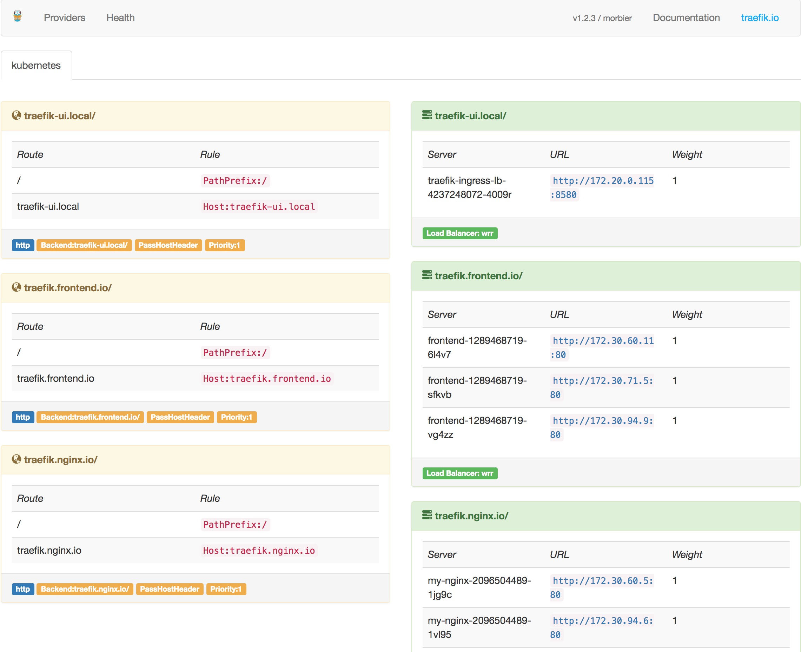
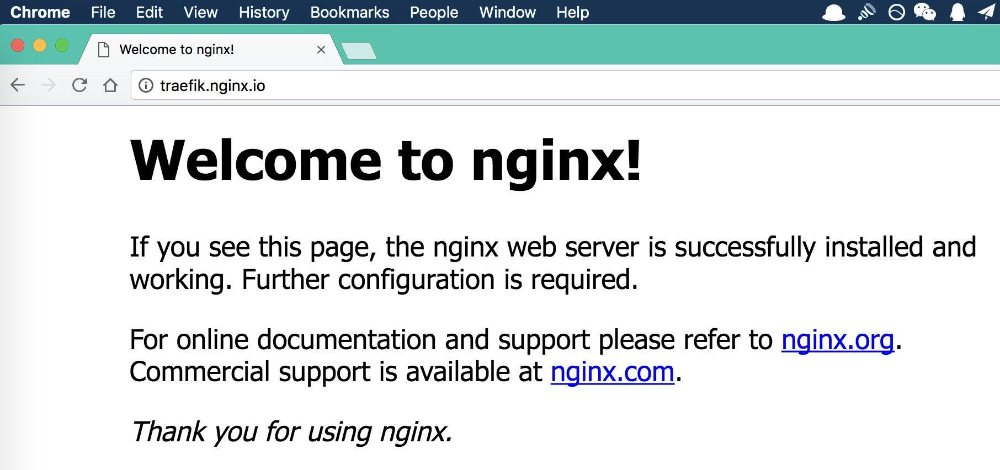
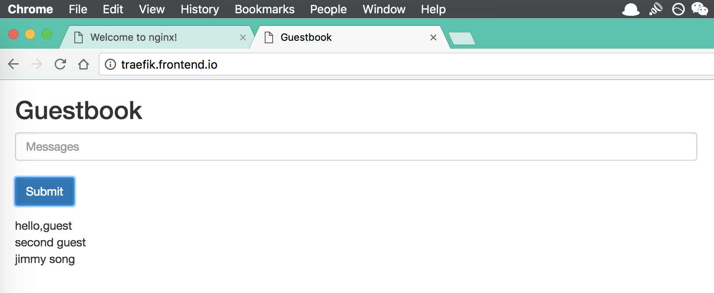

# 安装 Traefik ingress

[Traefik](https://traefik.io/) 是一款开源的反向代理与负载均衡工具。它最大的优点是能够与常见的微服务系统直接整合，可以实现自动化动态配置。目前支持 Docker, Swarm, Mesos/Marathon, Mesos, Kubernetes, Consul, Etcd, Zookeeper, BoltDB, Rest API 等等后端模型。

以下配置文件可以在 [../manifests/traefik-ingress/](https://github.com/rootsongjc/kubernetes-handbook/blob/master/manifests/traefik-ingress/) 目录下找到。

## 创建 ingress-rbac.yaml

将用于 service account 验证。

```yaml
apiVersion: v1
kind: ServiceAccount
metadata:
  name: ingress
  namespace: kube-system

---

kind: ClusterRoleBinding
apiVersion: rbac.authorization.k8s.io/v1beta1
metadata:
  name: ingress
subjects:
  - kind: ServiceAccount
    name: ingress
    namespace: kube-system
roleRef:
  kind: ClusterRole
  name: cluster-admin
  apiGroup: rbac.authorization.k8s.io
```

## 创建 Ingress

创建名为 `traefik-ingress` 的 ingress，文件名 ingress.yaml

```yaml
apiVersion: extensions/v1beta1
kind: Ingress
metadata:
  name: traefik-ingress
  namespace: default
spec:
  rules:
  - host: traefik.nginx.io
    http:
      paths:
      - path: /
        backend:
          serviceName: my-nginx
          servicePort: 80
  - host: traefik.frontend.io
    http:
      paths:
      - path: /
        backend:
          serviceName: frontend
          servicePort: 80
```

这其中的 `backend` 中要配置 default namespace 中启动的 service 名字，如果你没有配置 namespace 名字，默认使用 default namespace，如果你在其他 namespace 中创建服务想要暴露到 kubernetes 集群外部，可以创建新的 ingress.yaml 文件，同时在文件中指定该 `namespace`，其他配置与上面的文件格式相同。。`path` 就是 URL 地址后的路径，如 traefik.frontend.io/path，service 将会接受 path 这个路径，host 最好使用 service-name.filed1.filed2.domain-name 这种类似主机名称的命名方式，方便区分服务。

根据你自己环境中部署的 service 的名字和端口自行修改，有新 service 增加时，修改该文件后可以使用 `kubectl replace -f ingress.yaml` 来更新。

我们现在集群中已经有两个 service 了，一个是 nginx，另一个是官方的 `guestbook` 例子。

## 创建 DaemonSet

我们使用 DaemonSet 类型来部署 Traefik，并使用 `nodeSelector` 来限定 Traefik 所部署的主机。

```yaml
apiVersion: extensions/v1beta1
kind: DaemonSet
metadata:
  name: traefik-ingress-lb
  namespace: kube-system
  labels:
    k8s-app: traefik-ingress-lb
spec:
  template:
    metadata:
      labels:
        k8s-app: traefik-ingress-lb
        name: traefik-ingress-lb
    spec:
      terminationGracePeriodSeconds: 60
      hostNetwork: true
      restartPolicy: Always
      serviceAccountName: ingress
      containers:
      - image: traefik
        name: traefik-ingress-lb
        resources:
          limits:
            cpu: 200m
            memory: 30Mi
          requests:
            cpu: 100m
            memory: 20Mi
        ports:
        - name: http
          containerPort: 80
          hostPort: 80
        - name: admin
          containerPort: 8580
          hostPort: 8580
        args:
        - --web
        - --web.address=:8580
        - --kubernetes
      nodeSelector:
        edgenode: "true"
```

**注意**：我们使用了 `nodeSelector` 选择边缘节点来调度 traefik-ingress-lb 运行在它上面，所有你需要使用：

```ini
kubectl label nodes 172.20.0.113 edgenode=true
kubectl label nodes 172.20.0.114 edgenode=true
kubectl label nodes 172.20.0.115 edgenode=true
```

给三个 node 打标签，这样 traefik 的 pod 才会调度到这几台主机上，否则会一直处于 `pending` 状态。

关于使用 Traefik 作为边缘节点请参考[边缘节点配置](../practice/edge-node-configuration.md)。

**Traefik UI**

使用下面的 yaml 配置来创建 Traefik 的 Web UI。

```yaml
apiVersion: v1
kind: Service
metadata:
  name: traefik-web-ui
  namespace: kube-system
spec:
  selector:
    k8s-app: traefik-ingress-lb
  ports:
  - name: web
    port: 80
    targetPort: 8580
---
apiVersion: extensions/v1beta1
kind: Ingress
metadata:
  name: traefik-web-ui
  namespace: kube-system
spec:
  rules:
  - host: traefik-ui.local
    http:
      paths:
      - path: /
        backend:
          serviceName: traefik-web-ui
          servicePort: web
```

配置完成后就可以启动 treafik ingress 了。

```
kubectl create -f .
```

我查看到 traefik 的 pod 在 `172.20.0.115` 这台节点上启动了。

访问该地址 `http://172.20.0.115:8580/` 将可以看到 dashboard。



左侧黄色部分部分列出的是所有的 rule，右侧绿色部分是所有的 backend。

## 测试

在集群的任意一个节点上执行。假如现在我要访问 nginx 的 "/" 路径。

```bash
$ curl -H Host:traefik.nginx.io http://172.20.0.115/
<!DOCTYPE html>
<html>
<head>
<title>Welcome to nginx!</title>
<style>
    body {
        width: 35em;
        margin: 0 auto;
        font-family: Tahoma, Verdana, Arial, sans-serif;
    }
</style>
</head>
<body>
<h1>Welcome to nginx!</h1>
<p>If you see this page, the nginx web server is successfully installed and
working. Further configuration is required.</p>

<p>For online documentation and support please refer to
<a href="http://nginx.org/">nginx.org</a>.<br/>
Commercial support is available at
<a href="http://nginx.com/">nginx.com</a>.</p>

<p><em>Thank you for using nginx.</em></p>
</body>
</html>
```

如果你需要在 kubernetes 集群以外访问就需要设置 DNS，或者修改本机的 hosts 文件。

在其中加入：

```
172.20.0.115 traefik.nginx.io
172.20.0.115 traefik.frontend.io
```

所有访问这些地址的流量都会发送给 172.20.0.115 这台主机，就是我们启动 traefik 的主机。

Traefik 会解析 http 请求 header 里的 Host 参数将流量转发给 Ingress 配置里的相应 service。

修改 hosts 后就就可以在 kubernetes 集群外访问以上两个 service，如下图：





