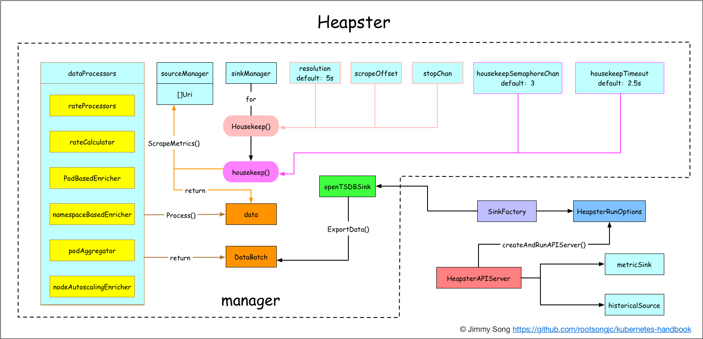

# 使用Heapster获取集群对象的metric数据

Heapster作为kubernetes安装过程中默认安装的一个插件，见[安装heapster插件](../practice/heapster-addon-installation.md)。这对于集群监控十分有用，同时在[Horizontal Pod Autoscaling](../concepts/horizontal-pod-autoscaling.md)中也用到了，HPA将Heapster作为`Resource Metrics API`，向其获取metric，做法是在`kube-controller-manager` 中配置`--api-server`指向[kube-aggregator](https://github.com/kubernetes/kube-aggregator)，也可以使用heapster来实现，通过在启动heapster的时候指定`--api-server=true`。

Heapster可以收集Node节点上的cAdvisor数据，还可以按照kubernetes的资源类型来集合资源，比如Pod、Namespace域，可以分别获取它们的CPU、内存、网络和磁盘的metric。默认的metric数据聚合时间间隔是1分钟。

## 架构

下面是Heapster架构图：



[Heapser](https://github.com/kubernetes/heapster)是用Go语言开发Kubernetes集群计算资源使用情况的数据采集工具，编译后可以直接以一个二进制文件运行，通过向heapster传递的参数来指定数据采集行为，这些数据可以选择多种sink方式，例如Graphite、influxDB、OpenTSDB、ElasticSearch、Kafka等。

## 使用案例

Heapster使用起来很简单，本身就是二进制文件，直接使用命令行启动，也可以放在容器里运行，在作为kubernetes插件运行时，我们是直接放在容器中的，见[安装heapster插件](../practice/heapster-addon-installation.md)。

### 运行

下面是heapster的启动参数：

| **Flag**                                 | **Description**                          |
| ---------------------------------------- | ---------------------------------------- |
| --allowed-users string                   | comma-separated list of allowed users    |
| --alsologtostderr                        | log to standard error as well as files   |
| --api-server                             | Enable API server for the Metrics API. If set, the Metrics API will be served on --insecure-port (internally) and --secure-port (externally). |
| --authentication-kubeconfig string       | kubeconfig file pointing at the 'core' kubernetes server with enough rights to create [tokenaccessreviews.authentication.k8s.io](http://tokenaccessreviews.authentication.k8s.io). |
| --authentication-token-webhook-cache-ttl duration | The duration to cache responses from the webhook token authenticator. (default 10s) |
| --authorization-kubeconfig string        | kubeconfig file pointing at the 'core' kubernetes server with enough rights to create  [subjectaccessreviews.authorization.k8s.io](http://subjectaccessreviews.authorization.k8s.io). |
| --authorization-webhook-cache-authorized-ttl duration | The duration to cache 'authorized' responses from the webhook authorizer. (default 10s) |
| --authorization-webhook-cache-unauthorized-ttl duration | The duration to cache 'unauthorized' responses from the webhook authorizer. (default 10s) |
| --bind-address ip                        | The IP address on which to listen for the --secure-port port. The associated interface(s) must be reachable by the rest of the cluster, and by CLI/web clients. If blank, all interfaces will be used (0.0.0.0). (default 0.0.0.0) |
| --cert-dir string                        | The directory where the TLS certs are located (by default /var/run/kubernetes). If --tls-cert-file and --tls-private-key-file are provided, this flag will be ignored. (default "/var/run/kubernetes") |
| --client-ca-file string                  | If set, any request presenting a client certificate signed by one of the authorities in the client-ca-file is authenticated with an identity corresponding to the CommonName of the client certificate. |
| --contention-profiling                   | Enable contention profiling. Requires --profiling to be set to work. |
| --disable-export                         | Disable exporting metrics in api/v1/metric-export |
| --enable-swagger-ui                      | Enables swagger ui on the apiserver at /swagger-ui |
| --heapster-port int                      | port used by the Heapster-specific APIs (default 8082) |
| --historical-source string               | which source type to use for the historical API (should be exactly the same as one of the sink URIs), or empty to disable the historical API |
| --label-seperator string                 | seperator used for joining labels (default ",") |
| --listen-ip string                       | IP to listen on, defaults to all IPs     |
| --log-backtrace-at traceLocation         | when logging hits line file:N, emit a stack trace (default :0) |
| --log-dir string                         | If non-empty, write log files in this directory |
| --log-flush-frequency duration           | Maximum number of seconds between log flushes (default 5s) |
| --logtostderr                            | log to standard error instead of files (default true) |
| --max-procs int                          | max number of CPUs that can be used simultaneously. Less than 1 for default (number of cores) |
| --metric-resolution duration             | The resolution at which heapster will retain metrics. (default 1m0s) |
| --profiling                              | Enable profiling via web interface host:port/debug/pprof/ (default true) |
| --requestheader-allowed-names stringSlice | List of client certificate common names to allow to provide usernames in headers specified by --requestheader-username-headers. If empty, any client certificate validated by the authorities in --requestheader-client-ca-file is allowed. |
| --requestheader-client-ca-file string    | Root certificate bundle to use to verify client certificates on incoming requests before trusting usernames in headers specified by --requestheader-username-headers |
| --requestheader-extra-headers-prefix stringSlice | List of request header prefixes to inspect. X-Remote-Extra- is suggested. (default [x-remote-extra-]) |
| --requestheader-group-headers stringSlice | List of request headers to inspect for groups. X-Remote-Group is suggested. (default [x-remote-group]) |
| --requestheader-username-headers stringSlice | List of request headers to inspect for usernames. X-Remote-User is common. (default [x-remote-user]) |
| --secure-port int                        | The port on which to serve HTTPS with authentication and authorization. If 0, don't serve HTTPS at all. (default 6443) |
| --sink *flags.Uris                       | external sink(s) that receive data (default []) |
| --source *flags.Uris                     | source(s) to watch (default [])          |
| --stderrthreshold severity               | logs at or above this threshold go to stderr (default 2) |
| --tls-ca-file string                     | If set, this certificate authority will used for secure access from Admission Controllers. This must be a valid PEM-encoded CA bundle. Altneratively, the certificate authority can be appended to the certificate provided by --tls-cert-file. |
| --tls-cert string                        | file containing TLS certificate          |
| --tls-cert-file string                   | File containing the default x509 Certificate for HTTPS. (CA cert, if any, concatenated after server cert). If HTTPS serving is enabled, and --tls-cert-file and --tls-private-key-file are not provided, a self-signed certificate and key are generated for the public address and saved to /var/run/kubernetes. |
| --tls-client-ca string                   | file containing TLS client CA for client cert validation |
| --tls-key string                         | file containing TLS key                  |
| --tls-private-key-file string            | File containing the default x509 private key matching --tls-cert-file. |
| --tls-sni-cert-key namedCertKey          | A pair of x509 certificate and private key file paths, optionally suffixed with a list of domain patterns which are fully qualified domain names, possibly with prefixed wildcard segments. If no domain patterns are provided, the names of the certificate are extracted. Non-wildcard matches trump over wildcard matches, explicit domain patterns trump over extracted names. For multiple key/certificate pairs, use the --tls-sni-cert-key multiple times. Examples: "example.key,example.crt" or "*.foo.com,foo.com:foo.key,foo.crt". (default []) |
| --v Level                                | log level for V logs                     |
| --version                                | print version info and exit              |
| --vmodule moduleSpec                     | comma-separated list of pattern=N settings for file-filtered logging |

**Version**

version: v1.4.0
commit: 546ab66f

### API使用

Heapster提供RESTful API接口，下面以获取`spark-cluster` namespace的memory usage为例讲解Heapster API的使用。

**构造URL地址**

https://172.20.0.113:6443/api/v1/proxy/namespaces/kube-system/services/heapster/api/v1/model/namespaces/spark-cluster/metrics/memory/usage?start=2017-10-16T09:14:00Z&end=2017-10-16T09:16:00Z

**结果**

访问该地址获取的结果是这样的：

```json
{
  "metrics": [
   {
    "timestamp": "2017-10-16T09:14:00Z",
    "value": 322592768
   },
   {
    "timestamp": "2017-10-16T09:15:00Z",
    "value": 322592768
   },
   {
    "timestamp": "2017-10-16T09:16:00Z",
    "value": 322592768
   }
  ],
  "latestTimestamp": "2017-10-16T09:16:00Z"
 }
```

注意：Heapster中查询的所有值都是以最小单位为单位，比如CPU为1milicore，内存为B。

**第一部分：Heapster API地址**

`https://172.20.0.113:6443/api/v1/proxy/namespaces/kube-system/services/heapster/`

可以使用下面的命令获取:

```bash
$ kubectl cluster-info
Heapster is running at https://172.20.0.113:6443/api/v1/proxy/namespaces/kube-system/services/heapster
...
```

**第二部分：Heapster API参数**

`/api/v1/model/namespaces/spark-cluster/metrics/memory/usage`

表示查询的是`spark-cluster` namespace中的`memory/usage`的metrics。

**第三部分：时间片**

`?start=2017-10-16T09:14:00Z&end=2017-10-16T09:16:00Z`

查询参数为时间片：包括start和end。使用`RFC-3339`时间格式，在Linux系统中可以这样获取：

```bash
$ date --rfc-3339="seconds"
2017-10-16 17:23:20+08:00
```

该时间中的空格替换成T，最后的`+08:00`替换成Z代表时区。可以只指定start时间，end时间自动设置为当前时间。

## 参考

- [kubernetes metrics](https://github.com/kubernetes/metrics)
- [Heapster metric model](https://github.com/kubernetes/heapster/blob/master/docs/model.md)
- [Heapster storage schema](https://github.com/kubernetes/heapster/blob/master/docs/storage-schema.md)