> 安全的云原生平台，始于对身份与权限的精细把控。

Kubernetes 通过多层认证、鉴权与准入控制机制，确保 API 访问安全，实现细粒度的权限管理。本文系统梳理身份验证、权限判定、服务账号、数据加密等关键环节，助力构建安全的云原生平台。

## 认证与鉴权流程概览

Kubernetes API Server 在处理每个请求时，依次经过认证、鉴权和准入控制三个阶段，确保请求的合法性与合规性。

{width=1920 height=1744}

## 用户类型与身份来源

Kubernetes 区分两类用户：

- **普通用户（Normal Users）**：由外部系统管理（如 CA、OIDC、LDAP、静态文件），不以 API 对象存在。
- **服务账号（Service Accounts）**：由 Kubernetes API 管理，绑定命名空间，供集群内部进程使用。

下图展示了用户身份来源与 API Server 的关系：

{width=1920 height=2268}

## 认证机制（Authentication）

认证用于验证请求发起者身份。Kubernetes 支持多种认证方式，可同时启用，首个认证成功即短路后续流程。

### 常见认证方式



| 方式 | 说明 |
| --- | --- |
| X.509 客户端证书 | 通过集群 CA 签发证书，CN 作为用户名，O 作为组 |
| Bearer Token | 包括静态 Token、Bootstrap Token、ServiceAccount Token、OIDC Token |
| Webhook Token | 通过外部服务校验 Token |
| Authenticating Proxy | 依赖外部代理完成认证 |



所有认证通过的用户自动加入 `system:authenticated` 组。

#### 认证流程示意

{width=1920 height=1659}

### 典型认证方式说明

- **X.509 客户端证书**：API Server 通过 `--client-ca-file` 启用，CN 作为用户名，O 作为组。
- **Bearer Token**：支持静态 Token 文件、Bootstrap Token（节点加入）、ServiceAccount Token（Pod 自动挂载）、OIDC Token（外部 IdP）。
- **Webhook Token**：委托外部服务校验 Token。
- **OpenID Connect**：集成企业 IdP，kubectl 配置 OIDC 凭证。

## 鉴权机制（Authorization）

认证通过后，鉴权决定用户对资源的操作权限。Kubernetes 支持多种鉴权模式，可组合使用，按顺序依次判定。

### 鉴权请求属性



| 属性 | 说明 |
| --- | --- |
| User | 认证用户名 |
| Group | 用户所属组 |
| Extra | 认证层附加元数据 |
| API | 是否为 API 资源请求 |
| Request path | 非资源请求路径 |
| API request verb | 资源请求动作（get、list、create 等） |
| HTTP request verb | 非资源请求动作（GET、POST 等） |
| Resource | 访问的资源类型 |
| Subresource | 访问的子资源 |
| Namespace | 命名空间 |
| API group | API 组 |



### 鉴权模式与流程

- **RBAC**（推荐）：基于角色的访问控制
- **ABAC**：基于属性的访问控制
- **Node Authorization**：专为 kubelet 设计
- **Webhook**：外部服务判定
- **AlwaysAllow/AlwaysDeny**：全部允许/拒绝（测试用）

每个鉴权器依次判定，首个明确允许/拒绝即返回结果，否则最终拒绝。

{width=1920 height=2177}

## RBAC 授权机制

RBAC（基于角色的访问控制）是 Kubernetes 推荐的权限管理方式。

### 核心对象与关系

- **Role/ClusterRole**：定义权限规则（命名空间/集群级）
- **RoleBinding/ClusterRoleBinding**：将用户/组/服务账号绑定到角色

{width=1920 height=533}

### 角色与绑定示例

- **Role/ClusterRole**：定义 apiGroups、resources、verbs 权限规则
- **RoleBinding/ClusterRoleBinding**：将用户/组/服务账号与角色关联

## 准入控制（Admission Control）

准入控制器在认证与鉴权后、对象持久化前拦截请求，分为变更型（Mutating）和校验型（Validating）两阶段。

{width=1920 height=1100}

常用准入控制器包括 PodSecurity、ResourceQuota、LimitRanger、ServiceAccount、MutatingAdmissionWebhook、ValidatingAdmissionWebhook 等。

## 服务账号认证

服务账号为 Pod 内进程提供身份：

- 可自动或手动创建
- 通过 `serviceAccountName` 字段关联 Pod
- Token 自动挂载到 Pod
- 认证用户名格式为 `system:serviceaccount:<NAMESPACE>:<SERVICEACCOUNT>`

## etcd 数据加密

Kubernetes 支持对 etcd 中敏感资源静态加密：

- 通过 EncryptionConfiguration 配置加密提供者
- API Server 启动时指定 `--encryption-provider-config`
- 新写入数据加密，旧数据需变更后加密

支持 identity、aescbc、secretbox、aesgcm、kms 等多种加密方式。

## 完整认证与鉴权流程

下图展示了用户从身份认证到资源持久化的全流程：

{width=1920 height=880}

## 最佳实践

### 认证

- 优先集成 OIDC 等强身份提供者
- 使用短周期凭证并自动轮换
- 避免生产环境使用静态 Token
- 通过 IdP 实现多因子认证
- 普通用户不建议用客户端证书

### 鉴权

- 推荐使用 RBAC
- 遵循最小权限原则
- 利用命名空间隔离资源
- 定期审计角色绑定
- 自定义资源建议用聚合 ClusterRole
- 优先用 RoleBinding 控制命名空间权限

### 服务账号

- 每个应用单独服务账号
- 仅授予必要权限
- 不需要 API 访问的 Pod 禁用自动挂载 Token
- 支持时采用第三方工作负载身份
- 定期轮换服务账号 Token

## 总结

Kubernetes 通过认证、鉴权与准入控制等多层机制，构建了健壮的 API 安全体系。合理配置这些机制，能有效保障集群资源的安全访问与合规操作。

## 参考文献

1. [Kubernetes 认证机制 - kubernetes.io](https://kubernetes.io/zh-cn/docs/reference/access-authn-authz/authentication/)
2. [Kubernetes 鉴权机制 - kubernetes.io](https://kubernetes.io/zh-cn/docs/reference/access-authn-authz/authorization/)
3. [Kubernetes Admission Controllers - kubernetes.io](https://kubernetes.io/docs/reference/access-authn-authz/admission-controllers/)
4. [Kubernetes RBAC 授权 - kubernetes.io](https://kubernetes.io/zh-cn/docs/reference/access-authn-authz/rbac/)
5. [Kubernetes 数据加密 - kubernetes.io](https://kubernetes.io/docs/tasks/administer-cluster/encrypt-data/)
