> 安全是 Kubernetes 集群稳定运行的基石，只有持续优化每一环节，才能真正守护云原生世界的边界。

Kubernetes 通过多层安全机制保护集群、资源与通信安全。本文系统梳理认证、鉴权、准入控制、数据加密等关键环节，助力构建安全的云原生基础设施。

## Kubernetes 安全架构总览

Kubernetes 安全体系由多层机制协同实现，每层针对不同安全目标提供防护能力。


{width=1920 height=1149}

## 认证（Authentication）

认证用于验证访问 API Server 的用户或服务身份，回答“你是谁？”的问题。

### 用户类型

Kubernetes 区分两类用户：

- **服务账号（Service Accounts）**：由 Kubernetes API 管理，绑定命名空间，可自动或手动创建。
- **普通用户（Normal Users）**：由外部系统管理（如 LDAP、证书、用户名密码文件），不通过 API 对象表示。

### 认证策略

Kubernetes 支持多种认证方式，可同时启用：



| 策略 | 说明 | 适用场景 |
| --- | --- | --- |
| X.509 客户端证书 | 基于 TLS 客户端证书认证 | 安全 API 访问 |
| 静态 Token 文件 | 预定义 Bearer Token 文件 | 测试/开发环境 |
| Bootstrap Token | 集群引导临时 Token | kubeadm 集群初始化 |
| Service Account Token | Pod 自动生成 Token | 集群内组件通信 |
| OpenID Connect | 外部身份提供集成 | 企业统一身份 |
| Webhook Token | 委托外部服务认证 | 定制化认证逻辑 |



多认证器并存时，首个认证成功者决定身份，API Server 不保证认证器执行顺序。

### 认证流程

下图展示了认证到数据持久化的完整流程：



{width=1920 height=1582}

## 鉴权（Authorization）

认证通过后，鉴权决定用户可对哪些资源执行哪些操作，回答“你能做什么？”的问题。

### 鉴权模式

Kubernetes 支持多种鉴权模式，可组合使用，按顺序依次检查：

- **RBAC**（推荐）：基于角色的访问控制
- **ABAC**：基于属性的访问控制
- **Node**：专为 kubelet 设计的节点鉴权
- **Webhook**：委托外部 HTTP 服务决策
- **AlwaysAllow/AlwaysDeny**：全部允许/拒绝（仅测试用）

若所有鉴权器均无明确意见，则默认拒绝请求。

### RBAC 机制

RBAC 是主流鉴权方式，核心对象包括：

- **Role**：命名空间级权限
- **ClusterRole**：集群级权限
- **RoleBinding**：将 Role 绑定到用户/组/服务账号（命名空间内）
- **ClusterRoleBinding**：将 ClusterRole 绑定到用户/组/服务账号（全局）



{width=1920 height=1317}

#### RBAC 配置示例

以下为典型 RBAC 配置：

1. 允许读取 Pod 的 Role：

    ```yaml
    apiVersion: rbac.authorization.k8s.io/v1
    kind: Role
    metadata:
      namespace: default
      name: pod-reader
    rules:
    - apiGroups: [""]
      resources: ["pods"]
      verbs: ["get", "list", "watch"]
    ```

2. 绑定该角色给用户：

    ```yaml
    apiVersion: rbac.authorization.k8s.io/v1
    kind: RoleBinding
    metadata:
      namespace: default
      name: read-pods
    subjects:
    - kind: User
      name: jane
      apiGroup: rbac.authorization.k8s.io
    roleRef:
      kind: Role
      name: pod-reader
      apiGroup: rbac.authorization.k8s.io
    ```

`roleRef` 创建后不可变更，确保权限变更可控。

## 准入控制（Admission Control）

准入控制器在认证与鉴权后、对象持久化前拦截请求，可校验或修改资源。


{width=2508 height=1193}

### 准入控制器类型

- **变更型（Mutating）**：可修改请求对象
- **校验型（Validating）**：仅校验请求，不可修改

准入流程先执行变更型，再执行校验型，任一拒绝则请求终止。

### 常用准入控制器



| 控制器 | 类型 | 作用 |
| --- | --- | --- |
| PodSecurity | 校验型 | 强制执行 Pod 安全标准 |
| ResourceQuota | 校验型 | 限制资源消耗 |
| LimitRanger | 变更型/校验型 | 设置默认资源请求/限制 |
| ServiceAccount | 变更型/校验型 | 自动化服务账号管理 |
| MutatingAdmissionWebhook | 变更型 | 调用外部 Webhook 变更资源 |
| ValidatingAdmissionWebhook | 校验型 | 调用外部 Webhook 校验资源 |
| DefaultStorageClass | 变更型 | 设置 PVC 默认存储类 |
| NodeRestriction | 校验型 | 限制 kubelet 权限 |



### 扩展准入控制

可通过 MutatingAdmissionWebhook 和 ValidatingAdmissionWebhook 实现自定义准入逻辑，增强安全策略。

## 数据加密（Data Encryption）

Kubernetes 支持对 etcd 中敏感数据进行静态加密，提升数据安全性。

### 加密配置

通过 EncryptionConfiguration 对象配置加密资源与加密提供者：

```yaml
apiVersion: apiserver.config.k8s.io/v1
kind: EncryptionConfiguration
resources:
  - resources:
      - secrets
      - configmaps
    providers:
      - aescbc:
          keys:
            - name: key1
              secret: <base64-encoded-key>
      - identity: {}
```

### 支持的加密提供者



| 提供者 | 加密方式 | 强度 | 密钥轮换 |
| --- | --- | --- | --- |
| identity | 无加密 | N/A | N/A |
| aescbc | AES-CBC | 弱（有填充攻击风险） | 手动 |
| secretbox | XSalsa20/Poly1305 | 强 | 手动 |
| aesgcm | AES-GCM | 强（需定期轮换） | 每 20 万次写入 |
| kms | 信封加密 | 最强 | 用户自控 |



### KMS 信封加密流程

KMS 提供信封加密，数据密钥（DEK）由主密钥（KEK）加密，主密钥存储于外部 KMS。



{width=1920 height=1419}

## 证书管理

Kubernetes 广泛使用 X.509 证书进行认证。CSR API 支持自动化证书签发。

### 证书签名请求（CSR）

CSR 资源用于请求指定签名者签发证书，流程如下：



{width=1920 height=1373}

### 内置签名者



| 签名者名称 | 用途 |
| --- | --- |
| kubernetes.io/kube-apiserver-client | API Server 客户端证书 |
| kubernetes.io/kube-apiserver-client-kubelet | kubelet 客户端证书 |
| kubernetes.io/kubelet-serving | kubelet 服务端证书 |
| kubernetes.io/legacy-unknown | 兼容历史用途 |



## 命名空间与安全隔离

命名空间用于隔离资源，提升安全性：

- 提供命名作用域
- 支持资源配额
- 可基于命名空间实施访问控制
- 支持网络策略隔离

RBAC 可结合命名空间实现细粒度权限控制，A 命名空间的 RoleBinding 无法授权 B 命名空间资源。

## 节点安全

节点安全聚焦于 kubelet 保护与节点到控制面的安全通信。

### 节点鉴权

Node authorizer 专为 kubelet 设计，仅授权其访问本节点及相关资源。


{width=1920 height=234}

### kubelet 认证与授权

kubelet HTTPS 接口默认无认证/鉴权，建议：

- 启用 X.509 客户端证书认证
- 启用 Node 鉴权
- 限制可访问 kubelet API 的 IP 范围

## Kubernetes 安全最佳实践

- **RBAC 最小权限原则**：仅授予必要权限，定期审计
- **启用审计日志**：合理配置审计级别，分析日志
- **保护 etcd**：开启静态加密，启用 TLS，限制访问
- **使用网络策略**：默认拒绝，显式允许流量
- **安全管理 Secret**：启用静态加密，考虑外部 Secret 管理
- **定期轮换证书**：自动化轮换，监控过期
- **强化准入控制**：启用推荐控制器，定制 Webhook
- **及时更新 Kubernetes**：定期升级，关注安全公告

## 总结

Kubernetes 通过多层防护体系实现集群安全，包括认证、鉴权、准入控制、数据加密、命名空间隔离与节点安全。合理配置与持续优化这些机制，是保障云原生环境安全的基础。

## 参考文献

1. [Kubernetes 官方安全文档 - kubernetes.io](https://kubernetes.io/zh-cn/docs/concepts/security/overview/)
2. [Kubernetes RBAC 授权 - kubernetes.io](https://kubernetes.io/zh-cn/docs/reference/access-authn-authz/rbac/)
3. [Kubernetes Admission Controllers - kubernetes.io](https://kubernetes.io/docs/reference/access-authn-authz/admission-controllers/)
4. [Kubernetes Data Encryption - kubernetes.io](https://kubernetes.io/docs/tasks/administer-cluster/encrypt-data/)
5. [Kubernetes Certificate Management - kubernetes.io](https://kubernetes.io/docs/tasks/tls/managing-tls-in-a-cluster/)
