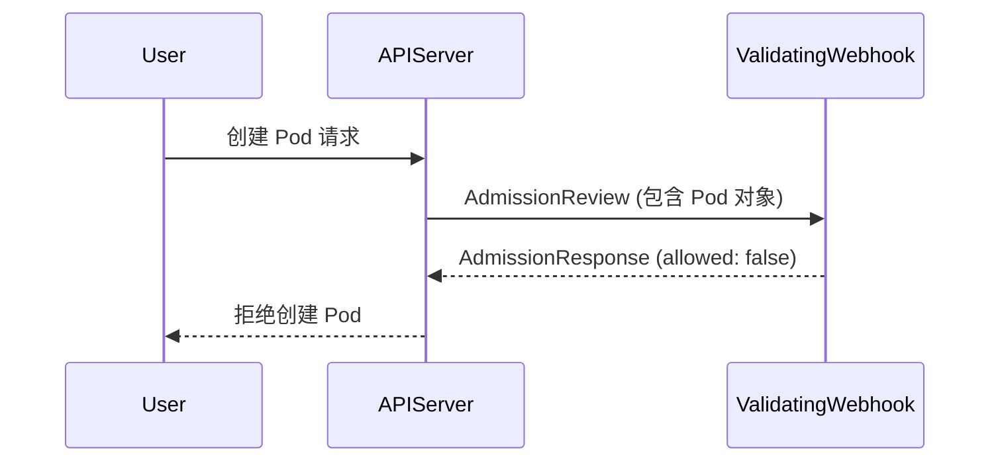

> ValidatingWebhook 是 Kubernetes 动态准入控制体系的关键机制，支持在 API 请求路径中灵活注入自定义校验逻辑，实现安全、合规与智能化的集群治理。

## 概述

在 Kubernetes 中，**ValidatingWebhook**（验证型 Webhook，参见 data/glossary.yaml）属于 *动态准入控制（Dynamic Admission Control）* 的一部分。它能在资源写入 etcd 之前介入 API Server 的请求处理流程，对对象内容进行**校验（Validation）**，并可以**拒绝不符合策略的请求**。

ValidatingWebhook 常见应用包括：

- 资源合规性校验（如命名规范、标签策略）
- 安全约束（如防止运行特权容器）
- 审计和风控（如禁止删除关键命名空间）
- 自定义策略扩展（如企业内部的 DevSecOps 检查）

## 工作机制

下图展示了 ValidatingWebhook 在 Kubernetes 请求处理流程中的位置：




{width=1920 height=903}

ValidatingWebhook 作为最终的校验层，在 MutatingWebhook 之后执行。一旦 Webhook 返回拒绝响应，API Server 将直接中止该请求并向用户返回错误信息。

## Webhook 配置结构

通过定义 ValidatingWebhookConfiguration 对象，可以注册自定义的验证逻辑。以下为典型配置示例：

```yaml
apiVersion: admissionregistration.k8s.io/v1
kind: ValidatingWebhookConfiguration
metadata:
  name: pod-policy-webhook
webhooks:
  - name: validate-pod.example.com
    admissionReviewVersions: ["v1"]
    sideEffects: None
    timeoutSeconds: 5
    clientConfig:
      service:
        name: pod-validator
        namespace: policy-system
        path: /validate
      caBundle: <base64-encoded-CA-cert>
    rules:
      - apiGroups: [""]
        apiVersions: ["v1"]
        operations: ["CREATE", "UPDATE"]
        resources: ["pods"]
    failurePolicy: Fail
```

下表对关键字段进行说明：



| 字段                        | 含义                                        |
| ------------------------- | ----------------------------------------- |
| `rules`                   | 指定作用的 API 组、版本、资源和操作类型                    |
| `failurePolicy`           | 当 Webhook 调用失败时是否拒绝请求 (`Ignore` 或 `Fail`) |
| `clientConfig`            | Webhook 服务地址及证书配置                         |
| `admissionReviewVersions` | 支持的 AdmissionReview 版本                    |
| `sideEffects`             | 声明是否会产生副作用（一般为 `None`）                    |



## Webhook 服务实现

Webhook 服务通常由一个 HTTPS 服务端实现。API Server 会发送 AdmissionReview 请求，Webhook 返回 AdmissionResponse。

以下为 Go 语言实现的最简化示例：

```go
package main

import (
  "encoding/json"
  "net/http"
  "k8s.io/api/admission/v1"
)

func handleValidate(w http.ResponseWriter, r *http.Request) {
  var review v1.AdmissionReview
  json.NewDecoder(r.Body).Decode(&review)

  // 默认允许
  allowed := true
  msg := "Validation passed"

  // 获取资源对象
  raw := review.Request.Object.Raw
  // 例如验证 Pod 是否包含禁止标签
  if string(raw) != "" && string(raw) != "{}" {
    // 示例规则：禁止带 label "debug=true"
    // 实际实现会使用 struct 解析
  }

  review.Response = &v1.AdmissionResponse{
    UID:     review.Request.UID,
    Allowed: allowed,
    Result: &metav1.Status{
      Message: msg,
    },
  }
  json.NewEncoder(w).Encode(review)
}

func main() {
  http.HandleFunc("/validate", handleValidate)
  http.ListenAndServeTLS(":443", "/certs/tls.crt", "/certs/tls.key", nil)
}
```

部署时需确保：

- 服务端口为 443
- 使用 TLS 证书
- 证书 CA 与 `caBundle` 匹配
- 与 `ValidatingWebhookConfiguration` 中的 `service` 对应

## 典型场景

ValidatingWebhook 可用于多种场景，以下为常见应用示例：

- **合规策略验证**  
  禁止在生产命名空间中创建带有 `debug=true` 标签的 Pod：

  ```yaml
  rules:
    - apiGroups: [""]
      apiVersions: ["v1"]
      operations: ["CREATE"]
      resources: ["pods"]
  ```

  Webhook 服务验证逻辑：

  ```go
  if pod.Namespace == "prod" && pod.Labels["debug"] == "true" {
    return deny("debug pod not allowed in prod")
  }
  ```

- **镜像安全扫描**  
  在资源创建时验证镜像是否来自受信任仓库：

  ```go
  if !strings.HasPrefix(container.Image, "registry.example.com/") {
    return deny("untrusted image registry")
  }
  ```

- **动态资源约束**  
  动态检查创建的 PVC 大小、Pod 数量是否超出配额范围。

## 动态策略演进与 Gatekeeper 对比

下表对比 ValidatingWebhook 与 OPA Gatekeeper 的主要特性：



| 功能点    | ValidatingWebhook | OPA Gatekeeper |
| ------ | ----------------- | -------------- |
| 策略表达方式 | 自定义代码（Go/Python）  | Rego 声明式策略     |
| 灵活性    | 极高                | 中等             |
| 易用性    | 较复杂               | 易于使用           |
| 性能     | 高度可控              | 依赖 OPA 引擎性能    |
| 典型用途   | 企业自研策略控制、特定业务逻辑   | 通用策略与合规控制      |



在实际生产环境中，两者常结合使用：**ValidatingWebhook 实现动态逻辑**，**Gatekeeper 管理通用策略模板**。

## 最佳实践

- 轻量与高可用：部署多副本、使用 readinessProbe。
- 合理超时：`timeoutSeconds` 建议 ≤ 5 秒。
- 最小化副作用：仅验证，不修改。
- 安全通信：使用 mTLS、最小权限 ServiceAccount。
- 可观测性：记录审计日志与验证结果。

## 总结

ValidatingWebhook 是实现 Kubernetes 动态策略控制的关键机制。它将安全与治理逻辑注入到集群 API 流程中，使平台具备动态自适应能力。结合 MutatingWebhook、OPA Gatekeeper 与 Policy Controller，可形成完整的策略闭环，实现“声明即合规”的自动化治理体系。

## 参考文献

1. [Kubernetes 官方文档：Validating Admission Webhooks - kubernetes.io](https://kubernetes.io/docs/reference/access-authn-authz/extensible-admission-controllers/)
2. [Gatekeeper Policy Controller - github.com](https://github.com/open-policy-agent/gatekeeper)
3. [CNCF Policy Working Group - github.com](https://github.com/cncf/tag-security/tree/main/policy)
4. [Kyverno - Kubernetes Policy Engine - kyverno.io](https://kyverno.io/)
