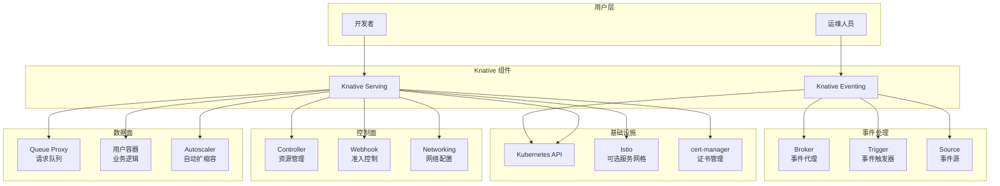
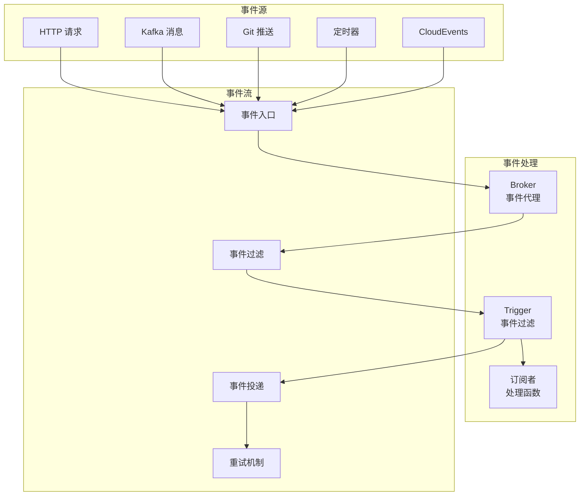

> Knative 为 Kubernetes 提供了完整的 Serverless 能力，涵盖自动扩缩容、流量管理和事件驱动等核心特性，是企业构建云原生 Serverless 应用的首选平台。

## Knative 简介

Knative 是 Google 发起的开源项目，是 Kubernetes 上的 Serverless 平台。它提供了两个核心组件：**Serving** 和 **Eventing**，为容器化应用提供了完整的 Serverless 体验。

### 核心特性

Knative 具备以下主要特性：

- **自动扩缩容**：从 0 到 N 的智能扩缩容
- **基于请求的路由**：流量分割和金丝雀部署
- **事件驱动**：统一的事件处理模型
- **标准兼容**：支持 CloudEvents 标准
- **Kubernetes 原生**：完全基于 Kubernetes API

## Knative 架构

下图展示了 Knative 的整体架构及各核心组件关系。




{width=2941 height=720}

## Knative Serving

Knative Serving 负责 Serverless 应用的部署、流量管理和自动扩缩容。以下介绍其核心概念和常用配置。

### 核心概念

Knative Serving 主要包含 Service、Configuration、Revision 和 Route 四类核心资源，分别负责应用生命周期、配置、版本和流量管理。

#### Service（服务）

Service 是部署和管理 Serverless 应用的最高层抽象：

```yaml
apiVersion: serving.knative.dev/v1
kind: Service
metadata:
  name: hello-world
spec:
  template:
    spec:
      containers:
      - image: gcr.io/knative-samples/helloworld-go
        env:
        - name: TARGET
          value: "Go Sample v1"
```

#### Configuration（配置）

Configuration 定义了应用的期望状态：

```yaml
apiVersion: serving.knative.dev/v1
kind: Configuration
metadata:
  name: hello-world
spec:
  template:
    spec:
      containers:
      - image: gcr.io/knative-samples/helloworld-go
```

#### Revision（版本）

Revision 是应用的一个不可变快照：

```yaml
apiVersion: serving.knative.dev/v1
kind: Revision
metadata:
  name: hello-world-abcde
  labels:
    serving.knative.dev/service: hello-world
spec:
  containers:
  - image: gcr.io/knative-samples/helloworld-go
```

#### Route（路由）

Route 管理流量的路由规则：

```yaml
apiVersion: serving.knative.dev/v1
kind: Route
metadata:
  name: hello-world
spec:
  traffic:
  - percent: 100
    revisionName: hello-world-abcde
```

### 流量管理

Knative Serving 支持多种流量管理策略，包括金丝雀部署和基于标签的路由。

#### 金丝雀部署

通过 traffic 字段实现多版本流量分配，支持灰度发布。

```yaml
apiVersion: serving.knative.dev/v1
kind: Route
metadata:
  name: hello-world
spec:
  traffic:
  - percent: 90
    revisionName: hello-world-v1
  - percent: 10
    revisionName: hello-world-v2
  - tag: latest
    revisionName: hello-world-v2
```

#### 基于标签的路由

可为不同版本分配标签，实现 A/B 测试或多环境路由。

```yaml
apiVersion: serving.knative.dev/v1
kind: Route
metadata:
  name: hello-world
spec:
  traffic:
  - tag: stable
    percent: 100
    revisionName: hello-world-v1
  - tag: canary
    percent: 0
    revisionName: hello-world-v2
```

### 自动扩缩容

Knative Serving 提供原生自动扩缩容能力，支持多维度配置和多种扩缩容策略。

#### KPA (Knative Pod Autoscaler)

KPA 是 Knative 的原生自动扩缩容器，支持多维度配置。

```yaml
apiVersion: serving.knative.dev/v1
kind: Service
metadata:
  name: hello-world
spec:
  template:
    metadata:
      annotations:
        autoscaling.knative.dev/minScale: "0"
        autoscaling.knative.dev/maxScale: "10"
        autoscaling.knative.dev/target: "100"
    spec:
      containers:
      - image: gcr.io/knative-samples/helloworld-go
```

#### 配置参数

下表汇总了常用扩缩容参数及其含义。



| 参数 | 描述 | 默认值 |
|------|------|--------|
| `autoscaling.knative.dev/minScale` | 最小实例数 | 0 |
| `autoscaling.knative.dev/maxScale` | 最大实例数 | 无限制 |
| `autoscaling.knative.dev/target` | 目标并发数 | 100 |
| `autoscaling.knative.dev/metric` | 扩缩容指标 | concurrency |



## Knative Eventing

Knative Eventing 提供事件驱动架构，支持多种事件源和灵活的事件路由。

### 事件驱动架构

下图展示了 Knative Eventing 的事件流转与核心组件。




{width=1920 height=2064}

### 核心组件

Knative Eventing 主要包含 Broker、Trigger 和 Source 三类核心资源。

#### Broker（事件代理）

Broker 是事件的中央集线器：

```yaml
apiVersion: eventing.knative.dev/v1
kind: Broker
metadata:
  name: default
  namespace: default
```

#### Trigger（触发器）

Trigger 定义了如何过滤和路由事件：

```yaml
apiVersion: eventing.knative.dev/v1
kind: Trigger
metadata:
  name: hello-world-trigger
spec:
  broker: default
  filter:
    attributes:
      type: dev.knative.samples.helloworld
  subscriber:
    ref:
      apiVersion: serving.knative.dev/v1
      kind: Service
      name: hello-world
```

#### Source（事件源）

Source 定义了如何从外部系统获取事件：

```yaml
apiVersion: sources.knative.dev/v1
kind: PingSource
metadata:
  name: test-ping-source
spec:
  schedule: "*/2 * * * *"
  data: '{"message": "Hello world!"}'
  sink:
    ref:
      apiVersion: serving.knative.dev/v1
      kind: Service
      name: event-display
```

### CloudEvents 标准

Knative Eventing 完全兼容 CloudEvents 规范，便于事件互操作。

```json
{
  "specversion": "1.0",
  "type": "com.example.someevent",
  "source": "/mycontext",
  "subject": "myresource",
  "id": "1234-1234-1234",
  "time": "2020-09-23T12:28:22.457Z",
  "datacontenttype": "application/json",
  "data": {
    "message": "Hello CloudEvents!"
  }
}
```

## 安装和配置

Knative 支持多种安装方式，推荐使用 YAML 或 Operator。

### 使用 YAML 安装

```bash
# 安装 Knative Serving
kubectl apply -f https://github.com/knative/serving/releases/latest/download/serving-crds.yaml
kubectl apply -f https://github.com/knative/serving/releases/latest/download/serving-core.yaml

# 安装 Knative Eventing
kubectl apply -f https://github.com/knative/eventing/releases/latest/download/eventing-crds.yaml
kubectl apply -f https://github.com/knative/eventing/releases/latest/download/eventing-core.yaml

# 安装网络层 (Istio)
kubectl apply -f https://github.com/knative/net-istio/releases/latest/download/net-istio.yaml
```

### 使用 Operator 安装

```yaml
apiVersion: v1
kind: Namespace
metadata:
  name: knative-serving

---
apiVersion: operator.knative.dev/v1beta1
kind: KnativeServing
metadata:
  name: knative-serving
  namespace: knative-serving
spec:
  version: "1.10.0"
  ingress:
    istio:
      enabled: true
  configs:
  - name: network
    data:
      ingress.class: "istio.ingress.networking.knative.dev"
```

## 监控和调试

Knative 提供丰富的监控和调试能力，便于运维和故障排查。

### 查看服务状态

```bash
# 查看 Knative 服务
kubectl get ksvc

# 查看 Pod 状态
kubectl get pods -n knative-serving

# 查看事件
kubectl get events -n knative-serving
```

### 日志调试

```bash
# 查看 activator 日志
kubectl logs -n knative-serving deployment/activator

# 查看 controller 日志
kubectl logs -n knative-serving deployment/controller

# 查看 autoscaler 日志
kubectl logs -n knative-serving deployment/autoscaler
```

### 性能监控

可通过 Prometheus ServiceMonitor 收集关键指标。

```yaml
# Prometheus 监控配置
apiVersion: monitoring.coreos.com/v1
kind: ServiceMonitor
metadata:
  name: knative-serving
  namespace: monitoring
spec:
  selector:
    matchLabels:
      app.kubernetes.io/name: knative-serving
  endpoints:
  - port: http-metrics
    path: /metrics
    interval: 30s
```

## 最佳实践

合理配置资源、优化启动时间和网络，有助于提升系统稳定性和效率。

### 应用配置优化

1. **资源限制**

   ```yaml
   spec:
     template:
       spec:
         containers:
         - resources:
             requests:
               cpu: 100m
               memory: 128Mi
             limits:
               cpu: 500m
               memory: 512Mi
   ```

2. **启动时间优化**

   ```yaml
   metadata:
     annotations:
       autoscaling.knative.dev/minScale: "0"
       autoscaling.knative.dev/maxScale: "10"
       autoscaling.knative.dev/targetBurstCapacity: "200"
   ```

### 网络配置

1. **域名配置**

   ```yaml
   apiVersion: v1
   kind: ConfigMap
   metadata:
     name: config-domain
     namespace: knative-serving
   data:
     example.com: ""
   ```

2. **TLS 配置**

   ```yaml
   apiVersion: networking.internal.knative.dev/v1alpha1
   kind: Certificate
   metadata:
     name: example-tls
     namespace: default
   spec:
     dnsNames:
     - example.com
     secretName: example-tls
   ```

## 故障排除

常见问题及调试技巧，帮助快速定位和解决问题。

### 常见问题

1. **服务无法启动**

   ```bash
   # 检查 Revision 状态
   kubectl get revision

   # 查看 Pod 事件
   kubectl describe pod <pod-name>
   ```

2. **流量无法路由**

   ```bash
   # 检查 Route 状态
   kubectl get route

   # 查看网络配置
   kubectl get gateway -n istio-system
   ```

3. **扩缩容不工作**

   ```bash
   # 检查 autoscaler 日志
   kubectl logs -n knative-serving deployment/autoscaler

   # 验证指标
   kubectl get metric
   ```

## 总结

Knative 为 Kubernetes 提供了完整的 Serverless 体验：

- **Serving** 组件提供自动扩缩容、流量管理等核心 Serverless 功能
- **Eventing** 组件实现事件驱动架构，支持多种事件源和处理模式
- **标准兼容** 确保与 CloudEvents 及其他 Serverless 平台的互操作性

通过 Knative，企业可以在 Kubernetes 上构建和管理 Serverless 应用，享受弹性伸缩、按需付费等优势，同时保持对底层基础设施的控制。

## 参考文献

1. [Knative 官方文档 - knative.dev](https://knative.dev/)
2. [Kubernetes 官方文档 - kubernetes.io](https://kubernetes.io/)
3. [CloudEvents 官方文档 - cloudevents.io](https://cloudevents.io/)
4. [Knative Eventing 源码 - github.com/knative/eventing](https://github.com/knative/eventing)
