> 本文系统梳理了如何利用 Kubernetes 原生能力实现 Serverless 模式，涵盖 HPA、KEDA、Job、CronJob 及事件驱动等典型场景，帮助你在无需专用 Serverless 平台的情况下，构建高弹性、自动化的云原生工作负载。

## Kubernetes 原生 Serverless 模式

Kubernetes 虽非为 Serverless 场景而生，但凭借其强大的控制器和扩展机制，已能实现许多 Serverless 的核心特性。本章将详细介绍如何通过 Kubernetes 原生功能构建 Serverless 工作负载，并结合最佳实践进行总结。

## HPA：自动扩缩容控制器

HPA（Horizontal Pod Autoscaler）是 Kubernetes 内置的自动扩缩容控制器，能够根据资源利用率或自定义指标自动调整 Pod 副本数量，实现弹性伸缩。



{width=1920 height=1552}

### 基于 CPU 的扩缩容

以下示例展示如何基于 CPU 利用率自动扩缩容：

```yaml
apiVersion: autoscaling/v2
kind: HorizontalPodAutoscaler
metadata:
  name: cpu-based-hpa
  namespace: default
spec:
  scaleTargetRef:
    apiVersion: apps/v1
    kind: Deployment
    name: my-app
  minReplicas: 1
  maxReplicas: 10
  metrics:
  - type: Resource
    resource:
      name: cpu
      target:
        type: Utilization
        averageUtilization: 70
  behavior:
    scaleDown:
      stabilizationWindowSeconds: 300
      policies:
      - type: Percent
        value: 50
        periodSeconds: 60
    scaleUp:
      stabilizationWindowSeconds: 0
      policies:
      - type: Percent
        value: 100
        periodSeconds: 60
      - type: Pods
        value: 4
        periodSeconds: 60
      selectPolicy: Max
```

### 基于内存与多指标扩缩容

支持多指标联合决策：

```yaml
apiVersion: autoscaling/v2
kind: HorizontalPodAutoscaler
metadata:
  name: memory-based-hpa
spec:
  scaleTargetRef:
    apiVersion: apps/v1
    kind: Deployment
    name: memory-intensive-app
  minReplicas: 1
  maxReplicas: 20
  metrics:
  - type: Resource
    resource:
      name: memory
      target:
        type: Utilization
        averageUtilization: 80
  - type: Resource
    resource:
      name: cpu
      target:
        type: Utilization
        averageUtilization: 60
```

### 基于自定义指标扩缩容

可结合业务指标实现更智能的弹性：

```yaml
apiVersion: autoscaling/v2
kind: HorizontalPodAutoscaler
metadata:
  name: custom-metrics-hpa
spec:
  scaleTargetRef:
    apiVersion: apps/v1
    kind: Deployment
    name: queue-consumer
  minReplicas: 1
  maxReplicas: 50
  metrics:
  - type: Pods
    pods:
      metric:
        name: queue_depth
      target:
        type: AverageValue
        averageValue: "10"
  - type: Object
    object:
      metric:
        name: requests_per_second
      describedObject:
        apiVersion: networking.k8s.io/v1
        kind: Ingress
        name: main-ingress
      target:
        type: Value
        value: "100"
```

## KEDA：事件驱动自动扩缩容

KEDA（Kubernetes Event-driven Autoscaling）是基于事件的自动扩缩容解决方案，支持 50+ 种事件源，能实现 Pod 从 0 到 N 的弹性伸缩。



{width=1920 height=1453}

### KEDA 安装与配置

使用 Helm 快速安装 KEDA：

```bash
helm repo add kedacore https://kedacore.github.io/charts
helm repo update

helm install keda kedacore/keda \
  --namespace keda-system \
  --create-namespace \
  --wait
```

### Kafka 事件驱动扩缩容示例

```yaml
apiVersion: keda.sh/v1alpha1
kind: ScaledObject
metadata:
  name: kafka-consumer-scaler
  namespace: default
spec:
  scaleTargetRef:
    name: kafka-consumer
  pollingInterval: 30
  cooldownPeriod: 300
  minReplicaCount: 0
  maxReplicaCount: 100
  triggers:
  - type: kafka
    metadata:
      bootstrapServers: kafka-cluster.kafka.svc.cluster.local:9092
      consumerGroup: my-consumer-group
      topic: orders
      lagThreshold: '10'
      offsetResetPolicy: latest
  advanced:
    horizontalPodAutoscalerConfig:
      behavior:
        scaleDown:
          stabilizationWindowSeconds: 300
          policies:
          - type: Percent
            value: 50
            periodSeconds: 60
```

### 其他事件源与定时扩缩容

KEDA 支持 RabbitMQ、Cron、HTTP、Redis 等多种事件源，配置方式类似。

## Job 与 CronJob：批处理与定时任务

Kubernetes Job 适用于一次性任务，CronJob 用于周期性任务。结合 KEDA 可实现事件驱动的批处理。

### Job 示例

```yaml
apiVersion: batch/v1
kind: Job
metadata:
  name: data-processor-job
  namespace: serverless
spec:
  parallelism: 1
  completions: 1
  activeDeadlineSeconds: 300
  backoffLimit: 3
  template:
    spec:
      containers:
      - name: processor
        image: data-processor:latest
        command: ["python", "process.py"]
        args: ["--input", "$(INPUT_DATA)", "--output", "$(OUTPUT_BUCKET)"]
        env:
        - name: INPUT_DATA
          value: "s3://input-bucket/data.json"
        - name: OUTPUT_BUCKET
          value: "s3://output-bucket/"
        resources:
          requests:
            cpu: 500m
            memory: 1Gi
          limits:
            cpu: 2000m
            memory: 4Gi
      restartPolicy: Never
```

### CronJob 示例

```yaml
apiVersion: batch/v1
kind: CronJob
metadata:
  name: daily-report-generator
  namespace: serverless
spec:
  schedule: "0 2 * * *"
  jobTemplate:
    spec:
      template:
        spec:
          containers:
          - name: report-generator
            image: report-generator:latest
            command: ["python", "generate_report.py"]
            env:
            - name: DB_HOST
              value: "postgres.serverless.svc.cluster.local"
            - name: REPORT_DATE
              value: "$(date +%Y-%m-%d)"
            - name: OUTPUT_PATH
              value: "/reports/$(date +%Y-%m-%d).pdf"
            volumeMounts:
            - name: reports-volume
              mountPath: /reports
          volumes:
          - name: reports-volume
            persistentVolumeClaim:
              claimName: reports-pvc
          restartPolicy: OnFailure
  successfulJobsHistoryLimit: 3
  failedJobsHistoryLimit: 1
```

### 事件驱动 Job（ScaledJob）

结合 KEDA ScaledJob，实现事件触发的批处理：

```yaml
apiVersion: keda.sh/v1alpha1
kind: ScaledJob
metadata:
  name: event-driven-processor
  namespace: serverless
spec:
  jobTargetRef:
    parallelism: 1
    completions: 1
    activeDeadlineSeconds: 600
    backoffLimit: 3
    template:
      spec:
        containers:
        - name: processor
          image: event-processor:latest
          command: ["python", "process_events.py"]
        restartPolicy: Never
  pollingInterval: 30
  successfulJobsHistoryLimit: 5
  failedJobsHistoryLimit: 5
  maxReplicaCount: 10
  triggers:
  - type: kafka
    metadata:
      bootstrapServers: kafka-cluster.kafka.svc.cluster.local:9092
      consumerGroup: processor-group
      topic: events
      lagThreshold: '100'
```

## 工作队列与异步处理模式

通过 Redis、RabbitMQ 等队列结合 KEDA，实现事件驱动的异步消费。

```yaml
# 生产者 Deployment
apiVersion: apps/v1
kind: Deployment
metadata:
  name: job-producer
spec:
  replicas: 1
  template:
    spec:
      containers:
      - name: producer
        image: job-producer:latest
        env:
        - name: REDIS_URL
          value: "redis://redis.serverless.svc.cluster.local:6379"

---
# 消费者 Deployment + KEDA
apiVersion: keda.sh/v1alpha1
kind: ScaledObject
metadata:
  name: redis-consumer-scaler
spec:
  scaleTargetRef:
    name: job-consumer
  minReplicaCount: 0
  maxReplicaCount: 20
  triggers:
  - type: redis-lists
    metadata:
      address: redis.serverless.svc.cluster.local:6379
      listName: job-queue
      listLength: "5"
    authenticationRef:
      name: redis-auth
      kind: Secret

---
# 消费者 Deployment
apiVersion: apps/v1
kind: Deployment
metadata:
  name: job-consumer
spec:
  template:
    spec:
      containers:
      - name: consumer
        image: job-consumer:latest
        env:
        - name: REDIS_URL
          value: "redis://redis.serverless.svc.cluster.local:6379"
        - name: QUEUE_NAME
          value: "job-queue"
```

## Serverless 存储模式

Serverless 工作负载常用临时存储（emptyDir）或外部对象存储（如 MinIO、S3）实现数据持久化。

### 临时存储卷示例

```yaml
apiVersion: apps/v1
kind: Deployment
metadata:
  name: temp-storage-app
spec:
  template:
    spec:
      containers:
      - name: app
        image: temp-storage-app:latest
        volumeMounts:
        - name: temp-volume
          mountPath: /tmp/data
      volumes:
      - name: temp-volume
        emptyDir: {}
```

### 对象存储集成示例

```yaml
apiVersion: apps/v1
kind: Deployment
metadata:
  name: object-storage-app
spec:
  template:
    spec:
      containers:
      - name: app
        image: object-storage-app:latest
        env:
        - name: S3_ENDPOINT
          value: "https://minio.serverless.svc.cluster.local"
        - name: S3_ACCESS_KEY
          valueFrom:
            secretKeyRef:
              name: minio-secret
              key: access-key
        - name: S3_SECRET_KEY
          valueFrom:
            secretKeyRef:
              name: minio-secret
              key: secret-key
```

## 监控与调试

为保障 Serverless 工作负载的稳定性，需关注 HPA、KEDA、Job 等对象的状态与事件。

```bash
# HPA 状态与事件
kubectl get hpa
kubectl describe hpa <hpa-name>
kubectl get events --field-selector involvedObject.kind=HorizontalPodAutoscaler

# KEDA ScaledObject 状态
kubectl get scaledobject
kubectl describe scaledobject <name>
kubectl get metrics

# Job 状态与日志
kubectl get jobs
kubectl describe job <job-name>
kubectl logs job/<job-name>
```

## 最佳实践

在实际生产环境中，建议遵循以下优化建议：

### HPA 配置优化

- 选择合适的指标（如请求延迟优于 CPU）
- 设置合理的副本上下限，避免冷启动和资源浪费
- 优化扩缩容行为，防止抖动

### KEDA 配置优化

- 针对业务场景选择合适的事件源和阈值
- 合理设置 pollingInterval、cooldownPeriod 等参数
- 充分利用 scale-to-zero 降低成本

### Job/CronJob 优化

- 合理配置资源请求与限制
- 设置 backoffLimit、activeDeadlineSeconds 等容错参数
- 配置 ttlSecondsAfterFinished 自动清理历史任务

### 成本优化建议

- 精确设置 requests/limits，提升资源利用率
- 利用抢占式节点降低成本
- 结合 KEDA 自动休眠，空闲时缩容到 0

## 总结

Kubernetes 原生 Serverless 模式通过 HPA、KEDA、Job/CronJob 及事件驱动等机制，已能满足大部分弹性伸缩和自动化处理需求。虽然功能不及专用 Serverless 平台丰富，但对于大多数云原生场景而言，已是轻量、灵活且易于集成的选择。
