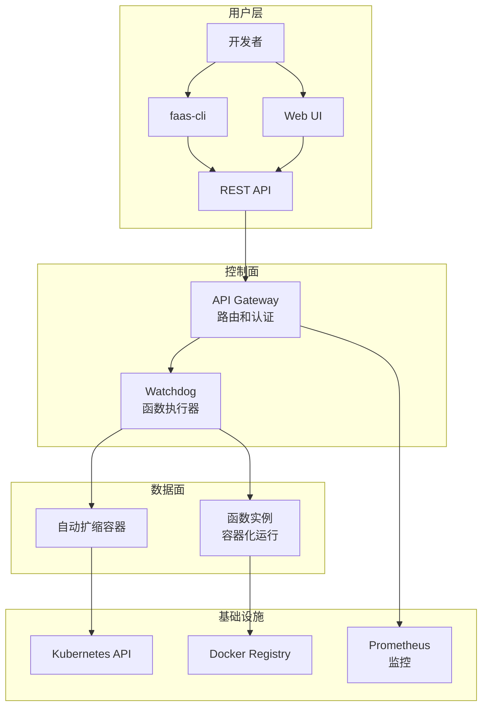

> OpenFaaS 为 Kubernetes 提供了简单易用的 Serverless 平台，支持多语言、自动扩缩容和丰富的监控集成，极大提升了函数开发与运维效率。

## OpenFaaS 简介

OpenFaaS（Functions as a Service）是一个轻量级 Serverless 框架，使开发者能够将几乎任何程序打包为容器化函数，并通过 HTTP API 调用。它提供了简单易用的 CLI 工具和 Web UI，支持多种编程语言和部署方式。

### 核心特性

OpenFaaS 具备以下主要特性：

- **多语言支持**：支持 Node.js、Python、Go、Java、C# 等多种语言
- **简单部署**：通过 Docker 镜像或源码一键部署
- **自动扩缩容**：基于请求量自动扩缩容
- **Web UI**：友好的图形界面进行函数管理
- **CLI 工具**：强大的命令行工具 faas-cli
- **监控集成**：内置 Prometheus 监控支持

## OpenFaaS 架构

下图展示了 OpenFaaS 的整体架构及各组件关系。




{width=1920 height=3651}

### 组件说明

- **API Gateway**：处理 HTTP 请求路由、认证和限流
- **Watchdog**：执行函数的轻量级进程，负责函数生命周期管理
- **faas-cli**：命令行工具，用于函数开发、构建和部署
- **Web UI**：图形界面，用于函数管理和监控

## 安装 OpenFaaS

OpenFaaS 支持多种安装方式，推荐使用 Helm 或 arkade 工具。

### 使用 Helm 安装

以下命令演示如何通过 Helm 安装 OpenFaaS：

```bash
# 添加 OpenFaaS Helm 仓库
helm repo add openfaas https://openfaas.github.io/faas-netes/
helm repo update

# 创建命名空间
kubectl create namespace openfaas

# 安装 OpenFaaS
helm upgrade --install openfaas openfaas/openfaas \
  --namespace openfaas \
  --set functionNamespace=openfaas-fn \
  --set operator.create=true \
  --set generateBasicAuth=true
```

### 获取访问凭据

安装完成后，可通过以下命令获取管理员密码并访问 Web UI：

```bash
# 获取管理员密码
echo $(kubectl -n openfaas get secret basic-auth -o jsonpath="{.data.basic-auth-password}" | base64 --decode)

# 端口转发访问 UI
kubectl port-forward -n openfaas svc/gateway 8080:8080

# 浏览器访问 http://localhost:8080
```

### 使用 arkade 快速安装

arkade 提供一键安装体验：

```bash
# 使用 arkade 安装（推荐）
arkade install openfaas

# 获取密码
arkade openfaas password
```

## 函数开发和部署

OpenFaaS 支持多语言函数开发，提供丰富的模板和便捷的部署流程。

### 创建第一个函数

以下为创建 Python 函数的完整流程：

```bash
# 安装 faas-cli
curl -SLsf https://cli.openfaas.com | sudo sh

# 创建新函数
faas-cli new hello-world --lang python3

# 查看生成的代码结构
tree hello-world/
```

### 函数模板

OpenFaaS 提供多种语言模板，便于快速开发：

```bash
# 查看可用模板
faas-cli template pull
faas-cli template store list

# 使用特定模板
faas-cli new my-function --lang go
faas-cli new my-function --lang node
faas-cli new my-function --lang python3
```

### 函数代码示例

以下分别为 Python 和 Go 语言的函数示例。

#### Python 函数

```python
import json

def handle(req):
    """处理函数请求"""
    try:
        # 解析输入
        data = json.loads(req)

        # 业务逻辑
        result = {
            "message": f"Hello {data.get('name', 'World')}!",
            "timestamp": data.get('timestamp'),
            "processed": True
        }

        return json.dumps(result)

    except Exception as e:
        return json.dumps({
            "error": str(e),
            "status": "error"
        })
```

#### Go 函数

```go
package function

import (
    "encoding/json"
    "fmt"
)

// Handle a serverless request
func Handle(req []byte) string {
    var data map[string]interface{}

    if err := json.Unmarshal(req, &data); err != nil {
        return fmt.Sprintf("Error parsing JSON: %s", err.Error())
    }

    name := "World"
    if n, ok := data["name"].(string); ok {
        name = n
    }

    response := map[string]interface{}{
        "message": fmt.Sprintf("Hello %s!", name),
        "processed": true,
    }

    responseBytes, _ := json.Marshal(response)
    return string(responseBytes)
}
```

### 部署函数

函数部署通过 stack.yml 配置文件完成，支持多种参数设置。

```yaml
# stack.yml - 函数部署配置
version: 1.0
provider:
  name: openfaas
  gateway: http://127.0.0.1:8080
functions:
  hello-world:
    lang: python3
    handler: ./hello-world
    image: hello-world:latest
    environment:
      write_debug: true
    labels:
      com.openfaas.scale.min: "1"
      com.openfaas.scale.max: "10"
```

```bash
# 构建和推送函数
faas-cli build -f stack.yml
faas-cli push -f stack.yml

# 部署函数
faas-cli deploy -f stack.yml

# 查看函数状态
faas-cli list
```

## 函数配置

OpenFaaS 支持灵活的扩缩容、环境变量和网络配置。

### 扩缩容配置

通过 labels 字段可灵活配置扩缩容策略：

```yaml
functions:
  my-function:
    lang: python3
    handler: ./function
    image: my-function:latest
    labels:
      # 最小实例数
      com.openfaas.scale.min: "1"
      # 最大实例数
      com.openfaas.scale.max: "20"
      # 扩缩容因子
      com.openfaas.scale.factor: "20"
      # 扩缩容阈值
      com.openfaas.scale.threshold: "50"
      # 扩缩容类型
      com.openfaas.scale.type: "cpu"
```

### 环境变量配置

可通过 environment 字段注入数据库、缓存、API 等配置信息：

```yaml
functions:
  api-handler:
    lang: go
    handler: ./handler
    image: api-handler:latest
    environment:
      # 数据库配置
      DB_HOST: "postgres.openfaas.svc.cluster.local"
      DB_PORT: "5432"
      DB_NAME: "myapp"
      # 缓存配置
      REDIS_URL: "redis://redis.openfaas.svc.cluster.local:6379"
      # 外部 API
      WEATHER_API_KEY: "your-api-key"
    secrets:
      - db-password
      - api-secret
```

### 网络配置

支持自定义路由、认证和域名等网络参数：

```yaml
functions:
  web-api:
    lang: node
    handler: ./api
    image: web-api:latest
    # 自定义路由
    annotations:
      # 路由注解
      nginx.ingress.kubernetes.io/rewrite-target: /
      nginx.ingress.kubernetes.io/ssl-redirect: "true"
      # 认证注解
      faas.net/basic-auth: "true"
      # 自定义域名
      faas.net/host: "api.example.com"
```

## 监控和日志

OpenFaaS 默认集成 Prometheus 监控，支持多种日志采集方式。

### Prometheus 集成

通过端口转发可访问 Prometheus 控制台：

```bash
# 查看监控指标
kubectl port-forward -n openfaas svc/prometheus 9090:9090

# 浏览器访问 http://localhost:9090
```

### 关键指标

常用监控指标包括：

- **函数调用次数**：`gateway_function_invocation_total`
- **函数执行时间**：`gateway_functions_seconds`
- **函数实例数**：`gateway_service_count`
- **队列长度**：`gateway_async_queue_length`

### 日志查看

可通过 faas-cli 或 kubectl 查看函数和网关日志：

```bash
# 查看函数日志
faas-cli logs my-function

# 查看网关日志
kubectl logs -n openfaas deployment/gateway

# 查看特定 Pod 日志
kubectl logs -n openfaas-fn deployment/my-function
```

## 高级特性

OpenFaaS 支持异步函数、函数链式调用和自定义模板等高级能力。

### 异步函数

通过注解可启用异步模式和回调：

```yaml
functions:
  async-processor:
    lang: python3
    handler: ./processor
    image: async-processor:latest
    annotations:
      # 启用异步模式
      faas.net/async: "true"
      # 回调 URL
      faas.net/callback: "http://callback.example.com/webhook"
```

### 函数链式调用

可通过 faas-flow 实现函数工作流编排：

```yaml
# 使用 faas-flow 创建函数工作流
version: 1.0
provider:
  name: openfaas
  gateway: http://127.0.0.1:8080

functions:
  data-validator:
    lang: go
    handler: ./validator
    image: data-validator:latest

  data-processor:
    lang: python3
    handler: ./processor
    image: data-processor:latest

  result-store:
    lang: node
    handler: ./store
    image: result-store:latest
```

### 自定义模板

支持自定义函数模板，满足特殊开发需求：

```bash
# 创建自定义模板
faas-cli template pull https://github.com/myorg/my-templates

# 使用自定义模板
faas-cli new my-custom-function --lang custom-lang
```

## 安全配置

OpenFaaS 支持多维度安全配置，包括认证、网络安全和密钥管理。

### 认证和授权

可通过注解启用基本认证和函数级别权限控制：

```yaml
# 启用基本认证
provider:
  name: openfaas
  gateway: http://127.0.0.1:8080

# 函数级认证
functions:
  secure-api:
    lang: go
    handler: ./api
    image: secure-api:latest
    annotations:
      faas.net/basic-auth: "true"
```

### 网络安全

支持 Service Mesh 集成和 mTLS 加密：

```yaml
# Service Mesh 集成
functions:
  secure-service:
    lang: go
    handler: ./service
    image: secure-service:latest
    annotations:
      # Istio 注入
      sidecar.istio.io/inject: "true"
      # mTLS
      security.istio.io/tlsMode: "istio"
```

### 密钥管理

可通过 Kubernetes Secret 管理敏感信息：

```yaml
# Kubernetes Secret 集成
functions:
  db-service:
    lang: python3
    handler: ./db
    image: db-service:latest
    secrets:
      - db-credentials
      - api-keys
```

## 故障排除

常见问题及调试技巧，帮助快速定位和解决问题。

### 常见问题

1. **函数部署失败**

   ```bash
   # 检查构建日志
   faas-cli build -f stack.yml --verbose

   # 检查镜像构建
   docker images | grep function-name

   # 检查 Kubernetes 事件
   kubectl get events -n openfaas-fn
   ```

2. **函数无法调用**

   ```bash
   # 检查网关状态
   kubectl get pods -n openfaas

   # 测试函数调用
   curl -X POST http://gateway.openfaas:8080/function/function-name \
     -H "Content-Type: application/json" \
     -d '{"test": "data"}'
   ```

3. **扩缩容异常**

   ```bash
   # 检查扩缩容配置
   kubectl describe deployment function-name -n openfaas-fn

   # 查看监控指标
   kubectl port-forward -n openfaas svc/prometheus 9090:9090
   ```

### 调试技巧

1. **启用调试模式**

   ```yaml
   provider:
     name: openfaas
     gateway: http://127.0.0.1:8080

   functions:
     debug-function:
       lang: python3
       handler: ./function
       image: debug-function:latest
       environment:
         write_debug: true
         debug: true
   ```

2. **使用 faas-cli 调试**

   ```bash
   # 本地测试函数
   faas-cli local-run

   # 查看函数信息
   faas-cli describe function-name
   ```

3. **网络调试**

   ```bash
   # 检查网络策略
   kubectl get networkpolicies -n openfaas

   # 测试服务发现
   kubectl run test-pod --image=busybox -it --rm -- nslookup function-name.openfaas
   ```

## 最佳实践

合理的函数设计和运维策略有助于提升系统稳定性和开发效率。

### 开发最佳实践

- **函数设计原则**
  - 单一职责：每个函数只做一件事情
  - 无状态设计：避免在函数中存储状态
  - 快速启动：优化冷启动时间
  - 错误处理：完善的错误处理和日志记录

- **性能优化**

  ```python
  # 使用连接池
  import redis
  pool = redis.ConnectionPool(host='redis', port=6379, db=0)

  def handle(req):
      r = redis.Redis(connection_pool=pool)
      # 使用连接池避免重复连接
  ```

- **资源管理**

  ```yaml
  functions:
    optimized-function:
      lang: python3
      handler: ./function
      image: optimized-function:latest
      limits:
        cpu: 100m
        memory: 128Mi
      requests:
        cpu: 50m
        memory: 64Mi
  ```

### 运维最佳实践

- **监控告警**

  ```yaml
  # Prometheus 告警规则
  groups:
  - name: openfaas
    rules:
    - alert: FunctionHighErrorRate
      expr: rate(gateway_function_invocation_total{code!="200"}[5m]) / rate(gateway_function_invocation_total[5m]) > 0.1
      for: 5m
      labels:
        severity: warning
  ```

- **日志聚合**

  ```yaml
  # Fluentd 配置
  <source>
    @type tail
    path /var/log/faas/*/*.log
    tag openfaas.functions
  </source>
  ```

- **备份和恢复**

  ```bash
  # 备份函数配置
  faas-cli list --format json > functions-backup.json

  # 备份数据
  kubectl get secrets -n openfaas -o yaml > secrets-backup.yaml
  ```

## 总结

OpenFaaS 为 Kubernetes 提供了一个简单而强大的 Serverless 平台：

- **简单易用**：通过 faas-cli 和 Web UI 简化函数开发和部署
- **多语言支持**：支持多种编程语言和自定义模板
- **自动扩缩容**：基于请求量的智能扩缩容
- **监控集成**：内置 Prometheus 和 Grafana 支持

通过 OpenFaaS，开发者可以专注于业务逻辑的实现，而无需关心底层基础设施的管理。这使得快速原型开发和微服务构建变得更加简单和高效。

## 参考文献

1. [OpenFaaS 官方文档 - openfaas.com](https://www.openfaas.com/)
2. [Kubernetes 官方文档 - kubernetes.io](https://kubernetes.io/)
3. [Prometheus 官方文档 - prometheus.io](https://prometheus.io/)
4. [faas-netes 项目 - github.com/openfaas/faas-netes](https://github.com/openfaas/faas-netes)

