> Serverless 架构推动了云原生应用的敏捷开发与弹性扩缩容，Kubernetes 生态下的 Serverless 方案兼具事件驱动、自动扩缩容和高效资源利用等优势，适用于多种业务场景。

## Serverless 概念演进

Serverless 架构是云计算发展的重要阶段，通过抽象底层基础设施，开发者可以专注于业务逻辑实现。在 Kubernetes 生态中，Serverless 不仅是一种架构模式，更是一套完整的生态系统，涵盖事件驱动、自动扩缩容等能力。

### 从传统架构到 Serverless

下图展示了从物理服务器到 Serverless 的演进过程及抽象层次提升。


{width=1920 height=637}

### Serverless 的核心特征

Serverless 具备以下核心特性：

- **无服务器管理**：开发者无需关心服务器采购、配置和维护，平台自动处理基础设施生命周期。
- **自动扩缩容**：根据实际负载自动调整资源，支持从零到数千实例的弹性伸缩。
- **按需付费**：基于实际使用量计费，显著降低闲置资源成本。
- **事件驱动**：通过事件触发函数执行，支持多种事件源和处理模式。

## Kubernetes 中的 Serverless 生态

Kubernetes 生态下的 Serverless 方案分为多个技术层次，涵盖函数、框架、原生能力和基础设施。

### 技术栈层次

下图展示了 Serverless 技术栈的分层结构及各组件关系。



{width=1920 height=1102}

### 框架对比

下表对比了主流 Serverless 框架的特性，便于选择合适方案。



| 特性         | Knative           | OpenFaaS         | Kubernetes 原生   |
|--------------|-------------------|------------------|-------------------|
| 复杂度       | 高                | 中               | 低                |
| 功能完整性   | 企业级 Serverless 平台 | 轻量级 FaaS   | 基础组件           |
| 学习曲线     | 陡峭              | 中等             | 平缓              |
| 定制化       | 高                | 中               | 高                |
| 生产就绪     | 是                | 是               | 是                |
| 社区活跃度   | 高                | 中               | 很高              |



## Serverless 架构的核心组件

Serverless 架构由函数运行时、事件驱动架构和自动扩缩容系统等核心组件构成。

### 函数运行时（Function Runtime）

函数运行时负责函数的生命周期管理和性能优化。


{width=1920 height=1199}

#### 冷启动问题与解决方案

冷启动是 Serverless 性能的主要挑战。以下为 Knative 冷启动优化配置示例：

```yaml
# Knative 冷启动优化配置
apiVersion: serving.knative.dev/v1
kind: Service
metadata:
  name: optimized-service
spec:
  template:
    metadata:
      annotations:
        autoscaling.knative.dev/minScale: "1"
        autoscaling.knative.dev/targetBurstCapacity: "200"
    spec:
      containers:
      - image: my-service:latest
        resources:
          requests:
            memory: "128Mi"
            cpu: "100m"
```

### 事件驱动架构（Event-Driven Architecture）

事件驱动架构通过多种事件源触发函数执行，实现高效解耦。


{width=1920 height=2272}

#### CloudEvents 标准

CloudEvents 是 Serverless 事件的标准格式，便于事件互操作。

```json
{
  "specversion": "1.0",
  "type": "com.example.order.created",
  "source": "/orders",
  "subject": "order-12345",
  "id": "1234567890",
  "time": "2023-10-19T10:30:00Z",
  "datacontenttype": "application/json",
  "data": {
    "orderId": "12345",
    "customerId": "67890",
    "amount": 99.99,
    "items": [
      {"productId": "widget-1", "quantity": 2}
    ]
  }
}
```

### 自动扩缩容系统（Auto-scaling）

自动扩缩容系统根据多种指标动态调整资源，提升弹性与效率。



{width=1920 height=1890}

#### HPA vs KEDA

下表对比了 HPA 与 KEDA 的主要区别和适用场景。



| 特性         | HPA                         | KEDA                       |
|--------------|-----------------------------|----------------------------|
| 指标类型     | 资源指标（CPU/内存）、自定义指标 | 50+ 事件源、外部指标      |
| 最小实例数   | 1                           | 0（scale-to-zero）         |
| 触发条件     | 基于负载阈值                | 基于事件频率               |
| 适用场景     | Web 服务扩缩容              | 事件驱动处理               |
| 配置复杂度   | 中等                        | 中等                       |



## Serverless 与微服务的融合

Serverless 与微服务架构各有优势，合理集成可提升系统灵活性和可维护性。

### 架构对比

下图对比了微服务与 Serverless 架构的主要结构和关键区别。


{width=1920 height=1310}

### 集成策略

- **渐进式迁移**：从单体应用重构，将无状态服务迁移到 Serverless，通过 API 网关统一入口。
- **混合部署**：有状态服务保持在传统容器，无状态逻辑迁移到函数，利用服务网格实现统一治理。

## 性能优化策略

Serverless 性能优化主要聚焦于冷启动和资源配置。

### 冷启动优化

下图展示了冷启动时间的组成及优化策略。


{width=1920 height=756}

### 资源配置优化

合理配置资源有助于提升性能并降低成本。以下为最佳实践配置示例：

```yaml
apiVersion: serving.knative.dev/v1
kind: Service
metadata:
  name: optimized-service
spec:
  template:
    metadata:
      annotations:
        autoscaling.knative.dev/minScale: "0"
        autoscaling.knative.dev/maxScale: "100"
        autoscaling.knative.dev/target: "10"
        autoscaling.knative.dev/targetBurstCapacity: "50"
        autoscaling.knative.dev/scaleDownDelay: "0s"
    spec:
      containers:
      - image: optimized-image:latest
        resources:
          requests:
            memory: "128Mi"
            cpu: "100m"
          limits:
            memory: "512Mi"
            cpu: "500m"
        startupProbe:
          httpGet:
            path: /health
            port: 8080
          initialDelaySeconds: 5
          periodSeconds: 3
```

## 安全架构

Serverless 架构需关注代码、运行时、数据等多维度安全挑战。

### Serverless 安全挑战与防护

下图总结了 Serverless 的主要安全挑战及对应防护措施。



{width=1920 height=624}

### 零信任模型

通过网络策略实现函数级别的隔离和最小权限访问。

```yaml
apiVersion: networking.k8s.io/v1
kind: NetworkPolicy
metadata:
  name: function-isolation
spec:
  podSelector:
    matchLabels:
      serving.knative.dev/service: my-function
  policyTypes:
  - Ingress
  - Egress
  ingress:
  - from:
    - namespaceSelector:
        matchLabels:
          name: ingress-gateway
    ports:
    - protocol: TCP
      port: 8080
  egress:
  - to:
    - podSelector:
        matchLabels:
          app: database
    ports:
    - protocol: TCP
      port: 5432
```

## 成本效益分析

Serverless 架构通过弹性计费和自动优化，显著提升资源利用率。

### 成本模型对比

下图对比了传统容器与 Serverless 的成本结构及优化策略。



{width=1920 height=461}

### 成本优化实践

- **合理配置资源**：

  ```yaml
  resources:
    requests:
      memory: "128Mi"  # 避免过度配置
      cpu: "100m"
    limits:
      memory: "256Mi"  # 设置合理上限
      cpu: "200m"
  ```

- **优化函数设计**：减少包大小、使用连接池、实现智能缓存。
- **监控和调整**：持续监控成本指标，根据使用模式调整配置，定期审查和优化。

## 行业应用案例

Serverless 架构已在电商、实时数据处理等领域广泛落地。

### 案例 1：电商平台订单处理

下图展示了电商平台订单处理流程及 Serverless 实现方式。



{width=2029 height=1132}

### 案例 2：实时数据处理

下图展示了实时数据处理的 Serverless 架构流程。



{width=1920 height=1463}

## 总结

Kubernetes Serverless 架构代表了容器编排平台的最新发展方向，具备弹性伸缩、事件驱动、成本优化和开发效率等核心优势。选择 Serverless 方案时，应结合应用特性、团队技能和组织需求，权衡传统容器与 Serverless 的适用场景，实现架构升级与业务创新。

## 参考文献

1. [Kubernetes 官方文档 - kubernetes.io](https://kubernetes.io/)
2. [Knative 官方文档 - knative.dev](https://knative.dev/)
3. [OpenFaaS 官方文档 - openfaas.com](https://www.openfaas.com/)
4. [KEDA 官方文档 - keda.sh](https://keda.sh/)
