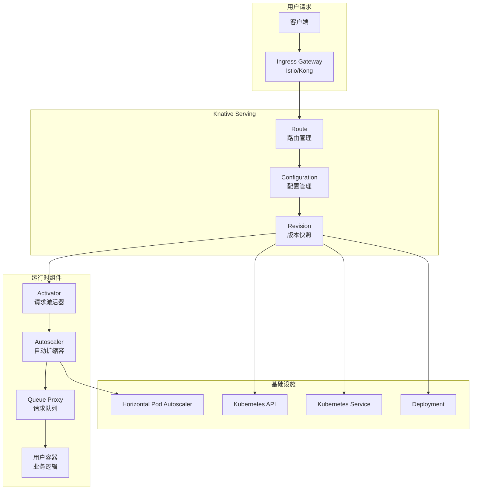
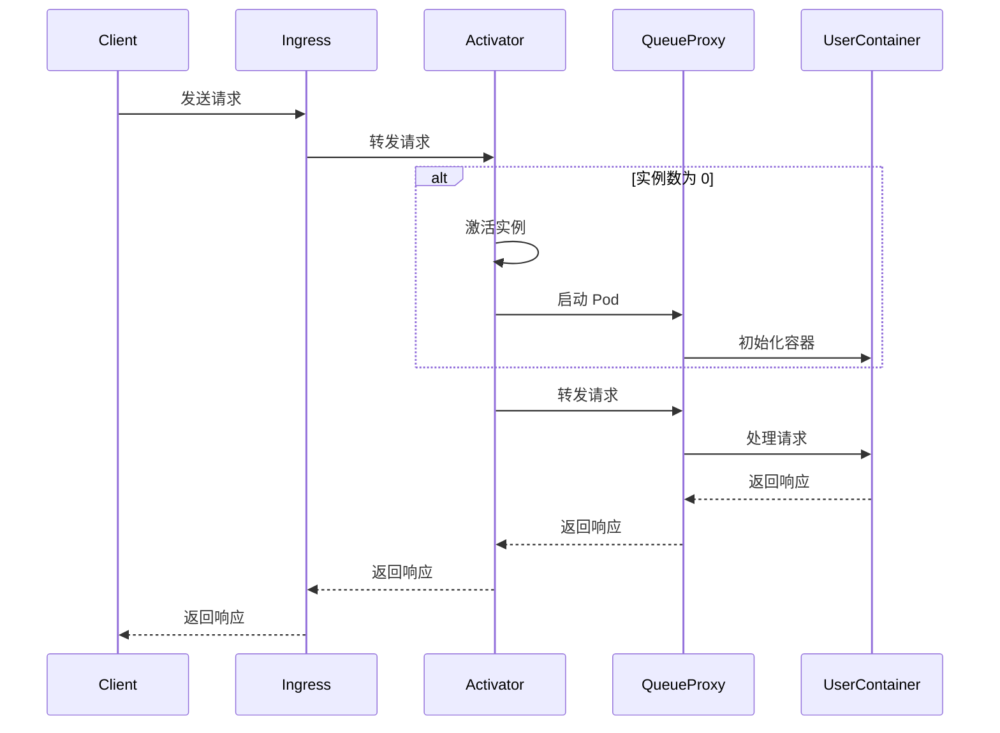

> Knative Serving 为 Kubernetes 上的 Serverless 应用提供了自动扩缩容、流量管理和版本控制等能力，极大简化了云原生应用的部署与运维。

## Knative Serving 概述

Knative Serving 是 Knative 的核心组件之一，提供 Serverless 应用的部署、路由和自动扩缩容功能。它构建在 Kubernetes 之上，为容器化应用带来完整的 Serverless 体验。

## 核心架构

下图展示了 Knative Serving 的核心架构及各组件关系。




{width=1920 height=2558}

## 核心资源

Knative Serving 主要包含 Service、Configuration、Revision 和 Route 四类核心资源，分别负责应用生命周期、配置、版本和流量管理。

### Service（服务）

Service 是最顶层的抽象，封装了应用的完整生命周期。以下为 Service 资源示例：

```yaml
apiVersion: serving.knative.dev/v1
kind: Service
metadata:
  name: hello-world
  namespace: default
spec:
  template:
    metadata:
      annotations:
        # 自动扩缩容配置
        autoscaling.knative.dev/minScale: "0"
        autoscaling.knative.dev/maxScale: "10"
        autoscaling.knative.dev/target: "100"
        # 流量配置
        traffic.knative.dev/latestRevision: "true"
    spec:
      containers:
      - image: gcr.io/knative-samples/helloworld-go:latest
        env:
        - name: TARGET
          value: "Knative!"
        ports:
        - containerPort: 8080
        resources:
          requests:
            cpu: 100m
            memory: 128Mi
          limits:
            cpu: 500m
            memory: 512Mi
```

### Configuration（配置）

Configuration 定义了应用的期望状态，每次变更都会生成新的 Revision。

```yaml
apiVersion: serving.knative.dev/v1
kind: Configuration
metadata:
  name: hello-world
  namespace: default
spec:
  template:
    metadata:
      name: hello-world-v1
    spec:
      containers:
      - image: gcr.io/knative-samples/helloworld-go:v1
        env:
        - name: TARGET
          value: "Version 1"
```

### Revision（版本）

Revision 是应用的不可变快照，支持版本回滚和多版本并存。

```yaml
apiVersion: serving.knative.dev/v1
kind: Revision
metadata:
  name: hello-world-v1-abcde
  namespace: default
  labels:
    serving.knative.dev/service: hello-world
    serving.knative.dev/configuration: hello-world
spec:
  containers:
  - image: gcr.io/knative-samples/helloworld-go:v1
    env:
    - name: TARGET
      value: "Version 1"
    resources:
      requests:
        cpu: 100m
        memory: 128Mi
  timeoutSeconds: 300
  concurrency: 100
```

### Route（路由）

Route 管理流量路由规则，支持金丝雀部署和标签路由。

```yaml
apiVersion: serving.knative.dev/v1
kind: Route
metadata:
  name: hello-world
  namespace: default
spec:
  traffic:
  # 主流量：90% 流向稳定版本
  - percent: 90
    revisionName: hello-world-v1-abcde
    tag: stable

  # 金丝雀流量：10% 流向新版本
  - percent: 10
    revisionName: hello-world-v2-fghij
    tag: canary

  # 标签路由：latest 标签指向最新版本
  - tag: latest
    revisionName: hello-world-v2-fghij
```

## 流量管理

Knative Serving 支持多种流量管理策略，包括金丝雀部署、标签路由和自定义域名。

### 金丝雀部署

通过 traffic 字段实现多版本流量分配，支持灰度发布。

```yaml
apiVersion: serving.knative.dev/v1
kind: Route
metadata:
  name: hello-world
spec:
  traffic:
  - percent: 95
    revisionName: hello-world-v1
  - percent: 5
    revisionName: hello-world-v2
  - tag: latest
    revisionName: hello-world-v2
```

### 基于标签的路由

可为不同版本分配标签，实现 A/B 测试或多环境路由。

```yaml
apiVersion: serving.knative.dev/v1
kind: Route
metadata:
  name: hello-world
spec:
  traffic:
  - tag: production
    percent: 100
    revisionName: hello-world-v1
  - tag: staging
    percent: 0
    revisionName: hello-world-v2
```

### 域名和路径路由

支持自定义域名和路径，灵活适配业务需求。

```yaml
apiVersion: serving.knative.dev/v1
kind: Route
metadata:
  name: my-app
spec:
  traffic:
  - percent: 100
    revisionName: my-app-v1
    # 自定义域名
    url:
      domain: my-app.example.com
      path: /api/v1
```

## 自动扩缩容

Knative Serving 提供原生自动扩缩容能力，支持多维度配置和多种扩缩容策略。

### KPA (Knative Pod Autoscaler)

KPA 是 Knative 的原生自动扩缩容器，支持多维度配置。

```yaml
apiVersion: serving.knative.dev/v1
kind: Service
metadata:
  name: hello-world
spec:
  template:
    metadata:
      annotations:
        # 扩缩容配置
        autoscaling.knative.dev/minScale: "0"          # 最小实例数
        autoscaling.knative.dev/maxScale: "100"        # 最大实例数
        autoscaling.knative.dev/target: "100"          # 目标并发数
        autoscaling.knative.dev/targetUtilizationPercentage: "70"  # 目标利用率
        # 扩缩容行为
        autoscaling.knative.dev/scaleDownDelay: "0s"   # 缩容延迟
        autoscaling.knative.dev/scaleUpDelay: "0s"     # 扩容延迟
        autoscaling.knative.dev/window: "60s"          # 观察窗口
        # 突发流量处理
        autoscaling.knative.dev/targetBurstCapacity: "200"  # 突发容量
        autoscaling.knative.dev/panicThresholdPercentage: "200"  # 恐慌阈值
    spec:
      containers:
      - image: gcr.io/knative-samples/helloworld-go
```

### 扩缩容指标

Knative 支持多种扩缩容指标，满足不同业务场景。

#### 并发度（Concurrency）

基于并发请求数的扩缩容：

```yaml
metadata:
  annotations:
    autoscaling.knative.dev/metric: "concurrency"
    autoscaling.knative.dev/target: "100"  # 每个 Pod 处理 100 个并发请求
```

#### RPS (Requests Per Second)

基于每秒请求数的扩缩容：

```yaml
metadata:
  annotations:
    autoscaling.knative.dev/metric: "rps"
    autoscaling.knative.dev/target: "100"  # 每个 Pod 处理 100 RPS
```

#### CPU 利用率

基于 CPU 使用率的扩缩容：

```yaml
metadata:
  annotations:
    autoscaling.knative.dev/metric: "cpu"
    autoscaling.knative.dev/targetUtilizationPercentage: "70"  # 目标 CPU 利用率 70%
```

## 运行时行为

Knative Serving 的请求处理流程涉及多组件协作，支持冷启动优化。

### 请求处理流程

下图展示了请求从入口到业务容器的完整流转过程。




{width=1920 height=1393}

### 冷启动优化

通过合理配置可显著降低冷启动延迟。

1. **预热实例**

   ```yaml
   annotations:
     autoscaling.knative.dev/minScale: "1"  # 保持至少 1 个实例
   ```

2. **突发容量**

   ```yaml
   annotations:
     autoscaling.knative.dev/targetBurstCapacity: "200"  # 允许突发 200 个并发请求
   ```

3. **快速扩容**

   ```yaml
   annotations:
     autoscaling.knative.dev/scaleUpDelay: "0s"  # 立即扩容
   ```

## 网络和安全

Knative Serving 支持灵活的域名配置、TLS 证书和多种网络插件，保障服务安全与可达性。

### 域名配置

通过 ConfigMap 配置自定义域名和通配符域名。

```yaml
apiVersion: v1
kind: ConfigMap
metadata:
  name: config-domain
  namespace: knative-serving
data:
  # 默认域名
  example.com: ""
  # 自定义域名映射
  my-app.example.com: ""
  # 通配符域名
  "*.example.com": ""
```

### TLS 证书

支持自动或手动管理 TLS 证书，提升安全性。

```yaml
apiVersion: networking.internal.knative.dev/v1alpha1
kind: Certificate
metadata:
  name: hello-world-tls
  namespace: default
spec:
  dnsNames:
  - hello-world.default.example.com
  secretName: hello-world-tls
```

### 网络插件

Knative 支持多种网络插件，满足不同场景需求：

- **Istio**：默认推荐，支持高级路由和安全特性
- **Contour**：轻量级 Ingress 控制器
- **Kourier**：专为 Knative 设计的轻量级网关
- **Ambassador**：API 网关集成

## 监控和可观测性

Knative Serving 提供丰富的监控和追踪能力，便于运维和故障排查。

### 指标收集

可通过 Prometheus ServiceMonitor 收集关键指标。

```yaml
# Prometheus ServiceMonitor
apiVersion: monitoring.coreos.com/v1
kind: ServiceMonitor
metadata:
  name: knative-serving
  namespace: monitoring
spec:
  selector:
    matchLabels:
      app.kubernetes.io/name: activator
  endpoints:
  - port: http-metrics
    path: /metrics
    interval: 30s
```

### 关键指标

- `knative.dev/serving/activator/request_count`：激活器请求数
- `knative.dev/serving/autoscaler/desired_pods`：期望的 Pod 数量
- `knative.dev/serving/autoscaler/actual_pods`：实际的 Pod 数量
- `knative.dev/serving/queue/proxy/request_count`：队列代理请求数

### 分布式追踪

支持 Zipkin 等分布式追踪系统，便于链路分析。

```yaml
# 启用 Zipkin 追踪
apiVersion: v1
kind: ConfigMap
metadata:
  name: config-tracing
  namespace: knative-serving
data:
  _example: |
    zipkin-endpoint: "http://zipkin.istio-system.svc.cluster.local:9411/api/v2/spans"
    debug: "false"
    sample-rate: "0.1"
```

## 故障排除

常见问题及调试技巧，帮助快速定位和解决问题。

### 常见问题

1. **Service 无法创建**

   ```bash
   # 检查 Knative Serving 状态
   kubectl get pods -n knative-serving

   # 查看控制器日志
   kubectl logs -n knative-serving deployment/controller
   ```

2. **流量无法路由**

   ```bash
   # 检查 Route 状态
   kubectl get route hello-world

   # 查看网络配置
   kubectl get gateway -n istio-system
   ```

3. **扩缩容异常**

   ```bash
   # 检查 autoscaler 日志
   kubectl logs -n knative-serving deployment/autoscaler

   # 查看扩缩容指标
   kubectl get metric -o yaml
   ```

4. **冷启动慢**

   ```bash
   # 检查镜像大小
   docker inspect <image> | jq '.[0].Size'

   # 查看容器启动时间
   kubectl describe pod <pod-name>
   ```

### 调试技巧

1. **查看 Revision 状态**

   ```bash
   kubectl get revision
   kubectl describe revision <revision-name>
   ```

2. **检查网络配置**

   ```bash
   kubectl get ksvc hello-world -o yaml
   kubectl get route hello-world -o yaml
   ```

3. **监控请求流**

   ```bash
   # 查看 activator 日志
   kubectl logs -n knative-serving -l app=activator --tail=100

   # 查看 queue-proxy 日志
   kubectl logs -n knative-serving -l app=queue-proxy --tail=100
   ```

## 最佳实践

合理配置资源、优化镜像和流量策略，有助于提升系统稳定性和效率。

### 应用配置优化

1. **合理设置资源限制**

   ```yaml
   spec:
     containers:
     - resources:
         requests:
           cpu: 100m
           memory: 128Mi
         limits:
           cpu: 500m
           memory: 512Mi
   ```

2. **优化容器镜像**
   - 使用多阶段构建减小镜像大小
   - 使用 distroless 镜像提高安全性
   - 合理设置 HEALTHCHECK

3. **配置优雅关闭**

   ```yaml
   lifecycle:
     preStop:
       exec:
         command: ["/bin/sh", "-c", "sleep 15"]
   ```

### 流量管理策略

1. **渐进式部署**

   ```yaml
   spec:
     traffic:
     - percent: 10
       revisionName: new-version
     - percent: 90
       revisionName: stable-version
   ```

2. **A/B 测试**

   ```yaml
   spec:
     traffic:
     - tag: control
       percent: 50
       revisionName: version-a
     - tag: experiment
       percent: 50
       revisionName: version-b
   ```

3. **蓝绿部署**

   ```yaml
   spec:
     traffic:
     - tag: blue
       percent: 100
       revisionName: blue-version
     - tag: green
       percent: 0
       revisionName: green-version
   ```

## 总结

Knative Serving 为 Kubernetes 应用提供了完整的 Serverless 体验：

- **自动扩缩容**：从 0 到 N 的智能扩缩容，支持多种扩缩容策略
- **流量管理**：支持金丝雀部署、蓝绿部署和 A/B 测试
- **版本管理**：通过 Revision 实现应用的版本控制和回滚
- **网络抽象**：统一的域名和 TLS 证书管理

通过 Knative Serving，开发者可以专注于业务逻辑，无需关心底层基础设施管理，极大简化了云原生应用的开发和运维流程。

## 参考文献

1. [Knative 官方文档 - knative.dev](https://knative.dev/)
2. [Kubernetes 官方文档 - kubernetes.io](https://kubernetes.io/)
3. [Istio 官方文档 - istio.io](https://istio.io/)
4. [Kourier 官方文档 - github.com/knative/networking](https://github.com/knative/networking)
