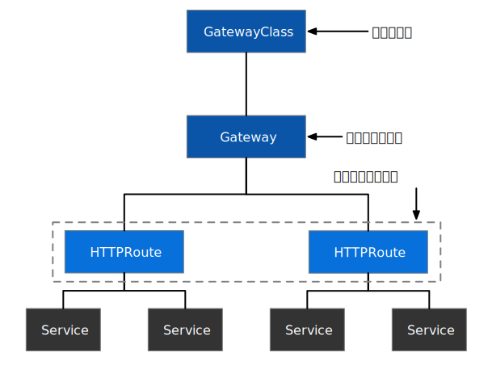
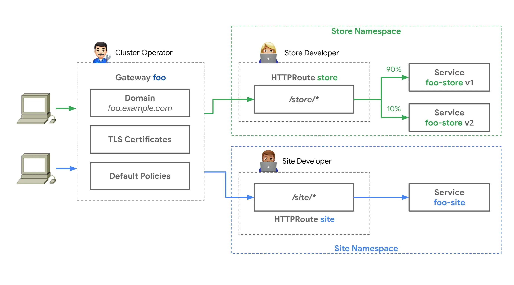
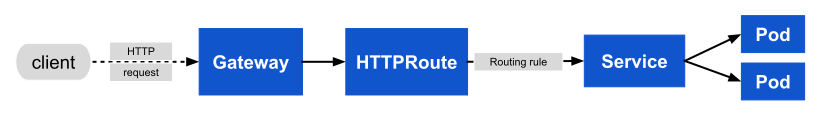
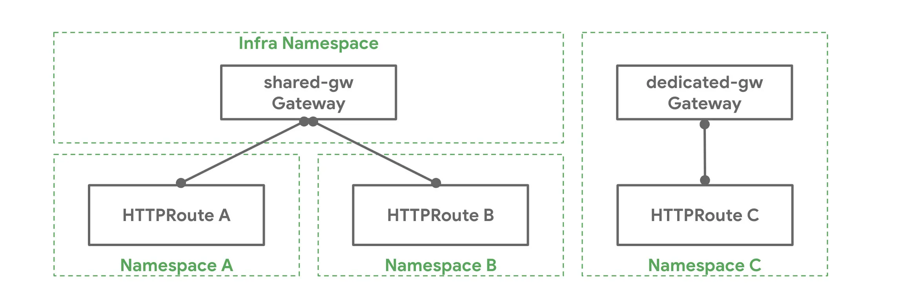
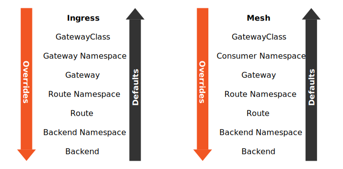
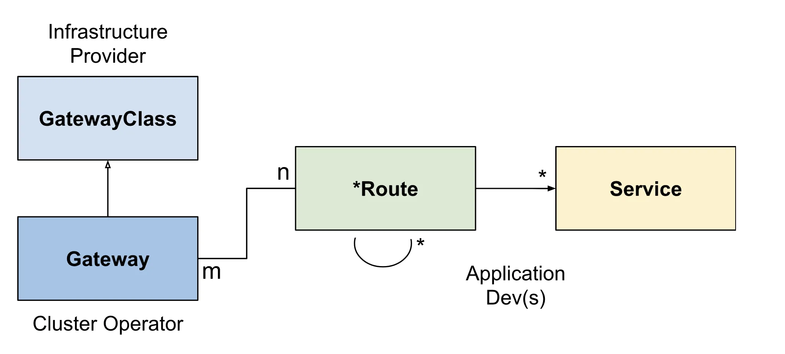
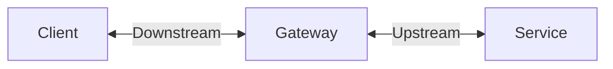



Gateway API 作为替代 [Ingress](../../service-discovery/ingress/) 的资源，既可以处理南北向流量，还可以处理东西向流量，详情见 [Gateway API：Kubernetes 和服务网格入口中网关的未来](/blog/why-gateway-api-is-the-future-of-ingress-and-mesh/)。关于使用 Gateway API 处理东西向流量的提议详见 [Google Doc](https://docs.google.com/document/d/1T_DtMQoq2tccLAtJTpo3c0ohjm25vRS35MsestSL9QU/edit)。



除了直接使用 Service 和 Ingress 之外，Kubernetes 社区还发起了 [Gateway API 项目](https://github.com/kubernetes-sigs/gateway-api)，它可以帮助我们将 Kubernetes 中的服务暴露到集群外。该项目在 2023 年 12 月[宣布 GA](https://kubernetes.io/blog/2023/10/31/gateway-api-ga/)，并在 2024 年 3 月[发布 v1.1](https://kubernetes.io/blog/2024/05/09/gateway-api-v1-1/)，宣布将多项功能升正式可用，特别是对服务网格和 GRPCRoute 的支持。

Gateway API 是一个由 [SIG-NETWORK](https://github.com/kubernetes/community/tree/master/sig-network) 管理的开源项目。该项目的目标是在 Kubernetes 生态系统中发展服务网络 API。Gateway API 提供了暴露 Kubernetes 应用的资源——`GatewayClass`、`Gateway`、`HTTPRoute`、`TCPRoute` 等。

Gateway API 已经得到了大量的网关和服务网格项目支持，请在 Gateway 官方文档中[查看支持状况](https://gateway-api.sigs.k8s.io/implementations/)。

## 目标

Gateway API 旨在通过提供表现性的、可扩展的、面向角色的接口来改善服务网络，这些接口由许多厂商实现，并得到了业界的广泛支持。

Gateway API 是一个 API 资源的集合 —— `GatewayClass`、`Gateway`、`HTTPRoute`、`TCPRoute` 等。使用这些资源共同为各种网络用例建模。

下图中展示的是 Kubernetes 集群中四层和七层的网络配置。从图中可以看到通过将这些资源对象分离，可以实现配置上的解耦，由不同角色的人员来管理，而这也是 Gateway API 的相较于 Ingress 的一大特色。



## Gateway API 与 Ingress 有什么不同？

Ingress 的主要目标是用简单的、声明性的语法来暴露 HTTP 应用。Gateway API 暴露了一个更通用的代理 API，可以用于更多的协议，而不仅仅是 HTTP，并为更多的基础设施组件建模，为集群运营提供更好的部署和管理选项。

## Gateway 相较于 Ingress 做了哪些改进？

以下是 Gateway API 对 Ingress 的改进点。

**更具表现力**

Gateway 表达了更多的核心功能，比如基于头的匹配、流量加权和其他功能，而这些功能在 Ingress 中只能通过自定义方式实现。

**更具扩展性**

Gateway API 允许在 API 的各个层次上链接自定义资源。这就允许在 API 结构的适当位置进行更精细的定制。

**面向角色**

它们被分离成不同的 API 资源，这些资源映射到 Kubernetes 上运行应用程序的常见角色。

**通用性**

这不是一种改进，而是应该保持不变。正如 Ingress 是一个具有众多实现的通用规范一样，Gateway API 被设计成一个由许多实现支持的可移植规范。

**共享网关**

它们允许独立的路由资源绑定到同一个网关，从而实现负载均衡器和 VIP 的共享。这允许团队安全地共享基础设施，而不需要直接协调。

**类型化后端引用**

通过类型化后端引用，Routes 可以引用 Kubernetes 服务，也可以引用任何一种被设计为 Gateway 后端的 Kubernetes 资源。

**跨命名空间引用**

跨越不同 Namespaces 的路由可以绑定到网关。这样，尽管对工作负载进行了命名空间划分，但仍可共享网络基础设施。

**类**

`GatewayClass` 将负载均衡实现的类型形式化。这些类使用户可以很容易和明确地了解资源模型本身有什么样的能力。

在了解了 Gateway API 的目的后，接下来我们再看下它的资源模型、请求流程、TLS 配置及扩展点等。

## 角色划分

Gateway API 开发者为其使用场景定义四类角色：

- 基础设施提供方：如 AWS、GKE 等
- 集群运维：管理整个集群的计算、存储、网络、安全等
- 应用程序开发者：为自己开发的应用负责，管理应用的健壮性
- 应用管理员：不是所有的公司都有，通常在一些复杂系统中会有专门的应用管理员

Gateway API 通过 Kubernetes 服务网络的面向角色的设计在分布式灵活性和集中控制之间取得了平衡。使得许多不同的非协调团队可以使用共享网络基础设施（硬件负载均衡器、云网络、集群托管代理等），所有团队都受集群运维设置的策略约束。下图展示了在进行 Gateway 管理时的角色划分。



集群运维人员创建从 [GatewayClass](https://gateway-api.sigs.k8s.io/api-types/gatewayclass) 派生的 [Gateway](https://gateway-api.sigs.k8s.io/api-types/gateway) 资源。此 Gateway 部署或配置它所代表的底层网络资源。通过 Gateway 和 Route 之间的[路由附加进程](https://gateway-api.sigs.k8s.io/concepts/api-overview#attaching-routes-to-gateways) ，集群运维人员和特定团队必须就可以附加到此 Gateway 并通过它公开其应用程序的内容达成一致。集群运维人员可以在网关上实施  [TLS](https://gateway-api.sigs.k8s.io/guides/tls#downstream-tls) 集中式策略。同时，Store 和 Site 团队[在他们自己的 Namespaces 中](https://gateway-api.sigs.k8s.io/guides/multiple-ns)运行，但是将他们的 Routes 附加到同一个共享 Gateway，允许他们独立控制自己的[路由逻辑](https://gateway-api.sigs.k8s.io/guides/http-routing)。这种关注点分离允许 Store 队管理自己的[流量拆分部署](https://gateway-api.sigs.k8s.io/guides/traffic-splitting)，同时将集中策略和控制权留给集群运维人员。

这种灵活性技能保持 API 的标准和可移植性，还使其可以适应截然不同的组织模型和实现。

## 资源模型

注意：资源最初将作为 CRD 存在于 `networking.x-k8s.io` API 组中。未限定的资源名称将隐含在该 API 组中。

Gateway API 的资源模型中，主要有三种类型的对象：

- `GatewayClass`：定义了一组具有共同配置和行为的网关。
- `Gateway`：流量请求端点，流量从这里被翻译成集群内的服务。
- `Route`：描述了通过 Gateway 而来的流量如何映射到服务。

### GatewayClass

`GatewayClass` 定义了一组共享共同配置和行为的 Gateway，每个 `GatewayClass` 由一个控制器处理，但控制器可以处理多个 `GatewayClass`。

`GatewayClass` 是一个集群范围的资源。必须至少定义一个 `GatewayClass`，`Gateway` 才能够生效。实现 Gateway API 的控制器通过关联的 `GatewayClass` 资源来实现，用户可以在自己的 `Gateway` 中引用该资源。

这类似于 `Ingress` 的 `IngressClass` 和 `PersistentVolumes` 的 [`StorageClass`](https://kubernetes.io/docs/concepts/storage/storage-classes/)。在 `Ingress` v1beta1 中，最接近 `GatewayClass` 的是 `ingress-class` 注解，而在 Ingress V1 中，它的作用与 `IngressClass` 一样。

下面是一个 `GatewayClass` 的配置示例。

```yaml
kind: GatewayClass
metadata:
  name: cluster-gateway
spec:
  controllerName: "example.net/gateway-controller"
```

`GatewayClass` 一般由基础设施提供商来创建，用户不需要关注控制器如何实现，只需要了解该 `GatewayClass` 创建的对应 `Gateway` 的属性即可。

Gateway API 的提供者还可以开放了一部分参数配置给网关管理员，管理员可以使用 `GatewayClass.spec.parametersRef` 字段来配置：

```yaml
kind: GatewayClass
metadata:
  name: internet
spec:
  controllerName: "example.net/gateway-controller" # 该字段的值应为集群唯一的
  parametersRef:
    group: example.net/v1alpha1
    kind: Config
    name: internet-gateway-config
---
apiVersion: example.net/v1alpha1
kind: Config
metadata:
  name: internet-gateway-config
spec:
  ip-address-pool: internet-vips
  ...
```

建议使用 `GatewayClass.spec.parametersRef` 自定义资源配置，不过你也可以使用 ConfigMap。

在刚部署 GatewayClass 后，`GatewayClass.status`  中的状态类型为 `Accepted` 但是 `status` 为 `False`，控制器处理完配置后 `status` 将变为 `True`，如果在该过程中出现错误，那么会显示在状态中，如下所示。

```yaml
kind: GatewayClass
...
status:
  conditions:
  - type: Accepted
    status: False
    Reason: BadFooBar
    Message: "foobar" is an FooBar.
```

### Gateway

`Gateway` 描述了如何将流量翻译到集群内的服务。它定义了一个将流量从不了解 Kubernetes 的地方翻译到了解 Kubernetes 的地方的方法。例如，由云负载均衡器、集群内代理或外部硬件负载均衡器发送到 Kubernetes 服务的流量。虽然许多用例的客户端流量源自集群的 "外部"，但这并不是必需的。

`Gateway` 定义了对实现 `GatewayClass` 配置和行为约定的特定负载均衡器配置的请求。该资源可以由运维人员直接创建，也可以由处理 `GatewayClass` 的控制器创建。

由于 `Gateway` 规范捕获了用户意图，它可能不包含规范中所有属性的完整规范。例如，用户可以省略地址、端口、TLS 设置等字段。这使得管理 `GatewayClass` 的控制器可以为用户提供这些缺省设置，从而使规范更加可移植。这种行为将通过 `GatewayClass` 状态对象来明确。

一个 `Gateway` 可以包含一个或多个 `Route` 引用，这些 `Route` 引用的作用是将一个子集的流量引导到一个特定的服务上。

`Gateway` 规范中定义了以下内容：

- `GatewayClassName`：定义此网关使用的  `GatewayClass`  对象的名称。
- `Listeners`：定义主机名、端口、协议、终止、TLS 设置以及哪些路由可以附加到监听器。
- `Addresses`：定义为此 Gateway 请求的网络地址。

如果以上规范中的配置无法实现，Gateway 将处于错误状态，状态条件中会显示详细信息。

下面展示的是使用 [Envoy Gateway](https://gateway.envoyproxy.io/) 生成的 Gateway 示例：

```yaml
apiVersion: gateway.networking.k8s.io/v1
kind: Gateway
metadata:
  annotations:
    kubectl.kubernetes.io/last-applied-configuration: |
      {"apiVersion":"gateway.networking.k8s.io/v1","kind":"Gateway","metadata":{"annotations":{},"name":"eg","namespace":"default"},"spec":{"gatewayClassName":"eg","listeners":[{"name":"http","port":8080,"protocol":"HTTP"}]}}
  creationTimestamp: "2022-10-22T07:03:28Z"
  generation: 1
  name: eg
  namespace: default
  resourceVersion: "326707757"
  uid: 20f37614-1814-4c4a-b3ee-8d923a1a78f8
spec:
  gatewayClassName: eg
  listeners:
  - allowedRoutes:
      namespaces:
        from: Same
    name: http
    port: 8080
    protocol: HTTP
status:
  addresses:
  - type: IPAddress
    value: 11.11.11.11 # 如果 Envoy Gateway 部署在云上，云会创建一个 LoadBalancer 实例从而获得一个外部 IP，该 IP 为网关 IP
  conditions:
  - lastTransitionTime: "2022-10-22T07:03:28Z"
    message: The Gateway has been scheduled by Envoy Gateway
    observedGeneration: 1
    reason: Scheduled
    status: "True"
    type: Scheduled
  - lastTransitionTime: "2022-10-22T07:04:17Z"
    message: Address assigned to the Gateway, 1/1 envoy Deployment replicas available
    observedGeneration: 1
    reason: Ready
    status: "True"
    type: Ready
  listeners:
  - attachedRoutes: 1
    conditions:
    - lastTransitionTime: "2022-10-22T07:03:30Z"
      message: Listener is ready
      observedGeneration: 1
      reason: Ready
      status: "True"
      type: Ready
    name: http
    supportedKinds:
    - group: gateway.networking.k8s.io
      kind: HTTPRoute
```

从上面的示例中我们可以看到 `status` 中显示了 Gateway 的状态，如网关的 IP 地址，监听器上附着的路由以及更新时间。

### Route

`Route` 对象定义了特定协议的规则，用于将请求从 `Gateway` 映射到 Kubernetes 服务。

从 v1alpha2 开始，Gateway API 中包含四种 `Route` 资源类型。对于其他协议，鼓励使用特定于实现的自定义路由类型。未来可能会向 API 添加新的路由类型。

#### HTTPRoute

`HTTPRoute` 用于多路复用 HTTP 或终止的 HTTPS 连接。它适用于检查 HTTP 流并使用 HTTP 请求数据进行路由或修改的情况，例如使用 HTTP Header 进行路由或在运行中修改它们。

HTTPRoute 的规范中包括：

- `parentRefs`：定义此路由要附加到的 Gateway。
- `hostnames`（可选）：定义用于匹配 HTTP 请求的主机头的主机名列表。
- `rules`：定义规则列表以针对匹配的 HTTP 请求执行操作。每条规则由 `matches`、`filters`（可选）和 `backendRefs`（可选）字段组成。

下图展示了流量经过网关和 HTTPRoute 发送到服务中的过程。



#### TLSRoute

`TLSRoute` 用于多路复用 TLS 连接，通过 SNI 进行区分。它适用于使用 SNI 作为主要路由方法的地方，并且对 HTTP 等高级协议的属性不感兴趣。连接的字节流被代理，无需对后端进行任何检查。

#### TCPRoute 和 UDPRoute

`TCPRoute`（和 `UDPRoute`）旨在用于将一个或多个端口映射到单个后端。在这种情况下，没有可用于在同一端口上选择不同后端的鉴别器（Discriminator），因此每个 `TCPRoute` 确实需要监听器上的不同端口。你可以终止 TLS，在这种情况下，未加密的字节流被传递到后端。你可以选择不终止 TLS，在这种情况下，加密的字节流被传递到后端。

#### GRCPRoute

`GRPCRoute` 用于路由 gRPC 流量。支持 `GRPCRoute` 的网关需要支持 HTTP/2，而无需从 HTTP/1 进行初始升级，因此可以保证 gRPC 流量正常流动。

#### Route 类型列表

下面的「路由鉴别器」一栏是指可以使用哪些信息来允许多个 Routes 共享 Listener 上的端口。

| 对象        | OSI 层                         | 路由鉴别器            | TLS 支持   | 目的                                           |
| :---------- | :----------------------------- | :-------------------- | :--------- | :--------------------------------------------- |
| `HTTPRoute` | 第 7 层                        | HTTP 协议中的任何内容 | 仅终止     | HTTP 和 HTTPS 路由                             |
| `TLSRoute`  | 第 4 层和第 7 层之间的某个位置 | SNI 或其他 TLS 属性   | 直通或终止 | TLS 协议的路由，包括不需要检查 HTTP 流的 HTTPS |
| `TCPRoute`  | 第 4 层                        | 目的端口              | 直通或终止 | 允许将 TCP 流从 Listener 转发到 Backends       |
| `UDPRoute`  | 第 4 层                        | 目的端口              | 没有任何   | 允许将 UDP 流从监听器转发到后端                |
| `GRPCRoute` | 第 7 层                        | gRPC 协议中的任何内容 | 仅终止     | 基于 HTTP/2 和 HTTP/2 明文的 gRPC 路由         |

请注意，通过 `HTTPRoute` 和 `TCPRoute` 路由的流量可以在网关和后端之间进行加密（通常称为重新加密）。无法使用现有的 Gateway API 资源对其进行配置，但实现可以为此提供自定义配置，直到 Gateway API 定义了标准化方法。

### ReferenceGrant



`ReferenceGrant` 资源仍在实验阶段，更多信息请参考[版本文档](https://gateway-api.sigs.k8s.io/concepts/versioning)。



`ReferenceGrant` 可用于在 Gateway API 中启用跨命名空间引用。特别是，路由可能会将流量转发到其他命名空间中的后端，或者 Gateway 可能会引用另一个命名空间中的 Secret。

过去，我们已经看到跨命名空间边界转发流量是一种理想的功能，但如果没有 `ReferenceGrant` 之类的保护措施，就会出现[漏洞](https://github.com/kubernetes/kubernetes/issues/103675)。

如果从其命名空间外部引用一个对象，则该对象的所有者必须创建一个 `ReferenceGrant` 资源以显式允许该引用，否则跨命名空间引用是无效的。

## 将路由添加到网关

将 Route 附加到 Gateway 表示在 Gateway 上应用的配置，用于配置底层负载均衡器或代理。Route 如何以及哪些 Route 附加到 Gateway 由资源本身控制。Route 和 Gateway 资源具有内置控件以允许或限制它们的连接方式。组织可以同时利用 Kubernetes RBAC，实施有关如何公开  Route 以及在公开在哪些 Gateway 上公开的策略。

如何将 Route 附加到网关以实现不同的组织策略和责任范围有很大的灵活性。下面是 Gateway 和 Route 可以具有的关系：

- **一对一**：Gateway 和 Route 可以由单个所有者部署和使用，具有一对一的关系。
- **一对多**：Gateway 可以绑定许多 Route，这些 Route 由来自不同命名空间的不同团队拥有。
- **多对一**：Route 也可以绑定到多个 Gateway，允许单个 Route 同时控制跨不同 IP、负载均衡器或网络的应用程序。

### 路由绑定

当 `Route` 绑定到 `Gateway` 时，代表应用在 `Gateway` 上配置了底层的负载均衡器或代理。哪些 `Route` 如何绑定到 `Gateway` 是由资源本身控制的。`Route` 和 `Gateway` 资源具有内置的控制，以允许或限制它们之间如何相互选择。这对于强制执行组织策略以确定 `Route` 如何暴露以及在哪些 `Gateway` 上暴露非常有用。请看下面的例子。

一个 Kubernetes 集群管理员在 `Infra` 命名空间中部署了一个名为 `shared-gw` 的 `Gateway`，供不同的应用团队使用，以便将其应用暴露在集群之外。团队 A 和团队 B（分别在命名空间 "A" 和 "B" 中）将他们的 `Route` 绑定到这个 `Gateway`。它们互不相识，只要它们的 `Route` 规则互不冲突，就可以继续隔离运行。团队 C 有特殊的网络需求（可能是性能、安全或关键业务），他们需要一个专门的 `Gateway` 来代理。团队 C 在 "C" 命名空间中部署了自己的 `Gateway` `specialive-gw`，该 Gateway 只能由 "C" 命名空间中的应用使用。

不同命名空间及 `Gateway` 与 `Route` 的绑定关系如下图所示。



将路由附加到网关包括以下步骤：

1. Route 需要在其 `parentRefs` 字段中引用 Gateway 的条目；
2. Gateway 上至少有一个监听器允许其附加。

## 策略附件

策略附件（Policy Attachment）是一种自定义策略资源，例如超时、重试、健康检查等，这些功能在不同的网关实现中的细节各不相同个，为了 Gateway API 的可移植性，我们将这些工作作为插件附加到资源上。

附加到 Gateway API 资源和实施的策略必须使用以下方法来确保 API 实施之间的一致性。此模式包含三个主要组件：

- 将策略附加到资源的标准化方法。
- 支持在策略资源中配置默认值和覆盖值。
- 用于说明默认值和覆盖值应如何交互的层次结构。

这种标准化不仅可以实现一致的模式，还可以让未来的工具（例如 kubectl 插件）能够可视化已应用于给定资源的所有策略。

你可以使用 `targetRef` 字段指定策略附件附加到的资源对象，例如下所示：

```yaml
apiVersion: networking.acme.io/v1alpha1
kind: RetryPolicy
metadata:
  name: foo
spec:
  default:
    maxRetries: 5
  targetRef:
    group: networking.acme.io
    kind: ExternalService
    name: foo.com
```

该在例子中，为一个外部服务配置了一个重试策略。你可以给几乎任何可以发送、接收流量的对象附加策略，例如 `GatewayClass`、`Gateway`、`Service`、`Route`、`Namespace` ，不过附加策略的时候，需要注意其优先级。

### 策略优先级

你可以给策略附件指定 `override` 和 `default` 值，其在入口和网格内不同资源上的覆盖值和默认值的优先级是如下图所示。



从图中我们可以看到：

- 覆盖值：上层覆盖下层

- 默认值：下层覆盖上层

## 引用网关

Route 可以通过在 `parentRef` 中指定命名空间（如果 Route 和 Gateway 在同一个名称空间中则该配置是可选的）和 Gateway 的名称来引用 Gateway。Route 可以使用 `parentRef` 中的以下字段进一步选择 Gateway 下的监听器子集：

1. **SectionName**：当设置了 `sectionName` 时，Route 选择具有指定名称的监听器；
2. **Port**：当设置了 `port` 时，Route 会选择所有指定的监听端口且协议与此类 Route 兼容的监听器。

当设置了多个 `parentRef` 字段时，Route 选择满足这些字段中指定的所有条件的监听器。例如，当 `sectionName` 和 `port` 两者都设置时，Route 选择具有指定名称的监听器并在指定端口上监听。

### 限制路由附加

每个 Gateway 监听器都可以通过以下机制限制其可以附加的路由：

1. **Hostname**：如果监听器上设置了 `hostname` ，附加路由的 `hostnames` 中必须至少有一个重叠值。
2. **Namespace**：监听器上的 `allowedRoutes.namespaces` 字段可用于限制可以附加路由的位置。该 `namespaces.from` 字段支持以下值：
   - `SameNamespace` 是默认选项。只有与该网关相同的命名空间中的路由才会被选择。
   - `All` 可选择来自所有命名空间的 `Route`。
   - `Selector` 意味着该网关将选择由 Namespace 标签选择器选择的 Namespace 子集的 Route。当使用 Selector 时，那么 `listeners.route.namespaces.selector` 字段可用于指定标签选择器。`All` 或 `SameNamespace` 不支持该字段。
3. **Kind**：监听器上的 `allowedRoutes.kinds` 字段可用于限制可能附加的路由种类。

如果未指定上述任何一项，网关监听器将信任从支持监听器协议的同一命名空间附加的路由。

### Gateway - Route 附加示例

在下面的例子中 `gateway-api-example-ns1` 命名空间中的 `my-route` Route 想要附加到 `foo-gateway` 中，不会附加到任何其他 Gateway 上。请注意， `foo-gateway` 位于与 Gateway 不同的命名空间中。`foo-gateway` 必须允许来自 `gateway-api-example-ns2` 命名空间中的 HTTPRoute 附加。

```yaml
apiVersion: gateway.networking.k8s.io/v1
kind: HTTPRoute
metadata:
  name: my-route
  namespace: gateway-api-example-ns2
spec:
  parentRefs:
  - kind: Gateway
    name: foo-gateway
    namespace: gateway-api-example-ns1
  rules:
  - backendRefs:
    - name: foo-svc
      port: 8080
```

`foo-gateway` 允许 `my-route` HTTPRoute 附加。

```yaml
apiVersion: gateway.networking.k8s.io/v1
kind: Gateway
metadata:
  name: foo-gateway
  namespace: gateway-api-example-ns1
spec:
  gatewayClassName: foo-lb
  listeners:
  - name: prod-web
    port: 80
    protocol: HTTP
    allowedRoutes:
      kinds: 
        - kind: HTTPRoute
      namespaces:
        from: Selector
        selector:
          matchLabels:
            # 该 label 在 Kubernetes 1.22 中自动添加到所有命名空间中
            kubernetes.io/metadata.name: gateway-api-example-ns2
```

对于一个更宽松的示例，下面的网关将允许所有 HTTPRoute 资源从带有 `expose-apps: true` 标签的命名空间附加。

```yaml
apiVersion: gateway.networking.k8s.io/v1
kind: Gateway
metadata:
  name: prod-gateway
  namespace: gateway-api-example-ns1
spec:
  gatewayClassName: foo-lb
  listeners:
  - name: prod-web
    port: 80
    protocol: HTTP    
    allowedRoutes:
      kinds: 
        - kind: HTTPRoute
      namespaces:
        from: Selector
        selector:
          matchLabels:
            expose-apps: "true"
```

### 组合类型

`GatewayClass`、Gateway、`xRoute` 和 `Service` 的组合将定义一个可实现的负载均衡器。下图说明了不同资源之间的关系。



## 请求流程

使用反向代理实现的网关的一个典型的客户端 / 网关 API 请求流程如下：

1. 客户端向 `http://foo.example.com` 发出请求。
2. DNS 将该名称解析为 `Gateway` 地址。
3. 反向代理在 `Listener` 上接收请求，并使用 `Host`  header 来匹配 `HTTPRoute`。
4. 可选地，反向代理可以根据 `HTTPRoute` 中的 `match` 规则执行请求 header 和 / 或路径匹配。
5. 可选地，反向代理可以根据 `HTTPRoute` 中的 `filter` 规则修改请求，即添加 / 删除 header。
6. 最后，反向代理可以根据 `HTTPRoute` 中的 `forwardTo` 规则，将请求转发到集群中的一个或多个对象，即 `Service`。

## TLS 配置

我们可以在 `Gateway` 监听器上配置 TLS，还可以跨命名空间引用。

首先我们先说明几个术语：

- 下游：客户端和网关之间的链接。
- 上游：网关与路由器指定的后端服务之间的链接。

其关系如下图所示。




通过 Gateway API 可以分别对上游或下游的 TLS 进行配置。

根据监听器协议，支持不同的 TLS 模式和路由类型，如下表所示。

| 监听器协议 | TLS 模式 | 支持的路由类型 |
| :--------- | :------- | :------------- |
| TLS        | 直通     | TLSRoute       |
| TLS        | 终止     | TCPRoute       |
| HTTPS      | 终止     | HTTPRoute      |

请注意，在`Passthrough`（直通）TLS 模式下，没有 TLS 设置生效，因为来自客户端的 TLS 会话不会在网关处终止。本文的其余部分假定 TLS 在网关处终止，这是默认设置。

### 下游 TLS

下游 TLS 设置使用网关级别的监听器进行配置。

### 监听器和 TLS

监听器基于每个域或子域公开 TLS 设置。监听器的 TLS 设置适用于满足 `hostname` 条件的所有域。

在以下示例中，`default-cert` Gateway 为所有请求提供 Secret 资源中定义的 TLS 证书。尽管该示例涉及 HTTPS 协议，但也可以将相同的功能用于 TLS-only 协议以及 TLSRoutes。

```yaml
listeners:
- protocol: HTTPS # Other possible value is `TLS`
  port: 443
  tls:
    mode: Terminate # If protocol is `TLS`, `Passthrough` is a possible mode
    certificateRef:
      kind: Secret
      group: ""
      name: default-cert
```

如果 `hostname.match` 设置为`Exact`，则 TLS 设置仅适用于在 `hostname.name` 中设置的特定主机名。

### 示例

#### 具有不同证书的监听器

在下面的示例中，配置 Gateway 服务于 `foo.example.com` 和  `bar.example.com` 域。这些域的证书在 Gateway 中指定。

```yaml
apiVersion: gateway.networking.k8s.io/v1
kind: Gateway
metadata:
  name: tls-basic
spec:
  gatewayClassName: acme-lb
  listeners:
  - name: foo-https
    protocol: HTTPS
    port: 443
    hostname: foo.example.com
    tls:
      certificateRefs:
      - kind: Secret
        group: ""
        name: foo-example-com-cert
  - name: bar-https
    protocol: HTTPS
    port: 443
    hostname: bar.example.com
    tls:
      certificateRefs:
      - kind: Secret
        group: ""
        name: bar-example-com-cert
```

#### 通配符 TLS 监听器

在下面的示例中，Gateway 为 `*.example.com` 和 `foo.example.com` 域配置了不同的通配符证书。由于特定匹配具有优先权，所有对 `foo.example.com` 的请求将使用 `foo-example-com-cert`，所有对 `exmaple.com` 的其他请求使用 `wildcard-example-com-cert` 证书。

```yaml
apiVersion: gateway.networking.k8s.io/v1
kind: Gateway
metadata:
  name: wildcard-tls-gateway
spec:
  gatewayClassName: acme-lb
  listeners:
  - name: foo-https
    protocol: HTTPS
    port: 443
    hostname: foo.example.com
    tls:
      certificateRefs:
      - kind: Secret
        group: ""
        name: foo-example-com-cert
  - name: wildcard-https
    protocol: HTTPS
    port: 443
    hostname: "*.example.com"
    tls:
      certificateRefs:
      - kind: Secret
        group: ""
        name: wildcard-example-com-cert
```

#### 跨命名空间证书引用

在此示例中，配置 Gateway 引用不同命名空间中的证书。在目标命名空间中创建 `ReferenceGrant` 以允许跨命名空间引用。

```yaml
apiVersion: gateway.networking.k8s.io/v1
kind: Gateway
metadata:
  name: cross-namespace-tls-gateway
  namespace: gateway-api-example-ns1
spec:
  gatewayClassName: acme-lb
  listeners:
  - name: https
    protocol: HTTPS
    port: 443
    hostname: "*.example.com"
    tls:
      certificateRefs:
      - kind: Secret
        group: ""
        name: wildcard-example-com-cert
        namespace: gateway-api-example-ns2
---
apiVersion: gateway.networking.k8s.io/v1alpha2
kind: ReferenceGrant
metadata:
  name: allow-ns1-gateways-to-ref-secrets
  namespace: gateway-api-example-ns2
spec:
  from:
  - group: gateway.networking.k8s.io
    kind: Gateway
    namespace: gateway-api-example-ns1
  to:
  - group: ""
    kind: Secret
```

### 扩展

网关 TLS 配置提供了一个 `options` 映射来为特定于实现的功能添加额外的 TLS 设置。此处可能包含的一些功能示例是 TLS 版本限制或要使用的密码。

## 扩展点

API 中提供了一些扩展点，以灵活处理大量通用 API 无法处理的用例。

以下是 API 中扩展点的摘要。

- `BackendRefs`：此扩展点应用于将流量转发到核心 Kubernetes 服务资源以外的网络端点。例如 S3 存储桶、Lambda 函数、文件服务器等。
- `HTTPRouteFilter`：`HTTPRoute` 中的这种 API 类型提供了一种挂钩 HTTP 请求的请求 / 响应生命周期的方法。
- **自定义路由**：如果上述扩展点都不能满足用例的需要，实施者可以选择为 API 当前不支持的协议创建自定义路由资源。自定义路由类型需要共享与核心路由类型相同的字段。这些包含在 `CommonRouteSpec` 和 `RouteStatus` 中。

## 参考

- [kuberentes-sigs/gateway-api - github.com](https://github.com/kubernetes-sigs/gateway-api)
- [Kubernetes Gateway API 文档 - gateway-api.sigs.k8s.io](https://gateway-api.sigs.k8s.io/)
