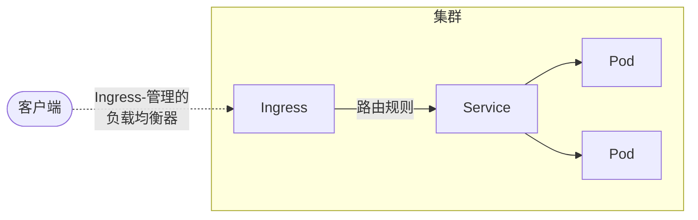

> Ingress 是 Kubernetes 集群中实现 HTTP/HTTPS 流量智能路由和安全暴露的核心机制，合理配置可实现灵活的服务访问与流量管理。

## 概述

Ingress 是 Kubernetes 的资源对象，用于管理集群外部到集群内服务的 HTTP 和 HTTPS 访问。它充当智能路由器，根据定义的规则将外部流量路由到集群内的不同服务。


Ingress 在 Kubernetes 1.9 正式发布，目前仍被广泛使用。但对于新项目，建议考虑使用更现代的 [Gateway API](../gateway/) 作为替代方案，它提供更强大和灵活的流量管理能力。


## Ingress 架构与核心功能

Ingress 的工作原理如下图所示，展示了客户端流量如何通过 Ingress 控制器路由到后端服务和 Pod。




{width=1920 height=606}

Ingress 提供以下核心功能：

- 外部 URL 访问：为集群内服务提供外部可访问的 URL
- 负载均衡：在多个 Pod 实例之间分发流量
- SSL/TLS 终结：处理 HTTPS 证书和加密
- 基于名称的虚拟主机：根据主机名路由到不同服务
- 路径路由：根据 URL 路径将请求路由到不同服务

## 前置条件

在使用 Ingress 前，需要满足以下条件：

- 部署 Ingress 控制器（如 NGINX、Traefik、HAProxy 等）
- 配置 IngressClass，指定使用的控制器
- 准备好后端 Service 和 Pod


仅创建 Ingress 资源本身不会产生任何效果，必须配合 [Ingress 控制器](../../controllers/ingress-controller) 一起使用。


## 基本配置与路径类型

Ingress 支持多种路径类型和灵活的路由规则，适用于不同访问场景。

### 最简单的 Ingress 配置

以下为典型的 Ingress 配置示例：

```yaml
apiVersion: networking.k8s.io/v1
kind: Ingress
metadata:
  name: simple-ingress
  annotations:
    nginx.ingress.kubernetes.io/rewrite-target: /
spec:
  ingressClassName: nginx
  rules:
  - host: example.com
    http:
      paths:
      - path: /
        pathType: Prefix
        backend:
          service:
            name: web-service
            port:
              number: 80
```

### 路径类型说明

Kubernetes 支持三种路径类型：

- `Exact`：精确匹配 URL 路径（区分大小写）
- `Prefix`：基于 URL 路径前缀匹配，按 `/` 分隔
- `ImplementationSpecific`：匹配方法由 IngressClass 决定

## IngressClass 详解

IngressClass 用于定义 Ingress 的实现类别，支持集群范围和命名空间范围参数配置。

### 基本 IngressClass 配置

```yaml
apiVersion: networking.k8s.io/v1
kind: IngressClass
metadata:
  name: nginx
spec:
  controller: k8s.io/ingress-nginx
```

### 设置默认 IngressClass

```yaml
apiVersion: networking.k8s.io/v1
kind: IngressClass
metadata:
  name: nginx
  annotations:
    ingressclass.kubernetes.io/is-default-class: "true"
spec:
  controller: k8s.io/ingress-nginx
```

### 参数化配置示例

#### 集群范围参数

```yaml
apiVersion: networking.k8s.io/v1
kind: IngressClass
metadata:
  name: external-lb
spec:
  controller: example.com/ingress-controller
  parameters:
    scope: Cluster
    apiGroup: k8s.example.net
    kind: ClusterIngressParameter
    name: external-config
```

#### 命名空间范围参数

```yaml
apiVersion: networking.k8s.io/v1
kind: IngressClass
metadata:
  name: internal-lb
spec:
  controller: example.com/ingress-controller
  parameters:
    scope: Namespace
    apiGroup: k8s.example.com
    kind: IngressParameter
    namespace: ingress-config
    name: internal-config
```

## 常见使用场景

Ingress 支持多种典型场景，满足不同业务需求。

### 单服务暴露

```yaml
apiVersion: networking.k8s.io/v1
kind: Ingress
metadata:
  name: single-service
spec:
  ingressClassName: nginx
  defaultBackend:
    service:
      name: web-service
      port:
        number: 80
```

### 路径扇出

```yaml
apiVersion: networking.k8s.io/v1
kind: Ingress
metadata:
  name: path-fanout
spec:
  ingressClassName: nginx
  rules:
  - host: api.example.com
    http:
      paths:
      - path: /v1
        pathType: Prefix
        backend:
          service:
            name: api-v1-service
            port:
              number: 80
      - path: /v2
        pathType: Prefix
        backend:
          service:
            name: api-v2-service
            port:
              number: 80
```

### 基于主机名的虚拟主机

```yaml
apiVersion: networking.k8s.io/v1
kind: Ingress
metadata:
  name: virtual-host
spec:
  ingressClassName: nginx
  rules:
  - host: blog.example.com
    http:
      paths:
      - path: /
        pathType: Prefix
        backend:
          service:
            name: blog-service
            port:
              number: 80
  - host: shop.example.com
    http:
      paths:
      - path: /
        pathType: Prefix
        backend:
          service:
            name: shop-service
            port:
              number: 80
```

## TLS/SSL 配置

Ingress 支持多种 TLS 配置，保障数据安全传输。

### 单域名 TLS

```yaml
apiVersion: networking.k8s.io/v1
kind: Ingress
metadata:
  name: tls-example
spec:
  ingressClassName: nginx
  tls:
  - hosts:
    - secure.example.com
    secretName: tls-secret
  rules:
  - host: secure.example.com
    http:
      paths:
      - path: /
        pathType: Prefix
        backend:
          service:
            name: secure-service
            port:
              number: 443
```

### 多域名 TLS

```yaml
apiVersion: networking.k8s.io/v1
kind: Ingress
metadata:
  name: multi-tls
spec:
  ingressClassName: nginx
  tls:
  - hosts:
    - api.example.com
    - admin.example.com
    secretName: wildcard-tls-secret
  rules:
  - host: api.example.com
    http:
      paths:
      - path: /
        pathType: Prefix
        backend:
          service:
            name: api-service
            port:
              number: 80
  - host: admin.example.com
    http:
      paths:
      - path: /
        pathType: Prefix
        backend:
          service:
            name: admin-service
            port:
              number: 80
```

### 创建 TLS Secret

```bash
kubectl create secret tls tls-secret \
  --cert=path/to/tls.cert \
  --key=path/to/tls.key
```

## 高级功能与注解

Ingress 控制器支持多种注解，可实现重写、限流、CORS 等高级功能。

```yaml
apiVersion: networking.k8s.io/v1
kind: Ingress
metadata:
  name: advanced-ingress
  annotations:
    nginx.ingress.kubernetes.io/rewrite-target: /$2
    nginx.ingress.kubernetes.io/ssl-redirect: "true"
    nginx.ingress.kubernetes.io/rate-limit: "100"
    nginx.ingress.kubernetes.io/cors-allow-origin: "*"
spec:
  ingressClassName: nginx
  rules:
  - host: api.example.com
    http:
      paths:
      - path: /api(/|$)(.*)
        pathType: Prefix
        backend:
          service:
            name: api-service
            port:
              number: 80
```

### 默认后端

为未匹配任何规则的请求提供默认处理：

```yaml
apiVersion: networking.k8s.io/v1
kind: Ingress
metadata:
  name: default-backend
spec:
  ingressClassName: nginx
  defaultBackend:
    service:
      name: default-service
      port:
        number: 80
  rules:
  - host: example.com
    http:
      paths:
      - path: /app
        pathType: Prefix
        backend:
          service:
            name: app-service
            port:
              number: 80
```

## 管理与维护

日常管理和维护 Ingress 资源时，可参考以下命令和流程。

### 更新 Ingress 配置

```bash
# 编辑现有 Ingress
kubectl edit ingress my-ingress

# 应用新配置
kubectl apply -f ingress.yaml

# 查看 Ingress 状态
kubectl get ingress
kubectl describe ingress my-ingress
```

### 故障排查

```bash
# 检查 Ingress 控制器日志
kubectl logs -n ingress-nginx deployment/ingress-nginx-controller

# 检查 Ingress 事件
kubectl get events --field-selector involvedObject.kind=Ingress

# 验证后端服务
kubectl get svc
kubectl get endpoints
```

## 迁移与替代方案

### 从注解到 IngressClass

Kubernetes 1.18 之前的 `kubernetes.io/ingress.class` 注解已废弃，推荐使用 `ingressClassName` 字段。

```yaml
# 旧方式（已废弃）
metadata:
  annotations:
    kubernetes.io/ingress.class: nginx

# 新方式（推荐）
spec:
  ingressClassName: nginx
```

### 替代方案对比



| 方案                 | 适用场景           | 优势                   | 劣势                   |
|----------------------|--------------------|------------------------|------------------------|
| Ingress              | HTTP/HTTPS 流量管理 | 功能丰富，生态成熟     | 仅支持 7 层路由        |
| LoadBalancer Service | 简单负载均衡       | 配置简单               | 成本高，功能有限       |
| NodePort Service     | 开发测试环境       | 无需额外组件           | 端口管理复杂，安全性差 |
| Gateway API          | 现代流量管理       | 功能强大，设计灵活     | 生态较新，待完善       |



## 最佳实践

- 明确指定 `ingressClassName`，避免依赖默认值
- 生产环境启用 HTTPS 并配置 TLS 证书
- 通过注解配置速率限制和资源控制
- 配置 Ingress 控制器监控与告警
- 启用安全头和 CORS 策略
- 使用标签和注解管理 Ingress 资源版本

## 总结

Ingress 作为 Kubernetes 集群中 HTTP/HTTPS 流量暴露和路由的核心机制，具备灵活的路由规则和丰富的控制能力。建议结合实际业务需求，合理选择 Ingress 或 Gateway API，并关注安全、监控和资源管理，提升集群的可用性与可维护性。

## 参考文献

- [Ingress - Kubernetes 官方文档](https://kubernetes.io/docs/concepts/services-networking/ingress/)
- [Ingress Controllers - Kubernetes 官方文档](https://kubernetes.io/docs/concepts/services-networking/ingress-controllers/)
- [Gateway API - Kubernetes SIG Network](https://gateway-api.sigs.k8s.io/)
