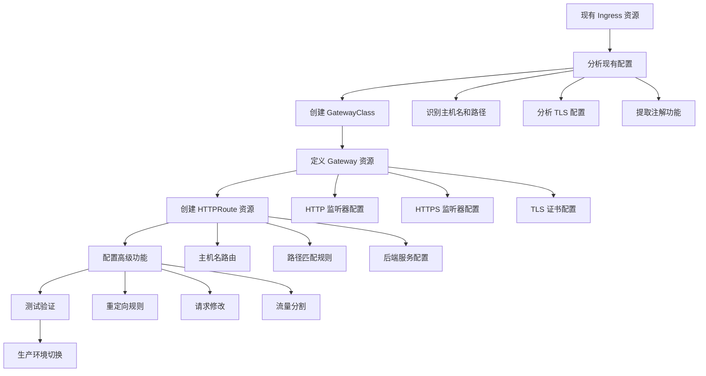

> Gateway API 作为 Kubernetes 新一代流量管理标准，凭借更强的表现力、扩展性和角色分离能力，成为 Ingress 的理想升级路径。本文系统梳理迁移流程与注意事项，助力平滑过渡。

## 迁移背景与价值

随着云原生架构的发展，Ingress API 已难以满足复杂流量管理和多团队协作的需求。Gateway API 作为 Ingress 的继任者，提供了更强大、灵活和标准化的流量治理能力。迁移到 Gateway API 能显著提升网络管理的可维护性和可扩展性。

## 为什么要切换到 Gateway API

在正式迁移前，建议先了解 Ingress API 的局限性及 Gateway API 的优势。

### Ingress API 的局限性

Ingress API 虽然广泛应用，但存在如下不足：

- 仅支持基本 HTTP/HTTPS 流量，TLS 终止能力有限
- 路由规则仅支持主机名和路径，扩展性差
- 严重依赖注解扩展，跨实现兼容性差
- 权限模型粗糙，难以支持多团队协作和基础设施共享

### Gateway API 的优势

Gateway API 针对上述痛点做了系统性改进：

- 明确角色分离，支持多团队协作
- 内置丰富路由与流量管理能力
- 标准化扩展机制，避免注解混乱
- 强类型 API，减少配置错误
- 支持多协议（HTTP/HTTPS/TCP/UDP/gRPC）

## Ingress API 与 Gateway API 的核心差异

迁移前需理解两者在资源模型、权限、功能和扩展性等方面的本质区别。



| 维度       | Ingress API         | Gateway API                                      |
|------------|---------------------|--------------------------------------------------|
| 资源模型   | 单一 Ingress        | Gateway、HTTPRoute、GatewayClass 等多资源        |
| 用户角色   | 单一角色            | 明确四类角色，支持权限分离                       |
| 协议支持   | 仅 HTTP/HTTPS       | HTTP/HTTPS/TCP/UDP/gRPC 等                       |
| 路由能力   | 主机名/路径         | 支持 Header、方法、参数等多维匹配                |
| 扩展方式   | 注解（非标准化）    | Policy、外部引用等标准化扩展                     |
| 权限控制   | 粗粒度              | 细粒度，支持多团队协作                           |



## 功能映射与配置转换

迁移时需将 Ingress 资源的各项功能映射到 Gateway API 的对应资源和字段。

### 入口点配置

Ingress 入口点为隐式（默认 80/443），Gateway 需显式定义监听器。

```yaml
# Ingress 示例
apiVersion: networking.k8s.io/v1
kind: Ingress
metadata:
  name: example-ingress
spec:
  tls:
  - hosts:
      - example.com
    secretName: example-tls
  rules:
  - host: example.com
# 默认监听 80/443
```

```yaml
# Gateway API 示例
apiVersion: gateway.networking.k8s.io/v1
kind: Gateway
metadata:
  name: example-gateway
spec:
  gatewayClassName: prod
  listeners:
  - name: http
    port: 80
    protocol: HTTP
  - name: https
    port: 443
    protocol: HTTPS
    tls:
      certificateRefs:
      - name: example-tls
```

### 路由规则映射

| Ingress 字段/功能           | Gateway API 对应字段/功能                |
|----------------------------|------------------------------------------|
| `spec.rules[].host`        | `HTTPRoute.spec.hostnames`               |
| `spec.rules[].http.paths[]`| `HTTPRoute.spec.rules[].matches[]`       |
| `backend.service`          | `HTTPRoute.spec.rules[].backendRefs[]`   |
| 注解式重定向               | `HTTPRoute.spec.rules[].filters[].requestRedirect` |
| 注解式重写                 | `HTTPRoute.spec.rules[].filters[].urlRewrite`      |

### 注解扩展的迁移

Ingress 依赖注解实现的功能，在 Gateway API 中可通过 Policy 资源等标准方式实现。

```yaml
# Ingress 注解重定向
metadata:
  annotations:
    nginx.ingress.kubernetes.io/ssl-redirect: "true"

# Gateway API 原生重定向
apiVersion: gateway.networking.k8s.io/v1
kind: HTTPRoute
spec:
  rules:
  - matches:
    - path:
        type: PathPrefix
        value: /
    filters:
    - type: RequestRedirect
      requestRedirect:
        scheme: https
        statusCode: 301
```

## 迁移步骤详解

迁移过程建议分阶段推进，确保平滑过渡和功能一致性。

### 迁移流程总览

下图展示了从 Ingress 到 Gateway API 的推荐迁移流程：




{width=1920 height=1357}

### 详细迁移步骤

#### 分析现有 Ingress 配置

导出现有配置，梳理主机名、路径、TLS、注解等关键信息。

```bash
kubectl get ingress -o yaml > current-ingress.yaml
kubectl get ingress -o jsonpath='{.items[*].spec.rules[*].host}' | tr ' ' '\n' | sort -u
kubectl get ingress -o jsonpath='{.items[*].spec.tls[*].secretName}' | tr ' ' '\n' | sort -u
kubectl get ingress -o jsonpath='{.items[*].metadata.annotations}' | jq .
```

#### 创建 GatewayClass

```yaml
apiVersion: gateway.networking.k8s.io/v1
kind: GatewayClass
metadata:
  name: prod
spec:
  controllerName: example.com/gateway-controller
```

#### 定义 Gateway 资源

```yaml
apiVersion: gateway.networking.k8s.io/v1
kind: Gateway
metadata:
  name: prod-gateway
  namespace: default
spec:
  gatewayClassName: prod
  listeners:
  - name: http
    port: 80
    protocol: HTTP
    allowedRoutes:
      namespaces:
        from: All
  - name: https
    port: 443
    protocol: HTTPS
    tls:
      mode: Terminate
      certificateRefs:
      - name: example-com-tls
    allowedRoutes:
      namespaces:
        from: All
```

#### 创建 HTTPRoute 资源

```yaml
# 主应用路由
apiVersion: gateway.networking.k8s.io/v1
kind: HTTPRoute
metadata:
  name: foo-route
spec:
  parentRefs:
  - name: prod-gateway
    sectionName: https
  hostnames:
  - foo.example.com
  rules:
  - matches:
    - path:
        type: PathPrefix
        value: /
    backendRefs:
    - name: foo-service
      port: 80
---
# HTTP 到 HTTPS 重定向
apiVersion: gateway.networking.k8s.io/v1
kind: HTTPRoute
metadata:
  name: http-redirect
spec:
  parentRefs:
  - name: prod-gateway
    sectionName: http
  rules:
  - matches:
    - path:
        type: PathPrefix
        value: /
    filters:
    - type: RequestRedirect
      requestRedirect:
        scheme: https
        statusCode: 301
```

#### 配置高级功能

将原有注解功能迁移为 Gateway API 的 Policy、Filter 等标准资源。

#### 验证与测试

通过 kubectl 检查资源状态，实际访问验证路由和 TLS 配置。

```bash
kubectl describe gateway prod-gateway
kubectl describe httproute foo-route
kubectl get httproute foo-route -o jsonpath='{.status.parents[*].conditions[*]}'
curl -I http://foo.example.com/
curl -I https://foo.example.com/
curl -I https://foo.example.com/api/v1/health
```

#### 生产环境切换

在功能验证无误后，逐步切换生产流量，并保留回滚方案。

## 自动化迁移工具

推荐使用 [ingress2gateway](https://github.com/kubernetes-sigs/ingress2gateway) 工具自动转换配置，提升效率并减少人工错误。

```bash
go install sigs.k8s.io/ingress2gateway@latest
kubectl get ingress -o yaml | ingress2gateway --gateway-class-name=prod
```

支持注解保留、跨命名空间等高级选项，转换后需人工复核。

## 迁移最佳实践与注意事项

- 渐进式迁移，按服务或命名空间逐步推进
- 并行运行 Ingress 与 Gateway API，确保平滑切换
- 使用流量镜像、金丝雀等方式验证新配置
- 关注注解兼容性、控制器差异和权限模型变化
- 更新监控与告警，适配新资源类型
- 迁移前后做好基准测试，关注性能与资源消耗

## 常见故障排查

迁移过程中如遇问题，可参考以下排查建议：

- Gateway 状态 NotReady：检查 GatewayClass 是否存在、控制器是否正常
- HTTPRoute 无法绑定：检查 parentRefs、命名空间权限和监听器配置
- TLS 证书异常：检查 Secret 是否存在、证书内容有效性

## 总结

从 Ingress 迁移到 Gateway API 是提升 Kubernetes 网络治理能力的必经之路。建议结合自动化工具和分阶段策略，确保迁移过程安全、可控、可回滚。迁移后可充分利用 Gateway API 的强大能力，构建更现代、可扩展的云原生流量管理体系。

## 参考文献

- [Gateway API 官方文档 - gateway-api.sigs.k8s.io](https://gateway-api.sigs.k8s.io/)
- [Migrating from Ingress - Gateway API](https://gateway-api.sigs.k8s.io/guides/migrating-from-ingress/)
- [ingress2gateway 项目 - github.com](https://github.com/kubernetes-sigs/ingress2gateway)
- [Gateway API 实现列表 - gateway-api.sigs.k8s.io](https://gateway-api.sigs.k8s.io/implementations/)
