Gateway API 是 [Ingress API](../ingress/) 的继任者。然而，它不包括 Ingress 资源（最接近的对应是 HTTPRoute）。因此，需要从现有的 Ingress 资源一次性转换到相应的 Gateway API 资源。

本指南将帮助你进行转换，内容包括：

- 说明为什么你可能想切换到 Gateway API。
- 描述 Ingress API 和 Gateway API 之间的主要区别。
- 将 Ingress 特性映射到 Gateway API 特性。
- 展示一个从 Ingress 资源转换到 Gateway API 资源的示例。
- 提及 [ingress2gateway](https://github.com/kubernetes-sigs/ingress2gateway) 用于自动转换。

同时，本指南不涉及实时迁移的准备工作，也不解释如何转换 Ingress 控制器的一些特定实现功能。此外，由于 Ingress API 仅涵盖 HTTP/HTTPS 流量，本指南不涵盖 Gateway API 对其他协议的支持。

## 切换到 Gateway API 的理由

Ingress API 是 Kubernetes 配置外部 HTTP/HTTPS 负载均衡的标准方式，广泛被 Kubernetes 用户采用，并得到众多实现（[Ingress 控制器](../../controllers/ingress-controller/)）的支持。但是，Ingress API 存在几个局限性：

- *功能有限*。Ingress API 仅支持 HTTP 流量的 TLS 终止和简单的基于内容的请求路由。
- *依赖注解进行扩展*。注解的扩展方法导致可移植性有限，因为每个实现都有自己支持的扩展，这些扩展可能不适用于其他实现。
- *权限模型不足*。对于具有共享负载均衡基础设施的多团队集群，Ingress API 并不适用。

Gateway API 解决了这些局限性。

## Ingress API 与 Gateway API 的主要区别

两者之间有三个主要区别：

- 角色差异
- 可用功能
- 扩展性方法

### 角色

Ingress API 最初只有一个资源种类 Ingress，因此只有一个用户角色。Gateway API 包括四个明确的角色：应用开发者、应用管理员、集群运营和基础设施提供商。这允许你通过分担用户角色的责任来突破自助服务模型。

### 可用功能

Ingress API 仅提供基本功能：基于主机头和请求 URI 的 HTTP 流量的 TLS 终止和基于内容的路由。Gateway API 不仅支持所有 Ingress 资源的功能，还支持许多过去只有通过 Ingress 注解才可用的功能，因此比 Ingress API 更具可移植性。

### 扩展方法

Gateway API 的扩展点包括：

- 外部引用
- 自定义实现
- 策略

这些扩展点不包括 Gateway API 资源上的注解，这种做法在 API 的实现中被强烈反对。

## 将 Ingress API 功能映射到 Gateway API 功能

主要区域包括：

- 入口点
- TLS 终止
- 路由规则

每个 Ingress 资源都有两个隐含的入口点，分别用于 HTTP 和 HTTPS 流量。在 Gateway API 中，入口点必须在 [Gateway](https://gateway-api.sigs.k8s.io/api-types/gateway/) 资源中明确定义。例如，如果你希望数据平面在端口 80 上处理 HTTP 流量，你需要为该流量定义一个 [监听器](https://gateway-api.sigs.k8s.io/reference/spec/#gateway.networking.k8s.io/v1.Listener)。

### 实施特定的 Ingress 功能（注解）

Ingress 注解配置实施特定的功能。因此，将它们转换为 Gateway API 取决于 Ingress 控制器和 Gateway 实现。一些通过注解支持的功能现在是 Gateway API（HTTPRoute）的一部分，主要包括：

- 请求重定向（包括 TLS 重定向）
- 请求/响应操作
- 流量分割
- 基于头、查询参数或方法的路由

## 如何从 Ingress 转换到 Gateway API

从 Ingress 迁移到 Gateway API 的过程如下图所示。

下面是对图中步骤的说明：
- **步骤 1：定义 Gateway**：创建一个 Gateway 资源，并配置对应的 GatewayClass（'prod'）。定义两个监听器：HTTP 在 80 端口，HTTPS 在 443 端口。HTTPS 监听器还包括了 TLS 终止设置，使用名为 'example-com' 的 Secret。
- **步骤 2：定义 HTTPRoutes**：根据 Ingress 资源的定义，将路由拆分成两个 HTTPRoutes，分别对应 'foo.example.com' 和 'bar.example.com' 的主机名。这些 HTTPRoutes 附加到 HTTPS 监听器。
- **步骤 3：配置 TLS 重定向**：创建一个新的 HTTPRoute 用于处理 HTTP 到 HTTPS 的重定向，这一设置原先通过 Ingress 注解来配置。

## 自动转换 Ingresses

[Ingress to Gateway](https://github.com/kubernetes-sigs/ingress2gateway) 项目帮助将 Ingress 资源转换为 Gateway API 资源，特别是 HTTPRoutes。转换结果应始终经过测试和验证。

## 参考

- [Migrating from Ingress - gateway-api.sigs.k8s.io](https://gateway-api.sigs.k8s.io/guides/migrating-from-ingress/)