Gateway API 是 Kubernetes 新一代的流量管理标准，作为 [Ingress API](../ingress/) 的继任者而设计。虽然它不直接包含 Ingress 资源（最接近的对应是 HTTPRoute），但提供了更强大和灵活的功能。因此，从现有的 Ingress 资源迁移到相应的 Gateway API 资源需要进行一次性转换。

本指南将帮助您完成这一转换过程，内容涵盖：

- 阐述切换到 Gateway API 的理由和优势
- 详细对比 Ingress API 和 Gateway API 的主要区别
- 提供完整的功能映射表和转换策略
- 展示具体的迁移步骤和实际示例
- 介绍 [ingress2gateway](https://github.com/kubernetes-sigs/ingress2gateway) 自动转换工具

**注意**：本指南专注于配置转换方面，不涉及生产环境的实时迁移策略，也不深入讨论特定 Ingress 控制器的专有功能转换。由于 Ingress API 主要处理 HTTP/HTTPS 流量，本指导不涵盖 Gateway API 对其他协议的扩展支持。

## 为什么要切换到 Gateway API

### Ingress API 的局限性

Ingress API 作为 Kubernetes 配置外部 HTTP/HTTPS 负载均衡的标准方式，虽然被广泛采用并得到众多 [Ingress 控制器](../../controllers/ingress-controller/) 的支持，但存在以下关键局限性：

**功能受限**

- 仅支持基本的 HTTP/HTTPS 流量处理
- TLS 终止功能简单
- 路由规则局限于基于主机名和路径的简单匹配

**扩展性问题**

- 严重依赖注解（annotations）进行功能扩展
- 不同实现间注解不兼容，导致可移植性差
- 缺乏标准化的扩展机制

**权限模型不足**

- 单一资源模型无法适应多团队协作场景
- 缺乏精细化的权限控制
- 不适合共享负载均衡基础设施的大型集群

### Gateway API 的优势

Gateway API 通过以下方式解决了这些问题：

- **角色分离**：明确定义了四种用户角色，支持更好的协作模式
- **功能丰富**：内置支持更多高级路由功能
- **标准化扩展**：提供标准化的扩展点，避免依赖注解
- **更好的类型安全**：强类型 API 设计，减少配置错误

## Ingress API 与 Gateway API 的核心差异

### 角色分离模型

| 角色 | Ingress API | Gateway API |
|------|-------------|-------------|
| 资源管理 | 单一 Ingress 资源 | Gateway、HTTPRoute、GatewayClass 等多种资源 |
| 用户角色 | 单一角色模型 | 四种明确角色：基础设施提供商、集群运营商、应用管理员、应用开发者 |
| 权限控制 | 粗粒度 | 细粒度，支持角色分离 |

### 功能对比

| 功能类别 | Ingress API | Gateway API |
|----------|-------------|-------------|
| 协议支持 | HTTP/HTTPS | HTTP/HTTPS/TCP/UDP/gRPC 等 |
| 路由规则 | 基本的主机名和路径匹配 | 支持请求头、查询参数、方法等多种匹配方式 |
| 流量操作 | 通过注解实现 | 原生支持请求/响应修改、重定向、流量分割等 |
| TLS 配置 | 基本 TLS 终止 | 高级 TLS 配置，支持 SNI、证书管理等 |
| 扩展机制 | 注解（非标准化） | 标准化扩展点：Policy、外部引用等 |

### 扩展机制对比

**Ingress API 扩展方式**：

```yaml
apiVersion: networking.k8s.io/v1
kind: Ingress
metadata:
    annotations:
        nginx.ingress.kubernetes.io/rewrite-target: /
        nginx.ingress.kubernetes.io/ssl-redirect: "true"
        # 各种实现特定的注解
```

**Gateway API 扩展方式**：

```yaml
# 通过 Policy 资源扩展
apiVersion: networking.example.com/v1alpha1
kind: RateLimitPolicy
metadata:
    name: rate-limit-policy
spec:
    targetRef:
        group: gateway.networking.k8s.io
        kind: HTTPRoute
        name: my-route
```

## 功能映射指南

### 入口点配置

**Ingress（隐式入口点）**：

```yaml
apiVersion: networking.k8s.io/v1
kind: Ingress
metadata:
    name: example-ingress
spec:
    tls:
    - hosts:
        - example.com
        secretName: example-tls
    rules:
    - host: example.com
        # 隐式支持 HTTP(80) 和 HTTPS(443)
```

**Gateway API（显式入口点）**：

```yaml
apiVersion: gateway.networking.k8s.io/v1
kind: Gateway
metadata:
    name: example-gateway
spec:
    gatewayClassName: prod
    listeners:
    - name: http
        port: 80
        protocol: HTTP
    - name: https
        port: 443
        protocol: HTTPS
        tls:
            certificateRefs:
            - name: example-tls
```

### 路由规则映射

| Ingress 功能 | Gateway API 对应 |
|-------------|------------------|
| `spec.rules[].host` | `HTTPRoute.spec.hostnames` |
| `spec.rules[].http.paths[]` | `HTTPRoute.spec.rules[].matches[]` |
| `backend.service` | `HTTPRoute.spec.rules[].backendRefs[]` |
| 注解式重定向 | `HTTPRoute.spec.rules[].filters[].requestRedirect` |
| 注解式重写 | `HTTPRoute.spec.rules[].filters[].urlRewrite` |

### 常见注解的 Gateway API 等价配置

**SSL 重定向**：

```yaml
# Ingress 注解方式
metadata:
    annotations:
        nginx.ingress.kubernetes.io/ssl-redirect: "true"

# Gateway API 原生支持
apiVersion: gateway.networking.k8s.io/v1
kind: HTTPRoute
spec:
    rules:
    - matches:
        - path:
                type: PathPrefix
                value: /
        filters:
        - type: RequestRedirect
            requestRedirect:
                scheme: https
                statusCode: 301
```

## 迁移步骤详解

### 步骤概览



{width=1082 height=646}

### 详细迁移步骤

**步骤 1：分析现有 Ingress 配置**

创建配置清单：

```bash
# 导出现有 Ingress 配置
kubectl get ingress -o yaml > current-ingress.yaml

# 分析关键信息
echo "主机名列表："
kubectl get ingress -o jsonpath='{.items[*].spec.rules[*].host}' | tr ' ' '\n' | sort -u

echo "TLS 配置："
kubectl get ingress -o jsonpath='{.items[*].spec.tls[*].secretName}' | tr ' ' '\n' | sort -u

echo "使用的注解："
kubectl get ingress -o jsonpath='{.items[*].metadata.annotations}' | jq .
```

**步骤 2：创建 GatewayClass**

```yaml
apiVersion: gateway.networking.k8s.io/v1
kind: GatewayClass
metadata:
    name: prod
spec:
    controllerName: example.com/gateway-controller
```

**步骤 3：定义 Gateway 资源**

```yaml
apiVersion: gateway.networking.k8s.io/v1
kind: Gateway
metadata:
    name: prod-gateway
    namespace: default
spec:
    gatewayClassName: prod
    listeners:
    - name: http
        port: 80
        protocol: HTTP
        allowedRoutes:
            namespaces:
                from: All
    - name: https
        port: 443
        protocol: HTTPS
        tls:
            mode: Terminate
            certificateRefs:
            - name: example-com-tls
        allowedRoutes:
            namespaces:
                from: All
```

**步骤 4：创建 HTTPRoute 资源**

```yaml
# 主应用路由
apiVersion: gateway.networking.k8s.io/v1
kind: HTTPRoute
metadata:
    name: foo-route
spec:
    parentRefs:
    - name: prod-gateway
        sectionName: https
    hostnames:
    - foo.example.com
    rules:
    - matches:
        - path:
                type: PathPrefix
                value: /
        backendRefs:
        - name: foo-service
            port: 80
---
# HTTP 到 HTTPS 重定向
apiVersion: gateway.networking.k8s.io/v1
kind: HTTPRoute
metadata:
    name: http-redirect
spec:
    parentRefs:
    - name: prod-gateway
        sectionName: http
    rules:
    - matches:
        - path:
                type: PathPrefix
                value: /
        filters:
        - type: RequestRedirect
            requestRedirect:
                scheme: https
                statusCode: 301
```

### 验证和测试

**配置验证**：

```bash
# 检查 Gateway 状态
kubectl describe gateway prod-gateway

# 检查 HTTPRoute 状态
kubectl describe httproute foo-route

# 验证路由绑定
kubectl get httproute foo-route -o jsonpath='{.status.parents[*].conditions[*]}'
```

**功能测试**：

```bash
# 测试 HTTP 重定向
curl -I http://foo.example.com/

# 测试 HTTPS 访问
curl -I https://foo.example.com/

# 测试路径路由
curl -I https://foo.example.com/api/v1/health
```

## 自动化迁移工具

### ingress2gateway 工具使用

**安装**：

```bash
go install sigs.k8s.io/ingress2gateway@latest
```

**基本使用**：

```bash
# 从文件转换
ingress2gateway --input-file=ingress.yaml --output-file=gateway.yaml

# 从集群转换
kubectl get ingress -o yaml | ingress2gateway

# 指定 GatewayClass
ingress2gateway --gateway-class-name=prod --input-file=ingress.yaml
```

**高级选项**：

```bash
# 保留原始注解作为注释
ingress2gateway --preserve-annotations --input-file=ingress.yaml

# 生成多个命名空间的资源
ingress2gateway --all-namespaces
```

### 转换验证清单

转换完成后，请验证以下项目：

- [ ] 所有主机名都已正确映射
- [ ] 路径匹配规则功能一致
- [ ] TLS 配置正确迁移
- [ ] 后端服务引用正确
- [ ] 重定向规则按预期工作
- [ ] 自定义注解功能已转换为对应的 Gateway API 功能
- [ ] 权限和 RBAC 配置已更新

## 最佳实践和注意事项

### 迁移策略

1. **渐进式迁移**：建议按服务或命名空间逐步迁移，而非一次性全部切换
2. **并行运行**：在切换期间保持 Ingress 和 Gateway API 并行运行
3. **流量验证**：使用流量镜像或金丝雀部署验证新配置
4. **回滚准备**：确保有快速回滚到原始 Ingress 配置的方案

### 常见陷阱

1. **注解依赖**：某些 Ingress 注解可能没有直接的 Gateway API 等价物
2. **控制器差异**：不同的 Gateway 实现可能有不同的功能支持
3. **权限模型**：需要更新 RBAC 配置以适应新的资源模型
4. **监控调整**：更新监控和告警配置以监控新的资源类型

### 性能考虑

- Gateway API 通常提供更好的性能，但需要根据具体实现进行测试
- 某些高级功能可能会影响性能，需要进行基准测试
- 考虑资源消耗和扩展性需求

## 故障排除

### 常见问题和解决方案

**Gateway 状态为 NotReady**：

```bash
kubectl describe gateway prod-gateway
# 检查 GatewayClass 是否存在和可用
kubectl get gatewayclass
```

**HTTPRoute 无法绑定到 Gateway**：

```bash
# 检查 parentRefs 配置
kubectl get httproute -o yaml | grep -A 5 parentRefs

# 验证命名空间权限
kubectl describe gateway prod-gateway | grep -A 10 allowedRoutes
```

**TLS 证书问题**：

```bash
# 检查证书 Secret
kubectl describe secret example-com-tls

# 验证证书有效性
kubectl get secret example-com-tls -o jsonpath='{.data.tls\.crt}' | base64 -d | openssl x509 -text -noout
```

## 参考资源

- [Gateway API 官方文档](https://gateway-api.sigs.k8s.io/)
- [Migrating from Ingress - Gateway API](https://gateway-api.sigs.k8s.io/guides/migrating-from-ingress/)
- [ingress2gateway 项目](https://github.com/kubernetes-sigs/ingress2gateway)
- [Gateway API 实现列表](https://gateway-api.sigs.k8s.io/implementations/)
