本文介绍 Kubernetes 网络与服务的核心概念，重点阐述 Service 及其相关组件如何实现 Pod 间通信与应用对外暴露。

## Service 概述

Service 是 Kubernetes 中用于定义一组逻辑 Pod 及其访问策略的抽象，提供稳定的访问入口，实现应用间的解耦。


{width=1920 height=2234}

## Service 类型

Kubernetes 支持多种 Service 类型，满足不同场景下的访问需求。



| 类型 | 描述 | 典型场景 |
| --- | --- | --- |
| ClusterIP | 仅集群内可访问 | 应用间内部通信 |
| NodePort | 每个节点开放静态端口 | 开发测试、简单外部访问 |
| LoadBalancer | 云厂商负载均衡器 | 生产环境对外服务 |
| ExternalName | 映射到外部 DNS 名称 | 访问集群外部服务 |



ClusterIP（默认）仅集群内可访问，NodePort 和 LoadBalancer 均基于 ClusterIP 增加了外部访问能力。



{width=1920 height=1185}

## Service 选择器与端点

Service 通过标签选择器确定后端 Pod，Kubernetes 自动生成 EndpointSlice 记录所有匹配 Pod 的 IP。无选择器的 Service 可手动管理 EndpointSlice。

## 多端口与 Headless Service

Service 支持多端口暴露，需为每个端口命名。Headless Service（`clusterIP: None`）不提供统一 IP，而是直接暴露所有后端 Pod 的 IP，适用于需要点对点连接的有状态应用。



{width=1920 height=777}

## EndpointSlice 机制

EndpointSlice 是 Kubernetes 跟踪网络端点的高效机制，适合大规模 Service。



{width=1920 height=1534}

控制面自动为带选择器的 Service 创建和维护 EndpointSlice，每个 Slice 包含一组端点的地址、端口和状态。

## 服务与 Pod 的 DNS

Kubernetes 为 Service 和 Pod 提供 DNS 记录，实现基于名称的服务发现。

### Service DNS 记录

普通 Service 在 `my-service.my-namespace.svc.cluster.local` 生成 A/AAAA 记录，Headless Service 为每个后端 Pod 生成独立记录。

### Pod DNS 记录

Pod 的 DNS 记录格式如下：

```text
pod-ip-address.my-namespace.pod.cluster.local
```


{width=1920 height=1697}

### Pod DNS 配置

可通过 `dnsPolicy` 和 `dnsConfig` 字段配置 Pod 的 DNS 行为：

- `Default`：继承节点 DNS 配置
- `ClusterFirst`：优先使用集群 DNS
- `ClusterFirstWithHostNet`：hostNetwork Pod 专用
- `None`：忽略集群 DNS 设置

## Ingress 入口资源

Ingress 用于将集群外部的 HTTP/HTTPS 流量路由到集群内 Service，支持基于主机名和路径的转发。



{width=1920 height=2614}

常见 Ingress Controller 包括 NGINX、AWS Load Balancer、GCE Ingress 等。

### 路径类型

Ingress 支持多种路径匹配方式：



| 路径类型 | 描述 | 示例 |
| --- | --- | --- |
| Prefix | 按 `/` 分割的前缀匹配 | `/foo` 匹配 `/foo/bar` |
| Exact | 精确路径匹配 | `/foo` 仅匹配 `/foo` |
| ImplementationSpecific | 由 IngressClass 决定 | 依赖控制器实现 |



## 网络策略（NetworkPolicy）

NetworkPolicy 允许基于标签选择器定义 Pod 的网络访问规则，实现细粒度的流量隔离。


{width=1920 height=1401}

NetworkPolicy 支持：

- **Ingress**：入站流量控制
- **Egress**：出站流量控制

默认无策略时全部放通，应用策略后仅允许显式声明的流量。

## 双栈网络（IPv4/IPv6）

Kubernetes 支持双栈网络，可为 Pod 和 Service 分配 IPv4 与 IPv6 地址（1.21+ 默认启用）。


{width=1920 height=1032}

Service 的 `ipFamilyPolicy` 可设为：

- `SingleStack`：仅分配首个 IP 家族
- `PreferDualStack`：优先双栈，若支持则分配双 IP
- `RequireDualStack`：强制要求双栈，否则失败

## Service 内部流量策略

通过设置 `.spec.internalTrafficPolicy: Local`，可让 Service 仅将内部流量路由到本节点上的后端 Pod，提升性能并减少跨节点流量。

## 总结

Kubernetes 网络与服务系统通过 Service、EndpointSlice、DNS、Ingress、NetworkPolicy 等机制，实现了集群内外的高效服务发现、流量调度与安全隔离。掌握这些核心机制，有助于设计和运维高可用、可扩展的云原生应用网络。

## 参考文献

1. [Kubernetes Service 官方文档 - kubernetes.io](https://kubernetes.io/docs/concepts/services-networking/service/)
2. [Kubernetes Ingress 官方文档 - kubernetes.io](https://kubernetes.io/docs/concepts/services-networking/ingress/)
3. [Kubernetes NetworkPolicy 官方文档 - kubernetes.io](https://kubernetes.io/docs/concepts/services-networking/network-policy/)
