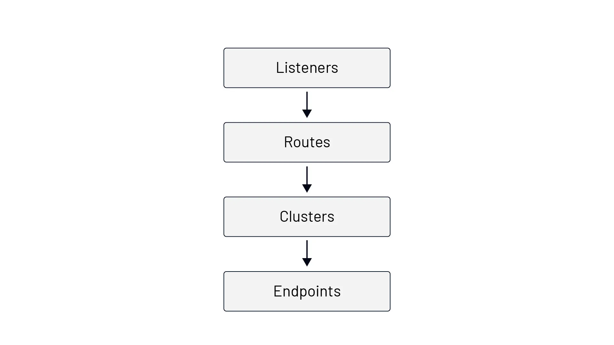
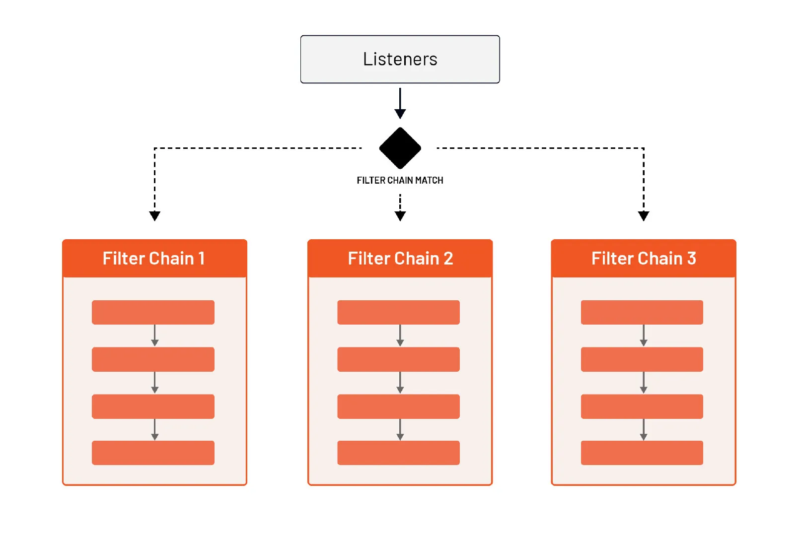
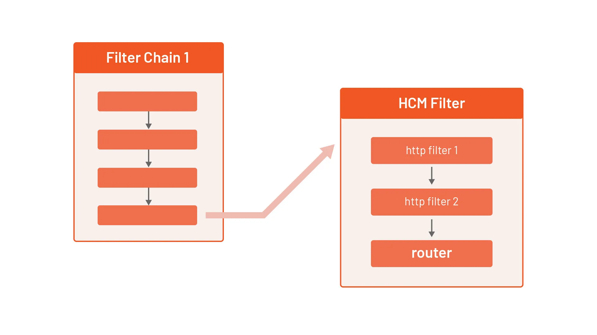

在这一节中，我们将解释 Envoy 的基本构建模块。

Envoy 配置的根被称为引导配置。它包含了一些字段，我们可以在这里提供静态或动态的资源和高级别的 Envoy 配置（例如，Envoy 实例名称、运行时配置、启用管理界面等等）。

为了开始学习，我们将主要关注静态资源，在课程的后面，我们将介绍如何配置动态资源。

Envoy 输出许多统计数据，这取决于启用的组件和它们的配置。我们会在整个课程中提到不同的统计信息，在课程后面的专门模块中，我们会更多地讨论统计信息。

下图显示了通过这些概念的请求流。



这一切都从监听器开始。Envoy 暴露的监听器是命名的网络位置，可以是一个 IP 地址和一个端口，也可以是一个 Unix 域套接字路径。Envoy 通过监听器接收连接和请求。考虑一下下面的 Envoy 配置。

```yaml
static_resources:
  listeners:
  - name: listener_0
    address:
      socket_address:
        address: 0.0.0.0
        port_value: 10000
    filter_chains: [{}]
```

通过上面的 Envoy 配置，我们在  0.0.0.0 地址的 10000 端口上声明了一个名为 listener_0 的监听器。这意味着 Envoy 正在监听 0.0.0.0:10000 的传入请求。

每个监听器都有不同的部分需要配置。然而，唯一需要的设置是地址。上述配置是有效的，你可以用它来运行 Envoy—— 尽管它没有用，因为所有的连接都会被关闭。

我们让 filter_chains 字段为空，因为在接收数据包后不需要额外的操作。

为了进入下一个构件（路由），我们需要创建一个或多个网络过滤器链（filter_chains），至少要有一个过滤器。

网络过滤器通常对数据包的有效载荷进行操作，查看有效载荷并对其进行解析。例如，Postgres 网络过滤器解析数据包的主体，检查数据库操作的种类或其携带的结果。

Envoy 定义了三类过滤器：监听器过滤器、网络过滤器和 HTTP 过滤器。监听器过滤器在收到数据包后立即启动，通常对数据包的头信息进行操作。监听器过滤器包括代理监听器过滤器（提取 PROXY 协议头），或 TLS 检查器监听器过滤器（检查流量是否为 TLS，如果是，则从 TLS 握手中提取数据）。

每个通过监听器进来的请求可以流经多个过滤器。我们还可以写一个配置，根据传入的请求或连接属性选择不同的过滤器链。



一个特殊的、内置的网络过滤器被称为 **HTTP 连接管理器**过滤器（HTTP Connection Manager Filter）或 **HCM**。HCM 过滤器能够将原始字节转换为 HTTP 级别的消息。它可以处理访问日志，生成请求 ID，操作头信息，管理路由表，并收集统计数据。我们将在以后的课程中对 HCM 进行更详细的介绍。

就像我们可以为每个监听器定义多个网络过滤器（其中一个是 HCM）一样，Envoy 也支持在 HCM 过滤器中定义多个 HTTP 级过滤器。我们可以在名为 `http_filters` 的字段下定义这些 HTTP 过滤器。



HTTP 过滤器链中的最后一个过滤器必须是路由器过滤器（`envoy.filters.HTTP.router`）。路由器过滤器负责执行路由任务。这最终把我们带到了第二个构件 —— **路由**。

我们在 HCM 过滤器的 `route_config` 字段下定义路由配置。在路由配置中，我们可以通过查看元数据（URI、Header 等）来匹配传入的请求，并在此基础上，定义流量的发送位置。

路由配置中的顶级元素是虚拟主机。每个虚拟主机都有一个名字，在发布统计数据时使用（不用于路由），还有一组被路由到它的域。

让我们考虑下面的路由配置和域的集合。

```yaml
route_config:
  name: my_route_config
  virtual_hosts:
  - name: tetrate_hosts
    domains: ["tetrate.io"]
    routes:
    ...
  - name: test_hosts
    domains: ["test.tetrate.io", "qa.tetrate.io"]
    routes:
    ...
```

如果传入请求的目的地是 `tetrate.io`（即 `Host/Authority` 标头被设置为其中一个值），则 `tetrate_hosts` 虚拟主机中定义的路由将得到处理。

同样，如果 `Host/Authority` 标头包含 `test.tetrate.io` 或 `qa.tetrate.io`，`test_hosts` 虚拟主机下的路由将被处理。使用这种设计，我们可以用一个监听器（`0.0.0.0:10000`）来处理多个顶级域。

如果你在数组中指定多个域，搜索顺序如下：

1. 精确的域名（例如：`tetrate.io`）。
1. 后缀域名通配符（如 `*.tetrate.io）`。
1. 前缀域名通配符（例如：`tetrate.*`）。
1. 匹配任何域的特殊通配符（`*`）。

在 Envoy 匹配域名后，是时候处理所选虚拟主机中的 `routes` 字段了。这是我们指定如何匹配一个请求，以及接下来如何处理该请求（例如，重定向、转发、重写、发送直接响应等）的地方。

我们来看看一个例子。

```yaml
static_resources:
  listeners:
  - name: listener_0
    address:
      socket_address:
        address: 0.0.0.0
        port_value: 10000
    filter_chains:
    - filters:
      - name: envoy.filters.network.http_connection_manager
        typed_config:
          "@type": type.googleapis.com/envoy.extensions.filters.network.http_connection_manager.v3.HttpConnectionManager
          stat_prefix: hello_world_service
          http_filters:
          - name: envoy.filters.http.router
          route_config:
            name: my_first_route
            virtual_hosts:
            - name: direct_response_service
              domains: ["*"]
              routes:
              - match:
                  prefix: "/"
                direct_response:
                  status: 200
                  body:
                    inline_string: "yay"
```

配置的顶部部分与我们之前看到的一样。我们已经添加了 HCM 过滤器、统计前缀（`hello_world_service`）、单个 HTTP 过滤器（路由器）和路由配置。

在虚拟主机内，我们要匹配任何域名。在 `routes` 下，我们匹配前缀（`/`），然后我们可以发送一个响应。

当涉及到匹配请求时，我们有多种选择。

| 路由匹配          | 描述                                     | 示例                                                         |
| ----------------- | ---------------------------------------- | ------------------------------------------------------------ |
| `prefix`          | 前缀必须与`:path` 头的开头相符。         | `/hello` 与 `hello.com/hello`、`hello.com/helloworld` 和 `hello.com/hello/v1` 匹配。 |
| `path`            | 路径必须与`:path` 头完全匹配。           | `/hello`匹配 `hello.com/hello`，但不匹配 `hello.com/helloworld`或 `hello.com/hello/v1` |
| `safe_regex`      | 所提供的正则表达式必须与`:path` 头匹配。 | `/\{3}` 匹配任何以 `/` 开头的三位数。例如，与 `hello.com/123` 匹配，但不能匹配 `hello.com/hello` 或 `hello.com/54321。` |
| `connect_matcher` | 匹配器只匹配 CONNECT 请求。              |                                                              |

一旦 Envoy 将请求与路由相匹配，我们就可以对其进行路由、重定向或返回一个直接响应。在这个例子中，我们通过 `direct_response` 配置字段使用**直接响应**。

你可以把上述配置保存到 `envoy-direct-response.yaml` 中。

我们将使用一个名为 [func-e](https://func-e.io/) 的命令行工具。func-e 允许我们选择和使用不同的 Envoy 版本。

我们可以通过运行以下命令下载 func-e CLI。

```sh
curl https://func-e.io/install.sh | sudo bash -s -- -b /usr/local/bin
```

现在我们用我们创建的配置运行 Envoy。

```sh
func-e run -c envoy-direct-response.yaml
```

一旦 Envoy 启动，我们就可以向 `localhost:10000` 发送一个请求，以获得我们配置的直接响应。

```sh
$ curl localhost:10000
yay
```

同样，如果我们添加一个不同的主机头（例如 `-H "Host: hello.com"`）将得到相同的响应，因为 `hello.com` 主机与虚拟主机中定义的域相匹配。

在大多数情况下，从配置中直接发送响应是一个很好的功能，但我们会有一组端点或主机，我们将流量路由到这些端点或主机。在 Envoy 中做到这一点的方法是通过定义**集群**。

集群（Cluster）是一组接受流量的上游类似主机。这可以是你的服务所监听的主机或 IP 地址的列表。

例如，假设我们的 hello world 服务是在 `127.0.0.0:8000` 上监听。然后，我们可以用一个单一的端点创建一个集群，像这样。

```yaml
clusters:
- name: hello_world_service
  load_assignment:
    cluster_name: hello_world_service
    endpoints:
    - lb_endpoints:
      - endpoint:
          address:
            socket_address:
              address: 127.0.0.1
              port_value: 8000
```

集群的定义与监听器的定义在同一级别，使用 `clusters` 字段。我们在路由配置中引用集群时，以及在导出统计数据时，都会使用集群。该名称在所有集群中必须是唯一的。

在 `load_assignment` 字段下，我们可以定义要进行负载均衡的端点列表，以及负载均衡策略设置。

Envoy 支持多种负载均衡算法（round-robin、Maglev、least-request、random），这些算法是由静态引导配置、DNS、动态 xDS（CDS 和 EDS 服务）以及主动 / 被动健康检查共同配置的。如果我们没有通过 `lb_policy` 字段明确地设置负载均衡算法，它默认为 round-robin。

`endpoints` 字段定义了一组属于特定地域的端点。使用可选的 `locality` 字段，我们可以指定上游主机的运行位置，然后在负载均衡过程中使用（即，将请求代理到离调用者更近的端点）。

添加新的端点指示负载均衡器在一个以上的接收者之间分配流量。通常情况下，负载均衡器对所有端点一视同仁，但集群定义允许在端点内建立一个层次结构。

例如，端点可以有一个 **权重（weight）** 属性，这将指示负载均衡器与其他端点相比，向这些端点发送更多 / 更少的流量。

另一种层次结构类型是基于**地域性的（locality）**，通常用于定义故障转移架构。这种层次结构允许我们定义地理上比较接近的 "首选" 端点，以及在 "首选" 端点变得不健康的情况下应该使用的 "备份" 端点。

由于我们只有一个端点，所以我们还没有设置 locality。在 `lb_endpoints` 字段下，可以定义 Envoy 可以路由流量的实际端点。

我们可以在 Cluster 中配置以下可选功能：

- 主动健康检查（`health_checks`）
- 断路器 (`circuit_breakers`)
- 异常点检测（`outlier_detection`）
- 在处理上游的 HTTP 请求时有额外的协议选项
- 一组可选的网络过滤器，应用于所有出站连接等

和监听器的地址一样，端点地址可以是一个套接字地址，也可以是一个 Unix 域套接字。在我们的例子中，我们使用一个套接字地址，并在 `127.0.0.1:8000` 为我们的服务定义端点。一旦选择了端点，请求就会被代理到该端点的上游。

让我们看看我们定义的集群是如何与其他配置结合起来的。

```yaml
static_resources:
  listeners:
  - name: listener_0
    address:
      socket_address:
        address: 0.0.0.0
        port_value: 10000
    filter_chains:
    - filters:
      - name: envoy.filters.network.http_connection_manager
        typed_config:
          "@type": type.googleapis.com/envoy.extensions.filters.network.http_connection_manager.v3.HttpConnectionManager
          stat_prefix: hello_world_service
          http_filters:
          - name: envoy.filters.http.router
          route_config:
            name: my_first_route
            virtual_hosts:
            - name: direct_response_service
              domains: ["*"]
              routes:
              - match:
                  prefix: "/"
                route:
                  cluster: hello_world_service
  clusters:
  - name: hello_world_service
    connect_timeout: 5s
    load_assignment:
      cluster_name: hello_world_service
      endpoints:
      - lb_endpoints:
        - endpoint:
            address:
              socket_address:
                address: 127.0.0.1
                port_value: 8000
```

我们已经添加了集群配置，我们没有使用 `direct_response`，而是使用 `routes` 字段并指定集群名称。

为了尝试这种配置，让我们在 `8000` 端口启动一个 hello-world Docker 镜像。

```sh
docker run -dit -p 8000:3000 gcr.io/tetratelabs/hello-world:1.0.0 
```

我们可以向 `127.0.0.1:8000` 发送一个请求，以检查我们是否得到 "Hello World" 的响应。

接下来，让我们把上述 Envoy 配置保存到 `envoy-clusters.yaml中`，并启动 Envoy 代理。

```sh
func-e run -c envoy-cluster.yaml
```

当 Envoy 代理启动时，向 `0.0.0.0:10000` 发送一个请求，让 Envoy 代理请求到 hello world 端点。

```sh
$ curl -v 0.0.0.0:10000
...
> GET / HTTP/1.1
> Host: localhost:10000
> User-Agent: curl/7.64.0
> Accept: */*
>
< HTTP/1.1 200 OK
< date: Wed, 30 Jun 2021 23:53:47 GMT
< content-length: 11
< content-type: text/plain; charset=utf-8
< x-envoy-upstream-service-time: 0
< server: envoy
<
* Connection #0 to host localhost left intact
Hello World
```

从冗长的输出中，我们会注意到由 Envoy 代理设置的响应头 `x-envoy-upstream-service-time` 和 `server: envoy`。
