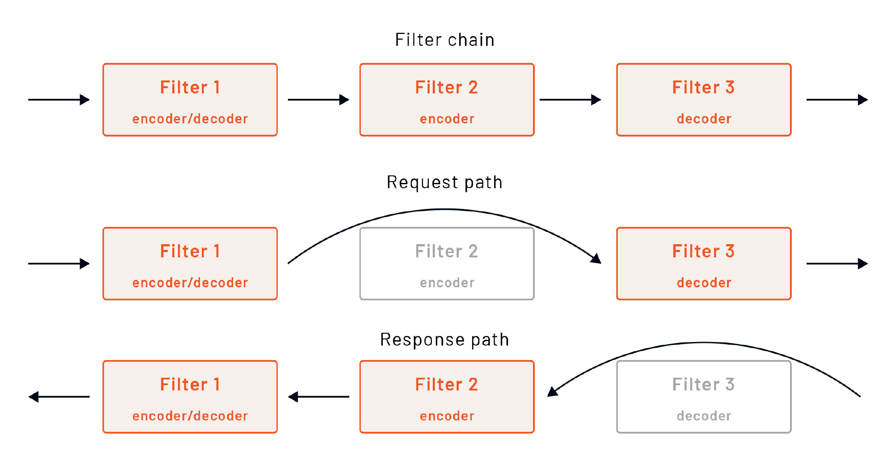

HCM 是一个网络级的过滤器，将原始字节转译成 HTTP 级别的消息和事件（例如，收到的 Header，收到的 Body 数据等）。

HCM 过滤器还处理标准的 HTTP 功能。它支持访问记录、请求 ID 生成和跟踪、Header 操作、路由表管理和统计等功能。

从协议的角度来看，HCM 原生支持 HTTP/1.1、WebSockets、HTTP/2 和 HTTP/3（仍在 Alpha 阶段）。

Envoy 代理被设计成一个 HTTP/2 复用代理，这体现在描述 Envoy 组件的术语中。

**HTTP/2 术语**

在 HTTP/2 中，流是已建立的连接中的字节的双向流动。每个流可以携带一个或多个**消息（message）**。消息是一个完整的**帧（frame）**序列，映射到一个 HTTP 请求或响应消息。最后，帧是 HTTP/2 中最小的通信单位。每个帧都包含一个**帧头（frame header）**，它至少可以识别该帧所属的流。帧可以携带有关 HTTP Header、消息有效载荷等信息。

无论流来自哪个连接（HTTP/1.1、HTTP/2 或 HTTP/3），Envoy 都使用一个叫做 **编解码 API（codec API）** 的功能，将不同的线程协议翻译成流、请求、响应等协议无关模型。协议无关的模型意味着大多数 Envoy 代码不需要理解每个协议的具体内容。

## HTTP 过滤器

在 HCM 中，Envoy 支持一系列的 HTTP 过滤器。与监听器级别的过滤器不同，这些过滤器对 HTTP 级别的消息进行操作，而不知道底层协议（HTTP/1.1、HTTP/2 等）或复用能力。

有三种类型的 HTTP 过滤器。

- 解码器（Decoder）：当 HCM 对请求流的部分进行解码时调用。
- 编码器（Encoder）：当 HCM 对响应流的部分进行编码时调用。
- 解码器 / 编码器（Decoder/Encoder）：在两个路径上调用，解码和编码

下图解释了 Envoy 如何在请求和响应路径上调用不同的过滤器类型。



像网络过滤器一样，单个的 HTTP 过滤器可以停止或继续执行后续的过滤器，并在单个请求流的范围内相互分享状态。

## 数据共享

在高层次上，我们可以把过滤器之间的数据共享分成**静态**和**动态**。

静态包含 Envoy 加载配置时的任何不可变的数据集，它被分成三个部分。

**1. 元数据**

Envoy 的配置，如监听器、路由或集群，都包含一个`metadata`数据字段，存储键 / 值对。元数据允许我们存储特定过滤器的配置。这些值不能改变，并在所有请求 / 连接中共享。例如，元数据值在集群中使用子集选择器时被使用。

**2. 类型化的元数据**

类型化元数据不需要为每个流或请求将元数据转换为类型化的类对象，而是允许过滤器为特定的键注册一个一次性的转换逻辑。来自 xDS 的元数据在配置加载时被转换为类对象，过滤器可以在运行时请求类型化的版本，而不需要每次都转换。

**3. HTTP 每路过滤器配置** 

与适用于所有虚拟主机的全局配置相比，我们还可以指定每个虚拟主机或路由的配置。每个路由的配置被嵌入到路由表中，可以在 `typed_per_filter_config` 字段下指定。

另一种分享数据的方式是使用**动态状态**。动态状态会在每个连接或 HTTP 流中产生，并且它可以被产生它的过滤器改变。名为 `StreamInfo` 的对象提供了一种从 map 上存储和检索类型对象的方法。

## 过滤器顺序

指定 HTTP 过滤器的顺序很重要。考虑一下下面的 HTTP 过滤器链。

```yaml
http_filters:
  - filter_1
  - filter_2
  - filter_3
```

一般来说，链中的最后一个过滤器通常是路由器过滤器。假设所有的过滤器都是解码器 / 编码器过滤器，HCM 在请求路径上调用它们的顺序是`filter_1`、`filter_2`、`filter_3`。

在响应路径上，Envoy 只调用编码器过滤器，但顺序相反。由于这三个过滤器都是解码器 / 编码器过滤器，所以在响应路径上的顺序是 `filter_3`、`filter_2`、`filter_1`。

## 内置 HTTP 过滤器

Envoy 已经内置了几个 HTTP 过滤器，如 CORS、CSRF、健康检查、JWT 认证等。你可以[在这里](https://www.envoyproxy.io/docs/envoy/latest/configuration/http/http_filters/http_filters#config-http-filters)找到 HTTP 过滤器的完整列表。