> 在 Kubernetes 中，ConfigMap 和 Secret 是实现应用配置与密文管理的核心资源，合理使用它们能够提升应用的安全性和可维护性。

本文系统梳理了 Kubernetes 中 ConfigMap 与 Secret 的原理、用法、安全注意事项及最佳实践，帮助读者实现配置与代码解耦，提升应用安全性与可维护性。

## 配置与密文资源概述

ConfigMap 和 Secret 都是 Kubernetes 用于存储配置信息的资源，但用途有所区别。



{width=1920 height=1796}



| 特性         | ConfigMap                | Secret                                 |
| ------------ | ----------------------- | -------------------------------------- |
| 用途         | 非敏感配置信息           | 敏感数据（凭据、令牌等）               |
| 存储方式     | 以明文存储于 etcd        | 以 base64 编码存储于 etcd（默认不加密）|
| 单个大小限制 | 1MiB                    | 1MiB                                   |
| 使用方式     | 环境变量、卷文件、命令参数 | 环境变量、卷文件、命令参数             |



## ConfigMap 详解

ConfigMap 以键值对形式存储配置信息，实现配置与应用代码解耦，提升应用可移植性。

### ConfigMap 结构

ConfigMap 可包含：

- 简单键值对
- 完整配置文件内容

### ConfigMap 消费方式

ConfigMap 可通过多种方式被 Pod 使用。



{width=1920 height=1104}

- 作为环境变量注入
- 作为所有环境变量批量注入
- 以卷文件挂载到容器

## Secret 详解

Secret 用于存储敏感信息，如密码、OAuth 令牌、SSH 密钥等。与 ConfigMap 类似，但有额外的安全考量。

### Secret 类型

Kubernetes 提供多种内置 Secret 类型，适配不同场景。



{width=1920 height=2404}



| Secret 类型                          | 用途                         |
| ------------------------------------ | ---------------------------- |
| `Opaque`（默认）                     | 任意自定义数据               |
| `kubernetes.io/service-account-token`| ServiceAccount 令牌          |
| `kubernetes.io/dockercfg`/`dockerconfigjson` | 镜像仓库凭据         |
| `kubernetes.io/basic-auth`           | 基本认证凭据                 |
| `kubernetes.io/ssh-auth`             | SSH 密钥                     |
| `kubernetes.io/tls`                  | TLS 证书与密钥               |
| `bootstrap.kubernetes.io/token`      | 启动引导令牌                 |



### Secret 创建方式

Secret 支持多种创建方式：

- 使用 kubectl 直接指定明文值
- 使用 kubectl 从文件创建
- 使用 YAML 清单（data 字段需 base64 编码）
- 使用 YAML 清单（stringData 字段为明文）
- 使用 Kustomize 管理

### Secret 在 Pod 中的使用

Secret 可通过以下方式被 Pod 消费：

- 作为环境变量注入
- 批量注入所有键值为环境变量
- 以卷文件挂载到容器

## Secret 安全性注意事项

默认情况下，Kubernetes Secret 有如下安全风险：



{width=1920 height=613}

### 主要安全问题

- **etcd 未加密存储**：未配置加密时，Secret 以 base64 明文存储。
- **API 访问**：拥有 API 访问权限的用户可读取 Secret。
- **Pod 访问**：有权限创建 Pod 的用户可挂载 Secret。
- **RBAC 权限过宽**：过宽的权限易导致泄露。

### 安全最佳实践

- 启用静态加密：配置 API Server 对 etcd 中的 Secret 数据加密。

    ```bash
    kubectl apply -f encrypt-secrets.yaml
    ```

- 使用最小权限 RBAC：通过 RBAC 限制 Secret 访问权限。
- 仅为需要的容器挂载 Secret。
- 使用外部密文管理系统（如 CSI Secret Store）。
- 对不变的 Secret 设置 `immutable: true`。

## 配置与密文的更新与生命周期

ConfigMap 和 Secret 的生命周期如下：



{width=1920 height=3158}

- 卷挂载方式：变更会最终同步到 Pod（不适用于 subPath 挂载），同步延迟取决于 kubelet 周期与缓存。
- 环境变量方式：变更不会自动同步，需重启 Pod。

## 不可变 ConfigMap 与 Secret

通过设置 `immutable: true`，ConfigMap 和 Secret 可变为不可变资源。

不可变资源优势：

- 防止误操作更新
- 性能更优（无需 watch）
- 降低 kube-apiserver 负载

不可变资源一旦创建不可更改，只能删除重建。

## ConfigMap 与 Secret 选择指南

选择 ConfigMap 还是 Secret 时，需综合考虑数据敏感性、访问方式、大小限制、变更频率与安全需求。



{width=1920 height=5398}

## 常见场景与示例

- Web 应用配置：ConfigMap 存储非敏感参数，Secret 存储数据库密码等敏感信息。
- 镜像仓库认证：Secret 用于存储 Docker Registry 凭据。

## Kubernetes Secret 的替代方案

为提升安全性，可考虑以下替代方案：

- ServiceAccount Token：用于集群内服务间认证。
- 外部密文管理系统：如 AWS Secrets Manager、HashiCorp Vault、Azure Key Vault。
- CSI Secret Store 驱动：Pod 可直接访问外部密文。
- 自定义证书签发器：用于 X.509 证书与认证。

## 总结

ConfigMap 与 Secret 为 Kubernetes 提供了灵活的配置与密文管理机制。合理区分敏感与非敏感数据，结合最佳实践与安全措施，可实现应用配置与代码解耦，提升系统安全性与可维护性。
