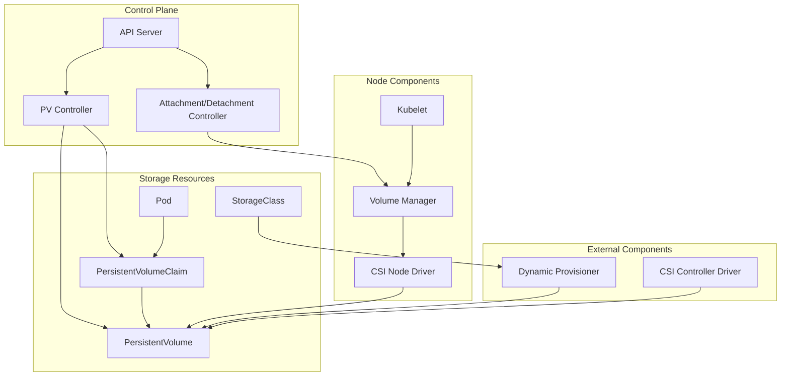
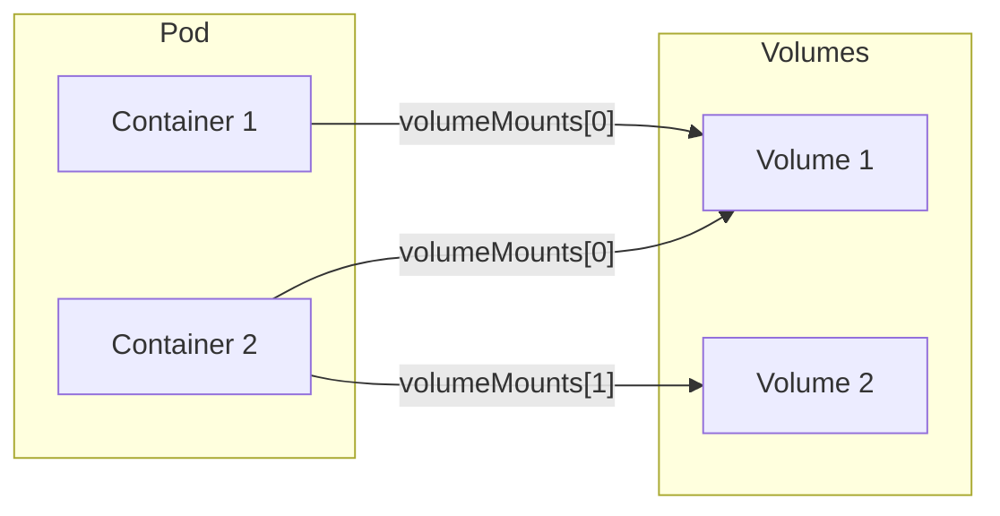
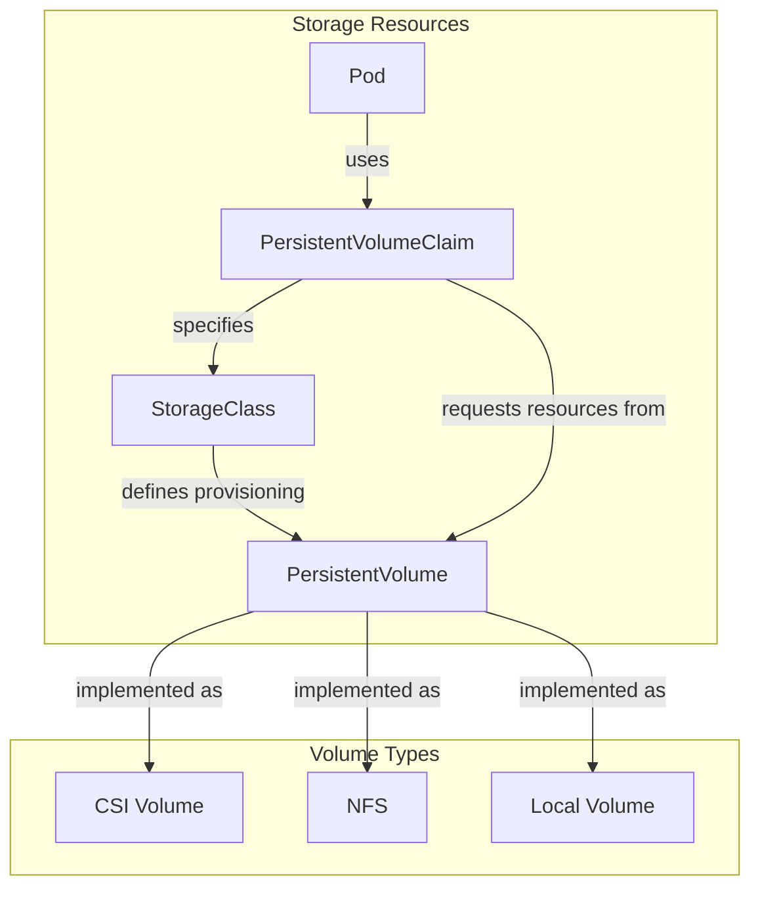
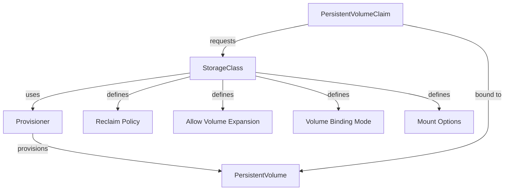
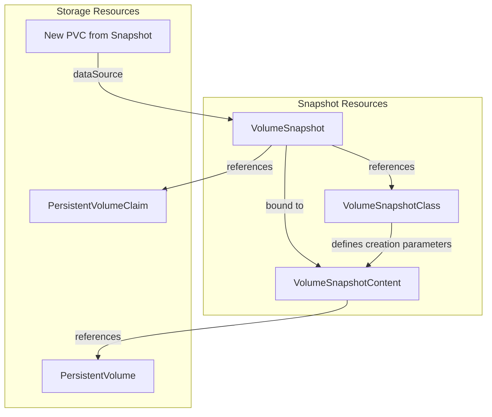
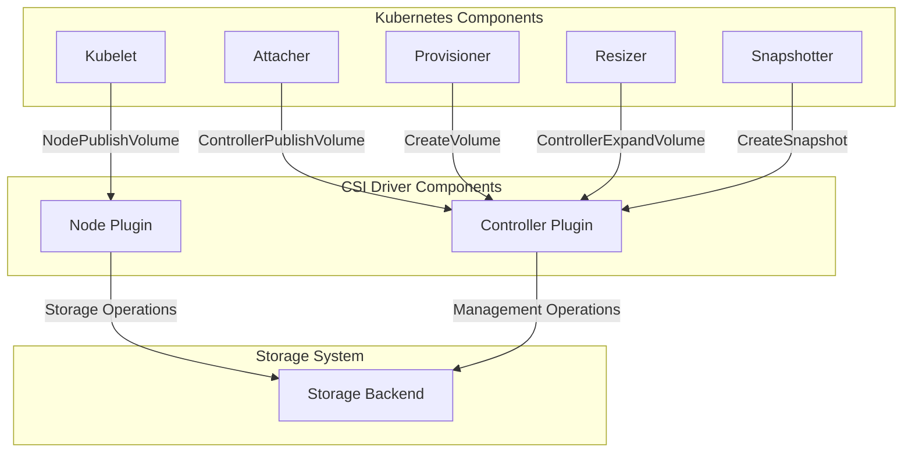
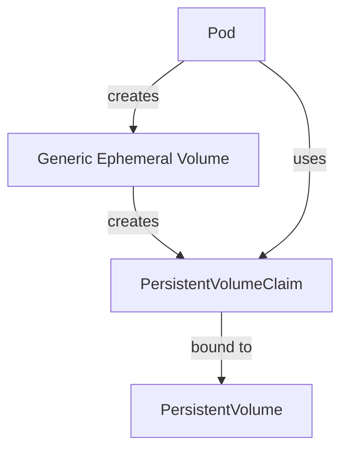

> Kubernetes 存储系统不仅为云原生应用提供了强大的数据持久化能力，更以其灵活与可扩展性，成为现代基础设施演进的关键驱动力。

Kubernetes 存储系统通过抽象与解耦，实现了持久化存储的灵活管理和多样化扩展，支持从基础卷到快照、克隆、健康监控等企业级需求，是云原生应用数据管理的基石。

## 存储系统架构

下图展示了 Kubernetes 存储系统的主要组件及其协作关系。

{width=1920 height=1269}

Kubernetes 存储系统由控制面、节点组件、存储资源和外部插件等部分组成，共同实现持久化存储的全生命周期管理。

## 核心存储概念

### 卷（Volume）

卷是 Pod 内部可被容器访问的目录，主要解决以下两类问题：

- 数据持久化：容器文件系统易失，重启或崩溃后数据丢失
- 数据共享：同一 Pod 内多个容器需要共享数据

卷在 Pod 规范中声明，并挂载到容器。不同类型的卷有不同的生命周期和后端介质。

{width=1920 height=960}

卷类型主要包括：

- **临时卷**（如 `emptyDir`、`configMap`、`secret`）：生命周期与 Pod 绑定
- **持久卷**（如 `persistentVolumeClaim`）：生命周期超出 Pod
- **投射卷**：将多个数据源映射到同一目录

### 持久卷与声明（PV & PVC）

Kubernetes 通过 PV/PVC 子系统实现存储的“提供”与“消费”解耦：

- **PersistentVolume（PV）**：由管理员预先创建或通过 StorageClass 动态供应的存储资源
- **PersistentVolumeClaim（PVC）**：用户对存储的请求

{width=1920 height=2750}

PV 与 PVC 的生命周期：

1. **供应**：管理员静态创建或通过 StorageClass 动态供应 PV
2. **绑定**：PVC 根据需求与合适的 PV 绑定
3. **使用**：Pod 通过 PVC 挂载卷
4. **回收**：PVC 删除后，PV 根据回收策略处理

### 访问模式

不同存储后端支持不同的访问模式：



| 访问模式 | 说明 |
| --- | --- |
| ReadWriteOnce (RWO) | 单节点读写挂载 |
| ReadOnlyMany (ROX) | 多节点只读挂载 |
| ReadWriteMany (RWX) | 多节点读写挂载 |
| ReadWriteOncePod (RWOP) | 单 Pod 读写挂载 |



实际支持的模式取决于存储类型和供应商。

## 存储编排机制

### StorageClass（存储类）

StorageClass 允许管理员定义不同的存储“类别”，如性能、备份策略等。

{width=1920 height=869}

StorageClass 主要字段：

- **Provisioner**：指定供应插件
- **Parameters**：卷参数
- **ReclaimPolicy**：回收策略
- **VolumeBindingMode**：绑定时机
- **AllowVolumeExpansion**：是否支持扩容

### 动态供应

动态供应无需管理员预先创建 PV，用户创建 PVC 时自动分配存储。PVC 指定 StorageClass 后，若无匹配 PV，则自动创建。

### 卷绑定模式

`volumeBindingMode` 控制绑定时机：

- **Immediate**：PVC 创建即绑定（默认）
- **WaitForFirstConsumer**：等有 Pod 使用时再绑定，适合有拓扑约束的场景

## 高级存储特性

### 卷快照

快照可为卷创建时间点副本，常用于备份等场景。

{width=1920 height=2201}

关键资源：

- **VolumeSnapshot**：用户请求快照
- **VolumeSnapshotContent**：实际快照对象
- **VolumeSnapshotClass**：快照参数定义

生命周期包括供应、绑定、删除（Delete/Retain）。

### 卷克隆

卷克隆允许基于现有 PVC 创建新 PVC，要求：

- 仅支持支持克隆的 CSI 驱动
- 源 PVC 已绑定且可用
- 源/目标 PVC 在同一命名空间
- 卷模式一致

### 卷健康监控

CSI 驱动可上报卷异常，分为：

- **外部健康监控器**：在 PVC 上报告事件
- **Kubelet**：在 Pod 上报告事件

健康状态也可通过 kubelet 指标暴露。

## 存储接口

### CSI（容器存储接口）

CSI 标准化了存储系统与编排器的集成方式，便于供应商开发通用插件。

{width=1920 height=1235}

CSI 优势：

- 解耦核心与存储实现
- 插件一次开发多平台复用
- 支持新存储系统快速集成

CSI 支持：供应/删除、挂载/卸载、快照、扩容、指标、健康监控等功能。

## 临时卷（Ephemeral Volumes）

临时卷为 Pod 提供生命周期内的临时存储，适用于无需持久化的场景。

支持类型包括：



| 类型 | 说明 |
| --- | --- |
| emptyDir | 空目录，适合临时空间 |
| configMap | 注入配置信息 |
| downwardAPI | 暴露 Pod 信息 |
| secret | 注入敏感数据 |
| CSI ephemeral | 支持该特性的 CSI 驱动 |
| generic ephemeral | 支持 PV 的任意驱动 |



{width=1920 height=3324}

Generic Ephemeral Volume 的 PVC 生命周期与 Pod 绑定，Pod 删除后 PVC 及底层卷也被删除。

## 特殊注意事项

### 存储容量跟踪

容量跟踪可让调度器在调度带未绑定 PVC 的 Pod 时考虑实际可用容量，避免调度失败。

实现方式：

- CSI 驱动上报 CSIStorageCapacity
- 调度器据此决策
- 若容量不足自动重调度

需 CSI 驱动支持、StorageClass 使用 `WaitForFirstConsumer`、CSIDriver 配置 `StorageCapacity: true`。

### 节点卷数量限制

云厂商通常限制单节点可挂载卷数，Kubernetes 会自动遵循：

- Amazon EBS：每节点 39 个
- Google Persistent Disk：每节点 16 个
- Azure Disk：每节点 16 个

Kubernetes 还支持动态卷限制，自动识别节点类型和驱动上报的限制。

## 存储系统生命周期

{width=2437 height=77}

主要阶段：

1. **供应**：静态或动态创建 PV
2. **绑定**：PVC 匹配并绑定 PV
3. **使用**：Pod 通过 PVC 挂载卷
4. **保护**：防止正在使用的 PV/PVC 被删除
5. **释放**：PVC 删除，PV 等待回收
6. **回收**：根据策略 Retain/Delete/Recycle（Recycle 已废弃）

## 总结

Kubernetes 存储系统通过抽象与解耦，实现了存储供应与消费的分离，支持多种卷类型和高级特性，满足企业级应用对数据持久化、备份、扩展和健康监控的需求。其灵活的架构既简化了用户操作，也赋予管理员强大的管理能力，是云原生基础设施不可或缺的重要组成部分。

## 参考文献

1. [Kubernetes 官方文档 - kubernetes.io](https://kubernetes.io/docs/concepts/storage/)
2. [Kubernetes StorageClass 设计 - kubernetes.io](https://kubernetes.io/docs/concepts/storage/storage-classes/)
3. [Kubernetes CSI 介绍 - kubernetes-csi.github.io](https://kubernetes-csi.github.io/)
