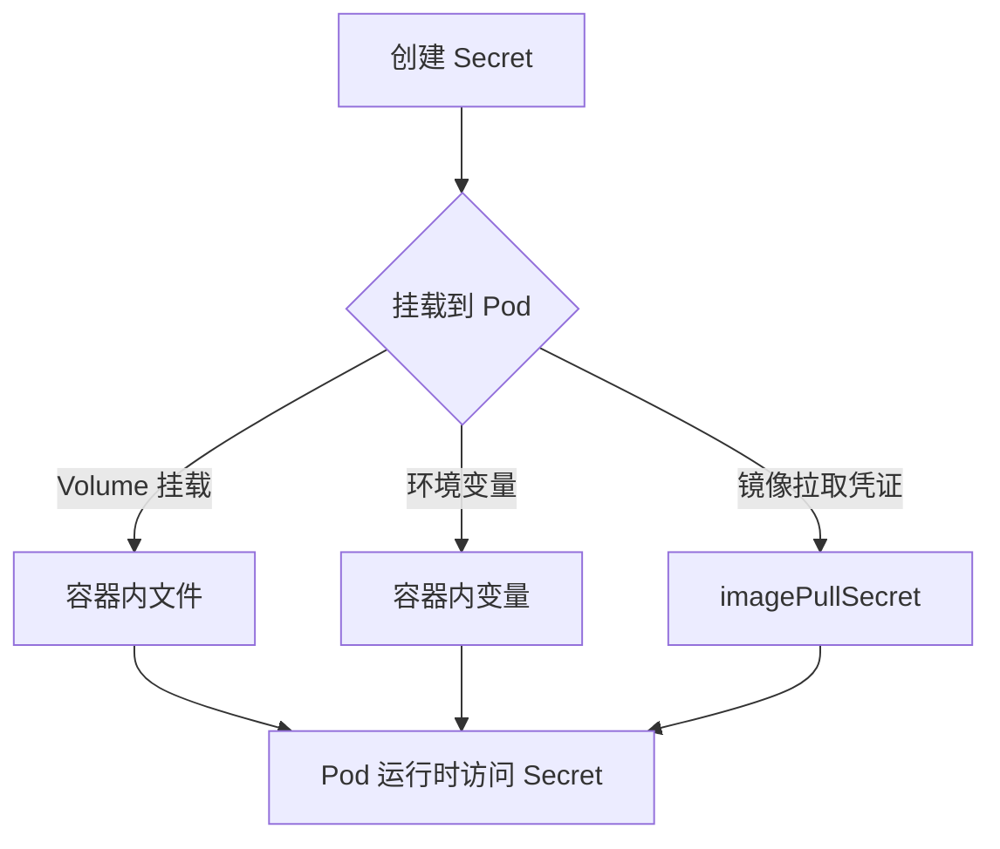
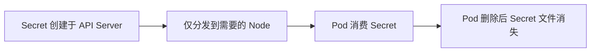

> Secret 是 Kubernetes 管理敏感信息（如密码、Token、密钥）的核心机制，合理使用可提升集群安全性与敏感数据治理能力。

## Secret 概览

Secret（密文对象）用于保存少量敏感信息（如密码、token、密钥等），相比直接写入 Pod spec 或镜像，更安全灵活。Secret 支持多种用法，提升了敏感数据的隔离与访问控制能力。




{width=1920 height=1908}

Secret 可通过以下方式被 Pod 使用：

- 作为 [volume](https://kubernetes.io/docs/concepts/storage/volumes) 挂载为文件
- 作为环境变量暴露给容器
- 作为镜像拉取凭证（imagePullSecret）

### 内置 Secret

#### ServiceAccount 自动创建 API 凭证 Secret

Kubernetes 会为每个 ServiceAccount 自动创建访问 API 的 Secret，并自动挂载到 Pod。自 v1.24 起，长期 Token Secret 不再自动创建，推荐使用短期 Token（BoundServiceAccountTokenVolume）。

## Secret 类型

Kubernetes 支持多种类型的 Secret：

- **Opaque**：用户定义的任意数据，最常用的类型
- **kubernetes.io/service-account-token**：Service Account 的认证令牌
- **kubernetes.io/dockerconfigjson**：Docker registry 认证信息
- **kubernetes.io/tls**：TLS 证书和私钥
- **kubernetes.io/basic-auth**：基本认证凭据

## Opaque Secret

Opaque 是最常用的 Secret 类型，用于存储任意的敏感数据。数据必须使用 base64 编码。

### 创建 Opaque Secret

首先准备需要编码的数据：

```bash
echo -n "admin" | base64
# 输出：YWRtaW4=
echo -n "mypassword123" | base64
# 输出：bXlwYXNzd29yZDEyMw==
```

创建 Secret 资源文件：

```yaml
apiVersion: v1
kind: Secret
metadata:
  name: user-credentials
  namespace: default
type: Opaque
data:
  username: YWRtaW4=
  password: bXlwYXNzd29yZDEyMw==
```

也可以使用 `kubectl` 命令直接创建：

```bash
kubectl create secret generic user-credentials \
  --from-literal=username=admin \
  --from-literal=password=mypassword123
```

应用 Secret：

```bash
kubectl apply -f secret.yaml
```

### 使用 Secret

Secret 可通过多种方式被 Pod 消费，提升安全性与灵活性。

#### 方式一：挂载为 Volume

```yaml
apiVersion: v1
kind: Pod
metadata:
  name: secret-volume-pod
spec:
  containers:
  - name: app
    image: nginx:1.20
    volumeMounts:
    - name: secret-volume
      mountPath: /etc/secrets
      readOnly: true
    ports:
    - containerPort: 80
  volumes:
  - name: secret-volume
    secret:
      secretName: user-credentials
      defaultMode: 0400  # 只读权限
```

挂载后，Secret 的每个键会成为一个文件：

- `/etc/secrets/username` 包含 `admin`
- `/etc/secrets/password` 包含 `mypassword123`

#### 方式二：作为环境变量

```yaml
apiVersion: apps/v1
kind: Deployment
metadata:
  name: web-app
spec:
  replicas: 2
  selector:
    matchLabels:
      app: web-app
  template:
    metadata:
      labels:
        app: web-app
    spec:
      containers:
      - name: web-app
        image: nginx:1.20
        ports:
        - containerPort: 80
        env:
        - name: DB_USERNAME
          valueFrom:
            secretKeyRef:
              name: user-credentials
              key: username
        - name: DB_PASSWORD
          valueFrom:
            secretKeyRef:
              name: user-credentials
              key: password
```

容器内可直接读取环境变量：

```bash
echo $DB_USERNAME
echo $DB_PASSWORD
```

### 以环境变量方式使用 Secret（通用示例）

```yaml
apiVersion: v1
kind: Pod
metadata:
  name: secret-env-pod
spec:
  containers:
  - name: mycontainer
    image: redis
    env:
      - name: SECRET_USERNAME
        valueFrom:
          secretKeyRef:
            name: user-credentials
            key: username
      - name: SECRET_PASSWORD
        valueFrom:
          secretKeyRef:
            name: user-credentials
            key: password
  restartPolicy: Never
```

## Docker Registry Secret

当需要从私有 Docker Registry 拉取镜像时，需要创建认证 Secret。

### 使用命令创建

```bash
kubectl create secret docker-registry registry-secret \
  --docker-server=your-registry.com \
  --docker-username=your-username \
  --docker-password=your-password \
  --docker-email=your-email@example.com
```

### 使用 YAML 创建

```yaml
apiVersion: v1
kind: Secret
metadata:
  name: registry-secret
type: kubernetes.io/dockerconfigjson
data:
  .dockerconfigjson: <base64-encoded-docker-config>
```

其中 `.dockerconfigjson` 的值可以通过以下方式获取：

```bash
cat ~/.docker/config.json | base64 -w 0
```

### 在 Pod 中使用

```yaml
apiVersion: v1
kind: Pod
metadata:
  name: private-app
spec:
  containers:
  - name: app
    image: your-registry.com/your-app:latest
    ports:
    - containerPort: 8080
  imagePullSecrets:
  - name: registry-secret
```

## Service Account 与 Secret

从 Kubernetes 1.24 开始，Service Account 不再自动创建对应的 Secret。如需手动创建：

```yaml
apiVersion: v1
kind: Secret
metadata:
  name: sa-token-secret
  annotations:
    kubernetes.io/service-account.name: my-service-account
type: kubernetes.io/service-account-token
```

查看 Service Account token：

```bash
kubectl create serviceaccount my-sa
kubectl apply -f sa-secret.yaml

# 查看 token
kubectl get secret sa-token-secret -o jsonpath='{.data.token}' | base64 -d
```

## Secret 生命周期与安全




{width=1920 height=123}

- Secret 仅在被 Pod 消费时分发到节点
- Secret 文件存储于 tmpfs，不落盘
- Pod 删除后，Secret 文件自动清理

## 限制与约束

- Secret 属于命名空间级资源，仅同 namespace Pod 可引用
- 单个 Secret 大小上限 1MB
- 必须先创建 Secret，Pod 才能引用（除非标记为可选）
- 通过 `envFrom` 注入环境变量时，非法变量名的 key 会被跳过

## 使用案例

### 包含 SSH 密钥的 Pod

```bash
kubectl create secret generic ssh-key-secret \
  --from-file=ssh-privatekey=/path/to/.ssh/id_rsa \
  --from-file=ssh-publickey=/path/to/.ssh/id_rsa.pub
```

Pod 挂载 SSH 密钥：

```yaml
apiVersion: v1
kind: Pod
metadata:
  name: secret-test-pod
spec:
  volumes:
  - name: secret-volume
    secret:
      secretName: ssh-key-secret
  containers:
  - name: ssh-test-container
    image: mySshImage
    volumeMounts:
    - name: secret-volume
      readOnly: true
      mountPath: "/etc/secret-volume"
```

### 多环境数据库凭据

```bash
kubectl create secret generic prod-db-secret \
  --from-literal=username=produser \
  --from-literal=password=Y4nys7f11
kubectl create secret generic test-db-secret \
  --from-literal=username=testuser \
  --from-literal=password=iluvtests
```

创建使用不同 Secret 的 Pod：

```yaml
apiVersion: v1
kind: List
items:
- kind: Pod
  apiVersion: v1
  metadata:
    name: prod-db-client-pod
    labels:
      name: prod-db-client
  spec:
    volumes:
    - name: secret-volume
      secret:
        secretName: prod-db-secret
    containers:
    - name: db-client-container
      image: myClientImage
      volumeMounts:
      - name: secret-volume
        readOnly: true
        mountPath: "/etc/secret-volume"
- kind: Pod
  apiVersion: v1
  metadata:
    name: test-db-client-pod
    labels:
      name: test-db-client
  spec:
    volumes:
    - name: secret-volume
      secret:
        secretName: test-db-secret
    containers:
    - name: db-client-container
      image: myClientImage
      volumeMounts:
      - name: secret-volume
        readOnly: true
        mountPath: "/etc/secret-volume"
```

### Secret 卷中以点号开头的文件

为了将数据"隐藏"起来（即文件名以点号开头的文件），让该键以一个点开始：

```yaml
apiVersion: v1
kind: Secret
metadata:
  name: dotfile-secret
data:
  .secret-file: dmFsdWUtMg0KDQo=
---
apiVersion: v1
kind: Pod
metadata:
  name: secret-dotfiles-pod
spec:
  volumes:
  - name: secret-volume
    secret:
      secretName: dotfile-secret
  containers:
  - name: dotfile-test-container
    image: busybox
    command:
    - ls
    - "-la"
    - "/etc/secret-volume"
    volumeMounts:
    - name: secret-volume
      readOnly: true
      mountPath: "/etc/secret-volume"
```

**注意**：以点号开头的文件在 `ls -l` 的输出中被隐藏起来了；必须使用 `ls -la` 才能查看它们。

## 最佳实践

- 使用 RBAC 限制 Secret 访问
- 启用 etcd 静态加密
- 定期轮换 Secret 凭据
- 避免日志输出 Secret 内容
- 高敏感信息建议用专用密钥管理系统
- 监控 Secret 访问与变更

## 监控和故障排查

查看 Secret 详情：

```bash
kubectl describe secret user-credentials
kubectl get secret user-credentials -o yaml
```

验证 Pod 中的 Secret：

```bash
# 检查环境变量
kubectl exec pod-name -- env | grep DB_

# 检查挂载的文件
kubectl exec pod-name -- ls -la /etc/secrets/
kubectl exec pod-name -- cat /etc/secrets/username
```

Secret 相关的常见问题包括编码错误、权限不足、Secret 不存在等，可通过 `kubectl describe pod` 查看详细的错误信息。

## 总结

Secret 是 Kubernetes 管理敏感信息的基础能力。通过合理的创建、挂载和权限控制，可有效提升集群安全性。结合 RBAC、etcd 加密与密钥管理系统，构建安全合规的敏感数据治理体系。
