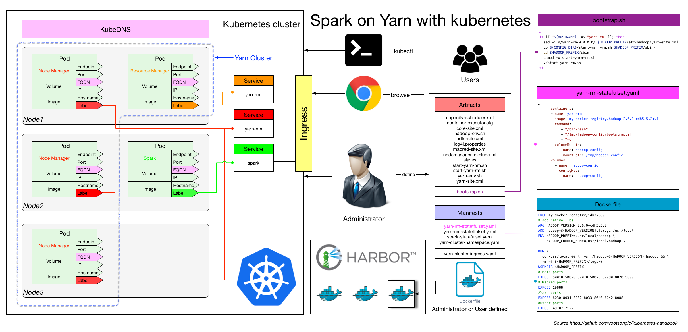

# 大数据

Kubernetes community中已经有了一个Big data SIG，大家可以通过这个SIG了解kubernetes结合大数据的应用。

在Swarm、Mesos、kubernetes这三种流行的容器编排调度架构中，Mesos对于大数据应用支持是最好的，spark原生就是运行在mesos上的，当然也可以容器化运行在kubernetes上。当前在kubernetes上运行大数据应用主要是spark应用。

## Spark on Kubernetes

Spark原生支持standalone、mesos和YARN的调度方式，当前kubernetes社区正在支持kubernetes的原生调度来运行spark - 。

当然您也可以在kubernetes直接部署spark on yarn或者spark standalone模式，仍然沿用已有的

## Spark Standalone

使用spark standalone模式在kubernetes上运行，kubernetes不负责spark任务的调度。参考：[Spark standalone on Kubernetes](spark-standalone-on-kubernetes.md)

这种模式中使用的spark本身负责任务调度，kubernetes只是作为一个spark的部署平台。

## Spark on Yarn

使用StatefulSet和Headless serverless来实现，请参考 [Spark on Yarn](https://github.com/rootsongjc/kube-yarn/tree/sz-test)

这种模式中kubernetes依然不负责spark应用的调度，而只是将Yarn换了一个部署环境而已。

下面是架构图：

### Spark on Kubernetes

Spark on kubernetes，使用kubernetes作为调度引擎，spark的任务直接调度到node节点上。参考：[运行支持kubernetes原生调度的Spark程序](running-spark-with-kubernetes-native-scheduler.md)。

### 调度方式总结

下图显示的是三种调度方式中单个kubernetes node节点上运行的spark相关容器的调度情况。

毫无疑问，使用kubernetes原生调度的spark任务才是最节省资源的。
