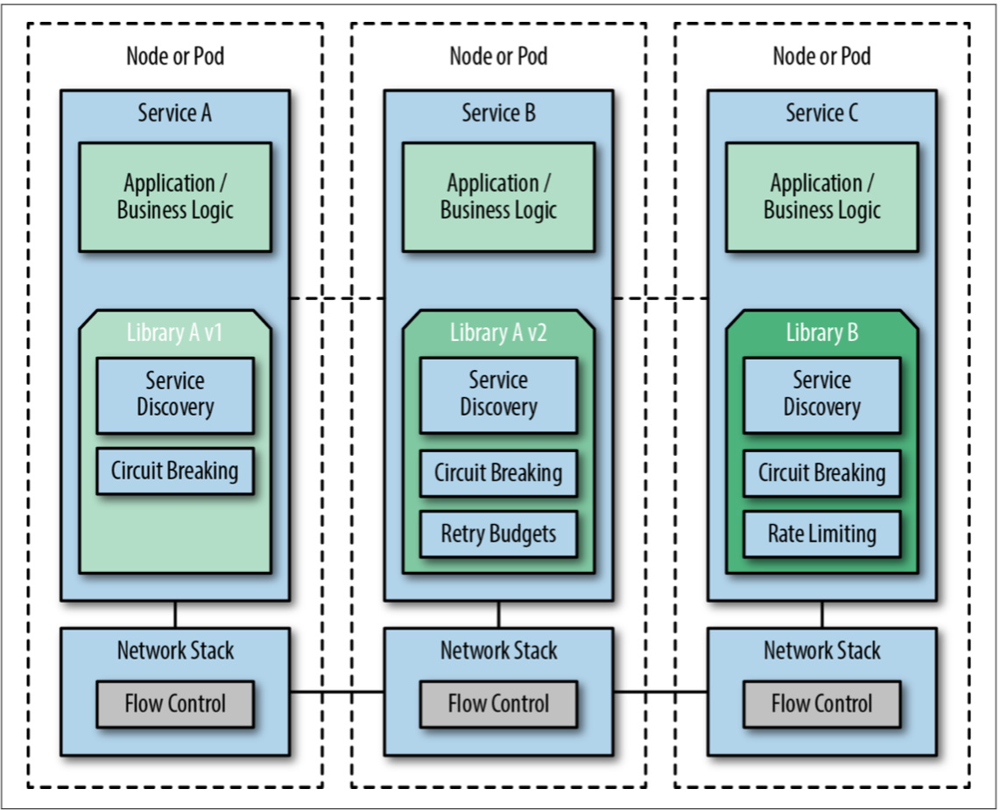

# Service Mesh 技术对比

这一章主要讲解的是 service mesh 与其他技术之间的区别以及为什么有了 Kubernetes 后还需要用 service mesh。

为什么有了如 Kubernetes 这样的容器编排我们还需要 Service Mesh 呢，下表是对容器编排调度器的核心功能和缺少的服务级别能力对比。

| 核心能力                     | 缺少的服务级别能力              |
| ---------------------------- | ------------------------------- |
| 集群管理                     | 熔断                            |
| 调度                         | L7 细粒度的流量控制             |
| 编排器和主机维护             | 混沌测试                        |
| 服务发现                     | 金丝雀部署                      |
| 网络和负载均衡               | 超时、重试、 budget 和 deadline |
| 有状态服务                   | 按请求路由                      |
| 多租户、多 region            | 策略                            |
| 简单的应用监控检查和性能监控 | 传输层安全（加密）              |
| 应用部署                     | 身份和访问控制                  |
| 配置和秘钥管理               | 配额管理                        |
| /                            | 协议转换（REST、gRPC）          |

以上是容器编排中缺少的服务级别的能力，当然类似 Kubernetes 这样的容器编排系统中也有服务管理的能力，如 Ingress Controller，但是它仅仅负责集群内的服务对外暴露的反向代理，每个 Ingress Controller 的能力受限于 Kubernetes 的编程模型。对服务进行管理还可以通过例如 Kong、基于云的负载均衡器、API Gateway 和 API 管理来实现，在没有 Service Mesh 的时候还需要如 [Finagle](https://finagle.github.io/blog/)、[Hystrix](https://github.com/Netflix/Hystrix)、[Ribbon](https://github.com/Netflix/ribbon) 客户端库的加持。

下图是一个使用**客户端库**将应用与服务治理紧耦合的示意图。

从图中我们可以看到，应用程序代码与客户端度库紧耦合在一起，不同的服务团队需要一起协调超时和重试机制等。容器编排更适用于分布式应用，API Gateway 通常只需要部署在系统边缘即可，不需要在每个应用中都部署，而 service mesh 却需要在每个服务或者说节点中部署。
