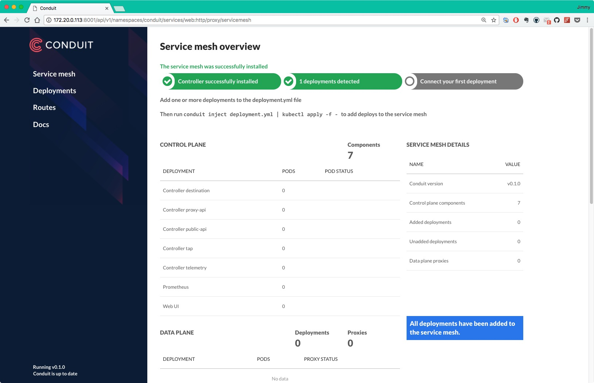

# 安装Conduit

本文档指导您如何在kubernetes上安装Conduit service mesh。

## 前提条件

- kubernetes版本为1.8或以上

用到的镜像如下：

- buoyantio/kubectl:v1.6.2
- gcr.io/runconduit/controller:v0.1.0
- gcr.io/runconduit/web:v0.1.0
- prom/prometheus:v1.8.1

其中位于gcr.io的镜像我备份到了DockerHub：

- jimmysong/runconduit-web:v0.1.0
- jimmysong/runconduit-controller:v0.1.0

另外两个镜像本身就可以从DockerHub上下载。

## 部署

到[release页面](https://github.com/runconduit/conduit/releases)上下载conduit的二进制文件。

使用`conduit install`命令生成了用于部署到kubernetes中yaml文件，然后修改文件中的镜像仓库地址为你自己的镜像地址。

```bash
conduit install>conduit-0.1.0.yaml
# 修改完镜像地址执行
kubectl apply -f conduit-0.1.0.yaml
```

**注意：**Conduit官方给出的yaml文件中不包括RBAC授权，我重新修改了，增加了RBAC和ServiceAccount。

使用`kubectl proxy`来开放外网访问conduit dashboard：

```bash
kubectl proxy --address='172.20.0.113' --port=8001 --accept-hosts='^*$'
```

在浏览器中访问<http://172.20.0.113:8001/api/v1/namespaces/conduit/services/web:http/proxy/servicemesh>将看到如下页面：



## Conduit inject

Conduit注入的时候需要用到如下两个镜像：

- gcr.io/runconduit/proxy:v0.1.0
- gcr.io/runconduit/proxy-init:v0.1.0

我将其备份到了DockerHub：

- jimmysong/runconduit-proxy:v0.1.0
- jimmysong/runconduit-proxy-init:v0.1.0

查看conduit向yaml文件中注入了哪些配置，我们使用my-nginx.yaml为例：

```bash
conduit inject --init-image harbor-001.jimmysong.io/library/runconduit-proxy-init --proxy-image harbor-001.jimmysong.io/library/runconduit-proxy my-nginx.yaml|kubectl apply -f -
```

**注意：**只需要指定镜像名称即可，tag与使用的conduit server版本相同，会自动注入。

my-nginx.yaml的内容如下：

```yaml
apiVersion: extensions/v1beta1
kind: Deployment
metadata:
  name: my-nginx
spec:
  replicas: 2
  template:
    metadata:
      labels:
        run: my-nginx
    spec:
      containers:
      - name: my-nginx
        image: harbor-001.jimmysong.io/library/nginx:1.9
        ports:
        - containerPort: 80
---
apiVersion: v1
kind: Service
metadata:
  name: my-nginx
  labels:
    app: my-nginx
spec:
  ports:
  - port: 80
    protocol: TCP
    name: http
  selector:
    run: my-nginx
```

Conduit自动注入后生成的新的yaml文件内容如下：

```yaml
apiVersion: extensions/v1beta1
kind: Deployment
metadata:
  creationTimestamp: null
  name: my-nginx
spec:
  replicas: 2
  strategy: {}
  template:
    metadata:
      annotations:
        conduit.io/created-by: conduit/cli v0.1.0
        conduit.io/proxy-version: v0.1.0
      creationTimestamp: null
      labels:
        conduit.io/controller: conduit
        conduit.io/plane: data
        run: my-nginx
    spec:
      containers:
      - image: harbor-001.jimmysong.io/library/nginx:1.9
        name: my-nginx
        ports:
        - containerPort: 80
        resources: {}
      - env:
        - name: CONDUIT_PROXY_LOG
          value: trace,h2=debug,mio=info,tokio_core=info
        - name: CONDUIT_PROXY_CONTROL_URL
          value: tcp://proxy-api.conduit.svc.cluster.local:8086
        - name: CONDUIT_PROXY_CONTROL_LISTENER
          value: tcp://0.0.0.0:4190
        - name: CONDUIT_PROXY_PRIVATE_LISTENER
          value: tcp://127.0.0.1:4140
        - name: CONDUIT_PROXY_PUBLIC_LISTENER
          value: tcp://0.0.0.0:4143
        - name: CONDUIT_PROXY_NODE_NAME
          valueFrom:
            fieldRef:
              fieldPath: spec.nodeName
        - name: CONDUIT_PROXY_POD_NAME
          valueFrom:
            fieldRef:
              fieldPath: metadata.name
        - name: CONDUIT_PROXY_POD_NAMESPACE
          valueFrom:
            fieldRef:
              fieldPath: metadata.namespace
        image: harbor-001.jimmysong.io/library/runconduit-proxy:v0.1.0
        imagePullPolicy: IfNotPresent
        name: conduit-proxy
        ports:
        - containerPort: 4143
          name: conduit-proxy
        resources: {}
        securityContext:
          runAsUser: 2102
      initContainers:
      - args:
        - -p
        - "4143"
        - -o
        - "4140"
        - -i
        - "4190"
        - -u
        - "2102"
        image: harbor-001.jimmysong.io/library/runconduit-proxy-init:v0.1.0
        imagePullPolicy: IfNotPresent
        name: conduit-init
        resources: {}
        securityContext:
          capabilities:
            add:
            - NET_ADMIN
          privileged: false
status: {}
---
apiVersion: v1
kind: Service
metadata:
  name: my-nginx
  labels:
    app: my-nginx
spec:
  ports:
  - port: 80
    protocol: TCP
    name: http
  selector:
    run: my-nginx
---
```

## 部署示例应用

使用下面的命令部署官方提供的示例应用：

```bash
curl https://raw.githubusercontent.com/rootsongjc/kubernetes-handbook/master/manifests/conduit/emojivoto.yml | conduit inject --init-image harbor-001.jimmysong.io/library/runconduit-proxy-init --proxy-image harbor-001.jimmysong.io/library/runconduit-proxy - --skip-inbound-ports=80 | kubectl apply -f -
```

**注意：**其中使用的镜像地址已经改为我的私有镜像仓库地址，大家使用时请注意修改。

## 参考

- [Getting started - conduit.io](https://conduit.io/getting-started/)